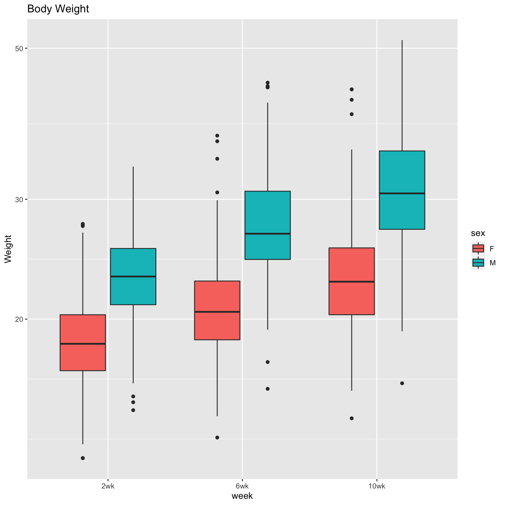
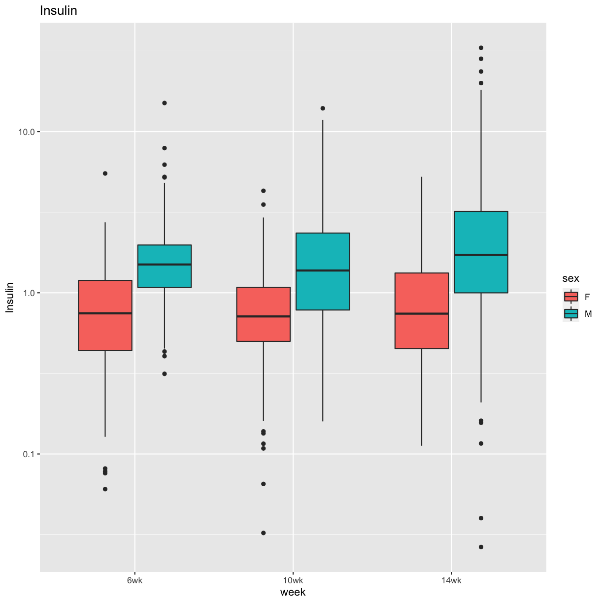
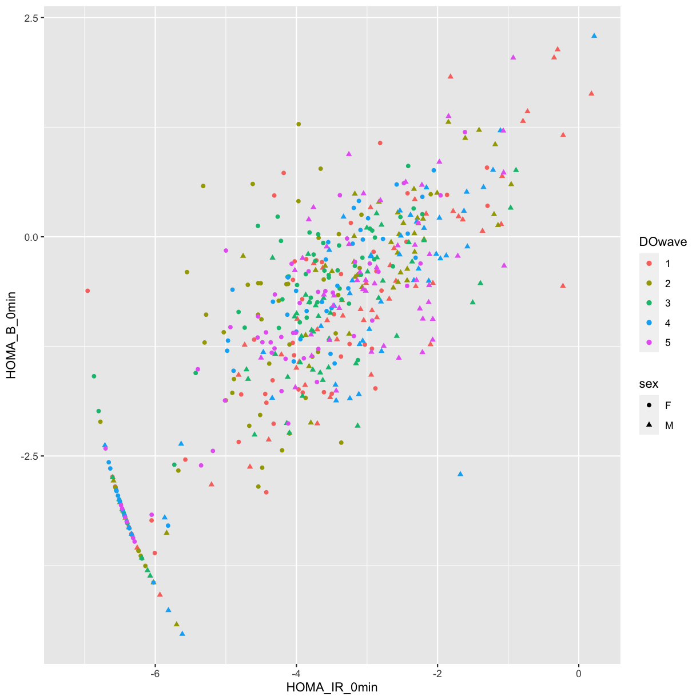
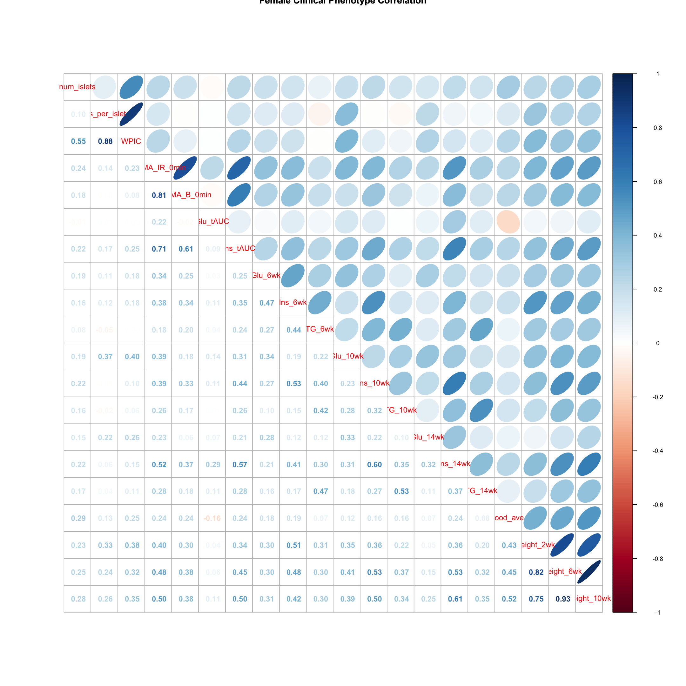
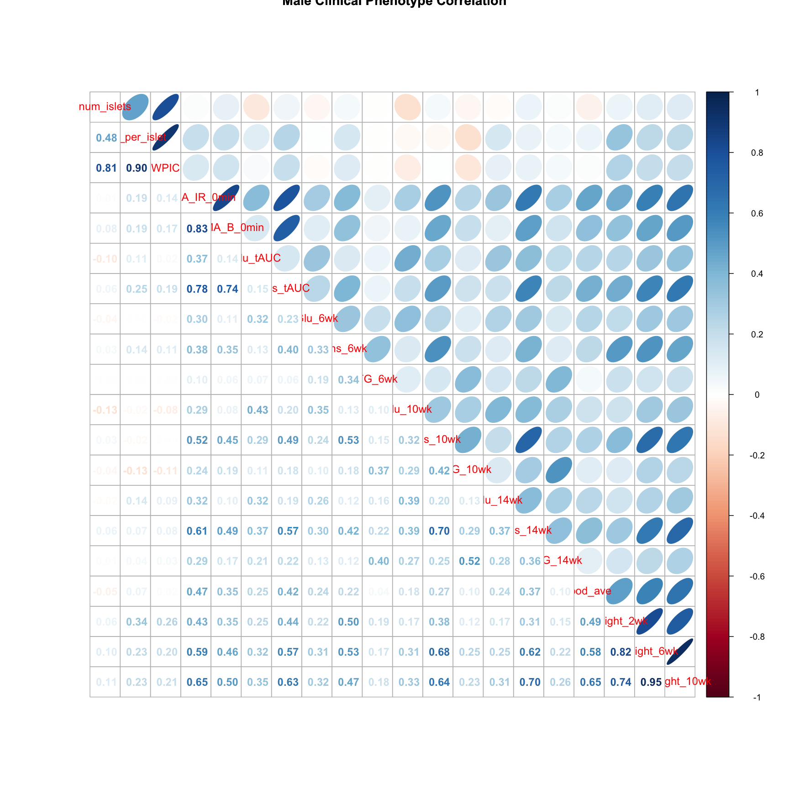

---
# Please do not edit this file directly; it is auto generated.
# Instead, please edit 02-load-explore-data.md in _episodes_rmd/
title: "Load and explore the data"
teaching: 15
exercises: 30
questions:
- "What data are required for eqtl mapping?"
objectives:
- To provide an example and exploration of data used for eqtl mapping.
keypoints:
- ""
source: Rmd
---

Load the libraries.

~~~
library(tidyverse)
library(knitr)
library(GGally)
library(corrplot)
library(broom)
# the following analysis is from File S1 Attie_eQTL_paper_physiology.Rmd 
# compliments of Daniel Gatti. See Data Dryad entry for more information.
~~~
{: .language-r}

## Physiological Phenotypes

The complete data used in these analyses are available from 
[Data Dryad](https://doi.org/10.5061/dryad.pj105). 

Load in the clinical phenotypes.

~~~
# load the data
load("../data/attie_DO500_clinical.phenotypes.RData")
~~~
{: .language-r}

See the [data dictionary](../data/Attie-232_Attie_DO_Islets-dictionary.csv) to 
see a description of each of these phenotypes.  

#### Phenotype Ranges

~~~
tmp = pheno_clin %>%
  select(num_islets:weight_10wk) %>%
  summarize_all(funs(min, max), na.rm = TRUE) %>%
  gather(phenotype, value) %>%
  mutate(phenotype = str_replace(phenotype, "_min", ".min")) %>%
  mutate(phenotype = str_replace(phenotype, "_max", ".max")) %>%
  separate(phenotype, c("phenotype", "stat"), sep = "\\.") %>%
  mutate(stat = factor(stat, levels = c("min", "max"))) %>%
  spread(key = stat, value = value)
kable(tmp, caption = "Phenotype Ranges")
~~~
{: .language-r}

Table: Phenotype Ranges

|phenotype     |          min|          max|
|:-------------|------------:|------------:|
|food_ave      | 1.882500e+00| 5.536790e+00|
|Glu_10wk      | 5.394220e+01| 5.903783e+02|
|Glu_14wk      | 1.005210e+01| 5.616875e+02|
|Glu_6wk       | 5.049661e+01| 2.112279e+02|
|Glu_tAUC      | 1.585963e+04| 1.000717e+05|
|HOMA_B_0min   | 1.076550e-02| 9.856865e+00|
|HOMA_IR_0min  | 7.430000e-04| 1.244811e+00|
|Ins_10wk      | 3.236660e-02| 1.394590e+01|
|Ins_14wk      | 2.648000e-02| 3.309000e+01|
|Ins_6wk       | 6.055000e-02| 1.504120e+01|
|Ins_per_islet | 8.706667e+00| 2.902618e+02|
|Ins_tAUC      | 4.800000e+00| 1.292177e+03|
|num_islets    | 4.200000e+01| 1.096000e+03|
|TG_10wk       | 5.373719e+01| 5.330684e+02|
|TG_14wk       | 4.923035e+01| 3.508755e+02|
|TG_6wk        | 4.731155e+01| 7.811902e+02|
|weight_10wk   | 1.430000e+01| 5.140000e+01|
|weight_2wk    | 1.250000e+01| 3.350000e+01|
|weight_6wk    | 1.340000e+01| 4.450000e+01|
|WPIC          | 3.658200e+02| 2.314127e+05|

#### Univariate Boxplot

~~~
pheno_clin %>%
  select(num_islets:weight_10wk) %>%
  gather(phenotype, value) %>%
  ggplot(aes(x = phenotype, y = value)) +
    geom_boxplot() +
    scale_y_log10() +
    theme(axis.text.x = element_text(angle = 90, vjust = 0.5, hjust = 1)) +
    labs(title = "Distribution of Log Transformed Phenotypes")
~~~
{: .language-r}

Subset the phenotypes to include only those analyzed in the paper.

~~~
# convert sex and DO wave (batch) to factors
pheno_clin$sex = factor(pheno_clin$sex)
pheno_clin$DOwave = factor(pheno_clin$DOwave)
~~~
{: .language-r}

### Figure 1 Boxplots

~~~
pheno_clin %>%
  select(mouse, sex, starts_with("weight")) %>%
  gather(week, value, -mouse, -sex) %>%
  separate(week, c("tmp", "week")) %>%
  mutate(week = factor(week, levels = c("2wk", "6wk", "10wk"))) %>%
  ggplot(aes(week, value, fill = sex)) +
    geom_boxplot() +
    scale_y_log10() +
    labs(title = "Body Weight", y = "Weight")
~~~
{: .language-r}

~~~
pheno_clin %>%
  select(mouse, sex, starts_with("Glu")) %>%
  select(mouse, sex, ends_with("wk")) %>%
  gather(week, value, -mouse, -sex) %>%
  separate(week, c("tmp", "week")) %>%
  mutate(week = factor(week, levels = c("6wk", "10wk", "14wk"))) %>%
  ggplot(aes(week, value, fill = sex)) +
    geom_boxplot() +
    scale_y_log10() +
    labs(title = "Glucose", y = "Glucose")
~~~
{: .language-r}

~~~
pheno_clin %>%
  select(mouse, sex, starts_with("Ins")) %>%
  select(mouse, sex, ends_with("wk")) %>%
  gather(week, value, -mouse, -sex) %>%
  separate(week, c("tmp", "week")) %>%
  mutate(week = factor(week, levels = c("6wk", "10wk", "14wk"))) %>%
  ggplot(aes(week, value, fill = sex)) +
    geom_boxplot() +
    scale_y_log10() +
    labs(title = "Insulin", y = "Insulin")
~~~
{: .language-r}

~~~
pheno_clin %>%
  select(mouse, sex, starts_with("TG")) %>%
  select(mouse, sex, ends_with("wk")) %>%
  gather(week, value, -mouse, -sex) %>%
  separate(week, c("tmp", "week")) %>%
  mutate(week = factor(week, levels = c("6wk", "10wk", "14wk"))) %>%
  ggplot(aes(week, value, fill = sex)) +
    geom_boxplot() +
    scale_y_log10() +
    labs(title = "TG", y = "TG")
~~~
{: .language-r}

~~~
pheno_clin %>%
  select(mouse, sex, num_islets:Ins_tAUC, food_ave) %>%
  gather(phenotype, value, -mouse, -sex) %>%
  ggplot(aes(sex, value, fill = sex)) +
    geom_boxplot() +
    scale_y_log10() +
    facet_wrap(~phenotype, scales = "free_y")
~~~
{: .language-r}

### QA/QC

#### Proportion Missing Data

~~~
tmp = pheno_clin %>% 
  mutate_all(is.na) %>% 
  summarize_all(mean) %>%
  gather(phenotype, value)
kable(tmp, caption = "Proportion of Missing Data")
~~~
{: .language-r}

Table: Proportion of Missing Data

|phenotype          | value|
|:------------------|-----:|
|mouse              | 0.000|
|sex                | 0.000|
|sac_date           | 0.222|
|partial_inflation  | 0.994|
|coat_color         | 0.000|
|oGTT_date          | 0.010|
|FAD_NAD_paired     | 0.814|
|FAD_NAD_filter_set | 0.814|
|crumblers          | 0.962|
|birthdate          | 0.034|
|diet_days          | 0.034|
|num_islets         | 0.034|
|Ins_per_islet      | 0.036|
|WPIC               | 0.036|
|HOMA_IR_0min       | 0.010|
|HOMA_B_0min        | 0.016|
|Glu_tAUC           | 0.010|
|Ins_tAUC           | 0.010|
|Glu_6wk            | 0.000|
|Ins_6wk            | 0.000|
|TG_6wk             | 0.000|
|Glu_10wk           | 0.002|
|Ins_10wk           | 0.002|
|TG_10wk            | 0.002|
|Glu_14wk           | 0.002|
|Ins_14wk           | 0.002|
|TG_14wk            | 0.002|
|food_ave           | 0.000|
|weight_2wk         | 0.000|
|weight_6wk         | 0.002|
|weight_10wk        | 0.002|
|DOwave             | 0.000|

The phenotypes that we're mapping (on the right) are mostly free of missing 
values. The highest are `Ins_per_islet` and WPIC at 3.6%.

Log transform and standardize each phenotype. Consider setting points that are 
more than 5 std. dev. from the mean to NA. Only do this if the final 
distribution doesn't look skewed.

~~~
pheno_clin_log = pheno_clin %>%
                   mutate_if(is.numeric, log)
pheno_clin_std = pheno_clin_log %>%
                   select(mouse, num_islets:weight_10wk) %>%
                   mutate_if(is.numeric, scale)
pheno_clin_std %>%
  select(num_islets:weight_10wk) %>%
  gather(phenotype, value) %>%
  ggplot(aes(x = phenotype, y = value)) +
    geom_boxplot() +
    theme(axis.text.x = element_text(angle = 90, vjust = 0.5, hjust = 1)) +
    labs(title = "Distribution of Standardized Phenotypes")
~~~
{: .language-r}

~~~
outliers = pheno_clin_std %>% 
              gather(pheno, value, -mouse) %>%
              filter(abs(value) > 5)
kable(outliers, caption = "Potential Outliers")
~~~
{: .language-r}

Table: Potential Outliers

|mouse |pheno      |     value|
|:-----|:----------|---------:|
|DO093 |num_islets | -6.767430|
|DO372 |num_islets | -6.217230|
|DO093 |WPIC       | -6.161516|
|DO372 |WPIC       | -5.068911|
|DO372 |Glu_10wk   |  5.854390|
|DO213 |Glu_14wk   | -9.031752|
|DO372 |Glu_14wk   |  5.802727|

### All Pairs

~~~
ggpairs(select(pheno_clin_log, num_islets:weight_10wk)) +
  theme(axis.text.x = element_text(angle = 90, vjust = 0.5, hjust = 1))
~~~
{: .language-r}

The HOMA phenotypes have odd distributions.

~~~
saveRDS(pheno_clin_log, 
        file = "../data/pheno_clin_log_outliers_removed.rds")
ggplot(pheno_clin_log, aes(HOMA_IR_0min, HOMA_B_0min, color = DOwave, shape = sex)) +
  geom_point()
~~~
{: .language-r}

There doesn't appear to be a batch effect, but there are a large number of low 
values. Is there some lower bound to the HOMA measurements?

### Tests for sex, wave and diet_days.

~~~
tmp = pheno_clin_log %>%
        select(mouse, sex, DOwave, diet_days, num_islets:weight_10wk) %>%
        gather(phenotype, value, -mouse, -sex, -DOwave, -diet_days) %>%
        group_by(phenotype) %>%
        nest()
mod_fxn = function(df) {
  lm(value ~ sex + DOwave + diet_days, data = df)
}
tmp = tmp %>%
  mutate(model = map(data, mod_fxn)) %>%
  mutate(summ = map(model, tidy)) %>%
  unnest(summ)
# kable(tmp, caption = "Effects of Sex, Wave & Diet Days on Phenotypes")
~~~
{: .language-r}

~~~
tmp %>%
  filter(term != "(Intercept)") %>%
  mutate(neg.log.p = -log10(p.value)) %>%
  ggplot(aes(term, neg.log.p)) +
    geom_point() +
    facet_wrap(~phenotype) +
    labs(title = "Significance of Sex, Wave & Diet Days on Phenotypes") +
    theme(axis.text.x = element_text(angle = 90, hjust = 1, vjust = 0.5)) +
rm(tmp)
~~~
{: .language-r}

### Weight vs. Food Intake

~~~
pheno_clin_log %>%
  select(mouse, sex, food_ave:weight_10wk) %>%
  gather(phenotype, value, -mouse, -sex, -food_ave) %>%
  separate(phenotype, c("phenotype", "week")) %>%
  mutate(week = factor(week, levels = c("2wk", "6wk", "10wk"))) %>%
  ggplot(aes(food_ave, value, color = sex)) +
    geom_point() +
    geom_smooth(method = "lm") +
    labs(title = "Food Intake vs. Body Weight", y = "log(Body Weight)") + 
    facet_wrap(~week)
~~~
{: .language-r}

~~~
`geom_smooth()` using formula 'y ~ x'
~~~
{: .output}

~~~
model_fxn = function(df) { lm(value ~ sex*food_ave, data = df) }
tmp = pheno_clin_log %>%
  select(mouse, sex, food_ave:weight_10wk) %>%
  gather(phenotype, value, -mouse, -sex, -food_ave) %>%
  separate(phenotype, c("phenotype", "week")) %>%
  mutate(week = factor(week, levels = c("2wk", "6wk", "10wk"))) %>%
  group_by(week) %>%
  nest() %>%
  mutate(model = map(data, model_fxn)) %>%
  mutate(summ = map(model, tidy)) %>%
  unnest(summ) %>%
  filter(term != "(Intercept)") %>%
  mutate(p.adj = p.adjust(p.value))
# kable(tmp, caption = "Effects of Sex and Food Intake on Body Weight")
~~~
{: .language-r}

### Correlation Plots

Females

~~~
tmp = pheno_clin_log %>% 
        filter(sex == "F") %>%
        select(num_islets:weight_10wk)
tmp = cor(tmp, use = "pairwise")
corrplot.mixed(tmp, upper = "ellipse", lower = "number", 
               main = "Female Clinical Phenotype Correlation")
corrplot.mixed(tmp, upper = "ellipse", lower = "number", 
               main = "Female Clinical Phenotype Correlation")
~~~
{: .language-r}

Males

~~~
tmp = pheno_clin_log %>% 
        filter(sex == "M") %>%
        select(num_islets:weight_10wk)
tmp = cor(tmp, use = "pairwise")
corrplot.mixed(tmp, upper = "ellipse", lower = "number", 
               main = "Male Clinical Phenotype Correlation")
corrplot.mixed(tmp, upper = "ellipse", lower = "number", 
               main = "Male Clinical Phenotype Correlation")
~~~
{: .language-r}

## Gene Expression Phenotypes
