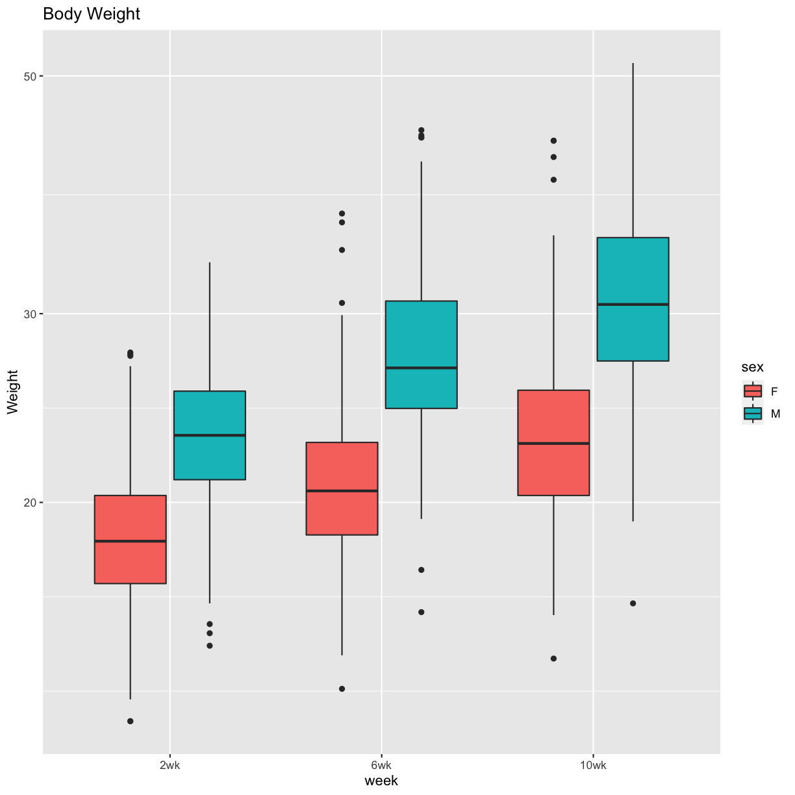

---
# Please do not edit this file directly; it is auto generated.
# Instead, please edit 03-load-explore-data.md in _episodes_rmd/
title: "Load and explore the data"
teaching: 15
exercises: 30
questions:
- "What data are required for eqtl mapping?"
objectives:
- To provide an example and exploration of data used for eqtl mapping.
keypoints:
- ""
source: Rmd
---

Load the libraries.

~~~
library(tidyverse)
library(knitr)
library(GGally)
library(corrplot)
library(broom)
library(qtl2)
library(qtl2convert)
library(qtl2ggplot)
library(RColorBrewer)
# the following analysis is from File S1 Attie_eQTL_paper_physiology.Rmd 
# compliments of Daniel Gatti. See Data Dryad entry for more information.
~~~
{: .language-r}

## Physiological Phenotypes

The complete data used in these analyses are available from 
[Data Dryad](https://doi.org/10.5061/dryad.pj105). 

Load in the clinical phenotypes.

~~~
# load the data
load("../data/attie_DO500_clinical.phenotypes.RData")
~~~
{: .language-r}

See the [data dictionary](../data/Attie-232_Attie_DO_Islets-dictionary.csv) to 
see a description of each of these phenotypes.  

#### Phenotype Ranges

~~~
tmp = pheno_clin %>%
  select(num_islets:weight_10wk) %>%
  summarize_all(funs(min, max), na.rm = TRUE) %>%
  gather(phenotype, value) %>%
  mutate(phenotype = str_replace(phenotype, "_min", ".min")) %>%
  mutate(phenotype = str_replace(phenotype, "_max", ".max")) %>%
  separate(phenotype, c("phenotype", "stat"), sep = "\\.") %>%
  mutate(stat = factor(stat, levels = c("min", "max"))) %>%
  spread(key = stat, value = value)
kable(tmp, caption = "Phenotype Ranges")
~~~
{: .language-r}

Table: Phenotype Ranges

|phenotype     |          min|          max|
|:-------------|------------:|------------:|
|food_ave      | 1.882500e+00| 5.536790e+00|
|Glu_10wk      | 5.394220e+01| 5.903783e+02|
|Glu_14wk      | 1.005210e+01| 5.616875e+02|
|Glu_6wk       | 5.049661e+01| 2.112279e+02|
|Glu_tAUC      | 1.585963e+04| 1.000717e+05|
|HOMA_B_0min   | 1.076550e-02| 9.856865e+00|
|HOMA_IR_0min  | 7.430000e-04| 1.244811e+00|
|Ins_10wk      | 3.236660e-02| 1.394590e+01|
|Ins_14wk      | 2.648000e-02| 3.309000e+01|
|Ins_6wk       | 6.055000e-02| 1.504120e+01|
|Ins_per_islet | 8.706667e+00| 2.902618e+02|
|Ins_tAUC      | 4.800000e+00| 1.292177e+03|
|num_islets    | 4.200000e+01| 1.096000e+03|
|TG_10wk       | 5.373719e+01| 5.330684e+02|
|TG_14wk       | 4.923035e+01| 3.508755e+02|
|TG_6wk        | 4.731155e+01| 7.811902e+02|
|weight_10wk   | 1.430000e+01| 5.140000e+01|
|weight_2wk    | 1.250000e+01| 3.350000e+01|
|weight_6wk    | 1.340000e+01| 4.450000e+01|
|WPIC          | 3.658200e+02| 2.314127e+05|

#### Univariate Boxplot

~~~
pheno_clin %>%
  select(num_islets:weight_10wk) %>%
  gather(phenotype, value) %>%
  ggplot(aes(x = phenotype, y = value)) +
    geom_boxplot() +
    scale_y_log10() +
    theme(axis.text.x = element_text(angle = 90, vjust = 0.5, hjust = 1)) +
    labs(title = "Distribution of Log Transformed Phenotypes")
~~~
{: .language-r}

Subset the phenotypes to include only those analyzed in the paper.

~~~
# convert sex and DO wave (batch) to factors
pheno_clin$sex = factor(pheno_clin$sex)
pheno_clin$DOwave = factor(pheno_clin$DOwave)
~~~
{: .language-r}

### Figure 1 Boxplots

~~~
pheno_clin %>%
  select(mouse, sex, starts_with("weight")) %>%
  gather(week, value, -mouse, -sex) %>%
  separate(week, c("tmp", "week")) %>%
  mutate(week = factor(week, levels = c("2wk", "6wk", "10wk"))) %>%
  ggplot(aes(week, value, fill = sex)) +
    geom_boxplot() +
    scale_y_log10() +
    labs(title = "Body Weight", y = "Weight")
~~~
{: .language-r}

~~~
pheno_clin %>%
  select(mouse, sex, starts_with("Glu")) %>%
  select(mouse, sex, ends_with("wk")) %>%
  gather(week, value, -mouse, -sex) %>%
  separate(week, c("tmp", "week")) %>%
  mutate(week = factor(week, levels = c("6wk", "10wk", "14wk"))) %>%
  ggplot(aes(week, value, fill = sex)) +
    geom_boxplot() +
    scale_y_log10() +
    labs(title = "Glucose", y = "Glucose")
~~~
{: .language-r}

~~~
pheno_clin %>%
  select(mouse, sex, starts_with("Ins")) %>%
  select(mouse, sex, ends_with("wk")) %>%
  gather(week, value, -mouse, -sex) %>%
  separate(week, c("tmp", "week")) %>%
  mutate(week = factor(week, levels = c("6wk", "10wk", "14wk"))) %>%
  ggplot(aes(week, value, fill = sex)) +
    geom_boxplot() +
    scale_y_log10() +
    labs(title = "Insulin", y = "Insulin")
~~~
{: .language-r}

~~~
pheno_clin %>%
  select(mouse, sex, starts_with("TG")) %>%
  select(mouse, sex, ends_with("wk")) %>%
  gather(week, value, -mouse, -sex) %>%
  separate(week, c("tmp", "week")) %>%
  mutate(week = factor(week, levels = c("6wk", "10wk", "14wk"))) %>%
  ggplot(aes(week, value, fill = sex)) +
    geom_boxplot() +
    scale_y_log10() +
    labs(title = "TG", y = "TG")
~~~
{: .language-r}

~~~
pheno_clin %>%
  select(mouse, sex, num_islets:Ins_tAUC, food_ave) %>%
  gather(phenotype, value, -mouse, -sex) %>%
  ggplot(aes(sex, value, fill = sex)) +
    geom_boxplot() +
    scale_y_log10() +
    facet_wrap(~phenotype, scales = "free_y")
~~~
{: .language-r}

### QA/QC

#### Proportion Missing Data

~~~
tmp = pheno_clin %>% 
  mutate_all(is.na) %>% 
  summarize_all(mean) %>%
  gather(phenotype, value)
kable(tmp, caption = "Proportion of Missing Data")
~~~
{: .language-r}

Table: Proportion of Missing Data

|phenotype          | value|
|:------------------|-----:|
|mouse              | 0.000|
|sex                | 0.000|
|sac_date           | 0.222|
|partial_inflation  | 0.994|
|coat_color         | 0.000|
|oGTT_date          | 0.010|
|FAD_NAD_paired     | 0.814|
|FAD_NAD_filter_set | 0.814|
|crumblers          | 0.962|
|birthdate          | 0.034|
|diet_days          | 0.034|
|num_islets         | 0.034|
|Ins_per_islet      | 0.036|
|WPIC               | 0.036|
|HOMA_IR_0min       | 0.010|
|HOMA_B_0min        | 0.016|
|Glu_tAUC           | 0.010|
|Ins_tAUC           | 0.010|
|Glu_6wk            | 0.000|
|Ins_6wk            | 0.000|
|TG_6wk             | 0.000|
|Glu_10wk           | 0.002|
|Ins_10wk           | 0.002|
|TG_10wk            | 0.002|
|Glu_14wk           | 0.002|
|Ins_14wk           | 0.002|
|TG_14wk            | 0.002|
|food_ave           | 0.000|
|weight_2wk         | 0.000|
|weight_6wk         | 0.002|
|weight_10wk        | 0.002|
|DOwave             | 0.000|

The phenotypes that we're mapping (on the right) are mostly free of missing 
values. The highest are `Ins_per_islet` and WPIC at 3.6%.

Log transform and standardize each phenotype. Consider setting points that are 
more than 5 std. dev. from the mean to NA. Only do this if the final 
distribution doesn't look skewed.

~~~
pheno_clin_log = pheno_clin %>%
                   mutate_if(is.numeric, log)
pheno_clin_std = pheno_clin_log %>%
                   select(mouse, num_islets:weight_10wk) %>%
                   mutate_if(is.numeric, scale)
pheno_clin_std %>%
  select(num_islets:weight_10wk) %>%
  gather(phenotype, value) %>%
  ggplot(aes(x = phenotype, y = value)) +
    geom_boxplot() +
    theme(axis.text.x = element_text(angle = 90, vjust = 0.5, hjust = 1)) +
    labs(title = "Distribution of Standardized Phenotypes")
~~~
{: .language-r}

~~~
outliers = pheno_clin_std %>% 
              gather(pheno, value, -mouse) %>%
              filter(abs(value) > 5)
kable(outliers, caption = "Potential Outliers")
~~~
{: .language-r}

Table: Potential Outliers

|mouse |pheno      |     value|
|:-----|:----------|---------:|
|DO093 |num_islets | -6.767430|
|DO372 |num_islets | -6.217230|
|DO093 |WPIC       | -6.161516|
|DO372 |WPIC       | -5.068911|
|DO372 |Glu_10wk   |  5.854390|
|DO213 |Glu_14wk   | -9.031752|
|DO372 |Glu_14wk   |  5.802727|

### All Pairs

~~~
knitr::include_graphics("../fig/rmd-02-pheno_all_pairs-1.png")
~~~
{: .language-r}

~~~
ggpairs(select(pheno_clin_log, num_islets:weight_10wk)) +
  theme(axis.text.x = element_text(angle = 90, vjust = 0.5, hjust = 1))
~~~
{: .language-r}

The HOMA phenotypes have odd distributions.

~~~
saveRDS(pheno_clin_log, 
        file = "../data/pheno_clin_log_outliers_removed.rds")
ggplot(pheno_clin_log, aes(HOMA_IR_0min, HOMA_B_0min, color = DOwave, shape = sex)) +
  geom_point()
~~~
{: .language-r}

There doesn't appear to be a batch effect, but there are a large number of low 
values. Is there some lower bound to the HOMA measurements?

### Tests for sex, wave and diet_days.

~~~
tmp = pheno_clin_log %>%
        select(mouse, sex, DOwave, diet_days, num_islets:weight_10wk) %>%
        gather(phenotype, value, -mouse, -sex, -DOwave, -diet_days) %>%
        group_by(phenotype) %>%
        nest()
mod_fxn = function(df) {
  lm(value ~ sex + DOwave + diet_days, data = df)
}
tmp = tmp %>%
  mutate(model = map(data, mod_fxn)) %>%
  mutate(summ = map(model, tidy)) %>%
  unnest(summ)
# kable(tmp, caption = "Effects of Sex, Wave & Diet Days on Phenotypes")
~~~
{: .language-r}

~~~
tmp %>%
  filter(term != "(Intercept)") %>%
  mutate(neg.log.p = -log10(p.value)) %>%
  ggplot(aes(term, neg.log.p)) +
    geom_point() +
    facet_wrap(~phenotype) +
    labs(title = "Significance of Sex, Wave & Diet Days on Phenotypes") +
    theme(axis.text.x = element_text(angle = 90, hjust = 1, vjust = 0.5)) +
rm(tmp)
~~~
{: .language-r}

### Weight vs. Food Intake

~~~
pheno_clin_log %>%
  select(mouse, sex, food_ave:weight_10wk) %>%
  gather(phenotype, value, -mouse, -sex, -food_ave) %>%
  separate(phenotype, c("phenotype", "week")) %>%
  mutate(week = factor(week, levels = c("2wk", "6wk", "10wk"))) %>%
  ggplot(aes(food_ave, value, color = sex)) +
    geom_point() +
    geom_smooth(method = "lm") +
    labs(title = "Food Intake vs. Body Weight", y = "log(Body Weight)") + 
    facet_wrap(~week)
~~~
{: .language-r}

~~~
`geom_smooth()` using formula 'y ~ x'
~~~
{: .output}

~~~
model_fxn = function(df) { lm(value ~ sex*food_ave, data = df) }
tmp = pheno_clin_log %>%
  select(mouse, sex, food_ave:weight_10wk) %>%
  gather(phenotype, value, -mouse, -sex, -food_ave) %>%
  separate(phenotype, c("phenotype", "week")) %>%
  mutate(week = factor(week, levels = c("2wk", "6wk", "10wk"))) %>%
  group_by(week) %>%
  nest() %>%
  mutate(model = map(data, model_fxn)) %>%
  mutate(summ = map(model, tidy)) %>%
  unnest(summ) %>%
  filter(term != "(Intercept)") %>%
  mutate(p.adj = p.adjust(p.value))
# kable(tmp, caption = "Effects of Sex and Food Intake on Body Weight")
~~~
{: .language-r}

### Correlation Plots

Females

~~~
tmp = pheno_clin_log %>% 
        filter(sex == "F") %>%
        select(num_islets:weight_10wk)
tmp = cor(tmp, use = "pairwise")
corrplot.mixed(tmp, upper = "ellipse", lower = "number", 
               main = "Female Clinical Phenotype Correlation")
corrplot.mixed(tmp, upper = "ellipse", lower = "number", 
               main = "Female Clinical Phenotype Correlation")
~~~
{: .language-r}

Males

~~~
tmp = pheno_clin_log %>% 
        filter(sex == "M") %>%
        select(num_islets:weight_10wk)
tmp = cor(tmp, use = "pairwise")
corrplot.mixed(tmp, upper = "ellipse", lower = "number", 
               main = "Male Clinical Phenotype Correlation")
corrplot.mixed(tmp, upper = "ellipse", lower = "number", 
               main = "Male Clinical Phenotype Correlation")
~~~
{: .language-r}

### Founder Allele Frequency

Load in the genoprobs and markers.

~~~
genoprobs = readRDS("../data/genotypes/attie_DO500_genoprobs_v5.rds")
markers = readRDS("../data/marker_grid_0.02cM_plus.rds")
K = calc_kinship(probs = genoprobs, type = "loco", cores = 4)
saveRDS(K, file = "../data/kinship")
map = map_df_to_list(map = markers, pos_column = "pos")
~~~
{: .language-r}

~~~
map_fxn = function(g, m) {
  retval = apply(g, 2:3, mean) %>%
             t() %>%
             data.frame() %>%
             mutate(pos = m) %>%
             gather(founder, prop, -pos)
  return(retval)
}
allele.freq = map2(genoprobs, map, map_fxn)
allele.freq = map2(allele.freq, 1:length(allele.freq), function(af, chr) { mutate(af, chr = chr) })
tmp = allele.freq[[1]]
for(i in 2:length(allele.freq)) {
  tmp = rbind(tmp, allele.freq[[i]])
}
allele.freq = data.frame(tmp)
rm(tmp)

cc = CCcolors
names(cc) = LETTERS[1:8]
ggplot(allele.freq, aes(pos, prop, color = founder)) +
  geom_line() +
  scale_color_manual(values = cc) +
  facet_grid(founder~chr, scales = "free") +
  theme(axis.text.x = element_text(angle = 90, vjust = 0.5, hjust = 1),
        panel.spacing = unit(0.1, "lines")) +
  labs(title = "Attie Founder Allele Proportions")
~~~
{: .language-r}

### QTL Scans

~~~
rownames(pheno_clin_log) = pheno_clin_log$mouse
covar = model.matrix(~sex + DOwave, data = pheno_clin_log)

qtl = scan1(genoprobs = genoprobs, pheno = pheno_clin_log[,12:31, drop = FALSE], kinship = K, addcovar = covar, cores = 2)
~~~
{: .language-r}

### QTL plots

~~~
par(mfrow=c(2,10))
for(i in 1:ncol(qtl)) {
  plot_scan1(x = qtl, map = map, lodcolumn = i, main = colnames(qtl)[i])
  abline(h = 6, col = 2, lwd = 2)
}
~~~
{: .language-r}

### QTL Peaks

~~~
lod_threshold = 6
peaks = find_peaks(scan1_output = qtl, map = map, threshold = lod_threshold, peakdrop = 4, prob = 0.95)
kable(peaks %>% select (-lodindex) %>% arrange(chr, pos), caption = "Phenotype QTL Peaks with LOD >= 6")
~~~
{: .language-r}

Table: Phenotype QTL Peaks with LOD >= 6

|lodcolumn     |chr |        pos|       lod|     ci_lo|      ci_hi|
|:-------------|:---|----------:|---------:|---------:|----------:|
|Ins_14wk      |1   | 135.481336|  6.411892|   3.00000| 136.156743|
|TG_14wk       |2   |  59.584104|  6.941041|  57.06789|  60.941372|
|weight_2wk    |2   | 102.703260|  6.850378|  27.19212| 105.158368|
|TG_10wk       |2   | 107.367424|  6.335945|  98.11262| 109.629183|
|Glu_6wk       |3   |   5.843185|  7.390397|   3.00000|   9.907714|
|WPIC          |4   |  59.732535|  6.010250|  59.16445|  87.661023|
|Ins_per_islet |4   |  59.736655|  6.599126|  59.46325|  63.541039|
|TG_10wk       |5   |  31.962653|  6.358020|  28.82120| 141.946043|
|Ins_14wk      |5   | 151.520204|  6.746210| 149.08909| 151.833620|
|Glu_10wk      |8   |  48.435138|  6.040469|  24.25070| 120.579268|
|Ins_10wk      |10  | 115.899454|  6.049395|  78.43255| 117.979203|
|weight_10wk   |11  |  11.726117|  6.595914|  10.41106|  16.881123|
|weight_6wk    |11  |  11.826027|  6.321523|  10.41106|  16.881123|
|Glu_tAUC      |11  |  71.782692|  6.185468|  61.06009|  94.220647|
|Ins_tAUC      |11  |  83.594665| 11.258841|  83.58553|  84.954440|
|HOMA_B_0min   |11  |  84.954440| 10.246737|  80.76487|  84.954440|
|HOMA_B_0min   |11  |  94.142728|  8.401139|  91.74957|  94.478235|
|HOMA_IR_0min  |12  |  75.147681|  6.636235|  72.84618|  79.844595|
|HOMA_B_0min   |12  |  75.168727|  6.538015|  73.60843|  77.028816|
|Ins_10wk      |12  |  79.450744|  6.310718|  77.15929|  97.135996|
|Ins_14wk      |13  |  38.450528|  6.174213|  34.80443| 109.389360|
|HOMA_IR_0min  |13  |  97.462245|  6.783359|  96.43627|  98.394465|
|TG_10wk       |14  |  55.802312|  6.120587|  46.98388|  86.148708|
|HOMA_IR_0min  |15  |  72.661699|  6.423236|  72.23535|  77.426124|
|Ins_14wk      |17  |  31.648772|  7.570437|  31.34581|  34.961498|
|weight_6wk    |17  |  34.565685|  6.831975|  31.46779|  44.523656|
|weight_10wk   |17  |  34.660915|  6.942955|  31.34289|  44.044398|
|HOMA_IR_0min  |17  |  72.177507|  6.587342|  71.48575|  87.735040|
|HOMA_B_0min   |18  |  47.130148|  6.099928|  15.39198|  47.422415|
|num_islets    |18  |  76.826830|  6.561935|  74.47827|  78.195167|
|food_ave      |19  |  22.638956|  6.266982|  21.84092|  60.056498|
|weight_2wk    |X   |  45.989364|  7.315103|  39.46486|  47.608349|
|weight_6wk    |X   |  45.989364|  6.373361|  39.23834|  49.934828|
|TG_6wk        |X   | 135.388462|  6.441733|  37.92750| 139.946194|

~~~
write_csv(peaks, file = "../data/pheno_clin_QTL_peaks.csv")
~~~
{: .language-r}

### QTL Peaks Figure

~~~
peaks = peaks %>%
          arrange(lodcolumn)
plot_peaks(peaks, map, col = c("blue","red"), lwd = 3, tick.height = 0.8, gap = 0, main = "LOD > 6")
box()
~~~
{: .language-r}

~~~
plot_peaks(peaks, map, col = c("blue","red"), lwd = 3, tick_height = 0.8, gap = 0, main = "LOD > 6")
box()
~~~
{: .language-r}

~~~
ggplot_peaks(peaks, map, col = c("blue","red"), legend.title = "LOD > 6")
~~~
{: .language-r}

~~~
source("../code/qtl_heatmap.R")
qtl_heatmap(qtl = qtl, map = map, low.thr = 3.5)
~~~
{: .language-r}

## Gene Expression Phenotypes

### summarized data, matrices w/sample annotation, exp data, gene annotation, 
### like bioconductor summarized experiment etc = whole set of rectangles

~~~
# load the expression data along with annotations and metadata
load("../data/dataset.islet.rnaseq.RData")

# look at raw counts
dataset.islet.rnaseq$raw[1:6,1:6]
~~~
{: .language-r}

~~~
      ENSMUSG00000000001 ENSMUSG00000000028 ENSMUSG00000000037
DO021              10247                108                 29
DO022              11838                187                 35
DO023              12591                160                 19
DO024              12424                216                 30
DO025              10906                 76                 21
DO026              12248                110                 34
      ENSMUSG00000000049 ENSMUSG00000000056 ENSMUSG00000000058
DO021                 15                120                703
DO022                 18                136                747
DO023                 18                275               1081
DO024                 81                160                761
DO025                  7                163                770
DO026                 18                204                644
~~~
{: .output}

~~~
# look at gene annotations
dataset.islet.rnaseq$annots[1:6,]
~~~
{: .language-r}

~~~
                              gene_id symbol chr     start       end strand
ENSMUSG00000000001 ENSMUSG00000000001  Gnai3   3 108.10728 108.14615     -1
ENSMUSG00000000028 ENSMUSG00000000028  Cdc45  16  18.78045  18.81199     -1
ENSMUSG00000000037 ENSMUSG00000000037  Scml2   X 161.11719 161.25821      1
ENSMUSG00000000049 ENSMUSG00000000049   Apoh  11 108.34335 108.41440      1
ENSMUSG00000000056 ENSMUSG00000000056   Narf  11 121.23725 121.25586      1
ENSMUSG00000000058 ENSMUSG00000000058   Cav2   6  17.28119  17.28911      1
                      middle nearest.marker.id        biotype      module
ENSMUSG00000000001 108.12671       3_108090236 protein_coding   darkgreen
ENSMUSG00000000028  18.79622       16_18817262 protein_coding        grey
ENSMUSG00000000037 161.18770       X_161182677 protein_coding        grey
ENSMUSG00000000049 108.37887      11_108369225 protein_coding greenyellow
ENSMUSG00000000056 121.24655      11_121200487 protein_coding       brown
ENSMUSG00000000058  17.28515        6_17288298 protein_coding       brown
                   hotspot
ENSMUSG00000000001    <NA>
ENSMUSG00000000028    <NA>
ENSMUSG00000000037    <NA>
ENSMUSG00000000049    <NA>
ENSMUSG00000000056    <NA>
ENSMUSG00000000058    <NA>
~~~
{: .output}

~~~
# look at sample metadata
# mouse sex, birth dates and DO waves
table(dataset.islet.rnaseq$samples[, c("sex", "birthdate")])
~~~
{: .language-r}

~~~
   birthdate
sex 2014-05-29 2014-10-15 2015-02-25 2015-09-22
  F         46         46         49         47
  M         45         48         50         47
~~~
{: .output}

~~~
table(dataset.islet.rnaseq$samples[, c("sex", "DOwave")])
~~~
{: .language-r}

~~~
   DOwave
sex  1  2  3  4  5
  F 46 46 49 47  0
  M 45 48 50 47  0
~~~
{: .output}

~~~
# look at raw counts
dataset.islet.rnaseq$raw[1:6,1:6]
~~~
{: .language-r}

~~~
      ENSMUSG00000000001 ENSMUSG00000000028 ENSMUSG00000000037
DO021              10247                108                 29
DO022              11838                187                 35
DO023              12591                160                 19
DO024              12424                216                 30
DO025              10906                 76                 21
DO026              12248                110                 34
      ENSMUSG00000000049 ENSMUSG00000000056 ENSMUSG00000000058
DO021                 15                120                703
DO022                 18                136                747
DO023                 18                275               1081
DO024                 81                160                761
DO025                  7                163                770
DO026                 18                204                644
~~~
{: .output}

~~~
# look at normalized counts
dataset.islet.rnaseq$expr[1:6,1:6]
~~~
{: .language-r}

~~~
      ENSMUSG00000000001 ENSMUSG00000000028 ENSMUSG00000000037
DO021        -0.09858728         0.19145703          0.5364855
DO022         0.97443030         2.41565800          1.1599398
DO023         0.75497867         1.62242658         -0.4767954
DO024         1.21299720         2.79216889          0.7205211
DO025         1.62242658        -0.27918258          0.3272808
DO026         0.48416010         0.03281516          0.8453674
      ENSMUSG00000000049 ENSMUSG00000000056 ENSMUSG00000000058
DO021         0.67037652         -1.4903750          0.6703765
DO022         1.03980755         -1.1221937          0.9744303
DO023         0.89324170          0.2317220          1.8245906
DO024         2.15179362         -0.7903569          0.9957498
DO025        -0.03281516         -0.2587715          1.5530179
DO026         0.86427916         -0.3973634          0.2791826
~~~
{: .output}

~~~
# look at LOD peaks
dataset.islet.rnaseq$lod.peaks[1:6,]
~~~
{: .language-r}

~~~
            annot.id   marker.id chrom        pos       lod
1 ENSMUSG00000037922 3_136728699     3 136.728699 11.976856
2 ENSMUSG00000037926 2_164758936     2 164.758936  7.091543
3 ENSMUSG00000037926 5_147178504     5 147.178504  6.248598
4 ENSMUSG00000037933 5_147253583     5 147.253583  8.581871
5 ENSMUSG00000037933  13_6542783    13   6.542783  6.065497
6 ENSMUSG00000037935 11_99340415    11  99.340415  8.089051
~~~
{: .output}

~~~
# look at a region of interest
chr11_peaks <- dataset.islet.rnaseq$annots %>% 
   select(gene_id, chr) %>% 
   filter(chr=="11") %>%
   left_join(dataset.islet.rnaseq$lod.peaks, 
             by = c("chr" = "chrom", "gene_id" = "annot.id")) 
chr11_peaks
~~~
{: .language-r}

~~~
                gene_id chr    marker.id        pos        lod
1    ENSMUSG00000000049  11 11_109408556 109.408556   8.337996
2    ENSMUSG00000000056  11 11_121434933 121.434933  11.379449
3    ENSMUSG00000000093  11  11_74732783  74.732783   9.889119
4    ENSMUSG00000000120  11  11_95962181  95.962181  11.257591
5    ENSMUSG00000000125  11         <NA>         NA         NA
6    ENSMUSG00000000126  11  11_26992236  26.992236   6.013533
7    ENSMUSG00000000142  11 11_108369225 108.369225  24.260335
8    ENSMUSG00000000202  11  11_41126639  41.126639   6.824549
9    ENSMUSG00000000204  11  11_83582961  83.582961  31.763338
10   ENSMUSG00000000263  11  11_55429054  55.429054  49.531639
11   ENSMUSG00000000275  11  11_89335308  89.335308   9.647504
12   ENSMUSG00000000276  11  11_88513803  88.513803   7.048147
13   ENSMUSG00000000278  11  11_88994925  88.994925  54.591885
14   ENSMUSG00000000282  11         <NA>         NA         NA
15   ENSMUSG00000000301  11  11_60085486  60.085486   9.866658
16   ENSMUSG00000000317  11         <NA>         NA         NA
17   ENSMUSG00000000320  11  11_69844926  69.844926  29.387372
18   ENSMUSG00000000378  11   11_6596042   6.596042   9.742792
19   ENSMUSG00000000384  11   11_6648354   6.648354  10.964150
20   ENSMUSG00000000538  11  11_60089969  60.089969  13.154893
21   ENSMUSG00000000567  11         <NA>         NA         NA
22   ENSMUSG00000000581  11  11_17595651  17.595651  24.623833
23   ENSMUSG00000000594  11  11_55155069  55.155069  38.451163
24   ENSMUSG00000000631  11  11_77801006  77.801006  33.243949
25   ENSMUSG00000000632  11         <NA>         NA         NA
26   ENSMUSG00000000686  11  11_71693132  71.693132   7.306978
27   ENSMUSG00000000690  11         <NA>         NA         NA
28   ENSMUSG00000000751  11  11_75466326  75.466326   7.799728
29   ENSMUSG00000000753  11         <NA>         NA         NA
30   ENSMUSG00000000782  11         <NA>         NA         NA
31   ENSMUSG00000000804  11         <NA>         NA         NA
32   ENSMUSG00000000805  11  11_85958455  85.958455   9.307509
33   ENSMUSG00000000861  11  11_24318978  24.318978  21.403676
34   ENSMUSG00000000869  11  11_49853788  49.853788   7.671247
35   ENSMUSG00000000976  11         <NA>         NA         NA
36   ENSMUSG00000000982  11  11_69837051  69.837051   7.747335
37   ENSMUSG00000000983  11         <NA>         NA         NA
38   ENSMUSG00000001027  11 11_106489815 106.489815  11.301726
39   ENSMUSG00000001029  11 11_107011293 107.011293   7.142036
40   ENSMUSG00000001034  11  11_62328221  62.328221  12.025452
41   ENSMUSG00000001036  11  11_61392451  61.392451  19.556371
42   ENSMUSG00000001039  11  11_61505910  61.505910  61.695665
43   ENSMUSG00000001053  11  11_51467011  51.467011  10.057523
44   ENSMUSG00000001054  11  11_51792299  51.792299  52.494628
45   ENSMUSG00000001056  11  11_51403711  51.403711  12.505044
46   ENSMUSG00000001095  11  11_78159906  78.159906  17.107211
47   ENSMUSG00000001100  11  11_71354568  71.354568   6.327982
48   ENSMUSG00000001105  11  11_78993273  78.993273   8.919419
49   ENSMUSG00000001123  11  11_78934925  78.934925   6.962837
50   ENSMUSG00000001240  11 11_101418401 101.418401  14.654836
51   ENSMUSG00000001313  11         <NA>         NA         NA
52   ENSMUSG00000001323  11  11_74724515  74.724515  94.516918
53   ENSMUSG00000001440  11         <NA>         NA         NA
54   ENSMUSG00000001441  11  11_97652865  97.652865  15.048846
55   ENSMUSG00000001444  11         <NA>         NA         NA
56   ENSMUSG00000001445  11  11_97103388  97.103388 104.277962
57   ENSMUSG00000001493  11 11_101627009 101.627009  86.037986
58   ENSMUSG00000001494  11 11_101947812 101.947812  19.960664
59   ENSMUSG00000001506  11         <NA>         NA         NA
60   ENSMUSG00000001507  11  11_95237582  95.237582  42.428954
61   ENSMUSG00000001508  11  11_95148734  95.148734   6.022848
62   ENSMUSG00000001510  11         <NA>         NA         NA
63   ENSMUSG00000001552  11         <NA>         NA         NA
64   ENSMUSG00000001555  11         <NA>         NA         NA
65   ENSMUSG00000001558  11 11_100521354 100.521354  79.227039
66   ENSMUSG00000001583  11  11_69837051  69.837051 103.526684
67   ENSMUSG00000001588  11         <NA>         NA         NA
68   ENSMUSG00000001751  11 11_100807942 100.807942   7.207208
69   ENSMUSG00000001755  11         <NA>         NA         NA
70   ENSMUSG00000001891  11  11_20790735  20.790735  11.382409
71   ENSMUSG00000001901  11         <NA>         NA         NA
72   ENSMUSG00000001983  11 11_105512723 105.512723   8.746037
73   ENSMUSG00000002052  11  11_81615704  81.615704   7.321556
74   ENSMUSG00000002055  11         <NA>         NA         NA
75   ENSMUSG00000002057  11  11_76623625  76.623625   7.270517
76   ENSMUSG00000002058  11         <NA>         NA         NA
77   ENSMUSG00000002059  11  11_78494191  78.494191  35.970388
78   ENSMUSG00000002064  11         <NA>         NA         NA
79   ENSMUSG00000002129  11   11_4428143   4.428143   7.075954
80   ENSMUSG00000002580  11  11_98120338  98.120338  11.320963
81   ENSMUSG00000002699  11  11_35240460  35.240460  10.162276
82   ENSMUSG00000002741  11   11_6422827   6.422827   7.320792
83   ENSMUSG00000002812  11  11_60929199  60.929199  10.266543
84   ENSMUSG00000002814  11  11_60832666  60.832666  20.388071
85   ENSMUSG00000003119  11         <NA>         NA         NA
86   ENSMUSG00000003518  11 11_101967225 101.967225  19.755310
87   ENSMUSG00000003581  11   11_3767644   3.767644   7.322220
88   ENSMUSG00000003585  11         <NA>         NA         NA
89   ENSMUSG00000003934  11  11_19236111  19.236111   6.038782
90   ENSMUSG00000003948  11  11_90216643  90.216643  31.555551
91   ENSMUSG00000003949  11  11_90683935  90.683935   9.432502
92   ENSMUSG00000004018  11  11_26517555  26.517555  17.724744
93   ENSMUSG00000004040  11         <NA>         NA         NA
94   ENSMUSG00000004043  11         <NA>         NA         NA
95   ENSMUSG00000004044  11 11_101076239 101.076239  42.257681
96   ENSMUSG00000004296  11  11_44169714  44.169714   7.458076
97   ENSMUSG00000004393  11  11_16878499  16.878499   7.757181
98   ENSMUSG00000004394  11   11_6422827   6.422827  17.457726
99   ENSMUSG00000004668  11   11_9437051   9.437051   8.549124
100  ENSMUSG00000004748  11   11_3931757   3.931757  12.612303
101  ENSMUSG00000004798  11  11_61688930  61.688930   6.544761
102  ENSMUSG00000004837  11         <NA>         NA         NA
103  ENSMUSG00000005043  11 11_119408273 119.408273  33.215982
104  ENSMUSG00000005198  11  11_69796313  69.796313  10.102583
105  ENSMUSG00000005204  11  11_69782339  69.782339  13.126534
106  ENSMUSG00000005237  11  11_69227838  69.227838  17.740281
107  ENSMUSG00000005267  11  11_61723026  61.723026  15.873960
108  ENSMUSG00000005417  11  11_59701172  59.701172  21.900687
109  ENSMUSG00000005947  11  11_73079353  73.079353  16.341791
110  ENSMUSG00000005949  11  11_73146945  73.146945  20.545167
111  ENSMUSG00000005950  11         <NA>         NA         NA
112  ENSMUSG00000005951  11  11_74082823  74.082823  30.046711
113  ENSMUSG00000005952  11  11_74732783  74.732783  16.079095
114  ENSMUSG00000006057  11  11_96034984  96.034984 104.585111
115  ENSMUSG00000006058  11  11_96030180  96.030180  20.904336
116  ENSMUSG00000006127  11  11_76708607  76.708607  14.142761
117  ENSMUSG00000006169  11  11_51856836  51.856836   6.485117
118  ENSMUSG00000006574  11 11_100810540 100.810540   6.684897
119  ENSMUSG00000006575  11         <NA>         NA         NA
120  ENSMUSG00000006777  11  11_99345136  99.345136  17.753694
121  ENSMUSG00000006782  11 11_100087613 100.087613  20.819969
122  ENSMUSG00000006784  11         <NA>         NA         NA
123  ENSMUSG00000006920  11 11_101134555 101.134555  36.564815
124  ENSMUSG00000006930  11 11_100449813 100.449813  25.995641
125  ENSMUSG00000006931  11 11_100806307 100.806307  14.800286
126  ENSMUSG00000007646  11  11_87227774  87.227774  58.088743
127  ENSMUSG00000007739  11         <NA>         NA         NA
128  ENSMUSG00000007777  11  11_51805753  51.805753  13.941778
129  ENSMUSG00000007850  11         <NA>         NA         NA
130  ENSMUSG00000007877  11  11_94923387  94.923387   6.369985
131  ENSMUSG00000008855  11 11_106640660 106.640660   7.036330
132  ENSMUSG00000009073  11   11_3767644   3.767644   7.749997
133  ENSMUSG00000009075  11   11_4889523   4.889523   6.911113
134  ENSMUSG00000009076  11   11_4634211   4.634211  20.734225
135  ENSMUSG00000009079  11         <NA>         NA         NA
136  ENSMUSG00000009090  11   11_4931444   4.931444   6.195754
137  ENSMUSG00000009185  11         <NA>         NA         NA
138  ENSMUSG00000009210  11 11_106489815 106.489815  46.917347
139  ENSMUSG00000009356  11  11_87321774  87.321774  93.140860
140  ENSMUSG00000009894  11  11_60083221  60.083221  47.470839
141  ENSMUSG00000010021  11 11_112910502 112.910502   7.490091
142  ENSMUSG00000010025  11  11_61074973  61.074973 103.142564
143  ENSMUSG00000010080  11         <NA>         NA         NA
144  ENSMUSG00000010086  11  11_61402047  61.402047  15.263384
145  ENSMUSG00000010122  11         <NA>         NA         NA
146  ENSMUSG00000010142  11         <NA>         NA         NA
147  ENSMUSG00000010277  11  11_78204410  78.204410  33.780265
148  ENSMUSG00000010342  11         <NA>         NA         NA
149  ENSMUSG00000010358  11  11_71813729  71.813729   6.233876
150  ENSMUSG00000010362  11 11_101617537 101.617537  44.752296
151  ENSMUSG00000010392  11  11_76717210  76.717210   9.644262
152  ENSMUSG00000010554  11  11_74716248  74.716248  19.137689
153  ENSMUSG00000011254  11  11_45938835  45.938835  26.163430
154  ENSMUSG00000011256  11  11_45790416  45.790416  17.155176
155  ENSMUSG00000011877  11         <NA>         NA         NA
156  ENSMUSG00000013483  11 11_119391026 119.391026   8.392197
157  ENSMUSG00000013643  11  11_58745423  58.745423  29.926873
158  ENSMUSG00000013646  11  11_58353048  58.353048  27.455245
159  ENSMUSG00000014177  11  11_62888731  62.888731  36.199104
160  ENSMUSG00000014195  11         <NA>         NA         NA
161  ENSMUSG00000014198  11         <NA>         NA         NA
162  ENSMUSG00000014243  11  11_62460678  62.460678  21.093188
163  ENSMUSG00000014245  11  11_63056938  63.056938   7.672072
164  ENSMUSG00000014349  11  11_95962181  95.962181  11.926487
165  ENSMUSG00000014606  11         <NA>         NA         NA
166  ENSMUSG00000015542  11 11_115219104 115.219104  30.940950
167  ENSMUSG00000015837  11  11_49974478  49.974478   9.245499
168  ENSMUSG00000015869  11 11_116564651 116.564651  34.514807
169  ENSMUSG00000016559  11         <NA>         NA         NA
170  ENSMUSG00000016940  11 11_115385104 115.385104   9.048782
171  ENSMUSG00000016984  11  11_17955964  17.955964  11.215912
172  ENSMUSG00000017119  11         <NA>         NA         NA
173  ENSMUSG00000017132  11 11_118291131 118.291131  55.806638
174  ENSMUSG00000017146  11 11_101583063 101.583063  15.032966
175  ENSMUSG00000017165  11         <NA>         NA         NA
176  ENSMUSG00000017167  11 11_105236010 105.236010   6.970191
177  ENSMUSG00000017176  11 11_100449813 100.449813  25.353529
178  ENSMUSG00000017188  11 11_101259890 101.259890  24.335307
179  ENSMUSG00000017195  11  11_98300878  98.300878  10.095455
180  ENSMUSG00000017204  11  11_99340415  99.340415   6.369996
181  ENSMUSG00000017210  11         <NA>         NA         NA
182  ENSMUSG00000017211  11  11_98702441  98.702441  68.104225
183  ENSMUSG00000017221  11         <NA>         NA         NA
184  ENSMUSG00000017286  11  11_75917304  75.917304  32.027286
185  ENSMUSG00000017288  11  11_76403847  76.403847  11.244011
186  ENSMUSG00000017291  11  11_77052920  77.052920  15.667337
187  ENSMUSG00000017309  11 11_102007716 102.007716  24.353900
188  ENSMUSG00000017311  11 11_102248023 102.248023   8.500580
189  ENSMUSG00000017314  11 11_102148307 102.148307  52.677767
190  ENSMUSG00000017316  11         <NA>         NA         NA
191  ENSMUSG00000017344  11  11_80644038  80.644038  10.244331
192  ENSMUSG00000017376  11  11_81603822  81.603822   6.053475
193  ENSMUSG00000017386  11  11_76633554  76.633554   7.807598
194  ENSMUSG00000017390  11  11_78358395  78.358395 125.575374
195  ENSMUSG00000017400  11  11_97059228  97.059228   8.163802
196  ENSMUSG00000017404  11  11_98062374  98.062374 136.042953
197  ENSMUSG00000017405  11         <NA>         NA         NA
198  ENSMUSG00000017417  11  11_72512588  72.512588   6.685940
199  ENSMUSG00000017421  11         <NA>         NA         NA
200  ENSMUSG00000017428  11         <NA>         NA         NA
201  ENSMUSG00000017446  11 11_118438308 118.438308  33.315612
202  ENSMUSG00000017453  11  11_76633554  76.633554   9.859705
203  ENSMUSG00000017466  11 11_118372606 118.372606  14.268598
204  ENSMUSG00000017493  11  11_98561313  98.561313  17.665832
205  ENSMUSG00000017499  11  11_98787342  98.787342  10.670019
206  ENSMUSG00000017548  11         <NA>         NA         NA
207  ENSMUSG00000017550  11         <NA>         NA         NA
208  ENSMUSG00000017561  11  11_80414123  80.414123  36.102193
209  ENSMUSG00000017588  11         <NA>         NA         NA
210  ENSMUSG00000017607  11  11_99130733  99.130733  16.526402
211  ENSMUSG00000017615  11  11_76717210  76.717210  11.824292
212  ENSMUSG00000017631  11  11_75917304  75.917304   8.122067
213  ENSMUSG00000017639  11  11_79946636  79.946636  27.659840
214  ENSMUSG00000017677  11         <NA>         NA         NA
215  ENSMUSG00000017686  11  11_80353939  80.353939   9.236298
216  ENSMUSG00000017692  11  11_79028947  79.028947  11.898285
217  ENSMUSG00000017713  11 11_117619990 117.619990   8.421050
218  ENSMUSG00000017715  11         <NA>         NA         NA
219  ENSMUSG00000017716  11 11_116670732 116.670732   6.784974
220  ENSMUSG00000017718  11 11_117898270 117.898270  33.798162
221  ENSMUSG00000017724  11 11_103078773 103.078773   9.273505
222  ENSMUSG00000017747  11 11_100806307 100.806307  17.910722
223  ENSMUSG00000017774  11  11_75917304  75.917304   8.750207
224  ENSMUSG00000017776  11         <NA>         NA         NA
225  ENSMUSG00000017781  11  11_75917304  75.917304   6.058626
226  ENSMUSG00000017801  11         <NA>         NA         NA
227  ENSMUSG00000017802  11         <NA>         NA         NA
228  ENSMUSG00000017830  11  11_69727519  69.727519   6.167234
229  ENSMUSG00000017832  11 11_100521354 100.521354   6.844609
230  ENSMUSG00000017837  11 11_100799768 100.799768  25.051378
231  ENSMUSG00000018012  11         <NA>         NA         NA
232  ENSMUSG00000018068  11  11_86502034  86.502034  17.136025
233  ENSMUSG00000018160  11  11_98300878  98.300878  37.065832
234  ENSMUSG00000018167  11         <NA>         NA         NA
235  ENSMUSG00000018168  11  11_98593178  98.593178  49.855836
236  ENSMUSG00000018171  11  11_86092453  86.092453  11.535552
237  ENSMUSG00000018217  11  11_63083900  63.083900  18.594326
238  ENSMUSG00000018238  11  11_53002568  53.002568  13.744543
239  ENSMUSG00000018239  11  11_52709413  52.709413   7.163618
240  ENSMUSG00000018286  11  11_69829176  69.829176  12.644749
241  ENSMUSG00000018287  11         <NA>         NA         NA
242  ENSMUSG00000018293  11         <NA>         NA         NA
243  ENSMUSG00000018334  11  11_79083233  79.083233   9.818706
244  ENSMUSG00000018339  11  11_49542819  49.542819   9.181274
245  ENSMUSG00000018340  11  11_54750071  54.750071  26.661590
246  ENSMUSG00000018347  11         <NA>         NA         NA
247  ENSMUSG00000018362  11 11_107030096 107.030096  80.329062
248  ENSMUSG00000018363  11 11_107011293 107.011293  18.318671
249  ENSMUSG00000018372  11 11_107011293 107.011293  30.701949
250  ENSMUSG00000018377  11         <NA>         NA         NA
251  ENSMUSG00000018378  11  11_88056165  88.056165  27.351386
252  ENSMUSG00000018379  11         <NA>         NA         NA
253  ENSMUSG00000018381  11  11_95937644  95.937644   8.605569
254  ENSMUSG00000018387  11  11_53008566  53.008566  51.522657
255  ENSMUSG00000018395  11  11_53005986  53.005986  10.410585
256  ENSMUSG00000018398  11  11_53959698  53.959698   6.818572
257  ENSMUSG00000018401  11  11_86038447  86.038447  11.164250
258  ENSMUSG00000018405  11         <NA>         NA         NA
259  ENSMUSG00000018411  11 11_103875969 103.875969  81.245154
260  ENSMUSG00000018412  11  11_71276599  71.276599   6.735474
261  ENSMUSG00000018415  11  11_60499596  60.499596  45.134645
262  ENSMUSG00000018425  11  11_87961834  87.961834  10.258932
263  ENSMUSG00000018427  11  11_19243993  19.243993   6.246223
264  ENSMUSG00000018428  11  11_88669662  88.669662  39.922732
265  ENSMUSG00000018433  11 11_106620739 106.620739  21.144044
266  ENSMUSG00000018442  11  11_71354568  71.354568  24.331853
267  ENSMUSG00000018446  11  11_71937774  71.937774  13.821042
268  ENSMUSG00000018449  11  11_71443287  71.443287  15.495242
269  ENSMUSG00000018451  11  11_71120660  71.120660  66.532115
270  ENSMUSG00000018470  11  11_67078257  67.078257   6.431215
271  ENSMUSG00000018474  11         <NA>         NA         NA
272  ENSMUSG00000018476  11         <NA>         NA         NA
273  ENSMUSG00000018481  11  11_85157589  85.157589 114.730786
274  ENSMUSG00000018486  11 11_103475543 103.475543  18.094334
275  ENSMUSG00000018500  11  11_61707505  61.707505  46.654814
276  ENSMUSG00000018501  11         <NA>         NA         NA
277  ENSMUSG00000018507  11  11_62328221  62.328221  12.741484
278  ENSMUSG00000018509  11  11_62394449  62.394449  17.653218
279  ENSMUSG00000018537  11  11_96593840  96.593840   9.234118
280  ENSMUSG00000018541  11         <NA>         NA         NA
281  ENSMUSG00000018543  11  11_97709598  97.709598  21.920695
282  ENSMUSG00000018547  11         <NA>         NA         NA
283  ENSMUSG00000018548  11  11_87321774  87.321774  66.876473
284  ENSMUSG00000018554  11         <NA>         NA         NA
285  ENSMUSG00000018559  11  11_69663280  69.663280   8.892792
286  ENSMUSG00000018565  11  11_70728481  70.728481  10.131916
287  ENSMUSG00000018566  11  11_69876397  69.876397  17.154645
288  ENSMUSG00000018567  11         <NA>         NA         NA
289  ENSMUSG00000018569  11  11_69484146  69.484146   7.168174
290  ENSMUSG00000018570  11  11_69876397  69.876397  10.841222
291  ENSMUSG00000018572  11         <NA>         NA         NA
292  ENSMUSG00000018574  11         <NA>         NA         NA
293  ENSMUSG00000018583  11  11_56955025  56.955025   6.684071
294  ENSMUSG00000018585  11  11_55541806  55.541806  37.524673
295  ENSMUSG00000018593  11  11_55933922  55.933922  17.511687
296  ENSMUSG00000018599  11  11_61672589  61.672589  22.141562
297  ENSMUSG00000018634  11 11_103875969 103.875969  77.980390
298  ENSMUSG00000018648  11  11_84097611  84.097611   7.831628
299  ENSMUSG00000018651  11  11_82109461  82.109461   6.103152
300  ENSMUSG00000018654  11  11_18280601  18.280601   6.800900
301  ENSMUSG00000018659  11  11_97101776  97.101776  90.639197
302  ENSMUSG00000018661  11 11_113646989 113.646989  67.268028
303  ENSMUSG00000018666  11  11_96599346  96.599346   7.414230
304  ENSMUSG00000018669  11  11_96920454  96.920454  22.471603
305  ENSMUSG00000018672  11  11_96907543  96.907543  45.362382
306  ENSMUSG00000018677  11 11_101947812 101.947812   9.221505
307  ENSMUSG00000018678  11         <NA>         NA         NA
308  ENSMUSG00000018697  11  11_83175351  83.175351  13.338681
309  ENSMUSG00000018698  11  11_83584248  83.584248  38.347052
310  ENSMUSG00000018727  11 11_113689728 113.689728  46.974936
311  ENSMUSG00000018733  11  11_80839540  80.839540  10.181867
312  ENSMUSG00000018736  11         <NA>         NA         NA
313  ENSMUSG00000018740  11  11_69505599  69.505599   9.305293
314  ENSMUSG00000018750  11  11_70785072  70.785072  10.780532
315  ENSMUSG00000018752  11  11_69484146  69.484146  19.739891
316  ENSMUSG00000018761  11  11_69796313  69.796313  13.644976
317  ENSMUSG00000018765  11  11_69810287  69.810287  11.424120
318  ENSMUSG00000018774  11  11_71418821  71.418821   6.666699
319  ENSMUSG00000018776  11         <NA>         NA         NA
320  ENSMUSG00000018800  11 11_110286332 110.286332  99.691419
321  ENSMUSG00000018809  11         <NA>         NA         NA
322  ENSMUSG00000018841  11  11_82560347  82.560347  24.290528
323  ENSMUSG00000018844  11  11_82833747  82.833747  46.172797
324  ENSMUSG00000018845  11  11_82759653  82.759653  63.130496
325  ENSMUSG00000018846  11  11_36160130  36.160130  16.475108
326  ENSMUSG00000018848  11  11_35679283  35.679283   6.878949
327  ENSMUSG00000018849  11  11_36024377  36.024377  72.455043
328  ENSMUSG00000018858  11         <NA>         NA         NA
329  ENSMUSG00000018861  11 11_115452277 115.452277  26.272320
330  ENSMUSG00000018862  11 11_115385104 115.385104   6.529698
331  ENSMUSG00000018882  11  11_97111349  97.111349  13.105836
332  ENSMUSG00000018899  11         <NA>         NA         NA
333  ENSMUSG00000018900  11  11_53840378  53.840378  43.410316
334  ENSMUSG00000018906  11  11_54061039  54.061039  27.027970
335  ENSMUSG00000018916  11         <NA>         NA         NA
336  ENSMUSG00000018919  11         <NA>         NA         NA
337  ENSMUSG00000018920  11  11_12270807  12.270807   7.202412
338  ENSMUSG00000018921  11         <NA>         NA         NA
339  ENSMUSG00000018923  11  11_71449172  71.449172  10.540510
340  ENSMUSG00000018925  11  11_69542556  69.542556   7.451503
341  ENSMUSG00000018927  11         <NA>         NA         NA
342  ENSMUSG00000018930  11         <NA>         NA         NA
343  ENSMUSG00000018931  11  11_69829176  69.829176   6.978625
344  ENSMUSG00000018932  11  11_61269884  61.269884   6.071300
345  ENSMUSG00000018986  11  11_83575237  83.575237  19.540645
346  ENSMUSG00000019102  11  11_61086361  61.086361  35.908742
347  ENSMUSG00000019122  11  11_83647144  83.647144  12.361915
348  ENSMUSG00000019173  11  11_72999600  72.999600   6.530391
349  ENSMUSG00000019189  11  11_44593550  44.593550   6.948176
350  ENSMUSG00000019301  11 11_101089745 101.089745  69.935627
351  ENSMUSG00000019302  11         <NA>         NA         NA
352  ENSMUSG00000019303  11 11_101222056 101.222056  81.796683
353  ENSMUSG00000019312  11  11_97981556  97.981556  31.587826
354  ENSMUSG00000019326  11 11_101562354 101.562354  15.138507
355  ENSMUSG00000019368  11   11_5153331   5.153331  14.955332
356  ENSMUSG00000019373  11  11_60040489  60.040489  13.784448
357  ENSMUSG00000019437  11  11_78358395  78.358395   8.159670
358  ENSMUSG00000019461  11  11_73196729  73.196729   7.312520
359  ENSMUSG00000019505  11  11_62460678  62.460678  79.386004
360  ENSMUSG00000019590  11 11_105981018 105.981018  44.659731
361  ENSMUSG00000019761  11         <NA>         NA         NA
362  ENSMUSG00000020116  11  11_17121558  17.121558  17.468823
363  ENSMUSG00000020120  11  11_16905175  16.905175  11.437957
364  ENSMUSG00000020122  11  11_16468763  16.468763  28.248407
365  ENSMUSG00000020128  11  11_21261944  21.261944  35.644104
366  ENSMUSG00000020134  11         <NA>         NA         NA
367  ENSMUSG00000020142  11  11_19241365  19.241365   7.481464
368  ENSMUSG00000020143  11  11_35555129  35.555129   6.679032
369  ENSMUSG00000020149  11  11_20422297  20.422297  14.329279
370  ENSMUSG00000020152  11  11_20122632  20.122632  24.265826
371  ENSMUSG00000020155  11  11_34084489  34.084489  80.591283
372  ENSMUSG00000020159  11         <NA>         NA         NA
373  ENSMUSG00000020160  11  11_18600328  18.600328  16.955384
374  ENSMUSG00000020173  11  11_12241828  12.241828  36.130857
375  ENSMUSG00000020176  11  11_12806040  12.806040  15.590814
376  ENSMUSG00000020182  11  11_11826027  11.826027  14.249593
377  ENSMUSG00000020191  11         <NA>         NA         NA
378  ENSMUSG00000020193  11  11_10828564  10.828564   8.248318
379  ENSMUSG00000020261  11  11_55270476  55.270476  24.584542
380  ENSMUSG00000020264  11         <NA>         NA         NA
381  ENSMUSG00000020267  11         <NA>         NA         NA
382  ENSMUSG00000020268  11  11_55073940  55.073940 189.233211
383  ENSMUSG00000020271  11         <NA>         NA         NA
384  ENSMUSG00000020272  11  11_32207213  32.207213  54.187602
385  ENSMUSG00000020273  11         <NA>         NA         NA
386  ENSMUSG00000020275  11  11_23278652  23.278652  10.932179
387  ENSMUSG00000020279  11         <NA>         NA         NA
388  ENSMUSG00000020280  11         <NA>         NA         NA
389  ENSMUSG00000020282  11  11_32207213  32.207213  63.592087
390  ENSMUSG00000020283  11         <NA>         NA         NA
391  ENSMUSG00000020286  11  11_23188257  23.188257  50.847095
392  ENSMUSG00000020287  11  11_31779379  31.779379  33.283487
393  ENSMUSG00000020288  11  11_25097318  25.097318  14.251427
394  ENSMUSG00000020289  11  11_32207213  32.207213  41.486619
395  ENSMUSG00000020290  11         <NA>         NA         NA
396  ENSMUSG00000020297  11  11_30443524  30.443524   7.430399
397  ENSMUSG00000020300  11  11_32420376  32.420376   7.444859
398  ENSMUSG00000020303  11  11_31513290  31.513290  90.684196
399  ENSMUSG00000020305  11  11_31318493  31.318493  19.784819
400  ENSMUSG00000020309  11  11_30971992  30.971992  15.743994
401  ENSMUSG00000020311  11         <NA>         NA         NA
402  ENSMUSG00000020315  11  11_30443524  30.443524  15.381285
403  ENSMUSG00000020319  11  11_21261944  21.261944  37.187145
404  ENSMUSG00000020321  11  11_24350764  24.350764  11.520720
405  ENSMUSG00000020326  11  11_43476315  43.476315   9.510938
406  ENSMUSG00000020328  11  11_40551594  40.551594  16.542512
407  ENSMUSG00000020330  11         <NA>         NA         NA
408  ENSMUSG00000020332  11  11_53949122  53.949122   6.652662
409  ENSMUSG00000020333  11  11_53961279  53.961279 147.813379
410  ENSMUSG00000020334  11  11_53961279  53.961279  52.644777
411  ENSMUSG00000020335  11  11_49542819  49.542819  12.584442
412  ENSMUSG00000020340  11  11_46422420  46.422420  30.652044
413  ENSMUSG00000020346  11  11_49542819  49.542819  24.286293
414  ENSMUSG00000020349  11         <NA>         NA         NA
415  ENSMUSG00000020354  11  11_47038759  47.038759  16.428395
416  ENSMUSG00000020357  11         <NA>         NA         NA
417  ENSMUSG00000020358  11         <NA>         NA         NA
418  ENSMUSG00000020359  11  11_51522275  51.522275  46.580922
419  ENSMUSG00000020361  11  11_73146945  73.146945   6.406190
420  ENSMUSG00000020362  11         <NA>         NA         NA
421  ENSMUSG00000020363  11  11_49802384  49.802384   8.812606
422  ENSMUSG00000020364  11  11_51012967  51.012967  28.688714
423  ENSMUSG00000020366  11  11_49630613  49.630613   7.444893
424  ENSMUSG00000020368  11  11_50514266  50.514266  19.230818
425  ENSMUSG00000020372  11  11_49542819  49.542819  10.239020
426  ENSMUSG00000020374  11         <NA>         NA         NA
427  ENSMUSG00000020375  11  11_50572624  50.572624  81.436453
428  ENSMUSG00000020376  11  11_49972042  49.972042  22.372523
429  ENSMUSG00000020377  11  11_18916090  18.916090   6.158907
430  ENSMUSG00000020380  11         <NA>         NA         NA
431  ENSMUSG00000020381  11         <NA>         NA         NA
432  ENSMUSG00000020385  11  11_55267483  55.267483   7.963792
433  ENSMUSG00000020386  11  11_51524133  51.524133  20.034325
434  ENSMUSG00000020387  11         <NA>         NA         NA
435  ENSMUSG00000020388  11  11_53961279  53.961279  66.632836
436  ENSMUSG00000020389  11  11_51903557  51.903557   9.886888
437  ENSMUSG00000020390  11         <NA>         NA         NA
438  ENSMUSG00000020392  11  11_51913007  51.913007  15.870994
439  ENSMUSG00000020393  11         <NA>         NA         NA
440  ENSMUSG00000020395  11  11_45938835  45.938835  25.818638
441  ENSMUSG00000020396  11   11_4937547   4.937547  75.944174
442  ENSMUSG00000020397  11         <NA>         NA         NA
443  ENSMUSG00000020399  11  11_46422420  46.422420   8.707476
444  ENSMUSG00000020400  11  11_54725254  54.725254  12.645093
445  ENSMUSG00000020401  11         <NA>         NA         NA
446  ENSMUSG00000020402  11  11_52377446  52.377446  28.128665
447  ENSMUSG00000020407  11   11_9437051   9.437051  17.728881
448  ENSMUSG00000020409  11  11_43442417  43.442417  16.780571
449  ENSMUSG00000020411  11  11_46422420  46.422420  47.364881
450  ENSMUSG00000020412  11   11_4699881   4.699881  31.172394
451  ENSMUSG00000020413  11   11_9039003   9.039003  20.319459
452  ENSMUSG00000020415  11  11_43442417  43.442417 115.597845
453  ENSMUSG00000020422  11   11_9023070   9.023070   6.526628
454  ENSMUSG00000020424  11         <NA>         NA         NA
455  ENSMUSG00000020427  11   11_6771894   6.771894  12.705022
456  ENSMUSG00000020430  11   11_5538256   5.538256  14.161270
457  ENSMUSG00000020431  11   11_7143572   7.143572  23.908253
458  ENSMUSG00000020432  11  11_70785072  70.785072   6.038710
459  ENSMUSG00000020434  11         <NA>         NA         NA
460  ENSMUSG00000020435  11   11_3767644   3.767644  20.342922
461  ENSMUSG00000020436  11  11_45796447  45.796447   9.894386
462  ENSMUSG00000020437  11         <NA>         NA         NA
463  ENSMUSG00000020439  11   11_3454184   3.454184  30.780475
464  ENSMUSG00000020441  11  11_58811859  58.811859   8.243457
465  ENSMUSG00000020444  11  11_59159525  59.159525  35.197923
466  ENSMUSG00000020447  11   11_6037525   6.037525  26.755979
467  ENSMUSG00000020448  11   11_3157511   3.157511  12.969848
468  ENSMUSG00000020451  11   11_3157511   3.157511  46.887765
469  ENSMUSG00000020453  11   11_3157511   3.157511   6.017134
470  ENSMUSG00000020454  11   11_3157511   3.157511  10.098897
471  ENSMUSG00000020455  11  11_59050524  59.050524  49.832244
472  ENSMUSG00000020456  11         <NA>         NA         NA
473  ENSMUSG00000020457  11         <NA>         NA         NA
474  ENSMUSG00000020458  11  11_29802824  29.802824  34.598744
475  ENSMUSG00000020459  11  11_29694463  29.694463  21.349901
476  ENSMUSG00000020460  11         <NA>         NA         NA
477  ENSMUSG00000020461  11         <NA>         NA         NA
478  ENSMUSG00000020462  11  11_28856253  28.856253  22.579655
479  ENSMUSG00000020463  11  11_28684409  28.684409  12.416359
480  ENSMUSG00000020464  11  11_28894531  28.894531   8.501276
481  ENSMUSG00000020467  11  11_29272786  29.272786  44.611219
482  ENSMUSG00000020469  11   11_4890588   4.890588   6.427294
483  ENSMUSG00000020471  11   11_6600691   6.600691  15.416922
484  ENSMUSG00000020472  11  11_57908990  57.908990  10.234988
485  ENSMUSG00000020473  11         <NA>         NA         NA
486  ENSMUSG00000020474  11   11_5954454   5.954454  12.281468
487  ENSMUSG00000020475  11   11_5550209   5.550209  22.144008
488  ENSMUSG00000020476  11   11_5975257   5.975257  11.162417
489  ENSMUSG00000020477  11   11_6203862   6.203862  10.117570
490  ENSMUSG00000020482  11   11_4152329   4.152329  21.672271
491  ENSMUSG00000020483  11  11_87933884  87.933884  17.690806
492  ENSMUSG00000020484  11   11_5157408   5.157408  13.537747
493  ENSMUSG00000020485  11         <NA>         NA         NA
494  ENSMUSG00000020486  11  11_87027347  87.027347   6.001601
495  ENSMUSG00000020491  11  11_59082999  59.082999  32.933022
496  ENSMUSG00000020492  11         <NA>         NA         NA
497  ENSMUSG00000020493  11  11_68885575  68.885575   6.597965
498  ENSMUSG00000020495  11         <NA>         NA         NA
499  ENSMUSG00000020496  11  11_59126324  59.126324  17.783019
500  ENSMUSG00000020513  11  11_86502034  86.502034  71.497692
501  ENSMUSG00000020514  11  11_58027860  58.027860  10.776236
502  ENSMUSG00000020515  11  11_57984178  57.984178  38.661162
503  ENSMUSG00000020516  11  11_86074451  86.074451   8.063756
504  ENSMUSG00000020519  11  11_57449816  57.449816  33.284374
505  ENSMUSG00000020520  11  11_57390238  57.390238  16.837683
506  ENSMUSG00000020521  11  11_85945042  85.945042   7.861279
507  ENSMUSG00000020522  11  11_57934053  57.934053  29.702068
508  ENSMUSG00000020523  11  11_57908990  57.908990  37.474251
509  ENSMUSG00000020525  11  11_85157589  85.157589  10.333580
510  ENSMUSG00000020526  11         <NA>         NA         NA
511  ENSMUSG00000020527  11  11_84954440  84.954440  59.895744
512  ENSMUSG00000020528  11  11_61723026  61.723026  17.644827
513  ENSMUSG00000020530  11         <NA>         NA         NA
514  ENSMUSG00000020532  11  11_83175351  83.175351  12.772843
515  ENSMUSG00000020534  11  11_60700576  60.700576  20.316201
516  ENSMUSG00000020536  11         <NA>         NA         NA
517  ENSMUSG00000020537  11  11_60520172  60.520172  21.998745
518  ENSMUSG00000020538  11  11_57390238  57.390238   8.406613
519  ENSMUSG00000020541  11  11_93498594  93.498594   8.536468
520  ENSMUSG00000020542  11  11_65375363  65.375363  12.454061
521  ENSMUSG00000020544  11  11_90410989  90.410989  57.434512
522  ENSMUSG00000020546  11  11_90589909  90.589909  65.832676
523  ENSMUSG00000020548  11  11_65375363  65.375363  55.575041
524  ENSMUSG00000020549  11  11_64648612  64.648612  26.567091
525  ENSMUSG00000020553  11  11_90029648  90.029648  76.358379
526  ENSMUSG00000020599  11 11_109410273 109.410273   9.122956
527  ENSMUSG00000020604  11 11_109417139 109.417139  83.254869
528  ENSMUSG00000020610  11 11_109098907 109.098907  15.989829
529  ENSMUSG00000020611  11 11_108322806 108.322806   7.343214
530  ENSMUSG00000020612  11 11_109696100 109.696100  28.529383
531  ENSMUSG00000020614  11 11_109721130 109.721130  28.516148
532  ENSMUSG00000020620  11 11_109965664 109.965664  62.177789
533  ENSMUSG00000020623  11 11_110361733 110.361733  25.335643
534  ENSMUSG00000020676  11         <NA>         NA         NA
535  ENSMUSG00000020677  11  11_84116592  84.116592  36.805300
536  ENSMUSG00000020679  11  11_84401384  84.401384  36.869250
537  ENSMUSG00000020680  11         <NA>         NA         NA
538  ENSMUSG00000020681  11         <NA>         NA         NA
539  ENSMUSG00000020682  11  11_83554638  83.554638   8.605188
540  ENSMUSG00000020684  11  11_83175351  83.175351  21.242429
541  ENSMUSG00000020687  11  11_81648044  81.648044   7.349491
542  ENSMUSG00000020689  11 11_104623605 104.623605  28.066441
543  ENSMUSG00000020690  11         <NA>         NA         NA
544  ENSMUSG00000020691  11         <NA>         NA         NA
545  ENSMUSG00000020692  11  11_82833747  82.833747  67.471740
546  ENSMUSG00000020694  11 11_105236010 105.236010  38.553385
547  ENSMUSG00000020695  11 11_105555732 105.555732   8.982596
548  ENSMUSG00000020696  11  11_82833747  82.833747  24.237422
549  ENSMUSG00000020697  11  11_82739502  82.739502  34.882691
550  ENSMUSG00000020698  11  11_82759653  82.759653  32.803473
551  ENSMUSG00000020700  11 11_105867454 105.867454   7.978933
552  ENSMUSG00000020701  11  11_82161996  82.161996  19.888831
553  ENSMUSG00000020703  11  11_81861059  81.861059  54.278617
554  ENSMUSG00000020704  11  11_81178576  81.178576  21.770123
555  ENSMUSG00000020705  11 11_106321996 106.321996   7.358622
556  ENSMUSG00000020706  11 11_106321996 106.321996  91.494191
557  ENSMUSG00000020707  11  11_79539239  79.539239   6.862498
558  ENSMUSG00000020708  11         <NA>         NA         NA
559  ENSMUSG00000020709  11  11_89240744  89.240744   6.210527
560  ENSMUSG00000020712  11 11_105563285 105.563285  40.599667
561  ENSMUSG00000020715  11 11_107725392 107.725392   9.851959
562  ENSMUSG00000020716  11  11_78189576  78.189576  15.669111
563  ENSMUSG00000020717  11 11_107011293 107.011293  21.571056
564  ENSMUSG00000020718  11 11_107718702 107.718702  20.210019
565  ENSMUSG00000020719  11 11_106338737 106.338737   7.578771
566  ENSMUSG00000020720  11 11_106628708 106.628708  17.957640
567  ENSMUSG00000020721  11 11_107676996 107.676996  14.873224
568  ENSMUSG00000020722  11 11_107676996 107.676996   7.324562
569  ENSMUSG00000020723  11 11_107813310 107.813310   7.447279
570  ENSMUSG00000020728  11 11_108931714 108.931714  17.576355
571  ENSMUSG00000020732  11 11_115149832 115.149832  33.732718
572  ENSMUSG00000020733  11 11_115385104 115.385104   8.582094
573  ENSMUSG00000020734  11 11_115309983 115.309983  63.936887
574  ENSMUSG00000020736  11         <NA>         NA         NA
575  ENSMUSG00000020737  11 11_115406199 115.406199   8.553283
576  ENSMUSG00000020738  11 11_115385104 115.385104  10.253071
577  ENSMUSG00000020739  11  11_20677716  20.677716   6.181947
578  ENSMUSG00000020740  11 11_115748009 115.748009  13.212941
579  ENSMUSG00000020741  11         <NA>         NA         NA
580  ENSMUSG00000020743  11 11_115765261 115.765261  20.351150
581  ENSMUSG00000020744  11 11_116192145 116.192145  38.598404
582  ENSMUSG00000020745  11         <NA>         NA         NA
583  ENSMUSG00000020747  11 11_115483474 115.483474  10.106804
584  ENSMUSG00000020752  11  11_83585535  83.585535   6.374577
585  ENSMUSG00000020755  11         <NA>         NA         NA
586  ENSMUSG00000020758  11 11_116423108 116.423108  26.907843
587  ENSMUSG00000020766  11         <NA>         NA         NA
588  ENSMUSG00000020770  11         <NA>         NA         NA
589  ENSMUSG00000020773  11 11_115455464 115.455464   6.635573
590  ENSMUSG00000020774  11         <NA>         NA         NA
591  ENSMUSG00000020775  11         <NA>         NA         NA
592  ENSMUSG00000020776  11         <NA>         NA         NA
593  ENSMUSG00000020777  11 11_116101132 116.101132  41.233692
594  ENSMUSG00000020778  11 11_116101132 116.101132  13.133951
595  ENSMUSG00000020780  11 11_116342296 116.342296  16.190769
596  ENSMUSG00000020781  11 11_115835369 115.835369  37.239674
597  ENSMUSG00000020782  11 11_115652334 115.652334   8.535312
598  ENSMUSG00000020783  11  11_73079353  73.079353  20.382003
599  ENSMUSG00000020785  11  11_73034987  73.034987  15.100649
600  ENSMUSG00000020787  11  11_73002626  73.002626   9.314557
601  ENSMUSG00000020788  11  11_73111862  73.111862   7.497798
602  ENSMUSG00000020790  11         <NA>         NA         NA
603  ENSMUSG00000020792  11 11_116192145 116.192145  60.863235
604  ENSMUSG00000020793  11 11_116359832 116.359832  33.035873
605  ENSMUSG00000020794  11  11_72040688  72.040688   9.550537
606  ENSMUSG00000020799  11  11_72366456  72.366456  73.157007
607  ENSMUSG00000020801  11  11_72210521  72.210521  28.775964
608  ENSMUSG00000020802  11         <NA>         NA         NA
609  ENSMUSG00000020803  11  11_71859513  71.859513  12.298288
610  ENSMUSG00000020804  11 11_116479882 116.479882  11.205388
611  ENSMUSG00000020805  11   11_6846503   6.846503   6.054240
612  ENSMUSG00000020806  11         <NA>         NA         NA
613  ENSMUSG00000020807  11         <NA>         NA         NA
614  ENSMUSG00000020808  11  11_71782692  71.782692   7.709167
615  ENSMUSG00000020810  11  11_78848113  78.848113  11.066991
616  ENSMUSG00000020811  11  11_71782692  71.782692  28.561910
617  ENSMUSG00000020812  11 11_116681159 116.681159   8.283784
618  ENSMUSG00000020814  11 11_116858749 116.858749  18.589605
619  ENSMUSG00000020817  11  11_71354568  71.354568  11.510839
620  ENSMUSG00000020818  11 11_116998167 116.998167  20.224560
621  ENSMUSG00000020821  11         <NA>         NA         NA
622  ENSMUSG00000020823  11         <NA>         NA         NA
623  ENSMUSG00000020826  11         <NA>         NA         NA
624  ENSMUSG00000020827  11  11_70661194  70.661194  18.670941
625  ENSMUSG00000020828  11  11_71354568  71.354568  25.935898
626  ENSMUSG00000020829  11  11_78358395  78.358395  24.469527
627  ENSMUSG00000020831  11         <NA>         NA         NA
628  ENSMUSG00000020832  11  11_78062799  78.062799  19.313352
629  ENSMUSG00000020834  11  11_77931903  77.931903  26.556848
630  ENSMUSG00000020836  11  11_77052920  77.052920  14.255135
631  ENSMUSG00000020838  11  11_78146595  78.146595  14.656727
632  ENSMUSG00000020839  11         <NA>         NA         NA
633  ENSMUSG00000020840  11         <NA>         NA         NA
634  ENSMUSG00000020841  11  11_77052920  77.052920  10.836421
635  ENSMUSG00000020843  11  11_76287653  76.287653  38.726416
636  ENSMUSG00000020844  11  11_76290145  76.290145  80.058309
637  ENSMUSG00000020846  11  11_76700004  76.700004  39.560128
638  ENSMUSG00000020847  11  11_75900971  75.900971  11.785374
639  ENSMUSG00000020848  11  11_75888435  75.888435  65.854743
640  ENSMUSG00000020849  11  11_76607927  76.607927  11.196860
641  ENSMUSG00000020850  11  11_75833098  75.833098  10.849060
642  ENSMUSG00000020857  11  11_92273747  92.273747  11.781092
643  ENSMUSG00000020859  11  11_93966734  93.966734  30.967344
644  ENSMUSG00000020863  11         <NA>         NA         NA
645  ENSMUSG00000020864  11         <NA>         NA         NA
646  ENSMUSG00000020865  11  11_94450139  94.450139  18.276388
647  ENSMUSG00000020866  11  11_94464187  94.464187  14.027784
648  ENSMUSG00000020867  11  11_94464187  94.464187  12.258701
649  ENSMUSG00000020868  11         <NA>         NA         NA
650  ENSMUSG00000020869  11         <NA>         NA         NA
651  ENSMUSG00000020870  11         <NA>         NA         NA
652  ENSMUSG00000020872  11  11_95267854  95.267854   9.583475
653  ENSMUSG00000020873  11         <NA>         NA         NA
654  ENSMUSG00000020875  11  11_96576563  96.576563  15.257056
655  ENSMUSG00000020876  11         <NA>         NA         NA
656  ENSMUSG00000020877  11  11_99822952  99.822952   7.888368
657  ENSMUSG00000020878  11  11_97059228  97.059228  44.115972
658  ENSMUSG00000020882  11  11_98872572  98.872572   7.260405
659  ENSMUSG00000020883  11  11_97910274  97.910274  12.611407
660  ENSMUSG00000020884  11  11_70785072  70.785072  10.521628
661  ENSMUSG00000020886  11  11_73046018  73.046018   9.613890
662  ENSMUSG00000020888  11         <NA>         NA         NA
663  ENSMUSG00000020889  11         <NA>         NA         NA
664  ENSMUSG00000020890  11  11_68987403  68.987403   9.554611
665  ENSMUSG00000020891  11  11_69131341  69.131341  68.881743
666  ENSMUSG00000020892  11  11_69064645  69.064645   8.654159
667  ENSMUSG00000020893  11  11_62639588  62.639588   6.158795
668  ENSMUSG00000020894  11  11_69131341  69.131341   8.221452
669  ENSMUSG00000020895  11  11_69131341  69.131341  18.238940
670  ENSMUSG00000020897  11  11_69234230  69.234230   8.878828
671  ENSMUSG00000020898  11  11_68420350  68.420350  24.404915
672  ENSMUSG00000020899  11  11_68987403  68.987403  13.879156
673  ENSMUSG00000020900  11  11_68664161  68.664161  13.316174
674  ENSMUSG00000020901  11         <NA>         NA         NA
675  ENSMUSG00000020902  11  11_67911248  67.911248   6.331297
676  ENSMUSG00000020903  11  11_41126639  41.126639   6.878949
677  ENSMUSG00000020904  11  11_69064645  69.064645  12.015604
678  ENSMUSG00000020905  11  11_67911248  67.911248  21.861153
679  ENSMUSG00000020908  11  11_67078257  67.078257  97.508917
680  ENSMUSG00000020910  11  11_66646387  66.646387  24.693281
681  ENSMUSG00000020911  11 11_100234766 100.234766  81.192105
682  ENSMUSG00000020914  11         <NA>         NA         NA
683  ENSMUSG00000020916  11 11_100184090 100.184090  54.022138
684  ENSMUSG00000020917  11 11_100109533 100.109533  30.800979
685  ENSMUSG00000020918  11         <NA>         NA         NA
686  ENSMUSG00000020919  11 11_100794445 100.794445  19.531018
687  ENSMUSG00000020921  11 11_102327166 102.327166  33.257130
688  ENSMUSG00000020922  11 11_102007716 102.007716   7.955989
689  ENSMUSG00000020923  11 11_102711345 102.711345  22.640438
690  ENSMUSG00000020925  11         <NA>         NA         NA
691  ENSMUSG00000020926  11 11_102771768 102.771768  20.547090
692  ENSMUSG00000020928  11 11_101941212 101.941212   6.239797
693  ENSMUSG00000020929  11 11_102939259 102.939259   7.156591
694  ENSMUSG00000020930  11 11_102771768 102.771768  58.098409
695  ENSMUSG00000020932  11 11_103000084 103.000084   9.100552
696  ENSMUSG00000020935  11 11_103481126 103.481126  23.919972
697  ENSMUSG00000020936  11  11_98744891  98.744891   6.869058
698  ENSMUSG00000020937  11 11_103101387 103.101387  48.076300
699  ENSMUSG00000020940  11         <NA>         NA         NA
700  ENSMUSG00000020941  11 11_103427205 103.427205  32.587058
701  ENSMUSG00000020945  11  11_70785072  70.785072   6.058090
702  ENSMUSG00000020946  11 11_103723039 103.723039  31.723233
703  ENSMUSG00000023170  11         <NA>         NA         NA
704  ENSMUSG00000023723  11         <NA>         NA         NA
705  ENSMUSG00000023764  11   11_3126009   3.126009  18.908122
706  ENSMUSG00000023781  11         <NA>         NA         NA
707  ENSMUSG00000024205  11         <NA>         NA         NA
708  ENSMUSG00000024414  11  11_94122111  94.122111   9.327759
709  ENSMUSG00000025127  11 11_120525818 120.525818  51.094526
710  ENSMUSG00000025129  11         <NA>         NA         NA
711  ENSMUSG00000025130  11         <NA>         NA         NA
712  ENSMUSG00000025132  11         <NA>         NA         NA
713  ENSMUSG00000025134  11         <NA>         NA         NA
714  ENSMUSG00000025135  11         <NA>         NA         NA
715  ENSMUSG00000025137  11         <NA>         NA         NA
716  ENSMUSG00000025138  11         <NA>         NA         NA
717  ENSMUSG00000025140  11         <NA>         NA         NA
718  ENSMUSG00000025141  11 11_121047954 121.047954   9.597558
719  ENSMUSG00000025142  11  11_71693132  71.693132   6.406438
720  ENSMUSG00000025144  11 11_121047954 121.047954   8.640367
721  ENSMUSG00000025145  11 11_120574205 120.574205   6.782116
722  ENSMUSG00000025153  11         <NA>         NA         NA
723  ENSMUSG00000025155  11 11_121050760 121.050760  49.212858
724  ENSMUSG00000025156  11 11_121047954 121.047954  14.756404
725  ENSMUSG00000025158  11 11_120669585 120.669585  20.471300
726  ENSMUSG00000025161  11         <NA>         NA         NA
727  ENSMUSG00000025162  11         <NA>         NA         NA
728  ENSMUSG00000025163  11 11_117071392 117.071392   7.452984
729  ENSMUSG00000025165  11         <NA>         NA         NA
730  ENSMUSG00000025169  11 11_121056374 121.056374  31.703523
731  ENSMUSG00000025170  11 11_121176813 121.176813  10.763238
732  ENSMUSG00000025173  11 11_121434933 121.434933  44.547830
733  ENSMUSG00000025175  11         <NA>         NA         NA
734  ENSMUSG00000025371  11 11_120245724 120.245724  12.076217
735  ENSMUSG00000025372  11 11_120574205 120.574205   8.972748
736  ENSMUSG00000025375  11 11_120092359 120.092359  32.906689
737  ENSMUSG00000025377  11 11_119486410 119.486410  27.684794
738  ENSMUSG00000025380  11 11_120327824 120.327824  73.879752
739  ENSMUSG00000025384  11 11_120327824 120.327824   9.506845
740  ENSMUSG00000025386  11 11_120245724 120.245724  15.848992
741  ENSMUSG00000025571  11         <NA>         NA         NA
742  ENSMUSG00000025572  11 11_118296923 118.296923  32.608628
743  ENSMUSG00000025574  11 11_117898270 117.898270  56.159804
744  ENSMUSG00000025575  11         <NA>         NA         NA
745  ENSMUSG00000025576  11         <NA>         NA         NA
746  ENSMUSG00000025577  11 11_119015349 119.015349  12.755811
747  ENSMUSG00000025578  11         <NA>         NA         NA
748  ENSMUSG00000025579  11 11_119186195 119.186195  24.252768
749  ENSMUSG00000025580  11 11_119391026 119.391026   9.828944
750  ENSMUSG00000025582  11 11_119799652 119.799652  54.400195
751  ENSMUSG00000025583  11 11_119186195 119.186195  21.672259
752  ENSMUSG00000025792  11         <NA>         NA         NA
753  ENSMUSG00000025793  11 11_117102071 117.102071   6.496262
754  ENSMUSG00000032615  11  11_59701172  59.701172  27.082801
755  ENSMUSG00000032633  11  11_61269884  61.269884  12.461945
756  ENSMUSG00000032673  11  11_29770186  29.770186  16.307362
757  ENSMUSG00000032691  11         <NA>         NA         NA
758  ENSMUSG00000032740  11         <NA>         NA         NA
759  ENSMUSG00000032782  11  11_67590359  67.590359   7.772312
760  ENSMUSG00000032807  11  11_69227838  69.227838  27.739946
761  ENSMUSG00000032878  11         <NA>         NA         NA
762  ENSMUSG00000032889  11         <NA>         NA         NA
763  ENSMUSG00000032892  11  11_68987403  68.987403  26.440049
764  ENSMUSG00000032985  11  11_25236542  25.236542  15.904482
765  ENSMUSG00000033066  11  11_67422975  67.422975  47.602198
766  ENSMUSG00000033352  11  11_65063246  65.063246  12.015285
767  ENSMUSG00000033389  11  11_65063246  65.063246   9.871745
768  ENSMUSG00000033857  11         <NA>         NA         NA
769  ENSMUSG00000033880  11 11_118314299 118.314299  18.267986
770  ENSMUSG00000033909  11         <NA>         NA         NA
771  ENSMUSG00000033953  11         <NA>         NA         NA
772  ENSMUSG00000033983  11  11_88962155  88.962155  29.586286
773  ENSMUSG00000033987  11 11_117966242 117.966242  20.715913
774  ENSMUSG00000034120  11         <NA>         NA         NA
775  ENSMUSG00000034121  11  11_87924568  87.924568  67.996156
776  ENSMUSG00000034156  11  11_87924568  87.924568  59.172643
777  ENSMUSG00000034164  11         <NA>         NA         NA
778  ENSMUSG00000034175  11   11_5538256   5.538256   7.882415
779  ENSMUSG00000034177  11  11_87924568  87.924568  14.076223
780  ENSMUSG00000034187  11 11_103875969 103.875969  19.268836
781  ENSMUSG00000034201  11   11_5145177   5.145177   8.226669
782  ENSMUSG00000034209  11         <NA>         NA         NA
783  ENSMUSG00000034227  11         <NA>         NA         NA
784  ENSMUSG00000034239  11         <NA>         NA         NA
785  ENSMUSG00000034247  11         <NA>         NA         NA
786  ENSMUSG00000034255  11         <NA>         NA         NA
787  ENSMUSG00000034274  11   11_4889523   4.889523   8.757712
788  ENSMUSG00000034282  11 11_116323164 116.323164  29.642305
789  ENSMUSG00000034285  11   11_4891653   4.891653  64.953308
790  ENSMUSG00000034297  11  11_87759758  87.759758   7.613764
791  ENSMUSG00000034329  11  11_86110455  86.110455  16.067113
792  ENSMUSG00000034341  11 11_115572062 115.572062  11.956168
793  ENSMUSG00000034354  11   11_4634211   4.634211   6.257540
794  ENSMUSG00000034394  11         <NA>         NA         NA
795  ENSMUSG00000034412  11         <NA>         NA         NA
796  ENSMUSG00000034427  11         <NA>         NA         NA
797  ENSMUSG00000034449  11  11_84954440  84.954440  30.552760
798  ENSMUSG00000034471  11 11_116323164 116.323164   6.513539
799  ENSMUSG00000034493  11         <NA>         NA         NA
800  ENSMUSG00000034520  11 11_102924705 102.924705  13.284898
801  ENSMUSG00000034543  11         <NA>         NA         NA
802  ENSMUSG00000034566  11         <NA>         NA         NA
803  ENSMUSG00000034570  11   11_3157511   3.157511  15.312605
804  ENSMUSG00000034579  11   11_3157511   3.157511  30.240768
805  ENSMUSG00000034586  11 11_116192145 116.192145   6.353356
806  ENSMUSG00000034587  11   11_3454184   3.454184 112.274545
807  ENSMUSG00000034614  11   11_3157511   3.157511  11.633827
808  ENSMUSG00000034621  11 11_102711345 102.711345  12.853733
809  ENSMUSG00000034641  11 11_114865036 114.865036  37.998706
810  ENSMUSG00000034652  11 11_115009854 115.009854  18.387621
811  ENSMUSG00000034664  11 11_102924705 102.924705   8.086850
812  ENSMUSG00000034677  11 11_114837873 114.837873  80.868065
813  ENSMUSG00000034685  11 11_102371824 102.371824   7.187789
814  ENSMUSG00000034706  11 11_114666673 114.666673  16.976633
815  ENSMUSG00000034708  11 11_102589080 102.589080  43.448146
816  ENSMUSG00000034714  11 11_114754290 114.754290  14.090332
817  ENSMUSG00000034757  11 11_101276408 101.276408   7.375926
818  ENSMUSG00000034768  11 11_101965737 101.965737  53.593512
819  ENSMUSG00000034773  11 11_102737648 102.737648  15.015295
820  ENSMUSG00000034793  11 11_101961014 101.961014  14.071897
821  ENSMUSG00000034931  11 11_101817473 101.817473   7.291689
822  ENSMUSG00000034936  11 11_101649143 101.649143  16.735646
823  ENSMUSG00000034940  11  11_84097611  84.097611  59.656237
824  ENSMUSG00000034947  11  11_69829176  69.829176   7.143004
825  ENSMUSG00000034993  11 11_101418401 101.418401  24.045107
826  ENSMUSG00000035007  11 11_101222056 101.222056  24.795533
827  ENSMUSG00000035042  11         <NA>         NA         NA
828  ENSMUSG00000035085  11  11_84401384  84.401384   7.548583
829  ENSMUSG00000035086  11 11_101583063 101.583063  11.568005
830  ENSMUSG00000035112  11 11_102239316 102.239316  17.024222
831  ENSMUSG00000035152  11  11_83175351  83.175351  16.038457
832  ENSMUSG00000035172  11 11_101089745 101.089745   9.682827
833  ENSMUSG00000035198  11 11_101022470 101.022470  14.277882
834  ENSMUSG00000035208  11  11_83104215  83.104215  62.210462
835  ENSMUSG00000035352  11         <NA>         NA         NA
836  ENSMUSG00000035355  11 11_100157765 100.157765   7.241269
837  ENSMUSG00000035373  11         <NA>         NA         NA
838  ENSMUSG00000035385  11         <NA>         NA         NA
839  ENSMUSG00000035413  11  11_79980363  79.980363   9.928591
840  ENSMUSG00000035441  11  11_80635848  80.635848  11.519819
841  ENSMUSG00000035455  11  11_11810730  11.810730   6.666727
842  ENSMUSG00000035530  11 11_101967225 101.967225   7.014034
843  ENSMUSG00000035557  11 11_100449813 100.449813  28.849002
844  ENSMUSG00000035575  11  11_79539239  79.539239  27.105051
845  ENSMUSG00000035775  11  11_99680055  99.680055  22.406213
846  ENSMUSG00000035831  11  11_34822220  34.822220   6.175679
847  ENSMUSG00000035849  11  11_99173695  99.173695  62.538198
848  ENSMUSG00000035992  11         <NA>         NA         NA
849  ENSMUSG00000036045  11  11_44624763  44.624763   6.027297
850  ENSMUSG00000036117  11         <NA>         NA         NA
851  ENSMUSG00000036216  11  11_51922458  51.922458  13.989678
852  ENSMUSG00000036264  11  11_52999150  52.999150  26.788964
853  ENSMUSG00000036275  11  11_51913007  51.913007  27.437456
854  ENSMUSG00000036309  11  11_55936930  55.936930  10.024938
855  ENSMUSG00000036391  11  11_51796784  51.796784  60.161565
856  ENSMUSG00000036545  11  11_49802384  49.802384  10.042374
857  ENSMUSG00000036620  11  11_49972042  49.972042  28.764599
858  ENSMUSG00000036644  11  11_50514266  50.514266  19.810398
859  ENSMUSG00000036819  11  11_59261557  59.261557  12.886139
860  ENSMUSG00000036860  11  11_59250578  59.250578  58.097078
861  ENSMUSG00000036964  11  11_59252223  59.252223  42.110804
862  ENSMUSG00000037001  11  11_59050524  59.050524  41.355147
863  ENSMUSG00000037243  11  11_58335146  58.335146   7.838587
864  ENSMUSG00000037275  11  11_58346527  58.346527  26.522648
865  ENSMUSG00000037278  11         <NA>         NA         NA
866  ENSMUSG00000037331  11         <NA>         NA         NA
867  ENSMUSG00000037533  11         <NA>         NA         NA
868  ENSMUSG00000037573  11  11_94122111  94.122111  12.771468
869  ENSMUSG00000037593  11  11_78358395  78.358395  84.232461
870  ENSMUSG00000037601  11         <NA>         NA         NA
871  ENSMUSG00000037750  11  11_76717210  76.717210   7.091708
872  ENSMUSG00000037791  11         <NA>         NA         NA
873  ENSMUSG00000037857  11  11_76717210  76.717210  24.747563
874  ENSMUSG00000037907  11         <NA>         NA         NA
875  ENSMUSG00000037926  11         <NA>         NA         NA
876  ENSMUSG00000037935  11  11_99340415  99.340415   8.089051
877  ENSMUSG00000037944  11  11_98829792  98.829792   6.411500
878  ENSMUSG00000037958  11  11_77539214  77.539214  18.176518
879  ENSMUSG00000037992  11  11_99098075  99.098075  10.034017
880  ENSMUSG00000038013  11  11_98921934  98.921934  13.948713
881  ENSMUSG00000038020  11  11_98872572  98.872572  43.364681
882  ENSMUSG00000038046  11  11_73111862  73.111862   9.418198
883  ENSMUSG00000038057  11 11_121056374 121.056374   6.409664
884  ENSMUSG00000038067  11         <NA>         NA         NA
885  ENSMUSG00000038150  11  11_98120338  98.120338  10.390766
886  ENSMUSG00000038178  11         <NA>         NA         NA
887  ENSMUSG00000038188  11  11_75875899  75.875899  54.431401
888  ENSMUSG00000038195  11  11_71859513  71.859513  22.038343
889  ENSMUSG00000038208  11  11_98120338  98.120338  29.336925
890  ENSMUSG00000038217  11  11_75466326  75.466326  30.416420
891  ENSMUSG00000038224  11  11_75875899  75.875899   7.619825
892  ENSMUSG00000038268  11  11_73171837  73.171837  73.706247
893  ENSMUSG00000038290  11         <NA>         NA         NA
894  ENSMUSG00000038335  11  11_74724515  74.724515  29.045289
895  ENSMUSG00000038351  11  11_73111862  73.111862  10.562423
896  ENSMUSG00000038352  11  11_97910274  97.910274  44.390980
897  ENSMUSG00000038366  11  11_97910274  97.910274  28.305909
898  ENSMUSG00000038437  11  11_97338922  97.338922  23.431813
899  ENSMUSG00000038453  11  11_97111349  97.111349  57.043710
900  ENSMUSG00000038485  11  11_97709598  97.709598   6.826610
901  ENSMUSG00000038517  11         <NA>         NA         NA
902  ENSMUSG00000038534  11  11_97059228  97.059228  35.544280
903  ENSMUSG00000038560  11         <NA>         NA         NA
904  ENSMUSG00000038615  11         <NA>         NA         NA
905  ENSMUSG00000038692  11         <NA>         NA         NA
906  ENSMUSG00000038700  11         <NA>         NA         NA
907  ENSMUSG00000038721  11         <NA>         NA         NA
908  ENSMUSG00000038807  11  11_74062073  74.062073  22.844240
909  ENSMUSG00000038811  11  11_95891957  95.891957  29.471454
910  ENSMUSG00000038845  11  11_95267854  95.267854  76.789499
911  ENSMUSG00000038893  11         <NA>         NA         NA
912  ENSMUSG00000038909  11  11_95932484  95.932484  20.744643
913  ENSMUSG00000038967  11  11_94940107  94.940107  13.798190
914  ENSMUSG00000038976  11         <NA>         NA         NA
915  ENSMUSG00000039055  11  11_94478235  94.478235  17.778673
916  ENSMUSG00000039084  11  11_94471211  94.471211  47.188729
917  ENSMUSG00000039096  11  11_94478235  94.478235  97.975342
918  ENSMUSG00000039110  11  11_94478235  94.478235  83.358364
919  ENSMUSG00000039208  11 11_121053567 121.053567   6.031927
920  ENSMUSG00000039230  11 11_121440254 121.440254  19.963682
921  ENSMUSG00000039238  11 11_121438924 121.438924  25.845331
922  ENSMUSG00000039253  11 11_121433602 121.433602  37.134568
923  ENSMUSG00000039275  11         <NA>         NA         NA
924  ENSMUSG00000039294  11 11_121054970 121.054970  35.300277
925  ENSMUSG00000039307  11         <NA>         NA         NA
926  ENSMUSG00000039364  11 11_121160062 121.160062  42.808291
927  ENSMUSG00000039450  11         <NA>         NA         NA
928  ENSMUSG00000039640  11         <NA>         NA         NA
929  ENSMUSG00000039670  11 11_120525818 120.525818  28.407526
930  ENSMUSG00000039691  11 11_120327824 120.327824   9.681336
931  ENSMUSG00000039703  11 11_120327824 120.327824  16.855056
932  ENSMUSG00000039741  11         <NA>         NA         NA
933  ENSMUSG00000039781  11 11_120574205 120.574205   8.289012
934  ENSMUSG00000039850  11 11_119799652 119.799652  34.915893
935  ENSMUSG00000039908  11 11_118702148 118.702148  10.000549
936  ENSMUSG00000039963  11 11_119285237 119.285237  16.411399
937  ENSMUSG00000039976  11 11_119186195 119.186195   6.741705
938  ENSMUSG00000039989  11 11_118548162 118.548162   8.513932
939  ENSMUSG00000040158  11  11_74732783  74.732783  21.848472
940  ENSMUSG00000040283  11  11_49179711  49.179711  16.099801
941  ENSMUSG00000040328  11  11_49179711  49.179711  49.029002
942  ENSMUSG00000040350  11  11_49010731  49.010731  41.817408
943  ENSMUSG00000040365  11  11_49627551  49.627551   7.249799
944  ENSMUSG00000040373  11 11_107936264 107.936264  14.136328
945  ENSMUSG00000040405  11  11_45346368  45.346368   9.197766
946  ENSMUSG00000040430  11 11_107011293 107.011293  22.138295
947  ENSMUSG00000040447  11  11_73629401  73.629401   8.639038
948  ENSMUSG00000040463  11         <NA>         NA         NA
949  ENSMUSG00000040471  11         <NA>         NA         NA
950  ENSMUSG00000040481  11         <NA>         NA         NA
951  ENSMUSG00000040483  11  11_72314268  72.314268  52.999651
952  ENSMUSG00000040489  11         <NA>         NA         NA
953  ENSMUSG00000040528  11 11_107020694 107.020694   9.627455
954  ENSMUSG00000040543  11         <NA>         NA         NA
955  ENSMUSG00000040548  11 11_106600819 106.600819  52.588351
956  ENSMUSG00000040554  11  11_72040688  72.040688  18.837109
957  ENSMUSG00000040592  11         <NA>         NA         NA
958  ENSMUSG00000040594  11  11_33631146  33.631146  44.981755
959  ENSMUSG00000040599  11  11_71418821  71.418821  38.560032
960  ENSMUSG00000040620  11  11_69876917  69.876917   7.119416
961  ENSMUSG00000040667  11  11_71354568  71.354568  21.371028
962  ENSMUSG00000040699  11 11_106321996 106.321996  15.160988
963  ENSMUSG00000040711  11  11_32470560  32.470560  11.788921
964  ENSMUSG00000040712  11         <NA>         NA         NA
965  ENSMUSG00000040746  11  11_70750402  70.750402  40.707077
966  ENSMUSG00000040767  11  11_31681981  31.681981  13.425987
967  ENSMUSG00000040829  11         <NA>         NA         NA
968  ENSMUSG00000040850  11  11_30450371  30.450371  24.975095
969  ENSMUSG00000040904  11  11_71120660  71.120660  13.954750
970  ENSMUSG00000040919  11  11_30450371  30.450371  49.577204
971  ENSMUSG00000040938  11  11_70616235  70.616235  21.419463
972  ENSMUSG00000040950  11         <NA>         NA         NA
973  ENSMUSG00000040978  11   11_9177874   9.177874  52.340901
974  ENSMUSG00000040985  11   11_9096731   9.096731  40.330968
975  ENSMUSG00000041046  11   11_3931757   3.931757   8.835823
976  ENSMUSG00000041073  11   11_6696710   6.696710  49.673701
977  ENSMUSG00000041126  11   11_8547772   8.547772  10.718590
978  ENSMUSG00000041164  11   11_6462540   6.462540   6.602954
979  ENSMUSG00000041165  11  11_72512588  72.512588  14.412941
980  ENSMUSG00000041189  11         <NA>         NA         NA
981  ENSMUSG00000041231  11  11_44370107  44.370107  15.102168
982  ENSMUSG00000041278  11  11_43476315  43.476315  10.154051
983  ENSMUSG00000041287  11  11_69064645  69.064645   9.351414
984  ENSMUSG00000041329  11  11_69796313  69.796313  13.450483
985  ENSMUSG00000041346  11  11_69542556  69.542556  21.965771
986  ENSMUSG00000041592  11 11_112936048 112.936048   8.737060
987  ENSMUSG00000041598  11 11_114601948 114.601948  20.607436
988  ENSMUSG00000041623  11         <NA>         NA         NA
989  ENSMUSG00000041629  11         <NA>         NA         NA
990  ENSMUSG00000041654  11 11_112448563 112.448563  14.732659
991  ENSMUSG00000041695  11         <NA>         NA         NA
992  ENSMUSG00000041797  11 11_109756755 109.756755  11.455119
993  ENSMUSG00000041798  11   11_6846503   6.846503  13.438555
994  ENSMUSG00000041828  11         <NA>         NA         NA
995  ENSMUSG00000041895  11 11_109696100 109.696100  27.851231
996  ENSMUSG00000041920  11 11_109526206 109.526206  43.979189
997  ENSMUSG00000041958  11  11_78358395  78.358395  15.486072
998  ENSMUSG00000041961  11   11_5538256   5.538256   7.849998
999  ENSMUSG00000042032  11         <NA>         NA         NA
1000 ENSMUSG00000042148  11         <NA>         NA         NA
1001 ENSMUSG00000042208  11  11_25802864  25.802864   6.370342
1002 ENSMUSG00000042298  11  11_62526906  62.526906  38.307705
1003 ENSMUSG00000042302  11  11_21569820  21.569820  16.540597
1004 ENSMUSG00000042331  11  11_61698218  61.698218  63.021006
1005 ENSMUSG00000042363  11  11_20842337  20.842337  74.483782
1006 ENSMUSG00000042371  11         <NA>         NA         NA
1007 ENSMUSG00000042377  11         <NA>         NA         NA
1008 ENSMUSG00000042436  11  11_61707505  61.707505  41.419016
1009 ENSMUSG00000042506  11  11_61269884  61.269884   8.699210
1010 ENSMUSG00000042529  11  11_60929199  60.929199  61.799936
1011 ENSMUSG00000042549  11  11_60929199  60.929199  20.564323
1012 ENSMUSG00000042569  11  11_60812499  60.812499  20.705647
1013 ENSMUSG00000042650  11  11_60587459  60.587459  23.990974
1014 ENSMUSG00000042678  11         <NA>         NA         NA
1015 ENSMUSG00000042709  11  11_60327308  60.327308  96.152023
1016 ENSMUSG00000042826  11         <NA>         NA         NA
1017 ENSMUSG00000043029  11  11_72512588  72.512588   7.094436
1018 ENSMUSG00000043099  11         <NA>         NA         NA
1019 ENSMUSG00000043177  11         <NA>         NA         NA
1020 ENSMUSG00000043284  11         <NA>         NA         NA
1021 ENSMUSG00000043372  11 11_103481126 103.481126  42.962644
1022 ENSMUSG00000043419  11  11_69231034  69.231034  20.135740
1023 ENSMUSG00000043439  11         <NA>         NA         NA
1024 ENSMUSG00000043448  11  11_59225024  59.225024 116.928272
1025 ENSMUSG00000043602  11  11_70750402  70.750402   8.038654
1026 ENSMUSG00000043644  11 11_120525818 120.525818  23.509051
1027 ENSMUSG00000043648  11  11_59701172  59.701172  24.398042
1028 ENSMUSG00000043857  11 11_116988495 116.988495   7.523851
1029 ENSMUSG00000043993  11         <NA>         NA         NA
1030 ENSMUSG00000043999  11  11_30516276  30.516276  40.963641
1031 ENSMUSG00000044034  11         <NA>         NA         NA
1032 ENSMUSG00000044041  11 11_100184090 100.184090  21.064659
1033 ENSMUSG00000044052  11         <NA>         NA         NA
1034 ENSMUSG00000044056  11  11_32420376  32.420376  64.690728
1035 ENSMUSG00000044066  11  11_19007698  19.007698  12.014478
1036 ENSMUSG00000044068  11         <NA>         NA         NA
1037 ENSMUSG00000044072  11  11_29802824  29.802824  16.832183
1038 ENSMUSG00000044122  11  11_78979252  78.979252  44.544407
1039 ENSMUSG00000044177  11  11_94478235  94.478235  13.764502
1040 ENSMUSG00000044243  11         <NA>         NA         NA
1041 ENSMUSG00000044296  11  11_50914792  50.914792  43.006882
1042 ENSMUSG00000044328  11         <NA>         NA         NA
1043 ENSMUSG00000044352  11  11_52977150  52.977150  15.444221
1044 ENSMUSG00000044367  11  11_70609170  70.609170  14.453236
1045 ENSMUSG00000044502  11  11_31318493  31.318493  18.249982
1046 ENSMUSG00000044629  11  11_16905763  16.905763  80.433120
1047 ENSMUSG00000044707  11         <NA>         NA         NA
1048 ENSMUSG00000044749  11 11_110253350 110.253350  75.608340
1049 ENSMUSG00000044751  11         <NA>         NA         NA
1050 ENSMUSG00000044787  11 11_103481126 103.481126  93.560491
1051 ENSMUSG00000044788  11 11_115309983 115.309983  24.040351
1052 ENSMUSG00000044795  11  11_68660126  68.660126  10.301821
1053 ENSMUSG00000044807  11  11_50914792  50.914792  61.857735
1054 ENSMUSG00000044811  11         <NA>         NA         NA
1055 ENSMUSG00000044847  11  11_46423983  46.423983  11.994065
1056 ENSMUSG00000044894  11  11_53000289  53.000289   6.631154
1057 ENSMUSG00000044949  11  11_32207213  32.207213  10.660117
1058 ENSMUSG00000044950  11  11_43613493  43.613493  48.264164
1059 ENSMUSG00000044966  11         <NA>         NA         NA
1060 ENSMUSG00000045007  11 11_101089745 101.089745  12.437282
1061 ENSMUSG00000045065  11 11_107982253 107.982253   9.523675
1062 ENSMUSG00000045075  11  11_95808905  95.808905  18.066715
1063 ENSMUSG00000045140  11  11_84819008  84.819008  15.922056
1064 ENSMUSG00000045176  11  11_68656091  68.656091  13.331012
1065 ENSMUSG00000045287  11  11_75466326  75.466326  12.601762
1066 ENSMUSG00000045288  11 11_115309983 115.309983  66.981262
1067 ENSMUSG00000045374  11  11_69829176  69.829176   6.021754
1068 ENSMUSG00000045377  11  11_69416362  69.416362  16.008807
1069 ENSMUSG00000045545  11         <NA>         NA         NA
1070 ENSMUSG00000045667  11         <NA>         NA         NA
1071 ENSMUSG00000045671  11  11_43476315  43.476315   6.969715
1072 ENSMUSG00000045775  11 11_115180334 115.180334  15.730449
1073 ENSMUSG00000045942  11  11_51913007  51.913007   9.114732
1074 ENSMUSG00000045980  11         <NA>         NA         NA
1075 ENSMUSG00000046010  11  11_82739502  82.739502  25.287769
1076 ENSMUSG00000046207  11         <NA>         NA         NA
1077 ENSMUSG00000046215  11 11_103497535 103.497535  12.253121
1078 ENSMUSG00000046275  11         <NA>         NA         NA
1079 ENSMUSG00000046311  11         <NA>         NA         NA
1080 ENSMUSG00000046417  11  11_62764720  62.764720  29.254394
1081 ENSMUSG00000046442  11  11_86056449  86.056449   6.914418
1082 ENSMUSG00000046490  11         <NA>         NA         NA
1083 ENSMUSG00000046491  11  11_43333379  43.333379  81.114213
1084 ENSMUSG00000046605  11 11_121434933 121.434933  23.001500
1085 ENSMUSG00000046634  11   11_8926708   8.926708  40.956754
1086 ENSMUSG00000046719  11  11_96015768  96.015768  10.116641
1087 ENSMUSG00000046731  11  11_69924127  69.924127  24.173013
1088 ENSMUSG00000046756  11 11_115765719 115.765719   8.624584
1089 ENSMUSG00000046879  11  11_71813729  71.813729   7.765917
1090 ENSMUSG00000046909  11         <NA>         NA         NA
1091 ENSMUSG00000047040  11  11_96920454  96.920454  11.901348
1092 ENSMUSG00000047126  11  11_87027347  87.027347  19.595722
1093 ENSMUSG00000047181  11  11_95049781  95.049781  60.650543
1094 ENSMUSG00000047205  11   11_4152329   4.152329  16.325193
1095 ENSMUSG00000047260  11  11_79001958  79.001958   7.627573
1096 ENSMUSG00000047284  11  11_72989681  72.989681   7.856942
1097 ENSMUSG00000047342  11  11_62639588  62.639588  36.709115
1098 ENSMUSG00000047759  11         <NA>         NA         NA
1099 ENSMUSG00000047798  11 11_114855982 114.855982  10.704365
1100 ENSMUSG00000047804  11         <NA>         NA         NA
1101 ENSMUSG00000047821  11  11_62888731  62.888731  10.572164
1102 ENSMUSG00000047904  11  11_16805656  16.805656   6.831116
1103 ENSMUSG00000047988  11  11_99240608  99.240608   7.281678
1104 ENSMUSG00000048070  11  11_67114488  67.114488  30.901141
1105 ENSMUSG00000048076  11  11_58355280  58.355280   9.147520
1106 ENSMUSG00000048149  11         <NA>         NA         NA
1107 ENSMUSG00000048217  11 11_102254477 102.254477  28.812563
1108 ENSMUSG00000048277  11 11_117603603 117.603603  14.134164
1109 ENSMUSG00000048329  11  11_68656091  68.656091  12.929449
1110 ENSMUSG00000048442  11 11_115399168 115.399168   6.911563
1111 ENSMUSG00000048445  11 11_121047954 121.047954  15.075467
1112 ENSMUSG00000048497  11  11_62706563  62.706563  32.333387
1113 ENSMUSG00000048498  11 11_114865036 114.865036  30.638435
1114 ENSMUSG00000048721  11  11_45938835  45.938835  64.702404
1115 ENSMUSG00000048728  11  11_50914792  50.914792  15.567297
1116 ENSMUSG00000048732  11 11_100521354 100.521354   9.807233
1117 ENSMUSG00000048763  11         <NA>         NA         NA
1118 ENSMUSG00000048807  11         <NA>         NA         NA
1119 ENSMUSG00000048834  11  11_70750402  70.750402  10.506679
1120 ENSMUSG00000048852  11  11_48841752  48.841752  81.890532
1121 ENSMUSG00000048878  11 11_103727990 103.727990   8.483787
1122 ENSMUSG00000048895  11  11_80644038  80.644038   9.250145
1123 ENSMUSG00000049154  11  11_59050524  59.050524  79.690703
1124 ENSMUSG00000049287  11  11_59126324  59.126324  41.875971
1125 ENSMUSG00000049291  11         <NA>         NA         NA
1126 ENSMUSG00000049299  11         <NA>         NA         NA
1127 ENSMUSG00000049321  11  11_50602706  50.602706   7.986012
1128 ENSMUSG00000049323  11  11_61073410  61.073410  14.726994
1129 ENSMUSG00000049336  11  11_35865617  35.865617  11.168998
1130 ENSMUSG00000049354  11 11_105981018 105.981018  48.197648
1131 ENSMUSG00000049396  11         <NA>         NA         NA
1132 ENSMUSG00000049470  11         <NA>         NA         NA
1133 ENSMUSG00000049489  11  11_78934925  78.934925  28.143131
1134 ENSMUSG00000049588  11  11_54739905  54.739905  44.461828
1135 ENSMUSG00000049612  11         <NA>         NA         NA
1136 ENSMUSG00000049659  11  11_82171725  82.171725   6.017799
1137 ENSMUSG00000049680  11         <NA>         NA         NA
1138 ENSMUSG00000049721  11         <NA>         NA         NA
1139 ENSMUSG00000049755  11  11_58341649  58.341649  25.988006
1140 ENSMUSG00000049800  11  11_20446851  20.446851  18.034330
1141 ENSMUSG00000049807  11  11_97111349  97.111349  29.987831
1142 ENSMUSG00000049811  11  11_23802107  23.802107  30.607045
1143 ENSMUSG00000049892  11         <NA>         NA         NA
1144 ENSMUSG00000049904  11  11_20943723  20.943723  48.289261
1145 ENSMUSG00000049928  11  11_67590359  67.590359  49.593400
1146 ENSMUSG00000049957  11 11_120574205 120.574205  37.636095
1147 ENSMUSG00000050106  11 11_117655245 117.655245  71.912355
1148 ENSMUSG00000050107  11         <NA>         NA         NA
1149 ENSMUSG00000050132  11  11_78358395  78.358395  83.717064
1150 ENSMUSG00000050201  11 11_115385104 115.385104   8.866490
1151 ENSMUSG00000050270  11  11_72040688  72.040688   9.860951
1152 ENSMUSG00000050538  11  11_97910274  97.910274  30.999685
1153 ENSMUSG00000050541  11  11_43944443  43.944443  30.696185
1154 ENSMUSG00000050567  11         <NA>         NA         NA
1155 ENSMUSG00000050628  11 11_116451495 116.451495   9.968917
1156 ENSMUSG00000050675  11  11_71354568  71.354568  43.000217
1157 ENSMUSG00000050818  11  11_59082999  59.082999   8.719816
1158 ENSMUSG00000050830  11  11_11446133  11.446133  14.884229
1159 ENSMUSG00000050852  11         <NA>         NA         NA
1160 ENSMUSG00000050860  11         <NA>         NA         NA
1161 ENSMUSG00000050910  11 11_115447495 115.447495  11.836824
1162 ENSMUSG00000050944  11         <NA>         NA         NA
1163 ENSMUSG00000050959  11         <NA>         NA         NA
1164 ENSMUSG00000050965  11 11_107967396 107.967396  44.530996
1165 ENSMUSG00000051008  11  11_60089969  60.089969  62.325680
1166 ENSMUSG00000051043  11 11_114865036 114.865036  24.077282
1167 ENSMUSG00000051232  11         <NA>         NA         NA
1168 ENSMUSG00000051355  11  11_23534796  23.534796  18.518751
1169 ENSMUSG00000051378  11  11_69810287  69.810287   7.297316
1170 ENSMUSG00000051427  11   11_4184718   4.184718  68.245101
1171 ENSMUSG00000051452  11  11_84107102  84.107102  10.027720
1172 ENSMUSG00000051455  11 11_101418401 101.418401  14.504460
1173 ENSMUSG00000051510  11 11_120327824 120.327824   8.112215
1174 ENSMUSG00000051650  11  11_24637223  24.637223  15.721763
1175 ENSMUSG00000051790  11         <NA>         NA         NA
1176 ENSMUSG00000051832  11  11_83573950  83.573950  62.908994
1177 ENSMUSG00000052234  11         <NA>         NA         NA
1178 ENSMUSG00000052298  11  11_55273469  55.273469  17.403860
1179 ENSMUSG00000052373  11 11_102007716 102.007716  81.880220
1180 ENSMUSG00000052563  11  11_51796784  51.796784  39.931763
1181 ENSMUSG00000052915  11  11_98829792  98.829792  13.150491
1182 ENSMUSG00000052921  11  11_68660126  68.660126  62.017498
1183 ENSMUSG00000052949  11 11_116323164 116.323164  19.126563
1184 ENSMUSG00000053113  11         <NA>         NA         NA
1185 ENSMUSG00000053218  11  11_58211200  58.211200   6.418882
1186 ENSMUSG00000053263  11   11_3767644   3.767644   6.165421
1187 ENSMUSG00000053519  11  11_33934955  33.934955  81.681538
1188 ENSMUSG00000053574  11  11_72210521  72.210521  40.827446
1189 ENSMUSG00000053580  11 11_105560414 105.560414  22.490123
1190 ENSMUSG00000053783  11         <NA>         NA         NA
1191 ENSMUSG00000053797  11         <NA>         NA         NA
1192 ENSMUSG00000053838  11   11_5836210   5.836210  53.476559
1193 ENSMUSG00000053906  11 11_120645657 120.645657  16.426906
1194 ENSMUSG00000053930  11  11_66847468  66.847468  14.366170
1195 ENSMUSG00000054079  11  11_73079353  73.079353   6.760288
1196 ENSMUSG00000054146  11 11_100301681 100.301681  30.457257
1197 ENSMUSG00000054404  11         <NA>         NA         NA
1198 ENSMUSG00000054418  11         <NA>         NA         NA
1199 ENSMUSG00000054517  11 11_115835369 115.835369  42.678873
1200 ENSMUSG00000054519  11  11_59261557  59.261557  32.974164
1201 ENSMUSG00000054986  11   11_4629287   4.629287  18.369724
1202 ENSMUSG00000055072  11         <NA>         NA         NA
1203 ENSMUSG00000055134  11  11_66260506  66.260506   7.028776
1204 ENSMUSG00000055333  11  11_55240257  55.240257  12.914153
1205 ENSMUSG00000055415  11         <NA>         NA         NA
1206 ENSMUSG00000055546  11         <NA>         NA         NA
1207 ENSMUSG00000055670  11  11_72601385  72.601385  14.770236
1208 ENSMUSG00000055775  11         <NA>         NA         NA
1209 ENSMUSG00000055805  11 11_103475543 103.475543  32.828583
1210 ENSMUSG00000056032  11 11_116738176 116.738176  70.946947
1211 ENSMUSG00000056158  11  11_92188841  92.188841  12.647755
1212 ENSMUSG00000056342  11         <NA>         NA         NA
1213 ENSMUSG00000056427  11  11_35240460  35.240460  19.615976
1214 ENSMUSG00000056579  11         <NA>         NA         NA
1215 ENSMUSG00000056598  11  11_60323872  60.323872  88.776600
1216 ENSMUSG00000056687  11 11_109399973 109.399973  12.710932
1217 ENSMUSG00000056752  11         <NA>         NA         NA
1218 ENSMUSG00000056895  11  11_59082999  59.082999   8.969698
1219 ENSMUSG00000056938  11  11_77373762  77.373762   8.619239
1220 ENSMUSG00000056959  11  11_59126324  59.126324  11.253367
1221 ENSMUSG00000056962  11 11_116807153 116.807153  11.051068
1222 ENSMUSG00000057054  11  11_69810287  69.810287  20.916548
1223 ENSMUSG00000057058  11  11_94940107  94.940107  12.623345
1224 ENSMUSG00000057098  11  11_44874606  44.874606   8.713326
1225 ENSMUSG00000057113  11         <NA>         NA         NA
1226 ENSMUSG00000057135  11  11_69978753  69.978753  11.966446
1227 ENSMUSG00000057181  11         <NA>         NA         NA
1228 ENSMUSG00000057219  11         <NA>         NA         NA
1229 ENSMUSG00000057286  11 11_116670732 116.670732  35.981019
1230 ENSMUSG00000057322  11 11_114680998 114.680998 123.571412
1231 ENSMUSG00000057522  11         <NA>         NA         NA
1232 ENSMUSG00000057534  11  11_88994925  88.994925  64.163974
1233 ENSMUSG00000057594  11 11_120327824 120.327824  34.035359
1234 ENSMUSG00000057767  11  11_51913007  51.913007  71.661176
1235 ENSMUSG00000057778  11  11_72944065  72.944065  36.253118
1236 ENSMUSG00000057897  11   11_6872087   6.872087   8.594008
1237 ENSMUSG00000057948  11 11_115455464 115.455464  11.170766
1238 ENSMUSG00000057967  11         <NA>         NA         NA
1239 ENSMUSG00000058073  11         <NA>         NA         NA
1240 ENSMUSG00000058163  11  11_48633050  48.633050  38.259202
1241 ENSMUSG00000058546  11  11_78204410  78.204410 132.336510
1242 ENSMUSG00000058755  11         <NA>         NA         NA
1243 ENSMUSG00000058756  11  11_98589900  98.589900   7.157615
1244 ENSMUSG00000058807  11         <NA>         NA         NA
1245 ENSMUSG00000058809  11         <NA>         NA         NA
1246 ENSMUSG00000059248  11  11_40748978  40.748978   6.154262
1247 ENSMUSG00000059278  11         <NA>         NA         NA
1248 ENSMUSG00000059439  11  11_85447946  85.447946  11.213618
1249 ENSMUSG00000059474  11         <NA>         NA         NA
1250 ENSMUSG00000059504  11  11_59082999  59.082999  16.796449
1251 ENSMUSG00000059534  11   11_5126321   5.126321  11.119458
1252 ENSMUSG00000059552  11         <NA>         NA         NA
1253 ENSMUSG00000059796  11  11_69592546  69.592546  24.995852
1254 ENSMUSG00000059864  11  11_49542819  49.542819   8.907974
1255 ENSMUSG00000059923  11         <NA>         NA         NA
1256 ENSMUSG00000059995  11         <NA>         NA         NA
1257 ENSMUSG00000060216  11  11_71198629  71.198629  19.656292
1258 ENSMUSG00000060600  11  11_69978753  69.978753  56.825370
1259 ENSMUSG00000060727  11 11_116738176 116.738176   6.150657
1260 ENSMUSG00000060765  11         <NA>         NA         NA
1261 ENSMUSG00000060808  11  11_61698218  61.698218   7.484484
1262 ENSMUSG00000060923  11  11_30516276  30.516276 102.709704
1263 ENSMUSG00000060938  11  11_68892129  68.892129 122.686983
1264 ENSMUSG00000061086  11 11_104766350 104.766350  18.423800
1265 ENSMUSG00000061111  11         <NA>         NA         NA
1266 ENSMUSG00000061306  11 11_120016103 120.016103  16.093589
1267 ENSMUSG00000061462  11  11_53492983  53.492983   9.076421
1268 ENSMUSG00000061650  11  11_60047150  60.047150  14.196218
1269 ENSMUSG00000061666  11         <NA>         NA         NA
1270 ENSMUSG00000061718  11         <NA>         NA         NA
1271 ENSMUSG00000061878  11         <NA>         NA         NA
1272 ENSMUSG00000061981  11         <NA>         NA         NA
1273 ENSMUSG00000062115  11         <NA>         NA         NA
1274 ENSMUSG00000062312  11  11_98300878  98.300878  11.313069
1275 ENSMUSG00000062391  11 11_114282099 114.282099  68.999431
1276 ENSMUSG00000062421  11 11_103875969 103.875969  13.382483
1277 ENSMUSG00000062511  11         <NA>         NA         NA
1278 ENSMUSG00000062825  11         <NA>         NA         NA
1279 ENSMUSG00000063109  11  11_89151712  89.151712  25.544661
1280 ENSMUSG00000063193  11 11_114811334 114.811334  20.507014
1281 ENSMUSG00000063316  11 11_101627009 101.627009  20.282793
1282 ENSMUSG00000063564  11  11_51471244  51.471244   8.565218
1283 ENSMUSG00000063652  11  11_53958118  53.958118  61.479239
1284 ENSMUSG00000064057  11  11_49795942  49.795942   9.768194
1285 ENSMUSG00000064090  11  11_28330738  28.330738   8.001956
1286 ENSMUSG00000064224  11  11_98702441  98.702441 100.118526
1287 ENSMUSG00000064252  11         <NA>         NA         NA
1288 ENSMUSG00000064513  11         <NA>         NA         NA
1289 ENSMUSG00000064702  11         <NA>         NA         NA
1290 ENSMUSG00000065251  11         <NA>         NA         NA
1291 ENSMUSG00000065767  11         <NA>         NA         NA
1292 ENSMUSG00000065820  11         <NA>         NA         NA
1293 ENSMUSG00000065862  11         <NA>         NA         NA
1294 ENSMUSG00000065944  11         <NA>         NA         NA
1295 ENSMUSG00000069588  11 11_117558713 117.558713  10.217344
1296 ENSMUSG00000069607  11 11_115070608 115.070608  14.040708
1297 ENSMUSG00000069609  11 11_115090414 115.090414  66.149270
1298 ENSMUSG00000069631  11 11_106620739 106.620739  13.341964
1299 ENSMUSG00000069744  11         <NA>         NA         NA
1300 ENSMUSG00000069763  11  11_90054297  90.054297  65.166757
1301 ENSMUSG00000069769  11         <NA>         NA         NA
1302 ENSMUSG00000069792  11  11_83647144  83.647144  45.256732
1303 ENSMUSG00000069793  11  11_82752936  82.752936  38.908286
1304 ENSMUSG00000069804  11         <NA>         NA         NA
1305 ENSMUSG00000069808  11  11_76700004  76.700004  16.250305
1306 ENSMUSG00000069814  11  11_73111862  73.111862  14.586188
1307 ENSMUSG00000069825  11         <NA>         NA         NA
1308 ENSMUSG00000069830  11  11_71120660  71.120660 130.829473
1309 ENSMUSG00000069835  11  11_69768364  69.768364  54.752196
1310 ENSMUSG00000069844  11  11_67078257  67.078257  17.413053
1311 ENSMUSG00000069874  11  11_58335146  58.335146   6.804833
1312 ENSMUSG00000069892  11  11_49179711  49.179711  62.719134
1313 ENSMUSG00000069893  11  11_49179711  49.179711  54.784349
1314 ENSMUSG00000069899  11         <NA>         NA         NA
1315 ENSMUSG00000069910  11  11_34822220  34.822220  26.408579
1316 ENSMUSG00000069911  11  11_33849442  33.849442  14.585020
1317 ENSMUSG00000069913  11         <NA>         NA         NA
1318 ENSMUSG00000069917  11  11_51786398  51.786398   6.096958
1319 ENSMUSG00000069919  11         <NA>         NA         NA
1320 ENSMUSG00000069939  11         <NA>         NA         NA
1321 ENSMUSG00000070327  11         <NA>         NA         NA
1322 ENSMUSG00000070331  11         <NA>         NA         NA
1323 ENSMUSG00000070336  11  11_98593178  98.593178  28.302704
1324 ENSMUSG00000070337  11  11_97652865  97.652865  34.945079
1325 ENSMUSG00000070345  11         <NA>         NA         NA
1326 ENSMUSG00000070354  11         <NA>         NA         NA
1327 ENSMUSG00000070388  11  11_72601385  72.601385   6.617316
1328 ENSMUSG00000070390  11  11_69978753  69.978753  11.205844
1329 ENSMUSG00000070394  11  11_69924127  69.924127   9.059992
1330 ENSMUSG00000070407  11  11_63928954  63.928954  57.993310
1331 ENSMUSG00000071415  11         <NA>         NA         NA
1332 ENSMUSG00000071866  11         <NA>         NA         NA
1333 ENSMUSG00000072582  11  11_81869542  81.869542   6.428285
1334 ENSMUSG00000072620  11  11_83554638  83.554638  23.088423
1335 ENSMUSG00000072621  11  11_83104215  83.104215  59.126755
1336 ENSMUSG00000072640  11  11_78501205  78.501205  50.716734
1337 ENSMUSG00000072673  11         <NA>         NA         NA
1338 ENSMUSG00000072809  11  11_69064645  69.064645  76.214094
1339 ENSMUSG00000072847  11  11_61397249  61.397249  35.204258
1340 ENSMUSG00000072893  11  11_59340592  59.340592  35.636094
1341 ENSMUSG00000072898  11         <NA>         NA         NA
1342 ENSMUSG00000072902  11  11_58335146  58.335146  12.560143
1343 ENSMUSG00000072915  11  11_58835753  58.835753  11.183395
1344 ENSMUSG00000072963  11         <NA>         NA         NA
1345 ENSMUSG00000073052  11  11_33763929  33.763929  10.666937
1346 ENSMUSG00000073063  11  11_35839011  35.839011   7.723999
1347 ENSMUSG00000073073  11  11_30434811  30.434811  55.318049
1348 ENSMUSG00000075389  11 11_119956390 119.956390   9.908555
1349 ENSMUSG00000075420  11 11_116346148 116.346148  73.849175
1350 ENSMUSG00000075480  11         <NA>         NA         NA
1351 ENSMUSG00000075510  11 11_103472683 103.472683  17.980703
1352 ENSMUSG00000075528  11 11_101456736 101.456736  39.321705
1353 ENSMUSG00000075576  11  11_98829792  98.829792  31.060067
1354 ENSMUSG00000075586  11         <NA>         NA         NA
1355 ENSMUSG00000075587  11         <NA>         NA         NA
1356 ENSMUSG00000075588  11  11_90216643  90.216643  10.128957
1357 ENSMUSG00000075595  11  11_95808905  95.808905  42.613481
1358 ENSMUSG00000075596  11         <NA>         NA         NA
1359 ENSMUSG00000075611  11         <NA>         NA         NA
1360 ENSMUSG00000075702  11  11_76717210  76.717210   6.980268
1361 ENSMUSG00000076433  11         <NA>         NA         NA
1362 ENSMUSG00000076435  11  11_94478235  94.478235 107.210210
1363 ENSMUSG00000077639  11  11_76717210  76.717210  17.661403
1364 ENSMUSG00000078134  11         <NA>         NA         NA
1365 ENSMUSG00000078151  11         <NA>         NA         NA
1366 ENSMUSG00000078153  11  11_48633050  48.633050  50.464585
1367 ENSMUSG00000078154  11  11_32420376  32.420376   6.374298
1368 ENSMUSG00000078157  11         <NA>         NA         NA
1369 ENSMUSG00000078249  11         <NA>         NA         NA
1370 ENSMUSG00000078251  11 11_113247231 113.247231  33.844478
1371 ENSMUSG00000078252  11  11_99855441  99.855441   6.040038
1372 ENSMUSG00000078253  11 11_100094969 100.094969  14.938589
1373 ENSMUSG00000078254  11 11_100094969 100.094969  15.215012
1374 ENSMUSG00000078561  11         <NA>         NA         NA
1375 ENSMUSG00000078572  11         <NA>         NA         NA
1376 ENSMUSG00000078607  11 11_107030096 107.030096  35.712039
1377 ENSMUSG00000078619  11 11_105993335 105.993335   6.043151
1378 ENSMUSG00000078622  11 11_106321996 106.321996   6.748851
1379 ENSMUSG00000078627  11 11_105514096 105.514096  31.610980
1380 ENSMUSG00000078635  11 11_103497535 103.497535  19.570825
1381 ENSMUSG00000078651  11         <NA>         NA         NA
1382 ENSMUSG00000078652  11  11_61672589  61.672589   6.071812
1383 ENSMUSG00000078653  11 11_101595443 101.595443   9.239755
1384 ENSMUSG00000078656  11 11_101456736 101.456736  18.704532
1385 ENSMUSG00000078676  11  11_98176877  98.176877   7.396059
1386 ENSMUSG00000078695  11  11_97596132  97.596132 131.800532
1387 ENSMUSG00000078700  11  11_96920454  96.920454  69.811672
1388 ENSMUSG00000078763  11  11_83104215  83.104215   9.671505
1389 ENSMUSG00000078771  11         <NA>         NA         NA
1390 ENSMUSG00000078789  11  11_74724515  74.724515  57.424885
1391 ENSMUSG00000078812  11         <NA>         NA         NA
1392 ENSMUSG00000078851  11  11_59082999  59.082999  30.473702
1393 ENSMUSG00000078853  11  11_69829176  69.829176   6.426477
1394 ENSMUSG00000078920  11  11_49010731  49.010731  23.817257
1395 ENSMUSG00000078921  11  11_49179711  49.179711  87.506462
1396 ENSMUSG00000078922  11  11_48841752  48.841752  27.891121
1397 ENSMUSG00000078965  11         <NA>         NA         NA
1398 ENSMUSG00000078970  11  11_11736851  11.736851   6.604070
1399 ENSMUSG00000078974  11  11_16300316  16.300316 100.393469
1400 ENSMUSG00000079889  11         <NA>         NA         NA
1401 ENSMUSG00000079988  11  11_20936153  20.936153   6.417055
1402 ENSMUSG00000080180  11  11_78189576  78.189576  11.873499
1403 ENSMUSG00000080530  11 11_110658076 110.658076  10.356275
1404 ENSMUSG00000080712  11         <NA>         NA         NA
1405 ENSMUSG00000080763  11         <NA>         NA         NA
1406 ENSMUSG00000080768  11  11_53840378  53.840378  15.922079
1407 ENSMUSG00000080776  11         <NA>         NA         NA
1408 ENSMUSG00000080791  11         <NA>         NA         NA
1409 ENSMUSG00000080823  11         <NA>         NA         NA
1410 ENSMUSG00000080951  11  11_48633050  48.633050   7.640172
1411 ENSMUSG00000080981  11  11_99340415  99.340415   6.538203
1412 ENSMUSG00000081021  11         <NA>         NA         NA
1413 ENSMUSG00000081059  11         <NA>         NA         NA
1414 ENSMUSG00000081076  11         <NA>         NA         NA
1415 ENSMUSG00000081078  11         <NA>         NA         NA
1416 ENSMUSG00000081103  11         <NA>         NA         NA
1417 ENSMUSG00000081208  11   11_3454184   3.454184   7.635921
1418 ENSMUSG00000081223  11  11_58142935  58.142935  21.630892
1419 ENSMUSG00000081249  11         <NA>         NA         NA
1420 ENSMUSG00000081251  11 11_121050760 121.050760   7.335651
1421 ENSMUSG00000081254  11         <NA>         NA         NA
1422 ENSMUSG00000081262  11         <NA>         NA         NA
1423 ENSMUSG00000081311  11         <NA>         NA         NA
1424 ENSMUSG00000081325  11         <NA>         NA         NA
1425 ENSMUSG00000081340  11         <NA>         NA         NA
1426 ENSMUSG00000081342  11  11_84097611  84.097611  10.327593
1427 ENSMUSG00000081451  11         <NA>         NA         NA
1428 ENSMUSG00000081455  11         <NA>         NA         NA
1429 ENSMUSG00000081485  11         <NA>         NA         NA
1430 ENSMUSG00000081552  11         <NA>         NA         NA
1431 ENSMUSG00000081575  11         <NA>         NA         NA
1432 ENSMUSG00000081600  11         <NA>         NA         NA
1433 ENSMUSG00000081604  11 11_101446834 101.446834  17.278121
1434 ENSMUSG00000081613  11  11_99345136  99.345136   6.003030
1435 ENSMUSG00000081629  11         <NA>         NA         NA
1436 ENSMUSG00000081666  11         <NA>         NA         NA
1437 ENSMUSG00000081675  11         <NA>         NA         NA
1438 ENSMUSG00000081695  11         <NA>         NA         NA
1439 ENSMUSG00000081756  11         <NA>         NA         NA
1440 ENSMUSG00000081769  11  11_56909371  56.909371   9.176461
1441 ENSMUSG00000081860  11         <NA>         NA         NA
1442 ENSMUSG00000081887  11  11_30516276  30.516276  19.364042
1443 ENSMUSG00000081929  11         <NA>         NA         NA
1444 ENSMUSG00000081930  11         <NA>         NA         NA
1445 ENSMUSG00000081932  11         <NA>         NA         NA
1446 ENSMUSG00000081944  11  11_67679986  67.679986   8.068419
1447 ENSMUSG00000081952  11         <NA>         NA         NA
1448 ENSMUSG00000081958  11         <NA>         NA         NA
1449 ENSMUSG00000081965  11 11_105280454 105.280454  62.910993
1450 ENSMUSG00000081968  11         <NA>         NA         NA
1451 ENSMUSG00000081974  11         <NA>         NA         NA
1452 ENSMUSG00000082045  11         <NA>         NA         NA
1453 ENSMUSG00000082049  11  11_30971992  30.971992  13.700022
1454 ENSMUSG00000082087  11         <NA>         NA         NA
1455 ENSMUSG00000082095  11         <NA>         NA         NA
1456 ENSMUSG00000082099  11         <NA>         NA         NA
1457 ENSMUSG00000082100  11  11_78358395  78.358395   6.158471
1458 ENSMUSG00000082110  11         <NA>         NA         NA
1459 ENSMUSG00000082116  11  11_49010731  49.010731  30.946957
1460 ENSMUSG00000082148  11         <NA>         NA         NA
1461 ENSMUSG00000082171  11 11_101917612 101.917612  25.594511
1462 ENSMUSG00000082180  11         <NA>         NA         NA
1463 ENSMUSG00000082252  11         <NA>         NA         NA
1464 ENSMUSG00000082272  11         <NA>         NA         NA
1465 ENSMUSG00000082286  11         <NA>         NA         NA
1466 ENSMUSG00000082292  11         <NA>         NA         NA
1467 ENSMUSG00000082364  11         <NA>         NA         NA
1468 ENSMUSG00000082380  11         <NA>         NA         NA
1469 ENSMUSG00000082419  11 11_112808007 112.808007   6.191476
1470 ENSMUSG00000082454  11         <NA>         NA         NA
1471 ENSMUSG00000082476  11         <NA>         NA         NA
1472 ENSMUSG00000082481  11         <NA>         NA         NA
1473 ENSMUSG00000082503  11  11_85879053  85.879053   6.680043
1474 ENSMUSG00000082507  11         <NA>         NA         NA
1475 ENSMUSG00000082510  11         <NA>         NA         NA
1476 ENSMUSG00000082530  11  11_99061867  99.061867   6.774621
1477 ENSMUSG00000082550  11         <NA>         NA         NA
1478 ENSMUSG00000082579  11         <NA>         NA         NA
1479 ENSMUSG00000082626  11         <NA>         NA         NA
1480 ENSMUSG00000082640  11         <NA>         NA         NA
1481 ENSMUSG00000082737  11         <NA>         NA         NA
1482 ENSMUSG00000082792  11         <NA>         NA         NA
1483 ENSMUSG00000082806  11  11_85879053  85.879053   6.645882
1484 ENSMUSG00000082816  11   11_4889523   4.889523   6.356965
1485 ENSMUSG00000082831  11         <NA>         NA         NA
1486 ENSMUSG00000082900  11         <NA>         NA         NA
1487 ENSMUSG00000082946  11         <NA>         NA         NA
1488 ENSMUSG00000082947  11         <NA>         NA         NA
1489 ENSMUSG00000083022  11         <NA>         NA         NA
1490 ENSMUSG00000083061  11         <NA>         NA         NA
1491 ENSMUSG00000083161  11  11_84401384  84.401384  17.874337
1492 ENSMUSG00000083178  11  11_49010731  49.010731  88.806263
1493 ENSMUSG00000083209  11   11_6462540   6.462540  10.640712
1494 ENSMUSG00000083337  11         <NA>         NA         NA
1495 ENSMUSG00000083339  11         <NA>         NA         NA
1496 ENSMUSG00000083356  11 11_107011293 107.011293  15.328074
1497 ENSMUSG00000083394  11         <NA>         NA         NA
1498 ENSMUSG00000083442  11         <NA>         NA         NA
1499 ENSMUSG00000083460  11         <NA>         NA         NA
1500 ENSMUSG00000083465  11         <NA>         NA         NA
1501 ENSMUSG00000083553  11         <NA>         NA         NA
1502 ENSMUSG00000083657  11         <NA>         NA         NA
1503 ENSMUSG00000083705  11         <NA>         NA         NA
1504 ENSMUSG00000083723  11         <NA>         NA         NA
1505 ENSMUSG00000083748  11 11_104733338 104.733338   6.965915
1506 ENSMUSG00000083761  11         <NA>         NA         NA
1507 ENSMUSG00000083819  11         <NA>         NA         NA
1508 ENSMUSG00000083844  11   11_5143138   5.143138  19.903623
1509 ENSMUSG00000083859  11 11_120245724 120.245724   9.269991
1510 ENSMUSG00000083878  11         <NA>         NA         NA
1511 ENSMUSG00000083899  11         <NA>         NA         NA
1512 ENSMUSG00000083935  11  11_65006143  65.006143  15.621319
1513 ENSMUSG00000083990  11         <NA>         NA         NA
1514 ENSMUSG00000083991  11 11_101124974 101.124974  22.751592
1515 ENSMUSG00000083992  11         <NA>         NA         NA
1516 ENSMUSG00000084020  11         <NA>         NA         NA
1517 ENSMUSG00000084064  11         <NA>         NA         NA
1518 ENSMUSG00000084081  11  11_22168499  22.168499   8.167802
1519 ENSMUSG00000084085  11         <NA>         NA         NA
1520 ENSMUSG00000084091  11  11_40543483  40.543483   6.263114
1521 ENSMUSG00000084129  11         <NA>         NA         NA
1522 ENSMUSG00000084139  11  11_71793079  71.793079  16.754042
1523 ENSMUSG00000084141  11  11_51913007  51.913007 107.685659
1524 ENSMUSG00000084145  11 11_112444549 112.444549   6.218255
1525 ENSMUSG00000084146  11  11_26995568  26.995568   9.200433
1526 ENSMUSG00000084168  11         <NA>         NA         NA
1527 ENSMUSG00000084170  11         <NA>         NA         NA
1528 ENSMUSG00000084231  11         <NA>         NA         NA
1529 ENSMUSG00000084249  11         <NA>         NA         NA
1530 ENSMUSG00000084252  11         <NA>         NA         NA
1531 ENSMUSG00000084302  11         <NA>         NA         NA
1532 ENSMUSG00000084329  11         <NA>         NA         NA
1533 ENSMUSG00000084347  11         <NA>         NA         NA
1534 ENSMUSG00000084373  11         <NA>         NA         NA
1535 ENSMUSG00000084381  11   11_4930910   4.930910  20.931610
1536 ENSMUSG00000084384  11         <NA>         NA         NA
1537 ENSMUSG00000084401  11 11_122078650 122.078650  55.309755
1538 ENSMUSG00000084413  11         <NA>         NA         NA
1539 ENSMUSG00000084666  11         <NA>         NA         NA
1540 ENSMUSG00000084708  11         <NA>         NA         NA
1541 ENSMUSG00000084744  11  11_51407913  51.407913   7.088850
1542 ENSMUSG00000084800  11  11_52331277  52.331277  11.046805
1543 ENSMUSG00000084819  11         <NA>         NA         NA
1544 ENSMUSG00000084822  11         <NA>         NA         NA
1545 ENSMUSG00000084835  11         <NA>         NA         NA
1546 ENSMUSG00000084844  11  11_91622531  91.622531   7.605127
1547 ENSMUSG00000084896  11  11_97910274  97.910274  11.415849
1548 ENSMUSG00000084930  11         <NA>         NA         NA
1549 ENSMUSG00000084936  11         <NA>         NA         NA
1550 ENSMUSG00000084941  11         <NA>         NA         NA
1551 ENSMUSG00000084967  11         <NA>         NA         NA
1552 ENSMUSG00000084980  11         <NA>         NA         NA
1553 ENSMUSG00000084983  11 11_120327824 120.327824  38.926326
1554 ENSMUSG00000084996  11  11_82008152  82.008152  18.065377
1555 ENSMUSG00000085033  11         <NA>         NA         NA
1556 ENSMUSG00000085035  11  11_20122632  20.122632  16.339442
1557 ENSMUSG00000085072  11         <NA>         NA         NA
1558 ENSMUSG00000085081  11 11_119486410 119.486410  48.628154
1559 ENSMUSG00000085083  11         <NA>         NA         NA
1560 ENSMUSG00000085088  11         <NA>         NA         NA
1561 ENSMUSG00000085091  11  11_16805656  16.805656   7.532014
1562 ENSMUSG00000085132  11         <NA>         NA         NA
1563 ENSMUSG00000085143  11  11_95808905  95.808905   8.951033
1564 ENSMUSG00000085145  11         <NA>         NA         NA
1565 ENSMUSG00000085148  11         <NA>         NA         NA
1566 ENSMUSG00000085154  11 11_103714313 103.714313 130.288201
1567 ENSMUSG00000085156  11         <NA>         NA         NA
1568 ENSMUSG00000085165  11         <NA>         NA         NA
1569 ENSMUSG00000085175  11  11_82109461  82.109461  17.847443
1570 ENSMUSG00000085178  11  11_69484146  69.484146  14.780695
1571 ENSMUSG00000085189  11   11_5561303   5.561303  25.747842
1572 ENSMUSG00000085192  11         <NA>         NA         NA
1573 ENSMUSG00000085207  11 11_119486410 119.486410  46.909960
1574 ENSMUSG00000085208  11  11_86502034  86.502034  85.467942
1575 ENSMUSG00000085229  11         <NA>         NA         NA
1576 ENSMUSG00000085232  11   11_5590405   5.590405  17.704176
1577 ENSMUSG00000085235  11  11_83582961  83.582961  16.968542
1578 ENSMUSG00000085240  11  11_33626008  33.626008  50.492407
1579 ENSMUSG00000085242  11         <NA>         NA         NA
1580 ENSMUSG00000085246  11         <NA>         NA         NA
1581 ENSMUSG00000085255  11         <NA>         NA         NA
1582 ENSMUSG00000085260  11  11_60040489  60.040489  64.975992
1583 ENSMUSG00000085262  11         <NA>         NA         NA
1584 ENSMUSG00000085297  11         <NA>         NA         NA
1585 ENSMUSG00000085307  11         <NA>         NA         NA
1586 ENSMUSG00000085310  11         <NA>         NA         NA
1587 ENSMUSG00000085326  11         <NA>         NA         NA
1588 ENSMUSG00000085342  11         <NA>         NA         NA
1589 ENSMUSG00000085360  11         <NA>         NA         NA
1590 ENSMUSG00000085379  11  11_59050524  59.050524 127.245379
1591 ENSMUSG00000085415  11         <NA>         NA         NA
1592 ENSMUSG00000085419  11 11_117251195 117.251195  15.152289
1593 ENSMUSG00000085434  11 11_117563629 117.563629  10.006057
1594 ENSMUSG00000085486  11         <NA>         NA         NA
1595 ENSMUSG00000085501  11         <NA>         NA         NA
1596 ENSMUSG00000085509  11  11_95257763  95.257763   6.715897
1597 ENSMUSG00000085511  11 11_117898270 117.898270   8.122086
1598 ENSMUSG00000085516  11  11_19726565  19.726565   6.126214
1599 ENSMUSG00000085548  11 11_120092359 120.092359  10.747139
1600 ENSMUSG00000085586  11  11_97709598  97.709598  70.340312
1601 ENSMUSG00000085604  11         <NA>         NA         NA
1602 ENSMUSG00000085609  11         <NA>         NA         NA
1603 ENSMUSG00000085628  11  11_85022157  85.022157  40.897238
1604 ENSMUSG00000085636  11         <NA>         NA         NA
1605 ENSMUSG00000085651  11         <NA>         NA         NA
1606 ENSMUSG00000085665  11  11_22868304  22.868304  29.658017
1607 ENSMUSG00000085683  11  11_67322859  67.322859  47.404007
1608 ENSMUSG00000085684  11  11_33763929  33.763929  29.320466
1609 ENSMUSG00000085707  11         <NA>         NA         NA
1610 ENSMUSG00000085733  11 11_105555732 105.555732   6.305613
1611 ENSMUSG00000085738  11         <NA>         NA         NA
1612 ENSMUSG00000085743  11         <NA>         NA         NA
1613 ENSMUSG00000085744  11  11_59050524  59.050524  26.037626
1614 ENSMUSG00000085747  11         <NA>         NA         NA
1615 ENSMUSG00000085762  11         <NA>         NA         NA
1616 ENSMUSG00000085765  11         <NA>         NA         NA
1617 ENSMUSG00000085772  11  11_32207213  32.207213  52.638335
1618 ENSMUSG00000085811  11         <NA>         NA         NA
1619 ENSMUSG00000085856  11         <NA>         NA         NA
1620 ENSMUSG00000085882  11  11_59159525  59.159525  89.668425
1621 ENSMUSG00000085887  11         <NA>         NA         NA
1622 ENSMUSG00000085888  11  11_53961279  53.961279  19.797047
1623 ENSMUSG00000085890  11         <NA>         NA         NA
1624 ENSMUSG00000085893  11         <NA>         NA         NA
1625 ENSMUSG00000085897  11         <NA>         NA         NA
1626 ENSMUSG00000085926  11  11_67078257  67.078257  14.309603
1627 ENSMUSG00000085955  11  11_98829792  98.829792   6.892452
1628 ENSMUSG00000086003  11  11_94142728  94.142728  82.810334
1629 ENSMUSG00000086015  11  11_95900400  95.900400  40.161703
1630 ENSMUSG00000086039  11         <NA>         NA         NA
1631 ENSMUSG00000086049  11   11_3157511   3.157511  57.988176
1632 ENSMUSG00000086050  11         <NA>         NA         NA
1633 ENSMUSG00000086191  11         <NA>         NA         NA
1634 ENSMUSG00000086193  11         <NA>         NA         NA
1635 ENSMUSG00000086222  11 11_103875969 103.875969   7.545560
1636 ENSMUSG00000086245  11  11_49010731  49.010731  38.092238
1637 ENSMUSG00000086298  11         <NA>         NA         NA
1638 ENSMUSG00000086311  11         <NA>         NA         NA
1639 ENSMUSG00000086330  11         <NA>         NA         NA
1640 ENSMUSG00000086347  11         <NA>         NA         NA
1641 ENSMUSG00000086359  11         <NA>         NA         NA
1642 ENSMUSG00000086391  11  11_11687539  11.687539  11.271112
1643 ENSMUSG00000086442  11 11_107583349 107.583349  21.465943
1644 ENSMUSG00000086459  11  11_23872947  23.872947  20.730088
1645 ENSMUSG00000086468  11  11_17745439  17.745439   8.998850
1646 ENSMUSG00000086474  11 11_112416365 112.416365   6.268214
1647 ENSMUSG00000086481  11 11_107935117 107.935117  20.760963
1648 ENSMUSG00000086487  11 11_105518216 105.518216  10.400935
1649 ENSMUSG00000086507  11         <NA>         NA         NA
1650 ENSMUSG00000086514  11 11_120016103 120.016103   7.054002
1651 ENSMUSG00000086536  11  11_61505910  61.505910   7.029220
1652 ENSMUSG00000086547  11 11_119186195 119.186195  10.478034
1653 ENSMUSG00000086584  11         <NA>         NA         NA
1654 ENSMUSG00000086591  11  11_69227838  69.227838  20.847870
1655 ENSMUSG00000086666  11  11_57984178  57.984178  14.337931
1656 ENSMUSG00000086677  11         <NA>         NA         NA
1657 ENSMUSG00000086680  11  11_97539399  97.539399  54.338852
1658 ENSMUSG00000086684  11         <NA>         NA         NA
1659 ENSMUSG00000086688  11         <NA>         NA         NA
1660 ENSMUSG00000086702  11 11_101134555 101.134555  17.403547
1661 ENSMUSG00000086707  11         <NA>         NA         NA
1662 ENSMUSG00000086716  11         <NA>         NA         NA
1663 ENSMUSG00000086725  11  11_29272786  29.272786  27.496915
1664 ENSMUSG00000086733  11 11_109848756 109.848756  16.197727
1665 ENSMUSG00000086794  11 11_103714313 103.714313  68.628651
1666 ENSMUSG00000086799  11         <NA>         NA         NA
1667 ENSMUSG00000086826  11 11_116620128 116.620128  53.925112
1668 ENSMUSG00000086839  11   11_6596042   6.596042  23.012057
1669 ENSMUSG00000086841  11  11_62328221  62.328221  16.373706
1670 ENSMUSG00000086851  11  11_53710387  53.710387  28.024594
1671 ENSMUSG00000086859  11 11_117094755 117.094755   8.936319
1672 ENSMUSG00000086900  11  11_68889671  68.889671   8.494050
1673 ENSMUSG00000086919  11         <NA>         NA         NA
1674 ENSMUSG00000086920  11  11_52698300  52.698300  15.659985
1675 ENSMUSG00000086924  11 11_119919990 119.919990  29.678895
1676 ENSMUSG00000086929  11         <NA>         NA         NA
1677 ENSMUSG00000086932  11 11_104733338 104.733338  23.669294
1678 ENSMUSG00000086943  11         <NA>         NA         NA
1679 ENSMUSG00000086962  11  11_58142935  58.142935  34.591663
1680 ENSMUSG00000086976  11  11_69810287  69.810287   9.754274
1681 ENSMUSG00000086986  11         <NA>         NA         NA
1682 ENSMUSG00000086998  11         <NA>         NA         NA
1683 ENSMUSG00000087013  11         <NA>         NA         NA
1684 ENSMUSG00000087036  11 11_118537113 118.537113  15.914255
1685 ENSMUSG00000087042  11  11_97652865  97.652865  22.445582
1686 ENSMUSG00000087050  11  11_77670110  77.670110  31.165341
1687 ENSMUSG00000087055  11         <NA>         NA         NA
1688 ENSMUSG00000087057  11 11_117064644 117.064644  14.853708
1689 ENSMUSG00000087059  11         <NA>         NA         NA
1690 ENSMUSG00000087060  11  11_17392147  17.392147  10.897819
1691 ENSMUSG00000087064  11 11_115483474 115.483474   8.865298
1692 ENSMUSG00000087067  11  11_96596593  96.596593  13.266976
1693 ENSMUSG00000087107  11  11_83104215  83.104215  32.270470
1694 ENSMUSG00000087111  11   11_3719355   3.719355   7.341194
1695 ENSMUSG00000087113  11 11_107712525 107.712525   6.734393
1696 ENSMUSG00000087120  11         <NA>         NA         NA
1697 ENSMUSG00000087165  11  11_57509394  57.509394  89.293942
1698 ENSMUSG00000087184  11         <NA>         NA         NA
1699 ENSMUSG00000087211  11  11_84401384  84.401384  36.517914
1700 ENSMUSG00000087242  11  11_67937973  67.937973  40.523061
1701 ENSMUSG00000087249  11  11_60587459  60.587459   6.272842
1702 ENSMUSG00000087253  11  11_20870267  20.870267   8.778464
1703 ENSMUSG00000087259  11         <NA>         NA         NA
1704 ENSMUSG00000087291  11         <NA>         NA         NA
1705 ENSMUSG00000087295  11         <NA>         NA         NA
1706 ENSMUSG00000087306  11         <NA>         NA         NA
1707 ENSMUSG00000087318  11  11_32765465  32.765465  14.616751
1708 ENSMUSG00000087328  11  11_33707997  33.707997  43.347484
1709 ENSMUSG00000087330  11 11_102252864 102.252864  33.085142
1710 ENSMUSG00000087338  11  11_88950603  88.950603  17.929226
1711 ENSMUSG00000087347  11  11_58355280  58.355280  13.115592
1712 ENSMUSG00000087373  11  11_88056165  88.056165  34.822300
1713 ENSMUSG00000087404  11 11_120092359 120.092359   7.527914
1714 ENSMUSG00000087474  11  11_30516276  30.516276   6.297377
1715 ENSMUSG00000087486  11 11_117712156 117.712156  93.435317
1716 ENSMUSG00000087497  11  11_63769160  63.769160  45.924464
1717 ENSMUSG00000087501  11  11_33048660  33.048660  11.817674
1718 ENSMUSG00000087507  11         <NA>         NA         NA
1719 ENSMUSG00000087523  11  11_71782692  71.782692   7.895661
1720 ENSMUSG00000087574  11  11_88669662  88.669662  54.446617
1721 ENSMUSG00000087596  11 11_107935404 107.935404   6.724883
1722 ENSMUSG00000087607  11         <NA>         NA         NA
1723 ENSMUSG00000087629  11         <NA>         NA         NA
1724 ENSMUSG00000087654  11         <NA>         NA         NA
1725 ENSMUSG00000087669  11 11_117619990 117.619990 121.376642
1726 ENSMUSG00000087675  11 11_119799652 119.799652  82.910204
1727 ENSMUSG00000087692  11  11_99345136  99.345136  30.041382
1728 ENSMUSG00000087881  11         <NA>         NA         NA
1729 ENSMUSG00000088529  11         <NA>         NA         NA
1730 ENSMUSG00000088702  11         <NA>         NA         NA
1731 ENSMUSG00000088816  11         <NA>         NA         NA
1732 ENSMUSG00000089542  11         <NA>         NA         NA
1733 ENSMUSG00000089669  11  11_69131341  69.131341  13.547150
1734 ENSMUSG00000089676  11         <NA>         NA         NA
1735 ENSMUSG00000089722  11 11_114855982 114.855982  32.859581
1736 ENSMUSG00000089753  11         <NA>         NA         NA
1737 ENSMUSG00000089876  11  11_69484146  69.484146  14.365592
1738 ENSMUSG00000090173  11  11_62885718  62.885718  76.597790
1739 ENSMUSG00000090266  11 11_116807153 116.807153  26.002772
1740 ENSMUSG00000090758  11         <NA>         NA         NA
1741 ENSMUSG00000091095  11         <NA>         NA         NA
1742 ENSMUSG00000091191  11         <NA>         NA         NA
1743 ENSMUSG00000091228  11         <NA>         NA         NA
1744 ENSMUSG00000091323  11         <NA>         NA         NA
1745 ENSMUSG00000091478  11  11_96034984  96.034984 124.108298
1746 ENSMUSG00000092300  11 11_116012544 116.012544  65.400536
1747 ENSMUSG00000092371  11 11_103078590 103.078590  16.560181
1748 ENSMUSG00000092509  11 11_100449813 100.449813  27.779483
1749 ENSMUSG00000092540  11         <NA>         NA         NA
1750 ENSMUSG00000092626  11  11_25096156  25.096156  36.002218
1751 ENSMUSG00000092641  11         <NA>         NA         NA
1752 ENSMUSG00000093133  11         <NA>         NA         NA
1753 ENSMUSG00000093164  11         <NA>         NA         NA
1754 ENSMUSG00000093467  11 11_102095616 102.095616  35.826489
1755 ENSMUSG00000093470  11  11_23278652  23.278652  15.334874
1756 ENSMUSG00000093483  11  11_83104215  83.104215 135.106672
1757 ENSMUSG00000093485  11 11_117898270 117.898270   7.017251
1758 ENSMUSG00000093673  11  11_98458790  98.458790  25.504728
1759 ENSMUSG00000093734  11         <NA>         NA         NA
1760 ENSMUSG00000093858  11         <NA>         NA         NA
1761 ENSMUSG00000093924  11  11_58217488  58.217488   8.455661
1762 ENSMUSG00000093938  11         <NA>         NA         NA
1763 ENSMUSG00000093978  11         <NA>         NA         NA
1764 ENSMUSG00000093989  11  11_71429405  71.429405  24.860846
1765 ENSMUSG00000094278  11  11_60083221  60.083221   8.480806
1766 ENSMUSG00000094483  11  11_71693132  71.693132   7.816143
1767 ENSMUSG00000094566  11  11_57257220  57.257220   8.045865
1768 ENSMUSG00000094845  11  11_69231034  69.231034  10.939589
1769 ENSMUSG00000095969  11         <NA>         NA         NA
1770 ENSMUSG00000096061  11         <NA>         NA         NA
1771 ENSMUSG00000096115  11  11_76708607  76.708607   9.927367
1772 ENSMUSG00000096205  11         <NA>         NA         NA
1773 ENSMUSG00000096923  11         <NA>         NA         NA
1774 ENSMUSG00000096983  11  11_88344415  88.344415  11.052474
1775 ENSMUSG00000097020  11 11_115652334 115.652334  14.465678
1776 ENSMUSG00000097051  11         <NA>         NA         NA
1777 ENSMUSG00000097062  11 11_120594515 120.594515  14.556031
1778 ENSMUSG00000097165  11  11_77539214  77.539214   7.350708
1779 ENSMUSG00000097176  11  11_95257763  95.257763  56.517827
1780 ENSMUSG00000097239  11 11_101418401 101.418401   8.013821
1781 ENSMUSG00000097289  11  11_96481883  96.481883   8.777039
1782 ENSMUSG00000097294  11 11_119004814 119.004814  19.135719
1783 ENSMUSG00000097328  11  11_69796313  69.796313  25.915258
1784 ENSMUSG00000097335  11  11_80474308  80.474308  15.624499
1785 ENSMUSG00000097386  11  11_69227838  69.227838  10.690643
1786 ENSMUSG00000097410  11 11_102764944 102.764944  27.681329
1787 ENSMUSG00000097457  11         <NA>         NA         NA
1788 ENSMUSG00000097477  11  11_67096372  67.096372   6.000975
1789 ENSMUSG00000097487  11 11_101120183 101.120183  25.513935
1790 ENSMUSG00000097605  11         <NA>         NA         NA
1791 ENSMUSG00000097614  11         <NA>         NA         NA
1792 ENSMUSG00000097658  11 11_120327824 120.327824  24.067042
1793 ENSMUSG00000097747  11  11_60812499  60.812499  26.548598
1794 ENSMUSG00000097800  11         <NA>         NA         NA
1795 ENSMUSG00000097887  11  11_50572624  50.572624   7.877734
1796 ENSMUSG00000097913  11  11_60696175  60.696175  10.375331
1797 ENSMUSG00000098020  11         <NA>         NA         NA
1798 ENSMUSG00000098196  11         <NA>         NA         NA
1799 ENSMUSG00000098265  11   11_5153331   5.153331   6.768888
1800 ENSMUSG00000098292  11         <NA>         NA         NA
1801 ENSMUSG00000098427  11         <NA>         NA         NA
1802 ENSMUSG00000098551  11         <NA>         NA         NA
1803 ENSMUSG00000098641  11         <NA>         NA         NA
1804 ENSMUSG00000098650  11  11_20870267  20.870267  11.837453
1805 ENSMUSG00000098792  11         <NA>         NA         NA
1806 ENSMUSG00000098925  11  11_88657302  88.657302   6.489419
1807 ENSMUSG00000098943  11         <NA>         NA         NA
1808 ENSMUSG00000098948  11         <NA>         NA         NA
1809 ENSMUSG00000099081  11         <NA>         NA         NA
1810 ENSMUSG00000099291  11         <NA>         NA         NA
~~~
{: .output}

~~~
# sort chromosome 11 peaks by LOD score
chr11_peaks %>% arrange(desc(lod))
~~~
{: .language-r}

~~~
                gene_id chr    marker.id        pos        lod
1    ENSMUSG00000020268  11  11_55073940  55.073940 189.233211
2    ENSMUSG00000020333  11  11_53961279  53.961279 147.813379
3    ENSMUSG00000017404  11  11_98062374  98.062374 136.042953
4    ENSMUSG00000093483  11  11_83104215  83.104215 135.106672
5    ENSMUSG00000058546  11  11_78204410  78.204410 132.336510
6    ENSMUSG00000078695  11  11_97596132  97.596132 131.800532
7    ENSMUSG00000069830  11  11_71120660  71.120660 130.829473
8    ENSMUSG00000085154  11 11_103714313 103.714313 130.288201
9    ENSMUSG00000085379  11  11_59050524  59.050524 127.245379
10   ENSMUSG00000017390  11  11_78358395  78.358395 125.575374
11   ENSMUSG00000091478  11  11_96034984  96.034984 124.108298
12   ENSMUSG00000057322  11 11_114680998 114.680998 123.571412
13   ENSMUSG00000060938  11  11_68892129  68.892129 122.686983
14   ENSMUSG00000087669  11 11_117619990 117.619990 121.376642
15   ENSMUSG00000043448  11  11_59225024  59.225024 116.928272
16   ENSMUSG00000020415  11  11_43442417  43.442417 115.597845
17   ENSMUSG00000018481  11  11_85157589  85.157589 114.730786
18   ENSMUSG00000034587  11   11_3454184   3.454184 112.274545
19   ENSMUSG00000084141  11  11_51913007  51.913007 107.685659
20   ENSMUSG00000076435  11  11_94478235  94.478235 107.210210
21   ENSMUSG00000006057  11  11_96034984  96.034984 104.585111
22   ENSMUSG00000001445  11  11_97103388  97.103388 104.277962
23   ENSMUSG00000001583  11  11_69837051  69.837051 103.526684
24   ENSMUSG00000010025  11  11_61074973  61.074973 103.142564
25   ENSMUSG00000060923  11  11_30516276  30.516276 102.709704
26   ENSMUSG00000078974  11  11_16300316  16.300316 100.393469
27   ENSMUSG00000064224  11  11_98702441  98.702441 100.118526
28   ENSMUSG00000018800  11 11_110286332 110.286332  99.691419
29   ENSMUSG00000039096  11  11_94478235  94.478235  97.975342
30   ENSMUSG00000020908  11  11_67078257  67.078257  97.508917
31   ENSMUSG00000042709  11  11_60327308  60.327308  96.152023
32   ENSMUSG00000001323  11  11_74724515  74.724515  94.516918
33   ENSMUSG00000044787  11 11_103481126 103.481126  93.560491
34   ENSMUSG00000087486  11 11_117712156 117.712156  93.435317
35   ENSMUSG00000009356  11  11_87321774  87.321774  93.140860
36   ENSMUSG00000020706  11 11_106321996 106.321996  91.494191
37   ENSMUSG00000020303  11  11_31513290  31.513290  90.684196
38   ENSMUSG00000018659  11  11_97101776  97.101776  90.639197
39   ENSMUSG00000085882  11  11_59159525  59.159525  89.668425
40   ENSMUSG00000087165  11  11_57509394  57.509394  89.293942
41   ENSMUSG00000083178  11  11_49010731  49.010731  88.806263
42   ENSMUSG00000056598  11  11_60323872  60.323872  88.776600
43   ENSMUSG00000078921  11  11_49179711  49.179711  87.506462
44   ENSMUSG00000001493  11 11_101627009 101.627009  86.037986
45   ENSMUSG00000085208  11  11_86502034  86.502034  85.467942
46   ENSMUSG00000037593  11  11_78358395  78.358395  84.232461
47   ENSMUSG00000050132  11  11_78358395  78.358395  83.717064
48   ENSMUSG00000039110  11  11_94478235  94.478235  83.358364
49   ENSMUSG00000020604  11 11_109417139 109.417139  83.254869
50   ENSMUSG00000087675  11 11_119799652 119.799652  82.910204
51   ENSMUSG00000086003  11  11_94142728  94.142728  82.810334
52   ENSMUSG00000048852  11  11_48841752  48.841752  81.890532
53   ENSMUSG00000052373  11 11_102007716 102.007716  81.880220
54   ENSMUSG00000019303  11 11_101222056 101.222056  81.796683
55   ENSMUSG00000053519  11  11_33934955  33.934955  81.681538
56   ENSMUSG00000020375  11  11_50572624  50.572624  81.436453
57   ENSMUSG00000018411  11 11_103875969 103.875969  81.245154
58   ENSMUSG00000020911  11 11_100234766 100.234766  81.192105
59   ENSMUSG00000046491  11  11_43333379  43.333379  81.114213
60   ENSMUSG00000034677  11 11_114837873 114.837873  80.868065
61   ENSMUSG00000020155  11  11_34084489  34.084489  80.591283
62   ENSMUSG00000044629  11  11_16905763  16.905763  80.433120
63   ENSMUSG00000018362  11 11_107030096 107.030096  80.329062
64   ENSMUSG00000020844  11  11_76290145  76.290145  80.058309
65   ENSMUSG00000049154  11  11_59050524  59.050524  79.690703
66   ENSMUSG00000019505  11  11_62460678  62.460678  79.386004
67   ENSMUSG00000001558  11 11_100521354 100.521354  79.227039
68   ENSMUSG00000018634  11 11_103875969 103.875969  77.980390
69   ENSMUSG00000038845  11  11_95267854  95.267854  76.789499
70   ENSMUSG00000090173  11  11_62885718  62.885718  76.597790
71   ENSMUSG00000020553  11  11_90029648  90.029648  76.358379
72   ENSMUSG00000072809  11  11_69064645  69.064645  76.214094
73   ENSMUSG00000020396  11   11_4937547   4.937547  75.944174
74   ENSMUSG00000044749  11 11_110253350 110.253350  75.608340
75   ENSMUSG00000042363  11  11_20842337  20.842337  74.483782
76   ENSMUSG00000025380  11 11_120327824 120.327824  73.879752
77   ENSMUSG00000075420  11 11_116346148 116.346148  73.849175
78   ENSMUSG00000038268  11  11_73171837  73.171837  73.706247
79   ENSMUSG00000020799  11  11_72366456  72.366456  73.157007
80   ENSMUSG00000018849  11  11_36024377  36.024377  72.455043
81   ENSMUSG00000050106  11 11_117655245 117.655245  71.912355
82   ENSMUSG00000057767  11  11_51913007  51.913007  71.661176
83   ENSMUSG00000020513  11  11_86502034  86.502034  71.497692
84   ENSMUSG00000056032  11 11_116738176 116.738176  70.946947
85   ENSMUSG00000085586  11  11_97709598  97.709598  70.340312
86   ENSMUSG00000019301  11 11_101089745 101.089745  69.935627
87   ENSMUSG00000078700  11  11_96920454  96.920454  69.811672
88   ENSMUSG00000062391  11 11_114282099 114.282099  68.999431
89   ENSMUSG00000020891  11  11_69131341  69.131341  68.881743
90   ENSMUSG00000086794  11 11_103714313 103.714313  68.628651
91   ENSMUSG00000051427  11   11_4184718   4.184718  68.245101
92   ENSMUSG00000017211  11  11_98702441  98.702441  68.104225
93   ENSMUSG00000034121  11  11_87924568  87.924568  67.996156
94   ENSMUSG00000020692  11  11_82833747  82.833747  67.471740
95   ENSMUSG00000018661  11 11_113646989 113.646989  67.268028
96   ENSMUSG00000045288  11 11_115309983 115.309983  66.981262
97   ENSMUSG00000018548  11  11_87321774  87.321774  66.876473
98   ENSMUSG00000020388  11  11_53961279  53.961279  66.632836
99   ENSMUSG00000018451  11  11_71120660  71.120660  66.532115
100  ENSMUSG00000069609  11 11_115090414 115.090414  66.149270
101  ENSMUSG00000020848  11  11_75888435  75.888435  65.854743
102  ENSMUSG00000020546  11  11_90589909  90.589909  65.832676
103  ENSMUSG00000092300  11 11_116012544 116.012544  65.400536
104  ENSMUSG00000069763  11  11_90054297  90.054297  65.166757
105  ENSMUSG00000085260  11  11_60040489  60.040489  64.975992
106  ENSMUSG00000034285  11   11_4891653   4.891653  64.953308
107  ENSMUSG00000048721  11  11_45938835  45.938835  64.702404
108  ENSMUSG00000044056  11  11_32420376  32.420376  64.690728
109  ENSMUSG00000057534  11  11_88994925  88.994925  64.163974
110  ENSMUSG00000020734  11 11_115309983 115.309983  63.936887
111  ENSMUSG00000020282  11  11_32207213  32.207213  63.592087
112  ENSMUSG00000018845  11  11_82759653  82.759653  63.130496
113  ENSMUSG00000042331  11  11_61698218  61.698218  63.021006
114  ENSMUSG00000081965  11 11_105280454 105.280454  62.910993
115  ENSMUSG00000051832  11  11_83573950  83.573950  62.908994
116  ENSMUSG00000069892  11  11_49179711  49.179711  62.719134
117  ENSMUSG00000035849  11  11_99173695  99.173695  62.538198
118  ENSMUSG00000051008  11  11_60089969  60.089969  62.325680
119  ENSMUSG00000035208  11  11_83104215  83.104215  62.210462
120  ENSMUSG00000020620  11 11_109965664 109.965664  62.177789
121  ENSMUSG00000052921  11  11_68660126  68.660126  62.017498
122  ENSMUSG00000044807  11  11_50914792  50.914792  61.857735
123  ENSMUSG00000042529  11  11_60929199  60.929199  61.799936
124  ENSMUSG00000001039  11  11_61505910  61.505910  61.695665
125  ENSMUSG00000063652  11  11_53958118  53.958118  61.479239
126  ENSMUSG00000020792  11 11_116192145 116.192145  60.863235
127  ENSMUSG00000047181  11  11_95049781  95.049781  60.650543
128  ENSMUSG00000036391  11  11_51796784  51.796784  60.161565
129  ENSMUSG00000020527  11  11_84954440  84.954440  59.895744
130  ENSMUSG00000034940  11  11_84097611  84.097611  59.656237
131  ENSMUSG00000034156  11  11_87924568  87.924568  59.172643
132  ENSMUSG00000072621  11  11_83104215  83.104215  59.126755
133  ENSMUSG00000020930  11 11_102771768 102.771768  58.098409
134  ENSMUSG00000036860  11  11_59250578  59.250578  58.097078
135  ENSMUSG00000007646  11  11_87227774  87.227774  58.088743
136  ENSMUSG00000070407  11  11_63928954  63.928954  57.993310
137  ENSMUSG00000086049  11   11_3157511   3.157511  57.988176
138  ENSMUSG00000020544  11  11_90410989  90.410989  57.434512
139  ENSMUSG00000078789  11  11_74724515  74.724515  57.424885
140  ENSMUSG00000038453  11  11_97111349  97.111349  57.043710
141  ENSMUSG00000060600  11  11_69978753  69.978753  56.825370
142  ENSMUSG00000097176  11  11_95257763  95.257763  56.517827
143  ENSMUSG00000025574  11 11_117898270 117.898270  56.159804
144  ENSMUSG00000017132  11 11_118291131 118.291131  55.806638
145  ENSMUSG00000020548  11  11_65375363  65.375363  55.575041
146  ENSMUSG00000073073  11  11_30434811  30.434811  55.318049
147  ENSMUSG00000084401  11 11_122078650 122.078650  55.309755
148  ENSMUSG00000069893  11  11_49179711  49.179711  54.784349
149  ENSMUSG00000069835  11  11_69768364  69.768364  54.752196
150  ENSMUSG00000000278  11  11_88994925  88.994925  54.591885
151  ENSMUSG00000087574  11  11_88669662  88.669662  54.446617
152  ENSMUSG00000038188  11  11_75875899  75.875899  54.431401
153  ENSMUSG00000025582  11 11_119799652 119.799652  54.400195
154  ENSMUSG00000086680  11  11_97539399  97.539399  54.338852
155  ENSMUSG00000020703  11  11_81861059  81.861059  54.278617
156  ENSMUSG00000020272  11  11_32207213  32.207213  54.187602
157  ENSMUSG00000020916  11 11_100184090 100.184090  54.022138
158  ENSMUSG00000086826  11 11_116620128 116.620128  53.925112
159  ENSMUSG00000034768  11 11_101965737 101.965737  53.593512
160  ENSMUSG00000053838  11   11_5836210   5.836210  53.476559
161  ENSMUSG00000040483  11  11_72314268  72.314268  52.999651
162  ENSMUSG00000017314  11 11_102148307 102.148307  52.677767
163  ENSMUSG00000020334  11  11_53961279  53.961279  52.644777
164  ENSMUSG00000085772  11  11_32207213  32.207213  52.638335
165  ENSMUSG00000040548  11 11_106600819 106.600819  52.588351
166  ENSMUSG00000001054  11  11_51792299  51.792299  52.494628
167  ENSMUSG00000040978  11   11_9177874   9.177874  52.340901
168  ENSMUSG00000018387  11  11_53008566  53.008566  51.522657
169  ENSMUSG00000025127  11 11_120525818 120.525818  51.094526
170  ENSMUSG00000020286  11  11_23188257  23.188257  50.847095
171  ENSMUSG00000072640  11  11_78501205  78.501205  50.716734
172  ENSMUSG00000085240  11  11_33626008  33.626008  50.492407
173  ENSMUSG00000078153  11  11_48633050  48.633050  50.464585
174  ENSMUSG00000018168  11  11_98593178  98.593178  49.855836
175  ENSMUSG00000020455  11  11_59050524  59.050524  49.832244
176  ENSMUSG00000041073  11   11_6696710   6.696710  49.673701
177  ENSMUSG00000049928  11  11_67590359  67.590359  49.593400
178  ENSMUSG00000040919  11  11_30450371  30.450371  49.577204
179  ENSMUSG00000000263  11  11_55429054  55.429054  49.531639
180  ENSMUSG00000025155  11 11_121050760 121.050760  49.212858
181  ENSMUSG00000040328  11  11_49179711  49.179711  49.029002
182  ENSMUSG00000085081  11 11_119486410 119.486410  48.628154
183  ENSMUSG00000049904  11  11_20943723  20.943723  48.289261
184  ENSMUSG00000044950  11  11_43613493  43.613493  48.264164
185  ENSMUSG00000049354  11 11_105981018 105.981018  48.197648
186  ENSMUSG00000020937  11 11_103101387 103.101387  48.076300
187  ENSMUSG00000033066  11  11_67422975  67.422975  47.602198
188  ENSMUSG00000009894  11  11_60083221  60.083221  47.470839
189  ENSMUSG00000085683  11  11_67322859  67.322859  47.404007
190  ENSMUSG00000020411  11  11_46422420  46.422420  47.364881
191  ENSMUSG00000039084  11  11_94471211  94.471211  47.188729
192  ENSMUSG00000018727  11 11_113689728 113.689728  46.974936
193  ENSMUSG00000009210  11 11_106489815 106.489815  46.917347
194  ENSMUSG00000085207  11 11_119486410 119.486410  46.909960
195  ENSMUSG00000020451  11   11_3157511   3.157511  46.887765
196  ENSMUSG00000018500  11  11_61707505  61.707505  46.654814
197  ENSMUSG00000020359  11  11_51522275  51.522275  46.580922
198  ENSMUSG00000018844  11  11_82833747  82.833747  46.172797
199  ENSMUSG00000087497  11  11_63769160  63.769160  45.924464
200  ENSMUSG00000018672  11  11_96907543  96.907543  45.362382
201  ENSMUSG00000069792  11  11_83647144  83.647144  45.256732
202  ENSMUSG00000018415  11  11_60499596  60.499596  45.134645
203  ENSMUSG00000040594  11  11_33631146  33.631146  44.981755
204  ENSMUSG00000010362  11 11_101617537 101.617537  44.752296
205  ENSMUSG00000019590  11 11_105981018 105.981018  44.659731
206  ENSMUSG00000020467  11  11_29272786  29.272786  44.611219
207  ENSMUSG00000025173  11 11_121434933 121.434933  44.547830
208  ENSMUSG00000044122  11  11_78979252  78.979252  44.544407
209  ENSMUSG00000050965  11 11_107967396 107.967396  44.530996
210  ENSMUSG00000049588  11  11_54739905  54.739905  44.461828
211  ENSMUSG00000038352  11  11_97910274  97.910274  44.390980
212  ENSMUSG00000020878  11  11_97059228  97.059228  44.115972
213  ENSMUSG00000041920  11 11_109526206 109.526206  43.979189
214  ENSMUSG00000034708  11 11_102589080 102.589080  43.448146
215  ENSMUSG00000018900  11  11_53840378  53.840378  43.410316
216  ENSMUSG00000038020  11  11_98872572  98.872572  43.364681
217  ENSMUSG00000087328  11  11_33707997  33.707997  43.347484
218  ENSMUSG00000044296  11  11_50914792  50.914792  43.006882
219  ENSMUSG00000050675  11  11_71354568  71.354568  43.000217
220  ENSMUSG00000043372  11 11_103481126 103.481126  42.962644
221  ENSMUSG00000039364  11 11_121160062 121.160062  42.808291
222  ENSMUSG00000054517  11 11_115835369 115.835369  42.678873
223  ENSMUSG00000075595  11  11_95808905  95.808905  42.613481
224  ENSMUSG00000001507  11  11_95237582  95.237582  42.428954
225  ENSMUSG00000004044  11 11_101076239 101.076239  42.257681
226  ENSMUSG00000036964  11  11_59252223  59.252223  42.110804
227  ENSMUSG00000049287  11  11_59126324  59.126324  41.875971
228  ENSMUSG00000040350  11  11_49010731  49.010731  41.817408
229  ENSMUSG00000020289  11  11_32207213  32.207213  41.486619
230  ENSMUSG00000042436  11  11_61707505  61.707505  41.419016
231  ENSMUSG00000037001  11  11_59050524  59.050524  41.355147
232  ENSMUSG00000020777  11 11_116101132 116.101132  41.233692
233  ENSMUSG00000043999  11  11_30516276  30.516276  40.963641
234  ENSMUSG00000046634  11   11_8926708   8.926708  40.956754
235  ENSMUSG00000085628  11  11_85022157  85.022157  40.897238
236  ENSMUSG00000053574  11  11_72210521  72.210521  40.827446
237  ENSMUSG00000040746  11  11_70750402  70.750402  40.707077
238  ENSMUSG00000020712  11 11_105563285 105.563285  40.599667
239  ENSMUSG00000087242  11  11_67937973  67.937973  40.523061
240  ENSMUSG00000040985  11   11_9096731   9.096731  40.330968
241  ENSMUSG00000086015  11  11_95900400  95.900400  40.161703
242  ENSMUSG00000052563  11  11_51796784  51.796784  39.931763
243  ENSMUSG00000018428  11  11_88669662  88.669662  39.922732
244  ENSMUSG00000020846  11  11_76700004  76.700004  39.560128
245  ENSMUSG00000075528  11 11_101456736 101.456736  39.321705
246  ENSMUSG00000084983  11 11_120327824 120.327824  38.926326
247  ENSMUSG00000069793  11  11_82752936  82.752936  38.908286
248  ENSMUSG00000020843  11  11_76287653  76.287653  38.726416
249  ENSMUSG00000020515  11  11_57984178  57.984178  38.661162
250  ENSMUSG00000020744  11 11_116192145 116.192145  38.598404
251  ENSMUSG00000040599  11  11_71418821  71.418821  38.560032
252  ENSMUSG00000020694  11 11_105236010 105.236010  38.553385
253  ENSMUSG00000000594  11  11_55155069  55.155069  38.451163
254  ENSMUSG00000018698  11  11_83584248  83.584248  38.347052
255  ENSMUSG00000042298  11  11_62526906  62.526906  38.307705
256  ENSMUSG00000058163  11  11_48633050  48.633050  38.259202
257  ENSMUSG00000086245  11  11_49010731  49.010731  38.092238
258  ENSMUSG00000034641  11 11_114865036 114.865036  37.998706
259  ENSMUSG00000049957  11 11_120574205 120.574205  37.636095
260  ENSMUSG00000018585  11  11_55541806  55.541806  37.524673
261  ENSMUSG00000020523  11  11_57908990  57.908990  37.474251
262  ENSMUSG00000020781  11 11_115835369 115.835369  37.239674
263  ENSMUSG00000020319  11  11_21261944  21.261944  37.187145
264  ENSMUSG00000039253  11 11_121433602 121.433602  37.134568
265  ENSMUSG00000018160  11  11_98300878  98.300878  37.065832
266  ENSMUSG00000020679  11  11_84401384  84.401384  36.869250
267  ENSMUSG00000020677  11  11_84116592  84.116592  36.805300
268  ENSMUSG00000047342  11  11_62639588  62.639588  36.709115
269  ENSMUSG00000006920  11 11_101134555 101.134555  36.564815
270  ENSMUSG00000087211  11  11_84401384  84.401384  36.517914
271  ENSMUSG00000057778  11  11_72944065  72.944065  36.253118
272  ENSMUSG00000014177  11  11_62888731  62.888731  36.199104
273  ENSMUSG00000020173  11  11_12241828  12.241828  36.130857
274  ENSMUSG00000017561  11  11_80414123  80.414123  36.102193
275  ENSMUSG00000092626  11  11_25096156  25.096156  36.002218
276  ENSMUSG00000057286  11 11_116670732 116.670732  35.981019
277  ENSMUSG00000002059  11  11_78494191  78.494191  35.970388
278  ENSMUSG00000019102  11  11_61086361  61.086361  35.908742
279  ENSMUSG00000093467  11 11_102095616 102.095616  35.826489
280  ENSMUSG00000078607  11 11_107030096 107.030096  35.712039
281  ENSMUSG00000020128  11  11_21261944  21.261944  35.644104
282  ENSMUSG00000072893  11  11_59340592  59.340592  35.636094
283  ENSMUSG00000038534  11  11_97059228  97.059228  35.544280
284  ENSMUSG00000039294  11 11_121054970 121.054970  35.300277
285  ENSMUSG00000072847  11  11_61397249  61.397249  35.204258
286  ENSMUSG00000020444  11  11_59159525  59.159525  35.197923
287  ENSMUSG00000070337  11  11_97652865  97.652865  34.945079
288  ENSMUSG00000039850  11 11_119799652 119.799652  34.915893
289  ENSMUSG00000020697  11  11_82739502  82.739502  34.882691
290  ENSMUSG00000087373  11  11_88056165  88.056165  34.822300
291  ENSMUSG00000020458  11  11_29802824  29.802824  34.598744
292  ENSMUSG00000086962  11  11_58142935  58.142935  34.591663
293  ENSMUSG00000015869  11 11_116564651 116.564651  34.514807
294  ENSMUSG00000057594  11 11_120327824 120.327824  34.035359
295  ENSMUSG00000078251  11 11_113247231 113.247231  33.844478
296  ENSMUSG00000017718  11 11_117898270 117.898270  33.798162
297  ENSMUSG00000010277  11  11_78204410  78.204410  33.780265
298  ENSMUSG00000020732  11 11_115149832 115.149832  33.732718
299  ENSMUSG00000017446  11 11_118438308 118.438308  33.315612
300  ENSMUSG00000020519  11  11_57449816  57.449816  33.284374
301  ENSMUSG00000020287  11  11_31779379  31.779379  33.283487
302  ENSMUSG00000020921  11 11_102327166 102.327166  33.257130
303  ENSMUSG00000000631  11  11_77801006  77.801006  33.243949
304  ENSMUSG00000005043  11 11_119408273 119.408273  33.215982
305  ENSMUSG00000087330  11 11_102252864 102.252864  33.085142
306  ENSMUSG00000020793  11 11_116359832 116.359832  33.035873
307  ENSMUSG00000054519  11  11_59261557  59.261557  32.974164
308  ENSMUSG00000020491  11  11_59082999  59.082999  32.933022
309  ENSMUSG00000025375  11 11_120092359 120.092359  32.906689
310  ENSMUSG00000089722  11 11_114855982 114.855982  32.859581
311  ENSMUSG00000055805  11 11_103475543 103.475543  32.828583
312  ENSMUSG00000020698  11  11_82759653  82.759653  32.803473
313  ENSMUSG00000025572  11 11_118296923 118.296923  32.608628
314  ENSMUSG00000020941  11 11_103427205 103.427205  32.587058
315  ENSMUSG00000048497  11  11_62706563  62.706563  32.333387
316  ENSMUSG00000087107  11  11_83104215  83.104215  32.270470
317  ENSMUSG00000017286  11  11_75917304  75.917304  32.027286
318  ENSMUSG00000000204  11  11_83582961  83.582961  31.763338
319  ENSMUSG00000020946  11 11_103723039 103.723039  31.723233
320  ENSMUSG00000025169  11 11_121056374 121.056374  31.703523
321  ENSMUSG00000078627  11 11_105514096 105.514096  31.610980
322  ENSMUSG00000019312  11  11_97981556  97.981556  31.587826
323  ENSMUSG00000003948  11  11_90216643  90.216643  31.555551
324  ENSMUSG00000020412  11   11_4699881   4.699881  31.172394
325  ENSMUSG00000087050  11  11_77670110  77.670110  31.165341
326  ENSMUSG00000075576  11  11_98829792  98.829792  31.060067
327  ENSMUSG00000050538  11  11_97910274  97.910274  30.999685
328  ENSMUSG00000020859  11  11_93966734  93.966734  30.967344
329  ENSMUSG00000082116  11  11_49010731  49.010731  30.946957
330  ENSMUSG00000015542  11 11_115219104 115.219104  30.940950
331  ENSMUSG00000048070  11  11_67114488  67.114488  30.901141
332  ENSMUSG00000020917  11 11_100109533 100.109533  30.800979
333  ENSMUSG00000020439  11   11_3454184   3.454184  30.780475
334  ENSMUSG00000018372  11 11_107011293 107.011293  30.701949
335  ENSMUSG00000050541  11  11_43944443  43.944443  30.696185
336  ENSMUSG00000020340  11  11_46422420  46.422420  30.652044
337  ENSMUSG00000048498  11 11_114865036 114.865036  30.638435
338  ENSMUSG00000049811  11  11_23802107  23.802107  30.607045
339  ENSMUSG00000034449  11  11_84954440  84.954440  30.552760
340  ENSMUSG00000078851  11  11_59082999  59.082999  30.473702
341  ENSMUSG00000054146  11 11_100301681 100.301681  30.457257
342  ENSMUSG00000038217  11  11_75466326  75.466326  30.416420
343  ENSMUSG00000034579  11   11_3157511   3.157511  30.240768
344  ENSMUSG00000005951  11  11_74082823  74.082823  30.046711
345  ENSMUSG00000087692  11  11_99345136  99.345136  30.041382
346  ENSMUSG00000049807  11  11_97111349  97.111349  29.987831
347  ENSMUSG00000013643  11  11_58745423  58.745423  29.926873
348  ENSMUSG00000020522  11  11_57934053  57.934053  29.702068
349  ENSMUSG00000086924  11 11_119919990 119.919990  29.678895
350  ENSMUSG00000085665  11  11_22868304  22.868304  29.658017
351  ENSMUSG00000034282  11 11_116323164 116.323164  29.642305
352  ENSMUSG00000033983  11  11_88962155  88.962155  29.586286
353  ENSMUSG00000038811  11  11_95891957  95.891957  29.471454
354  ENSMUSG00000000320  11  11_69844926  69.844926  29.387372
355  ENSMUSG00000038208  11  11_98120338  98.120338  29.336925
356  ENSMUSG00000085684  11  11_33763929  33.763929  29.320466
357  ENSMUSG00000046417  11  11_62764720  62.764720  29.254394
358  ENSMUSG00000038335  11  11_74724515  74.724515  29.045289
359  ENSMUSG00000035557  11 11_100449813 100.449813  28.849002
360  ENSMUSG00000048217  11 11_102254477 102.254477  28.812563
361  ENSMUSG00000020801  11  11_72210521  72.210521  28.775964
362  ENSMUSG00000036620  11  11_49972042  49.972042  28.764599
363  ENSMUSG00000020364  11  11_51012967  51.012967  28.688714
364  ENSMUSG00000020811  11  11_71782692  71.782692  28.561910
365  ENSMUSG00000020612  11 11_109696100 109.696100  28.529383
366  ENSMUSG00000020614  11 11_109721130 109.721130  28.516148
367  ENSMUSG00000039670  11 11_120525818 120.525818  28.407526
368  ENSMUSG00000038366  11  11_97910274  97.910274  28.305909
369  ENSMUSG00000070336  11  11_98593178  98.593178  28.302704
370  ENSMUSG00000020122  11  11_16468763  16.468763  28.248407
371  ENSMUSG00000049489  11  11_78934925  78.934925  28.143131
372  ENSMUSG00000020402  11  11_52377446  52.377446  28.128665
373  ENSMUSG00000020689  11 11_104623605 104.623605  28.066441
374  ENSMUSG00000086851  11  11_53710387  53.710387  28.024594
375  ENSMUSG00000078922  11  11_48841752  48.841752  27.891121
376  ENSMUSG00000041895  11 11_109696100 109.696100  27.851231
377  ENSMUSG00000092509  11 11_100449813 100.449813  27.779483
378  ENSMUSG00000032807  11  11_69227838  69.227838  27.739946
379  ENSMUSG00000025377  11 11_119486410 119.486410  27.684794
380  ENSMUSG00000097410  11 11_102764944 102.764944  27.681329
381  ENSMUSG00000017639  11  11_79946636  79.946636  27.659840
382  ENSMUSG00000086725  11  11_29272786  29.272786  27.496915
383  ENSMUSG00000013646  11  11_58353048  58.353048  27.455245
384  ENSMUSG00000036275  11  11_51913007  51.913007  27.437456
385  ENSMUSG00000018378  11  11_88056165  88.056165  27.351386
386  ENSMUSG00000035575  11  11_79539239  79.539239  27.105051
387  ENSMUSG00000032615  11  11_59701172  59.701172  27.082801
388  ENSMUSG00000018906  11  11_54061039  54.061039  27.027970
389  ENSMUSG00000020758  11 11_116423108 116.423108  26.907843
390  ENSMUSG00000036264  11  11_52999150  52.999150  26.788964
391  ENSMUSG00000020447  11   11_6037525   6.037525  26.755979
392  ENSMUSG00000018340  11  11_54750071  54.750071  26.661590
393  ENSMUSG00000020549  11  11_64648612  64.648612  26.567091
394  ENSMUSG00000020834  11  11_77931903  77.931903  26.556848
395  ENSMUSG00000097747  11  11_60812499  60.812499  26.548598
396  ENSMUSG00000037275  11  11_58346527  58.346527  26.522648
397  ENSMUSG00000032892  11  11_68987403  68.987403  26.440049
398  ENSMUSG00000069910  11  11_34822220  34.822220  26.408579
399  ENSMUSG00000018861  11 11_115452277 115.452277  26.272320
400  ENSMUSG00000011254  11  11_45938835  45.938835  26.163430
401  ENSMUSG00000085744  11  11_59050524  59.050524  26.037626
402  ENSMUSG00000090266  11 11_116807153 116.807153  26.002772
403  ENSMUSG00000006930  11 11_100449813 100.449813  25.995641
404  ENSMUSG00000049755  11  11_58341649  58.341649  25.988006
405  ENSMUSG00000020828  11  11_71354568  71.354568  25.935898
406  ENSMUSG00000097328  11  11_69796313  69.796313  25.915258
407  ENSMUSG00000039238  11 11_121438924 121.438924  25.845331
408  ENSMUSG00000020395  11  11_45938835  45.938835  25.818638
409  ENSMUSG00000085189  11   11_5561303   5.561303  25.747842
410  ENSMUSG00000082171  11 11_101917612 101.917612  25.594511
411  ENSMUSG00000063109  11  11_89151712  89.151712  25.544661
412  ENSMUSG00000097487  11 11_101120183 101.120183  25.513935
413  ENSMUSG00000093673  11  11_98458790  98.458790  25.504728
414  ENSMUSG00000017176  11 11_100449813 100.449813  25.353529
415  ENSMUSG00000020623  11 11_110361733 110.361733  25.335643
416  ENSMUSG00000046010  11  11_82739502  82.739502  25.287769
417  ENSMUSG00000017837  11 11_100799768 100.799768  25.051378
418  ENSMUSG00000059796  11  11_69592546  69.592546  24.995852
419  ENSMUSG00000040850  11  11_30450371  30.450371  24.975095
420  ENSMUSG00000093989  11  11_71429405  71.429405  24.860846
421  ENSMUSG00000035007  11 11_101222056 101.222056  24.795533
422  ENSMUSG00000037857  11  11_76717210  76.717210  24.747563
423  ENSMUSG00000020910  11  11_66646387  66.646387  24.693281
424  ENSMUSG00000000581  11  11_17595651  17.595651  24.623833
425  ENSMUSG00000020261  11  11_55270476  55.270476  24.584542
426  ENSMUSG00000020829  11  11_78358395  78.358395  24.469527
427  ENSMUSG00000020898  11  11_68420350  68.420350  24.404915
428  ENSMUSG00000043648  11  11_59701172  59.701172  24.398042
429  ENSMUSG00000017309  11 11_102007716 102.007716  24.353900
430  ENSMUSG00000017188  11 11_101259890 101.259890  24.335307
431  ENSMUSG00000018442  11  11_71354568  71.354568  24.331853
432  ENSMUSG00000018841  11  11_82560347  82.560347  24.290528
433  ENSMUSG00000020346  11  11_49542819  49.542819  24.286293
434  ENSMUSG00000020152  11  11_20122632  20.122632  24.265826
435  ENSMUSG00000000142  11 11_108369225 108.369225  24.260335
436  ENSMUSG00000025579  11 11_119186195 119.186195  24.252768
437  ENSMUSG00000020696  11  11_82833747  82.833747  24.237422
438  ENSMUSG00000046731  11  11_69924127  69.924127  24.173013
439  ENSMUSG00000051043  11 11_114865036 114.865036  24.077282
440  ENSMUSG00000097658  11 11_120327824 120.327824  24.067042
441  ENSMUSG00000034993  11 11_101418401 101.418401  24.045107
442  ENSMUSG00000044788  11 11_115309983 115.309983  24.040351
443  ENSMUSG00000042650  11  11_60587459  60.587459  23.990974
444  ENSMUSG00000020935  11 11_103481126 103.481126  23.919972
445  ENSMUSG00000020431  11   11_7143572   7.143572  23.908253
446  ENSMUSG00000078920  11  11_49010731  49.010731  23.817257
447  ENSMUSG00000086932  11 11_104733338 104.733338  23.669294
448  ENSMUSG00000043644  11 11_120525818 120.525818  23.509051
449  ENSMUSG00000038437  11  11_97338922  97.338922  23.431813
450  ENSMUSG00000072620  11  11_83554638  83.554638  23.088423
451  ENSMUSG00000086839  11   11_6596042   6.596042  23.012057
452  ENSMUSG00000046605  11 11_121434933 121.434933  23.001500
453  ENSMUSG00000038807  11  11_74062073  74.062073  22.844240
454  ENSMUSG00000083991  11 11_101124974 101.124974  22.751592
455  ENSMUSG00000020923  11 11_102711345 102.711345  22.640438
456  ENSMUSG00000020462  11  11_28856253  28.856253  22.579655
457  ENSMUSG00000053580  11 11_105560414 105.560414  22.490123
458  ENSMUSG00000018669  11  11_96920454  96.920454  22.471603
459  ENSMUSG00000087042  11  11_97652865  97.652865  22.445582
460  ENSMUSG00000035775  11  11_99680055  99.680055  22.406213
461  ENSMUSG00000020376  11  11_49972042  49.972042  22.372523
462  ENSMUSG00000020475  11   11_5550209   5.550209  22.144008
463  ENSMUSG00000018599  11  11_61672589  61.672589  22.141562
464  ENSMUSG00000040430  11 11_107011293 107.011293  22.138295
465  ENSMUSG00000038195  11  11_71859513  71.859513  22.038343
466  ENSMUSG00000020537  11  11_60520172  60.520172  21.998745
467  ENSMUSG00000041346  11  11_69542556  69.542556  21.965771
468  ENSMUSG00000018543  11  11_97709598  97.709598  21.920695
469  ENSMUSG00000005417  11  11_59701172  59.701172  21.900687
470  ENSMUSG00000020905  11  11_67911248  67.911248  21.861153
471  ENSMUSG00000040158  11  11_74732783  74.732783  21.848472
472  ENSMUSG00000020704  11  11_81178576  81.178576  21.770123
473  ENSMUSG00000020482  11   11_4152329   4.152329  21.672271
474  ENSMUSG00000025583  11 11_119186195 119.186195  21.672259
475  ENSMUSG00000081223  11  11_58142935  58.142935  21.630892
476  ENSMUSG00000020717  11 11_107011293 107.011293  21.571056
477  ENSMUSG00000086442  11 11_107583349 107.583349  21.465943
478  ENSMUSG00000040938  11  11_70616235  70.616235  21.419463
479  ENSMUSG00000000861  11  11_24318978  24.318978  21.403676
480  ENSMUSG00000040667  11  11_71354568  71.354568  21.371028
481  ENSMUSG00000020459  11  11_29694463  29.694463  21.349901
482  ENSMUSG00000020684  11  11_83175351  83.175351  21.242429
483  ENSMUSG00000018433  11 11_106620739 106.620739  21.144044
484  ENSMUSG00000014243  11  11_62460678  62.460678  21.093188
485  ENSMUSG00000044041  11 11_100184090 100.184090  21.064659
486  ENSMUSG00000084381  11   11_4930910   4.930910  20.931610
487  ENSMUSG00000057054  11  11_69810287  69.810287  20.916548
488  ENSMUSG00000006058  11  11_96030180  96.030180  20.904336
489  ENSMUSG00000086591  11  11_69227838  69.227838  20.847870
490  ENSMUSG00000006782  11 11_100087613 100.087613  20.819969
491  ENSMUSG00000086481  11 11_107935117 107.935117  20.760963
492  ENSMUSG00000038909  11  11_95932484  95.932484  20.744643
493  ENSMUSG00000009076  11   11_4634211   4.634211  20.734225
494  ENSMUSG00000086459  11  11_23872947  23.872947  20.730088
495  ENSMUSG00000033987  11 11_117966242 117.966242  20.715913
496  ENSMUSG00000042569  11  11_60812499  60.812499  20.705647
497  ENSMUSG00000041598  11 11_114601948 114.601948  20.607436
498  ENSMUSG00000042549  11  11_60929199  60.929199  20.564323
499  ENSMUSG00000020926  11 11_102771768 102.771768  20.547090
500  ENSMUSG00000005949  11  11_73146945  73.146945  20.545167
501  ENSMUSG00000063193  11 11_114811334 114.811334  20.507014
502  ENSMUSG00000025158  11 11_120669585 120.669585  20.471300
503  ENSMUSG00000002814  11  11_60832666  60.832666  20.388071
504  ENSMUSG00000020783  11  11_73079353  73.079353  20.382003
505  ENSMUSG00000020743  11 11_115765261 115.765261  20.351150
506  ENSMUSG00000020435  11   11_3767644   3.767644  20.342922
507  ENSMUSG00000020413  11   11_9039003   9.039003  20.319459
508  ENSMUSG00000020534  11  11_60700576  60.700576  20.316201
509  ENSMUSG00000063316  11 11_101627009 101.627009  20.282793
510  ENSMUSG00000020818  11 11_116998167 116.998167  20.224560
511  ENSMUSG00000020718  11 11_107718702 107.718702  20.210019
512  ENSMUSG00000043419  11  11_69231034  69.231034  20.135740
513  ENSMUSG00000020386  11  11_51524133  51.524133  20.034325
514  ENSMUSG00000039230  11 11_121440254 121.440254  19.963682
515  ENSMUSG00000001494  11 11_101947812 101.947812  19.960664
516  ENSMUSG00000083844  11   11_5143138   5.143138  19.903623
517  ENSMUSG00000020701  11  11_82161996  82.161996  19.888831
518  ENSMUSG00000036644  11  11_50514266  50.514266  19.810398
519  ENSMUSG00000085888  11  11_53961279  53.961279  19.797047
520  ENSMUSG00000020305  11  11_31318493  31.318493  19.784819
521  ENSMUSG00000003518  11 11_101967225 101.967225  19.755310
522  ENSMUSG00000018752  11  11_69484146  69.484146  19.739891
523  ENSMUSG00000060216  11  11_71198629  71.198629  19.656292
524  ENSMUSG00000056427  11  11_35240460  35.240460  19.615976
525  ENSMUSG00000047126  11  11_87027347  87.027347  19.595722
526  ENSMUSG00000078635  11 11_103497535 103.497535  19.570825
527  ENSMUSG00000001036  11  11_61392451  61.392451  19.556371
528  ENSMUSG00000018986  11  11_83575237  83.575237  19.540645
529  ENSMUSG00000020919  11 11_100794445 100.794445  19.531018
530  ENSMUSG00000081887  11  11_30516276  30.516276  19.364042
531  ENSMUSG00000020832  11  11_78062799  78.062799  19.313352
532  ENSMUSG00000034187  11 11_103875969 103.875969  19.268836
533  ENSMUSG00000020368  11  11_50514266  50.514266  19.230818
534  ENSMUSG00000010554  11  11_74716248  74.716248  19.137689
535  ENSMUSG00000097294  11 11_119004814 119.004814  19.135719
536  ENSMUSG00000052949  11 11_116323164 116.323164  19.126563
537  ENSMUSG00000023764  11   11_3126009   3.126009  18.908122
538  ENSMUSG00000040554  11  11_72040688  72.040688  18.837109
539  ENSMUSG00000078656  11 11_101456736 101.456736  18.704532
540  ENSMUSG00000020827  11  11_70661194  70.661194  18.670941
541  ENSMUSG00000018217  11  11_63083900  63.083900  18.594326
542  ENSMUSG00000020814  11 11_116858749 116.858749  18.589605
543  ENSMUSG00000051355  11  11_23534796  23.534796  18.518751
544  ENSMUSG00000061086  11 11_104766350 104.766350  18.423800
545  ENSMUSG00000034652  11 11_115009854 115.009854  18.387621
546  ENSMUSG00000054986  11   11_4629287   4.629287  18.369724
547  ENSMUSG00000018363  11 11_107011293 107.011293  18.318671
548  ENSMUSG00000020865  11  11_94450139  94.450139  18.276388
549  ENSMUSG00000033880  11 11_118314299 118.314299  18.267986
550  ENSMUSG00000044502  11  11_31318493  31.318493  18.249982
551  ENSMUSG00000020895  11  11_69131341  69.131341  18.238940
552  ENSMUSG00000037958  11  11_77539214  77.539214  18.176518
553  ENSMUSG00000018486  11 11_103475543 103.475543  18.094334
554  ENSMUSG00000045075  11  11_95808905  95.808905  18.066715
555  ENSMUSG00000084996  11  11_82008152  82.008152  18.065377
556  ENSMUSG00000049800  11  11_20446851  20.446851  18.034330
557  ENSMUSG00000075510  11 11_103472683 103.472683  17.980703
558  ENSMUSG00000020720  11 11_106628708 106.628708  17.957640
559  ENSMUSG00000087338  11  11_88950603  88.950603  17.929226
560  ENSMUSG00000017747  11 11_100806307 100.806307  17.910722
561  ENSMUSG00000083161  11  11_84401384  84.401384  17.874337
562  ENSMUSG00000085175  11  11_82109461  82.109461  17.847443
563  ENSMUSG00000020496  11  11_59126324  59.126324  17.783019
564  ENSMUSG00000039055  11  11_94478235  94.478235  17.778673
565  ENSMUSG00000006777  11  11_99345136  99.345136  17.753694
566  ENSMUSG00000005237  11  11_69227838  69.227838  17.740281
567  ENSMUSG00000020407  11   11_9437051   9.437051  17.728881
568  ENSMUSG00000004018  11  11_26517555  26.517555  17.724744
569  ENSMUSG00000085232  11   11_5590405   5.590405  17.704176
570  ENSMUSG00000020483  11  11_87933884  87.933884  17.690806
571  ENSMUSG00000017493  11  11_98561313  98.561313  17.665832
572  ENSMUSG00000077639  11  11_76717210  76.717210  17.661403
573  ENSMUSG00000018509  11  11_62394449  62.394449  17.653218
574  ENSMUSG00000020528  11  11_61723026  61.723026  17.644827
575  ENSMUSG00000020728  11 11_108931714 108.931714  17.576355
576  ENSMUSG00000018593  11  11_55933922  55.933922  17.511687
577  ENSMUSG00000020116  11  11_17121558  17.121558  17.468823
578  ENSMUSG00000004394  11   11_6422827   6.422827  17.457726
579  ENSMUSG00000069844  11  11_67078257  67.078257  17.413053
580  ENSMUSG00000052298  11  11_55273469  55.273469  17.403860
581  ENSMUSG00000086702  11 11_101134555 101.134555  17.403547
582  ENSMUSG00000081604  11 11_101446834 101.446834  17.278121
583  ENSMUSG00000011256  11  11_45790416  45.790416  17.155176
584  ENSMUSG00000018566  11  11_69876397  69.876397  17.154645
585  ENSMUSG00000018068  11  11_86502034  86.502034  17.136025
586  ENSMUSG00000001095  11  11_78159906  78.159906  17.107211
587  ENSMUSG00000035112  11 11_102239316 102.239316  17.024222
588  ENSMUSG00000034706  11 11_114666673 114.666673  16.976633
589  ENSMUSG00000085235  11  11_83582961  83.582961  16.968542
590  ENSMUSG00000020160  11  11_18600328  18.600328  16.955384
591  ENSMUSG00000039703  11 11_120327824 120.327824  16.855056
592  ENSMUSG00000020520  11  11_57390238  57.390238  16.837683
593  ENSMUSG00000044072  11  11_29802824  29.802824  16.832183
594  ENSMUSG00000059504  11  11_59082999  59.082999  16.796449
595  ENSMUSG00000020409  11  11_43442417  43.442417  16.780571
596  ENSMUSG00000084139  11  11_71793079  71.793079  16.754042
597  ENSMUSG00000034936  11 11_101649143 101.649143  16.735646
598  ENSMUSG00000092371  11 11_103078590 103.078590  16.560181
599  ENSMUSG00000020328  11  11_40551594  40.551594  16.542512
600  ENSMUSG00000042302  11  11_21569820  21.569820  16.540597
601  ENSMUSG00000017607  11  11_99130733  99.130733  16.526402
602  ENSMUSG00000018846  11  11_36160130  36.160130  16.475108
603  ENSMUSG00000020354  11  11_47038759  47.038759  16.428395
604  ENSMUSG00000053906  11 11_120645657 120.645657  16.426906
605  ENSMUSG00000039963  11 11_119285237 119.285237  16.411399
606  ENSMUSG00000086841  11  11_62328221  62.328221  16.373706
607  ENSMUSG00000005947  11  11_73079353  73.079353  16.341791
608  ENSMUSG00000085035  11  11_20122632  20.122632  16.339442
609  ENSMUSG00000047205  11   11_4152329   4.152329  16.325193
610  ENSMUSG00000032673  11  11_29770186  29.770186  16.307362
611  ENSMUSG00000069808  11  11_76700004  76.700004  16.250305
612  ENSMUSG00000086733  11 11_109848756 109.848756  16.197727
613  ENSMUSG00000020780  11 11_116342296 116.342296  16.190769
614  ENSMUSG00000040283  11  11_49179711  49.179711  16.099801
615  ENSMUSG00000061306  11 11_120016103 120.016103  16.093589
616  ENSMUSG00000005952  11  11_74732783  74.732783  16.079095
617  ENSMUSG00000034329  11  11_86110455  86.110455  16.067113
618  ENSMUSG00000035152  11  11_83175351  83.175351  16.038457
619  ENSMUSG00000045377  11  11_69416362  69.416362  16.008807
620  ENSMUSG00000020610  11 11_109098907 109.098907  15.989829
621  ENSMUSG00000080768  11  11_53840378  53.840378  15.922079
622  ENSMUSG00000045140  11  11_84819008  84.819008  15.922056
623  ENSMUSG00000087036  11 11_118537113 118.537113  15.914255
624  ENSMUSG00000032985  11  11_25236542  25.236542  15.904482
625  ENSMUSG00000005267  11  11_61723026  61.723026  15.873960
626  ENSMUSG00000020392  11  11_51913007  51.913007  15.870994
627  ENSMUSG00000025386  11 11_120245724 120.245724  15.848992
628  ENSMUSG00000020309  11  11_30971992  30.971992  15.743994
629  ENSMUSG00000045775  11 11_115180334 115.180334  15.730449
630  ENSMUSG00000051650  11  11_24637223  24.637223  15.721763
631  ENSMUSG00000020716  11  11_78189576  78.189576  15.669111
632  ENSMUSG00000017291  11  11_77052920  77.052920  15.667337
633  ENSMUSG00000086920  11  11_52698300  52.698300  15.659985
634  ENSMUSG00000097335  11  11_80474308  80.474308  15.624499
635  ENSMUSG00000083935  11  11_65006143  65.006143  15.621319
636  ENSMUSG00000020176  11  11_12806040  12.806040  15.590814
637  ENSMUSG00000048728  11  11_50914792  50.914792  15.567297
638  ENSMUSG00000018449  11  11_71443287  71.443287  15.495242
639  ENSMUSG00000041958  11  11_78358395  78.358395  15.486072
640  ENSMUSG00000044352  11  11_52977150  52.977150  15.444221
641  ENSMUSG00000020471  11   11_6600691   6.600691  15.416922
642  ENSMUSG00000020315  11  11_30443524  30.443524  15.381285
643  ENSMUSG00000093470  11  11_23278652  23.278652  15.334874
644  ENSMUSG00000083356  11 11_107011293 107.011293  15.328074
645  ENSMUSG00000034570  11   11_3157511   3.157511  15.312605
646  ENSMUSG00000010086  11  11_61402047  61.402047  15.263384
647  ENSMUSG00000020875  11  11_96576563  96.576563  15.257056
648  ENSMUSG00000078254  11 11_100094969 100.094969  15.215012
649  ENSMUSG00000040699  11 11_106321996 106.321996  15.160988
650  ENSMUSG00000085419  11 11_117251195 117.251195  15.152289
651  ENSMUSG00000019326  11 11_101562354 101.562354  15.138507
652  ENSMUSG00000041231  11  11_44370107  44.370107  15.102168
653  ENSMUSG00000020785  11  11_73034987  73.034987  15.100649
654  ENSMUSG00000048445  11 11_121047954 121.047954  15.075467
655  ENSMUSG00000001441  11  11_97652865  97.652865  15.048846
656  ENSMUSG00000017146  11 11_101583063 101.583063  15.032966
657  ENSMUSG00000034773  11 11_102737648 102.737648  15.015295
658  ENSMUSG00000019368  11   11_5153331   5.153331  14.955332
659  ENSMUSG00000078253  11 11_100094969 100.094969  14.938589
660  ENSMUSG00000050830  11  11_11446133  11.446133  14.884229
661  ENSMUSG00000020721  11 11_107676996 107.676996  14.873224
662  ENSMUSG00000087057  11 11_117064644 117.064644  14.853708
663  ENSMUSG00000006931  11 11_100806307 100.806307  14.800286
664  ENSMUSG00000085178  11  11_69484146  69.484146  14.780695
665  ENSMUSG00000055670  11  11_72601385  72.601385  14.770236
666  ENSMUSG00000025156  11 11_121047954 121.047954  14.756404
667  ENSMUSG00000041654  11 11_112448563 112.448563  14.732659
668  ENSMUSG00000049323  11  11_61073410  61.073410  14.726994
669  ENSMUSG00000020838  11  11_78146595  78.146595  14.656727
670  ENSMUSG00000001240  11 11_101418401 101.418401  14.654836
671  ENSMUSG00000087318  11  11_32765465  32.765465  14.616751
672  ENSMUSG00000069814  11  11_73111862  73.111862  14.586188
673  ENSMUSG00000069911  11  11_33849442  33.849442  14.585020
674  ENSMUSG00000097062  11 11_120594515 120.594515  14.556031
675  ENSMUSG00000051455  11 11_101418401 101.418401  14.504460
676  ENSMUSG00000097020  11 11_115652334 115.652334  14.465678
677  ENSMUSG00000044367  11  11_70609170  70.609170  14.453236
678  ENSMUSG00000041165  11  11_72512588  72.512588  14.412941
679  ENSMUSG00000053930  11  11_66847468  66.847468  14.366170
680  ENSMUSG00000089876  11  11_69484146  69.484146  14.365592
681  ENSMUSG00000086666  11  11_57984178  57.984178  14.337931
682  ENSMUSG00000020149  11  11_20422297  20.422297  14.329279
683  ENSMUSG00000085926  11  11_67078257  67.078257  14.309603
684  ENSMUSG00000035198  11 11_101022470 101.022470  14.277882
685  ENSMUSG00000017466  11 11_118372606 118.372606  14.268598
686  ENSMUSG00000020836  11  11_77052920  77.052920  14.255135
687  ENSMUSG00000020288  11  11_25097318  25.097318  14.251427
688  ENSMUSG00000020182  11  11_11826027  11.826027  14.249593
689  ENSMUSG00000061650  11  11_60047150  60.047150  14.196218
690  ENSMUSG00000020430  11   11_5538256   5.538256  14.161270
691  ENSMUSG00000006127  11  11_76708607  76.708607  14.142761
692  ENSMUSG00000040373  11 11_107936264 107.936264  14.136328
693  ENSMUSG00000048277  11 11_117603603 117.603603  14.134164
694  ENSMUSG00000034714  11 11_114754290 114.754290  14.090332
695  ENSMUSG00000034177  11  11_87924568  87.924568  14.076223
696  ENSMUSG00000034793  11 11_101961014 101.961014  14.071897
697  ENSMUSG00000069607  11 11_115070608 115.070608  14.040708
698  ENSMUSG00000020866  11  11_94464187  94.464187  14.027784
699  ENSMUSG00000036216  11  11_51922458  51.922458  13.989678
700  ENSMUSG00000040904  11  11_71120660  71.120660  13.954750
701  ENSMUSG00000038013  11  11_98921934  98.921934  13.948713
702  ENSMUSG00000007777  11  11_51805753  51.805753  13.941778
703  ENSMUSG00000020899  11  11_68987403  68.987403  13.879156
704  ENSMUSG00000018446  11  11_71937774  71.937774  13.821042
705  ENSMUSG00000038967  11  11_94940107  94.940107  13.798190
706  ENSMUSG00000019373  11  11_60040489  60.040489  13.784448
707  ENSMUSG00000044177  11  11_94478235  94.478235  13.764502
708  ENSMUSG00000018238  11  11_53002568  53.002568  13.744543
709  ENSMUSG00000082049  11  11_30971992  30.971992  13.700022
710  ENSMUSG00000018761  11  11_69796313  69.796313  13.644976
711  ENSMUSG00000089669  11  11_69131341  69.131341  13.547150
712  ENSMUSG00000020484  11   11_5157408   5.157408  13.537747
713  ENSMUSG00000041329  11  11_69796313  69.796313  13.450483
714  ENSMUSG00000041798  11   11_6846503   6.846503  13.438555
715  ENSMUSG00000040767  11  11_31681981  31.681981  13.425987
716  ENSMUSG00000062421  11 11_103875969 103.875969  13.382483
717  ENSMUSG00000069631  11 11_106620739 106.620739  13.341964
718  ENSMUSG00000018697  11  11_83175351  83.175351  13.338681
719  ENSMUSG00000045176  11  11_68656091  68.656091  13.331012
720  ENSMUSG00000020900  11  11_68664161  68.664161  13.316174
721  ENSMUSG00000034520  11 11_102924705 102.924705  13.284898
722  ENSMUSG00000087067  11  11_96596593  96.596593  13.266976
723  ENSMUSG00000020740  11 11_115748009 115.748009  13.212941
724  ENSMUSG00000000538  11  11_60089969  60.089969  13.154893
725  ENSMUSG00000052915  11  11_98829792  98.829792  13.150491
726  ENSMUSG00000020778  11 11_116101132 116.101132  13.133951
727  ENSMUSG00000005204  11  11_69782339  69.782339  13.126534
728  ENSMUSG00000087347  11  11_58355280  58.355280  13.115592
729  ENSMUSG00000018882  11  11_97111349  97.111349  13.105836
730  ENSMUSG00000020448  11   11_3157511   3.157511  12.969848
731  ENSMUSG00000048329  11  11_68656091  68.656091  12.929449
732  ENSMUSG00000055333  11  11_55240257  55.240257  12.914153
733  ENSMUSG00000036819  11  11_59261557  59.261557  12.886139
734  ENSMUSG00000034621  11 11_102711345 102.711345  12.853733
735  ENSMUSG00000020532  11  11_83175351  83.175351  12.772843
736  ENSMUSG00000037573  11  11_94122111  94.122111  12.771468
737  ENSMUSG00000025577  11 11_119015349 119.015349  12.755811
738  ENSMUSG00000018507  11  11_62328221  62.328221  12.741484
739  ENSMUSG00000056687  11 11_109399973 109.399973  12.710932
740  ENSMUSG00000020427  11   11_6771894   6.771894  12.705022
741  ENSMUSG00000056158  11  11_92188841  92.188841  12.647755
742  ENSMUSG00000020400  11  11_54725254  54.725254  12.645093
743  ENSMUSG00000018286  11  11_69829176  69.829176  12.644749
744  ENSMUSG00000057058  11  11_94940107  94.940107  12.623345
745  ENSMUSG00000004748  11   11_3931757   3.931757  12.612303
746  ENSMUSG00000020883  11  11_97910274  97.910274  12.611407
747  ENSMUSG00000045287  11  11_75466326  75.466326  12.601762
748  ENSMUSG00000020335  11  11_49542819  49.542819  12.584442
749  ENSMUSG00000072902  11  11_58335146  58.335146  12.560143
750  ENSMUSG00000001056  11  11_51403711  51.403711  12.505044
751  ENSMUSG00000032633  11  11_61269884  61.269884  12.461945
752  ENSMUSG00000020542  11  11_65375363  65.375363  12.454061
753  ENSMUSG00000045007  11 11_101089745 101.089745  12.437282
754  ENSMUSG00000020463  11  11_28684409  28.684409  12.416359
755  ENSMUSG00000019122  11  11_83647144  83.647144  12.361915
756  ENSMUSG00000020803  11  11_71859513  71.859513  12.298288
757  ENSMUSG00000020474  11   11_5954454   5.954454  12.281468
758  ENSMUSG00000020867  11  11_94464187  94.464187  12.258701
759  ENSMUSG00000046215  11 11_103497535 103.497535  12.253121
760  ENSMUSG00000025371  11 11_120245724 120.245724  12.076217
761  ENSMUSG00000001034  11  11_62328221  62.328221  12.025452
762  ENSMUSG00000020904  11  11_69064645  69.064645  12.015604
763  ENSMUSG00000033352  11  11_65063246  65.063246  12.015285
764  ENSMUSG00000044066  11  11_19007698  19.007698  12.014478
765  ENSMUSG00000044847  11  11_46423983  46.423983  11.994065
766  ENSMUSG00000057135  11  11_69978753  69.978753  11.966446
767  ENSMUSG00000034341  11 11_115572062 115.572062  11.956168
768  ENSMUSG00000014349  11  11_95962181  95.962181  11.926487
769  ENSMUSG00000047040  11  11_96920454  96.920454  11.901348
770  ENSMUSG00000017692  11  11_79028947  79.028947  11.898285
771  ENSMUSG00000080180  11  11_78189576  78.189576  11.873499
772  ENSMUSG00000098650  11  11_20870267  20.870267  11.837453
773  ENSMUSG00000050910  11 11_115447495 115.447495  11.836824
774  ENSMUSG00000017615  11  11_76717210  76.717210  11.824292
775  ENSMUSG00000087501  11  11_33048660  33.048660  11.817674
776  ENSMUSG00000040711  11  11_32470560  32.470560  11.788921
777  ENSMUSG00000020847  11  11_75900971  75.900971  11.785374
778  ENSMUSG00000020857  11  11_92273747  92.273747  11.781092
779  ENSMUSG00000034614  11   11_3157511   3.157511  11.633827
780  ENSMUSG00000035086  11 11_101583063 101.583063  11.568005
781  ENSMUSG00000018171  11  11_86092453  86.092453  11.535552
782  ENSMUSG00000020321  11  11_24350764  24.350764  11.520720
783  ENSMUSG00000035441  11  11_80635848  80.635848  11.519819
784  ENSMUSG00000020817  11  11_71354568  71.354568  11.510839
785  ENSMUSG00000041797  11 11_109756755 109.756755  11.455119
786  ENSMUSG00000020120  11  11_16905175  16.905175  11.437957
787  ENSMUSG00000018765  11  11_69810287  69.810287  11.424120
788  ENSMUSG00000084896  11  11_97910274  97.910274  11.415849
789  ENSMUSG00000001891  11  11_20790735  20.790735  11.382409
790  ENSMUSG00000000056  11 11_121434933 121.434933  11.379449
791  ENSMUSG00000002580  11  11_98120338  98.120338  11.320963
792  ENSMUSG00000062312  11  11_98300878  98.300878  11.313069
793  ENSMUSG00000001027  11 11_106489815 106.489815  11.301726
794  ENSMUSG00000086391  11  11_11687539  11.687539  11.271112
795  ENSMUSG00000000120  11  11_95962181  95.962181  11.257591
796  ENSMUSG00000056959  11  11_59126324  59.126324  11.253367
797  ENSMUSG00000017288  11  11_76403847  76.403847  11.244011
798  ENSMUSG00000016984  11  11_17955964  17.955964  11.215912
799  ENSMUSG00000059439  11  11_85447946  85.447946  11.213618
800  ENSMUSG00000070390  11  11_69978753  69.978753  11.205844
801  ENSMUSG00000020804  11 11_116479882 116.479882  11.205388
802  ENSMUSG00000020849  11  11_76607927  76.607927  11.196860
803  ENSMUSG00000072915  11  11_58835753  58.835753  11.183395
804  ENSMUSG00000057948  11 11_115455464 115.455464  11.170766
805  ENSMUSG00000049336  11  11_35865617  35.865617  11.168998
806  ENSMUSG00000018401  11  11_86038447  86.038447  11.164250
807  ENSMUSG00000020476  11   11_5975257   5.975257  11.162417
808  ENSMUSG00000059534  11   11_5126321   5.126321  11.119458
809  ENSMUSG00000020810  11  11_78848113  78.848113  11.066991
810  ENSMUSG00000096983  11  11_88344415  88.344415  11.052474
811  ENSMUSG00000056962  11 11_116807153 116.807153  11.051068
812  ENSMUSG00000084800  11  11_52331277  52.331277  11.046805
813  ENSMUSG00000000384  11   11_6648354   6.648354  10.964150
814  ENSMUSG00000094845  11  11_69231034  69.231034  10.939589
815  ENSMUSG00000020275  11  11_23278652  23.278652  10.932179
816  ENSMUSG00000087060  11  11_17392147  17.392147  10.897819
817  ENSMUSG00000020850  11  11_75833098  75.833098  10.849060
818  ENSMUSG00000018570  11  11_69876397  69.876397  10.841222
819  ENSMUSG00000020841  11  11_77052920  77.052920  10.836421
820  ENSMUSG00000018750  11  11_70785072  70.785072  10.780532
821  ENSMUSG00000020514  11  11_58027860  58.027860  10.776236
822  ENSMUSG00000025170  11 11_121176813 121.176813  10.763238
823  ENSMUSG00000085548  11 11_120092359 120.092359  10.747139
824  ENSMUSG00000041126  11   11_8547772   8.547772  10.718590
825  ENSMUSG00000047798  11 11_114855982 114.855982  10.704365
826  ENSMUSG00000097386  11  11_69227838  69.227838  10.690643
827  ENSMUSG00000017499  11  11_98787342  98.787342  10.670019
828  ENSMUSG00000073052  11  11_33763929  33.763929  10.666937
829  ENSMUSG00000044949  11  11_32207213  32.207213  10.660117
830  ENSMUSG00000083209  11   11_6462540   6.462540  10.640712
831  ENSMUSG00000047821  11  11_62888731  62.888731  10.572164
832  ENSMUSG00000038351  11  11_73111862  73.111862  10.562423
833  ENSMUSG00000018923  11  11_71449172  71.449172  10.540510
834  ENSMUSG00000020884  11  11_70785072  70.785072  10.521628
835  ENSMUSG00000048834  11  11_70750402  70.750402  10.506679
836  ENSMUSG00000086547  11 11_119186195 119.186195  10.478034
837  ENSMUSG00000018395  11  11_53005986  53.005986  10.410585
838  ENSMUSG00000086487  11 11_105518216 105.518216  10.400935
839  ENSMUSG00000038150  11  11_98120338  98.120338  10.390766
840  ENSMUSG00000097913  11  11_60696175  60.696175  10.375331
841  ENSMUSG00000080530  11 11_110658076 110.658076  10.356275
842  ENSMUSG00000020525  11  11_85157589  85.157589  10.333580
843  ENSMUSG00000081342  11  11_84097611  84.097611  10.327593
844  ENSMUSG00000044795  11  11_68660126  68.660126  10.301821
845  ENSMUSG00000002812  11  11_60929199  60.929199  10.266543
846  ENSMUSG00000018425  11  11_87961834  87.961834  10.258932
847  ENSMUSG00000020738  11 11_115385104 115.385104  10.253071
848  ENSMUSG00000017344  11  11_80644038  80.644038  10.244331
849  ENSMUSG00000020372  11  11_49542819  49.542819  10.239020
850  ENSMUSG00000020472  11  11_57908990  57.908990  10.234988
851  ENSMUSG00000069588  11 11_117558713 117.558713  10.217344
852  ENSMUSG00000018733  11  11_80839540  80.839540  10.181867
853  ENSMUSG00000002699  11  11_35240460  35.240460  10.162276
854  ENSMUSG00000041278  11  11_43476315  43.476315  10.154051
855  ENSMUSG00000018565  11  11_70728481  70.728481  10.131916
856  ENSMUSG00000075588  11  11_90216643  90.216643  10.128957
857  ENSMUSG00000020477  11   11_6203862   6.203862  10.117570
858  ENSMUSG00000046719  11  11_96015768  96.015768  10.116641
859  ENSMUSG00000020747  11 11_115483474 115.483474  10.106804
860  ENSMUSG00000005198  11  11_69796313  69.796313  10.102583
861  ENSMUSG00000020454  11   11_3157511   3.157511  10.098897
862  ENSMUSG00000017195  11  11_98300878  98.300878  10.095455
863  ENSMUSG00000001053  11  11_51467011  51.467011  10.057523
864  ENSMUSG00000036545  11  11_49802384  49.802384  10.042374
865  ENSMUSG00000037992  11  11_99098075  99.098075  10.034017
866  ENSMUSG00000051452  11  11_84107102  84.107102  10.027720
867  ENSMUSG00000036309  11  11_55936930  55.936930  10.024938
868  ENSMUSG00000085434  11 11_117563629 117.563629  10.006057
869  ENSMUSG00000039908  11 11_118702148 118.702148  10.000549
870  ENSMUSG00000050628  11 11_116451495 116.451495   9.968917
871  ENSMUSG00000035413  11  11_79980363  79.980363   9.928591
872  ENSMUSG00000096115  11  11_76708607  76.708607   9.927367
873  ENSMUSG00000075389  11 11_119956390 119.956390   9.908555
874  ENSMUSG00000020436  11  11_45796447  45.796447   9.894386
875  ENSMUSG00000000093  11  11_74732783  74.732783   9.889119
876  ENSMUSG00000020389  11  11_51903557  51.903557   9.886888
877  ENSMUSG00000033389  11  11_65063246  65.063246   9.871745
878  ENSMUSG00000000301  11  11_60085486  60.085486   9.866658
879  ENSMUSG00000050270  11  11_72040688  72.040688   9.860951
880  ENSMUSG00000017453  11  11_76633554  76.633554   9.859705
881  ENSMUSG00000020715  11 11_107725392 107.725392   9.851959
882  ENSMUSG00000025580  11 11_119391026 119.391026   9.828944
883  ENSMUSG00000018334  11  11_79083233  79.083233   9.818706
884  ENSMUSG00000048732  11 11_100521354 100.521354   9.807233
885  ENSMUSG00000064057  11  11_49795942  49.795942   9.768194
886  ENSMUSG00000086976  11  11_69810287  69.810287   9.754274
887  ENSMUSG00000000378  11   11_6596042   6.596042   9.742792
888  ENSMUSG00000035172  11 11_101089745 101.089745   9.682827
889  ENSMUSG00000039691  11 11_120327824 120.327824   9.681336
890  ENSMUSG00000078763  11  11_83104215  83.104215   9.671505
891  ENSMUSG00000000275  11  11_89335308  89.335308   9.647504
892  ENSMUSG00000010392  11  11_76717210  76.717210   9.644262
893  ENSMUSG00000040528  11 11_107020694 107.020694   9.627455
894  ENSMUSG00000020886  11  11_73046018  73.046018   9.613890
895  ENSMUSG00000025141  11 11_121047954 121.047954   9.597558
896  ENSMUSG00000020872  11  11_95267854  95.267854   9.583475
897  ENSMUSG00000020890  11  11_68987403  68.987403   9.554611
898  ENSMUSG00000020794  11  11_72040688  72.040688   9.550537
899  ENSMUSG00000045065  11 11_107982253 107.982253   9.523675
900  ENSMUSG00000020326  11  11_43476315  43.476315   9.510938
901  ENSMUSG00000025384  11 11_120327824 120.327824   9.506845
902  ENSMUSG00000003949  11  11_90683935  90.683935   9.432502
903  ENSMUSG00000038046  11  11_73111862  73.111862   9.418198
904  ENSMUSG00000041287  11  11_69064645  69.064645   9.351414
905  ENSMUSG00000024414  11  11_94122111  94.122111   9.327759
906  ENSMUSG00000020787  11  11_73002626  73.002626   9.314557
907  ENSMUSG00000000805  11  11_85958455  85.958455   9.307509
908  ENSMUSG00000018740  11  11_69505599  69.505599   9.305293
909  ENSMUSG00000017724  11 11_103078773 103.078773   9.273505
910  ENSMUSG00000083859  11 11_120245724 120.245724   9.269991
911  ENSMUSG00000048895  11  11_80644038  80.644038   9.250145
912  ENSMUSG00000015837  11  11_49974478  49.974478   9.245499
913  ENSMUSG00000078653  11 11_101595443 101.595443   9.239755
914  ENSMUSG00000017686  11  11_80353939  80.353939   9.236298
915  ENSMUSG00000018537  11  11_96593840  96.593840   9.234118
916  ENSMUSG00000018677  11 11_101947812 101.947812   9.221505
917  ENSMUSG00000084146  11  11_26995568  26.995568   9.200433
918  ENSMUSG00000040405  11  11_45346368  45.346368   9.197766
919  ENSMUSG00000018339  11  11_49542819  49.542819   9.181274
920  ENSMUSG00000081769  11  11_56909371  56.909371   9.176461
921  ENSMUSG00000048076  11  11_58355280  58.355280   9.147520
922  ENSMUSG00000020599  11 11_109410273 109.410273   9.122956
923  ENSMUSG00000045942  11  11_51913007  51.913007   9.114732
924  ENSMUSG00000020932  11 11_103000084 103.000084   9.100552
925  ENSMUSG00000061462  11  11_53492983  53.492983   9.076421
926  ENSMUSG00000070394  11  11_69924127  69.924127   9.059992
927  ENSMUSG00000016940  11 11_115385104 115.385104   9.048782
928  ENSMUSG00000086468  11  11_17745439  17.745439   8.998850
929  ENSMUSG00000020695  11 11_105555732 105.555732   8.982596
930  ENSMUSG00000025372  11 11_120574205 120.574205   8.972748
931  ENSMUSG00000056895  11  11_59082999  59.082999   8.969698
932  ENSMUSG00000085143  11  11_95808905  95.808905   8.951033
933  ENSMUSG00000086859  11 11_117094755 117.094755   8.936319
934  ENSMUSG00000001105  11  11_78993273  78.993273   8.919419
935  ENSMUSG00000059864  11  11_49542819  49.542819   8.907974
936  ENSMUSG00000018559  11  11_69663280  69.663280   8.892792
937  ENSMUSG00000020897  11  11_69234230  69.234230   8.878828
938  ENSMUSG00000050201  11 11_115385104 115.385104   8.866490
939  ENSMUSG00000087064  11 11_115483474 115.483474   8.865298
940  ENSMUSG00000041046  11   11_3931757   3.931757   8.835823
941  ENSMUSG00000020363  11  11_49802384  49.802384   8.812606
942  ENSMUSG00000087253  11  11_20870267  20.870267   8.778464
943  ENSMUSG00000097289  11  11_96481883  96.481883   8.777039
944  ENSMUSG00000034274  11   11_4889523   4.889523   8.757712
945  ENSMUSG00000017774  11  11_75917304  75.917304   8.750207
946  ENSMUSG00000001983  11 11_105512723 105.512723   8.746037
947  ENSMUSG00000041592  11 11_112936048 112.936048   8.737060
948  ENSMUSG00000050818  11  11_59082999  59.082999   8.719816
949  ENSMUSG00000057098  11  11_44874606  44.874606   8.713326
950  ENSMUSG00000020399  11  11_46422420  46.422420   8.707476
951  ENSMUSG00000042506  11  11_61269884  61.269884   8.699210
952  ENSMUSG00000020892  11  11_69064645  69.064645   8.654159
953  ENSMUSG00000025144  11 11_121047954 121.047954   8.640367
954  ENSMUSG00000040447  11  11_73629401  73.629401   8.639038
955  ENSMUSG00000046756  11 11_115765719 115.765719   8.624584
956  ENSMUSG00000056938  11  11_77373762  77.373762   8.619239
957  ENSMUSG00000018381  11  11_95937644  95.937644   8.605569
958  ENSMUSG00000020682  11  11_83554638  83.554638   8.605188
959  ENSMUSG00000057897  11   11_6872087   6.872087   8.594008
960  ENSMUSG00000020733  11 11_115385104 115.385104   8.582094
961  ENSMUSG00000063564  11  11_51471244  51.471244   8.565218
962  ENSMUSG00000020737  11 11_115406199 115.406199   8.553283
963  ENSMUSG00000004668  11   11_9437051   9.437051   8.549124
964  ENSMUSG00000020541  11  11_93498594  93.498594   8.536468
965  ENSMUSG00000020782  11 11_115652334 115.652334   8.535312
966  ENSMUSG00000039989  11 11_118548162 118.548162   8.513932
967  ENSMUSG00000020464  11  11_28894531  28.894531   8.501276
968  ENSMUSG00000017311  11 11_102248023 102.248023   8.500580
969  ENSMUSG00000086900  11  11_68889671  68.889671   8.494050
970  ENSMUSG00000048878  11 11_103727990 103.727990   8.483787
971  ENSMUSG00000094278  11  11_60083221  60.083221   8.480806
972  ENSMUSG00000093924  11  11_58217488  58.217488   8.455661
973  ENSMUSG00000017713  11 11_117619990 117.619990   8.421050
974  ENSMUSG00000020538  11  11_57390238  57.390238   8.406613
975  ENSMUSG00000013483  11 11_119391026 119.391026   8.392197
976  ENSMUSG00000000049  11 11_109408556 109.408556   8.337996
977  ENSMUSG00000039781  11 11_120574205 120.574205   8.289012
978  ENSMUSG00000020812  11 11_116681159 116.681159   8.283784
979  ENSMUSG00000020193  11  11_10828564  10.828564   8.248318
980  ENSMUSG00000020441  11  11_58811859  58.811859   8.243457
981  ENSMUSG00000034201  11   11_5145177   5.145177   8.226669
982  ENSMUSG00000020894  11  11_69131341  69.131341   8.221452
983  ENSMUSG00000084081  11  11_22168499  22.168499   8.167802
984  ENSMUSG00000017400  11  11_97059228  97.059228   8.163802
985  ENSMUSG00000019437  11  11_78358395  78.358395   8.159670
986  ENSMUSG00000085511  11 11_117898270 117.898270   8.122086
987  ENSMUSG00000017631  11  11_75917304  75.917304   8.122067
988  ENSMUSG00000051510  11 11_120327824 120.327824   8.112215
989  ENSMUSG00000037935  11  11_99340415  99.340415   8.089051
990  ENSMUSG00000034664  11 11_102924705 102.924705   8.086850
991  ENSMUSG00000081944  11  11_67679986  67.679986   8.068419
992  ENSMUSG00000020516  11  11_86074451  86.074451   8.063756
993  ENSMUSG00000094566  11  11_57257220  57.257220   8.045865
994  ENSMUSG00000043602  11  11_70750402  70.750402   8.038654
995  ENSMUSG00000097239  11 11_101418401 101.418401   8.013821
996  ENSMUSG00000064090  11  11_28330738  28.330738   8.001956
997  ENSMUSG00000049321  11  11_50602706  50.602706   7.986012
998  ENSMUSG00000020700  11 11_105867454 105.867454   7.978933
999  ENSMUSG00000020385  11  11_55267483  55.267483   7.963792
1000 ENSMUSG00000020922  11 11_102007716 102.007716   7.955989
1001 ENSMUSG00000087523  11  11_71782692  71.782692   7.895661
1002 ENSMUSG00000020877  11  11_99822952  99.822952   7.888368
1003 ENSMUSG00000034175  11   11_5538256   5.538256   7.882415
1004 ENSMUSG00000097887  11  11_50572624  50.572624   7.877734
1005 ENSMUSG00000020521  11  11_85945042  85.945042   7.861279
1006 ENSMUSG00000047284  11  11_72989681  72.989681   7.856942
1007 ENSMUSG00000041961  11   11_5538256   5.538256   7.849998
1008 ENSMUSG00000037243  11  11_58335146  58.335146   7.838587
1009 ENSMUSG00000018648  11  11_84097611  84.097611   7.831628
1010 ENSMUSG00000094483  11  11_71693132  71.693132   7.816143
1011 ENSMUSG00000017386  11  11_76633554  76.633554   7.807598
1012 ENSMUSG00000000751  11  11_75466326  75.466326   7.799728
1013 ENSMUSG00000032782  11  11_67590359  67.590359   7.772312
1014 ENSMUSG00000046879  11  11_71813729  71.813729   7.765917
1015 ENSMUSG00000004393  11  11_16878499  16.878499   7.757181
1016 ENSMUSG00000009073  11   11_3767644   3.767644   7.749997
1017 ENSMUSG00000000982  11  11_69837051  69.837051   7.747335
1018 ENSMUSG00000073063  11  11_35839011  35.839011   7.723999
1019 ENSMUSG00000020808  11  11_71782692  71.782692   7.709167
1020 ENSMUSG00000014245  11  11_63056938  63.056938   7.672072
1021 ENSMUSG00000000869  11  11_49853788  49.853788   7.671247
1022 ENSMUSG00000080951  11  11_48633050  48.633050   7.640172
1023 ENSMUSG00000081208  11   11_3454184   3.454184   7.635921
1024 ENSMUSG00000047260  11  11_79001958  79.001958   7.627573
1025 ENSMUSG00000038224  11  11_75875899  75.875899   7.619825
1026 ENSMUSG00000034297  11  11_87759758  87.759758   7.613764
1027 ENSMUSG00000084844  11  11_91622531  91.622531   7.605127
1028 ENSMUSG00000020719  11 11_106338737 106.338737   7.578771
1029 ENSMUSG00000035085  11  11_84401384  84.401384   7.548583
1030 ENSMUSG00000086222  11 11_103875969 103.875969   7.545560
1031 ENSMUSG00000085091  11  11_16805656  16.805656   7.532014
1032 ENSMUSG00000087404  11 11_120092359 120.092359   7.527914
1033 ENSMUSG00000043857  11 11_116988495 116.988495   7.523851
1034 ENSMUSG00000020788  11  11_73111862  73.111862   7.497798
1035 ENSMUSG00000010021  11 11_112910502 112.910502   7.490091
1036 ENSMUSG00000060808  11  11_61698218  61.698218   7.484484
1037 ENSMUSG00000020142  11  11_19241365  19.241365   7.481464
1038 ENSMUSG00000004296  11  11_44169714  44.169714   7.458076
1039 ENSMUSG00000025163  11 11_117071392 117.071392   7.452984
1040 ENSMUSG00000018925  11  11_69542556  69.542556   7.451503
1041 ENSMUSG00000020723  11 11_107813310 107.813310   7.447279
1042 ENSMUSG00000020366  11  11_49630613  49.630613   7.444893
1043 ENSMUSG00000020300  11  11_32420376  32.420376   7.444859
1044 ENSMUSG00000020297  11  11_30443524  30.443524   7.430399
1045 ENSMUSG00000018666  11  11_96599346  96.599346   7.414230
1046 ENSMUSG00000078676  11  11_98176877  98.176877   7.396059
1047 ENSMUSG00000034757  11 11_101276408 101.276408   7.375926
1048 ENSMUSG00000020705  11 11_106321996 106.321996   7.358622
1049 ENSMUSG00000097165  11  11_77539214  77.539214   7.350708
1050 ENSMUSG00000020687  11  11_81648044  81.648044   7.349491
1051 ENSMUSG00000020611  11 11_108322806 108.322806   7.343214
1052 ENSMUSG00000087111  11   11_3719355   3.719355   7.341194
1053 ENSMUSG00000081251  11 11_121050760 121.050760   7.335651
1054 ENSMUSG00000020722  11 11_107676996 107.676996   7.324562
1055 ENSMUSG00000003581  11   11_3767644   3.767644   7.322220
1056 ENSMUSG00000002052  11  11_81615704  81.615704   7.321556
1057 ENSMUSG00000002741  11   11_6422827   6.422827   7.320792
1058 ENSMUSG00000019461  11  11_73196729  73.196729   7.312520
1059 ENSMUSG00000000686  11  11_71693132  71.693132   7.306978
1060 ENSMUSG00000051378  11  11_69810287  69.810287   7.297316
1061 ENSMUSG00000034931  11 11_101817473 101.817473   7.291689
1062 ENSMUSG00000047988  11  11_99240608  99.240608   7.281678
1063 ENSMUSG00000002057  11  11_76623625  76.623625   7.270517
1064 ENSMUSG00000020882  11  11_98872572  98.872572   7.260405
1065 ENSMUSG00000040365  11  11_49627551  49.627551   7.249799
1066 ENSMUSG00000035355  11 11_100157765 100.157765   7.241269
1067 ENSMUSG00000001751  11 11_100807942 100.807942   7.207208
1068 ENSMUSG00000018920  11  11_12270807  12.270807   7.202412
1069 ENSMUSG00000034685  11 11_102371824 102.371824   7.187789
1070 ENSMUSG00000018569  11  11_69484146  69.484146   7.168174
1071 ENSMUSG00000018239  11  11_52709413  52.709413   7.163618
1072 ENSMUSG00000058756  11  11_98589900  98.589900   7.157615
1073 ENSMUSG00000020929  11 11_102939259 102.939259   7.156591
1074 ENSMUSG00000034947  11  11_69829176  69.829176   7.143004
1075 ENSMUSG00000001029  11 11_107011293 107.011293   7.142036
1076 ENSMUSG00000040620  11  11_69876917  69.876917   7.119416
1077 ENSMUSG00000043029  11  11_72512588  72.512588   7.094436
1078 ENSMUSG00000037750  11  11_76717210  76.717210   7.091708
1079 ENSMUSG00000084744  11  11_51407913  51.407913   7.088850
1080 ENSMUSG00000002129  11   11_4428143   4.428143   7.075954
1081 ENSMUSG00000086514  11 11_120016103 120.016103   7.054002
1082 ENSMUSG00000000276  11  11_88513803  88.513803   7.048147
1083 ENSMUSG00000008855  11 11_106640660 106.640660   7.036330
1084 ENSMUSG00000086536  11  11_61505910  61.505910   7.029220
1085 ENSMUSG00000055134  11  11_66260506  66.260506   7.028776
1086 ENSMUSG00000093485  11 11_117898270 117.898270   7.017251
1087 ENSMUSG00000035530  11 11_101967225 101.967225   7.014034
1088 ENSMUSG00000075702  11  11_76717210  76.717210   6.980268
1089 ENSMUSG00000018931  11  11_69829176  69.829176   6.978625
1090 ENSMUSG00000017167  11 11_105236010 105.236010   6.970191
1091 ENSMUSG00000045671  11  11_43476315  43.476315   6.969715
1092 ENSMUSG00000083748  11 11_104733338 104.733338   6.965915
1093 ENSMUSG00000001123  11  11_78934925  78.934925   6.962837
1094 ENSMUSG00000019189  11  11_44593550  44.593550   6.948176
1095 ENSMUSG00000046442  11  11_86056449  86.056449   6.914418
1096 ENSMUSG00000048442  11 11_115399168 115.399168   6.911563
1097 ENSMUSG00000009075  11   11_4889523   4.889523   6.911113
1098 ENSMUSG00000085955  11  11_98829792  98.829792   6.892452
1099 ENSMUSG00000018848  11  11_35679283  35.679283   6.878949
1100 ENSMUSG00000020903  11  11_41126639  41.126639   6.878949
1101 ENSMUSG00000020936  11  11_98744891  98.744891   6.869058
1102 ENSMUSG00000020707  11  11_79539239  79.539239   6.862498
1103 ENSMUSG00000017832  11 11_100521354 100.521354   6.844609
1104 ENSMUSG00000047904  11  11_16805656  16.805656   6.831116
1105 ENSMUSG00000038485  11  11_97709598  97.709598   6.826610
1106 ENSMUSG00000000202  11  11_41126639  41.126639   6.824549
1107 ENSMUSG00000018398  11  11_53959698  53.959698   6.818572
1108 ENSMUSG00000069874  11  11_58335146  58.335146   6.804833
1109 ENSMUSG00000018654  11  11_18280601  18.280601   6.800900
1110 ENSMUSG00000017716  11 11_116670732 116.670732   6.784974
1111 ENSMUSG00000025145  11 11_120574205 120.574205   6.782116
1112 ENSMUSG00000082530  11  11_99061867  99.061867   6.774621
1113 ENSMUSG00000098265  11   11_5153331   5.153331   6.768888
1114 ENSMUSG00000054079  11  11_73079353  73.079353   6.760288
1115 ENSMUSG00000078622  11 11_106321996 106.321996   6.748851
1116 ENSMUSG00000039976  11 11_119186195 119.186195   6.741705
1117 ENSMUSG00000018412  11  11_71276599  71.276599   6.735474
1118 ENSMUSG00000087113  11 11_107712525 107.712525   6.734393
1119 ENSMUSG00000087596  11 11_107935404 107.935404   6.724883
1120 ENSMUSG00000085509  11  11_95257763  95.257763   6.715897
1121 ENSMUSG00000017417  11  11_72512588  72.512588   6.685940
1122 ENSMUSG00000006574  11 11_100810540 100.810540   6.684897
1123 ENSMUSG00000018583  11  11_56955025  56.955025   6.684071
1124 ENSMUSG00000082503  11  11_85879053  85.879053   6.680043
1125 ENSMUSG00000020143  11  11_35555129  35.555129   6.679032
1126 ENSMUSG00000035455  11  11_11810730  11.810730   6.666727
1127 ENSMUSG00000018774  11  11_71418821  71.418821   6.666699
1128 ENSMUSG00000020332  11  11_53949122  53.949122   6.652662
1129 ENSMUSG00000082806  11  11_85879053  85.879053   6.645882
1130 ENSMUSG00000020773  11 11_115455464 115.455464   6.635573
1131 ENSMUSG00000044894  11  11_53000289  53.000289   6.631154
1132 ENSMUSG00000070388  11  11_72601385  72.601385   6.617316
1133 ENSMUSG00000078970  11  11_11736851  11.736851   6.604070
1134 ENSMUSG00000041164  11   11_6462540   6.462540   6.602954
1135 ENSMUSG00000020493  11  11_68885575  68.885575   6.597965
1136 ENSMUSG00000004798  11  11_61688930  61.688930   6.544761
1137 ENSMUSG00000080981  11  11_99340415  99.340415   6.538203
1138 ENSMUSG00000019173  11  11_72999600  72.999600   6.530391
1139 ENSMUSG00000018862  11 11_115385104 115.385104   6.529698
1140 ENSMUSG00000020422  11   11_9023070   9.023070   6.526628
1141 ENSMUSG00000034471  11 11_116323164 116.323164   6.513539
1142 ENSMUSG00000025793  11 11_117102071 117.102071   6.496262
1143 ENSMUSG00000098925  11  11_88657302  88.657302   6.489419
1144 ENSMUSG00000006169  11  11_51856836  51.856836   6.485117
1145 ENSMUSG00000018470  11  11_67078257  67.078257   6.431215
1146 ENSMUSG00000072582  11  11_81869542  81.869542   6.428285
1147 ENSMUSG00000020469  11   11_4890588   4.890588   6.427294
1148 ENSMUSG00000078853  11  11_69829176  69.829176   6.426477
1149 ENSMUSG00000053218  11  11_58211200  58.211200   6.418882
1150 ENSMUSG00000079988  11  11_20936153  20.936153   6.417055
1151 ENSMUSG00000037944  11  11_98829792  98.829792   6.411500
1152 ENSMUSG00000038057  11 11_121056374 121.056374   6.409664
1153 ENSMUSG00000025142  11  11_71693132  71.693132   6.406438
1154 ENSMUSG00000020361  11  11_73146945  73.146945   6.406190
1155 ENSMUSG00000020752  11  11_83585535  83.585535   6.374577
1156 ENSMUSG00000078154  11  11_32420376  32.420376   6.374298
1157 ENSMUSG00000042208  11  11_25802864  25.802864   6.370342
1158 ENSMUSG00000017204  11  11_99340415  99.340415   6.369996
1159 ENSMUSG00000007877  11  11_94923387  94.923387   6.369985
1160 ENSMUSG00000082816  11   11_4889523   4.889523   6.356965
1161 ENSMUSG00000034586  11 11_116192145 116.192145   6.353356
1162 ENSMUSG00000020902  11  11_67911248  67.911248   6.331297
1163 ENSMUSG00000001100  11  11_71354568  71.354568   6.327982
1164 ENSMUSG00000085733  11 11_105555732 105.555732   6.305613
1165 ENSMUSG00000087474  11  11_30516276  30.516276   6.297377
1166 ENSMUSG00000087249  11  11_60587459  60.587459   6.272842
1167 ENSMUSG00000086474  11 11_112416365 112.416365   6.268214
1168 ENSMUSG00000084091  11  11_40543483  40.543483   6.263114
1169 ENSMUSG00000034354  11   11_4634211   4.634211   6.257540
1170 ENSMUSG00000018427  11  11_19243993  19.243993   6.246223
1171 ENSMUSG00000020928  11 11_101941212 101.941212   6.239797
1172 ENSMUSG00000010358  11  11_71813729  71.813729   6.233876
1173 ENSMUSG00000084145  11 11_112444549 112.444549   6.218255
1174 ENSMUSG00000020709  11  11_89240744  89.240744   6.210527
1175 ENSMUSG00000009090  11   11_4931444   4.931444   6.195754
1176 ENSMUSG00000082419  11 11_112808007 112.808007   6.191476
1177 ENSMUSG00000020739  11  11_20677716  20.677716   6.181947
1178 ENSMUSG00000035831  11  11_34822220  34.822220   6.175679
1179 ENSMUSG00000017830  11  11_69727519  69.727519   6.167234
1180 ENSMUSG00000053263  11   11_3767644   3.767644   6.165421
1181 ENSMUSG00000020377  11  11_18916090  18.916090   6.158907
1182 ENSMUSG00000020893  11  11_62639588  62.639588   6.158795
1183 ENSMUSG00000082100  11  11_78358395  78.358395   6.158471
1184 ENSMUSG00000059248  11  11_40748978  40.748978   6.154262
1185 ENSMUSG00000060727  11 11_116738176 116.738176   6.150657
1186 ENSMUSG00000085516  11  11_19726565  19.726565   6.126214
1187 ENSMUSG00000018651  11  11_82109461  82.109461   6.103152
1188 ENSMUSG00000069917  11  11_51786398  51.786398   6.096958
1189 ENSMUSG00000078652  11  11_61672589  61.672589   6.071812
1190 ENSMUSG00000018932  11  11_61269884  61.269884   6.071300
1191 ENSMUSG00000017781  11  11_75917304  75.917304   6.058626
1192 ENSMUSG00000020945  11  11_70785072  70.785072   6.058090
1193 ENSMUSG00000020805  11   11_6846503   6.846503   6.054240
1194 ENSMUSG00000017376  11  11_81603822  81.603822   6.053475
1195 ENSMUSG00000078619  11 11_105993335 105.993335   6.043151
1196 ENSMUSG00000078252  11  11_99855441  99.855441   6.040038
1197 ENSMUSG00000003934  11  11_19236111  19.236111   6.038782
1198 ENSMUSG00000020432  11  11_70785072  70.785072   6.038710
1199 ENSMUSG00000039208  11 11_121053567 121.053567   6.031927
1200 ENSMUSG00000036045  11  11_44624763  44.624763   6.027297
1201 ENSMUSG00000001508  11  11_95148734  95.148734   6.022848
1202 ENSMUSG00000045374  11  11_69829176  69.829176   6.021754
1203 ENSMUSG00000049659  11  11_82171725  82.171725   6.017799
1204 ENSMUSG00000020453  11   11_3157511   3.157511   6.017134
1205 ENSMUSG00000000126  11  11_26992236  26.992236   6.013533
1206 ENSMUSG00000081613  11  11_99345136  99.345136   6.003030
1207 ENSMUSG00000020486  11  11_87027347  87.027347   6.001601
1208 ENSMUSG00000097477  11  11_67096372  67.096372   6.000975
1209 ENSMUSG00000000125  11         <NA>         NA         NA
1210 ENSMUSG00000000282  11         <NA>         NA         NA
1211 ENSMUSG00000000317  11         <NA>         NA         NA
1212 ENSMUSG00000000567  11         <NA>         NA         NA
1213 ENSMUSG00000000632  11         <NA>         NA         NA
1214 ENSMUSG00000000690  11         <NA>         NA         NA
1215 ENSMUSG00000000753  11         <NA>         NA         NA
1216 ENSMUSG00000000782  11         <NA>         NA         NA
1217 ENSMUSG00000000804  11         <NA>         NA         NA
1218 ENSMUSG00000000976  11         <NA>         NA         NA
1219 ENSMUSG00000000983  11         <NA>         NA         NA
1220 ENSMUSG00000001313  11         <NA>         NA         NA
1221 ENSMUSG00000001440  11         <NA>         NA         NA
1222 ENSMUSG00000001444  11         <NA>         NA         NA
1223 ENSMUSG00000001506  11         <NA>         NA         NA
1224 ENSMUSG00000001510  11         <NA>         NA         NA
1225 ENSMUSG00000001552  11         <NA>         NA         NA
1226 ENSMUSG00000001555  11         <NA>         NA         NA
1227 ENSMUSG00000001588  11         <NA>         NA         NA
1228 ENSMUSG00000001755  11         <NA>         NA         NA
1229 ENSMUSG00000001901  11         <NA>         NA         NA
1230 ENSMUSG00000002055  11         <NA>         NA         NA
1231 ENSMUSG00000002058  11         <NA>         NA         NA
1232 ENSMUSG00000002064  11         <NA>         NA         NA
1233 ENSMUSG00000003119  11         <NA>         NA         NA
1234 ENSMUSG00000003585  11         <NA>         NA         NA
1235 ENSMUSG00000004040  11         <NA>         NA         NA
1236 ENSMUSG00000004043  11         <NA>         NA         NA
1237 ENSMUSG00000004837  11         <NA>         NA         NA
1238 ENSMUSG00000005950  11         <NA>         NA         NA
1239 ENSMUSG00000006575  11         <NA>         NA         NA
1240 ENSMUSG00000006784  11         <NA>         NA         NA
1241 ENSMUSG00000007739  11         <NA>         NA         NA
1242 ENSMUSG00000007850  11         <NA>         NA         NA
1243 ENSMUSG00000009079  11         <NA>         NA         NA
1244 ENSMUSG00000009185  11         <NA>         NA         NA
1245 ENSMUSG00000010080  11         <NA>         NA         NA
1246 ENSMUSG00000010122  11         <NA>         NA         NA
1247 ENSMUSG00000010142  11         <NA>         NA         NA
1248 ENSMUSG00000010342  11         <NA>         NA         NA
1249 ENSMUSG00000011877  11         <NA>         NA         NA
1250 ENSMUSG00000014195  11         <NA>         NA         NA
1251 ENSMUSG00000014198  11         <NA>         NA         NA
1252 ENSMUSG00000014606  11         <NA>         NA         NA
1253 ENSMUSG00000016559  11         <NA>         NA         NA
1254 ENSMUSG00000017119  11         <NA>         NA         NA
1255 ENSMUSG00000017165  11         <NA>         NA         NA
1256 ENSMUSG00000017210  11         <NA>         NA         NA
1257 ENSMUSG00000017221  11         <NA>         NA         NA
1258 ENSMUSG00000017316  11         <NA>         NA         NA
1259 ENSMUSG00000017405  11         <NA>         NA         NA
1260 ENSMUSG00000017421  11         <NA>         NA         NA
1261 ENSMUSG00000017428  11         <NA>         NA         NA
1262 ENSMUSG00000017548  11         <NA>         NA         NA
1263 ENSMUSG00000017550  11         <NA>         NA         NA
1264 ENSMUSG00000017588  11         <NA>         NA         NA
1265 ENSMUSG00000017677  11         <NA>         NA         NA
1266 ENSMUSG00000017715  11         <NA>         NA         NA
1267 ENSMUSG00000017776  11         <NA>         NA         NA
1268 ENSMUSG00000017801  11         <NA>         NA         NA
1269 ENSMUSG00000017802  11         <NA>         NA         NA
1270 ENSMUSG00000018012  11         <NA>         NA         NA
1271 ENSMUSG00000018167  11         <NA>         NA         NA
1272 ENSMUSG00000018287  11         <NA>         NA         NA
1273 ENSMUSG00000018293  11         <NA>         NA         NA
1274 ENSMUSG00000018347  11         <NA>         NA         NA
1275 ENSMUSG00000018377  11         <NA>         NA         NA
1276 ENSMUSG00000018379  11         <NA>         NA         NA
1277 ENSMUSG00000018405  11         <NA>         NA         NA
1278 ENSMUSG00000018474  11         <NA>         NA         NA
1279 ENSMUSG00000018476  11         <NA>         NA         NA
1280 ENSMUSG00000018501  11         <NA>         NA         NA
1281 ENSMUSG00000018541  11         <NA>         NA         NA
1282 ENSMUSG00000018547  11         <NA>         NA         NA
1283 ENSMUSG00000018554  11         <NA>         NA         NA
1284 ENSMUSG00000018567  11         <NA>         NA         NA
1285 ENSMUSG00000018572  11         <NA>         NA         NA
1286 ENSMUSG00000018574  11         <NA>         NA         NA
1287 ENSMUSG00000018678  11         <NA>         NA         NA
1288 ENSMUSG00000018736  11         <NA>         NA         NA
1289 ENSMUSG00000018776  11         <NA>         NA         NA
1290 ENSMUSG00000018809  11         <NA>         NA         NA
1291 ENSMUSG00000018858  11         <NA>         NA         NA
1292 ENSMUSG00000018899  11         <NA>         NA         NA
1293 ENSMUSG00000018916  11         <NA>         NA         NA
1294 ENSMUSG00000018919  11         <NA>         NA         NA
1295 ENSMUSG00000018921  11         <NA>         NA         NA
1296 ENSMUSG00000018927  11         <NA>         NA         NA
1297 ENSMUSG00000018930  11         <NA>         NA         NA
1298 ENSMUSG00000019302  11         <NA>         NA         NA
1299 ENSMUSG00000019761  11         <NA>         NA         NA
1300 ENSMUSG00000020134  11         <NA>         NA         NA
1301 ENSMUSG00000020159  11         <NA>         NA         NA
1302 ENSMUSG00000020191  11         <NA>         NA         NA
1303 ENSMUSG00000020264  11         <NA>         NA         NA
1304 ENSMUSG00000020267  11         <NA>         NA         NA
1305 ENSMUSG00000020271  11         <NA>         NA         NA
1306 ENSMUSG00000020273  11         <NA>         NA         NA
1307 ENSMUSG00000020279  11         <NA>         NA         NA
1308 ENSMUSG00000020280  11         <NA>         NA         NA
1309 ENSMUSG00000020283  11         <NA>         NA         NA
1310 ENSMUSG00000020290  11         <NA>         NA         NA
1311 ENSMUSG00000020311  11         <NA>         NA         NA
1312 ENSMUSG00000020330  11         <NA>         NA         NA
1313 ENSMUSG00000020349  11         <NA>         NA         NA
1314 ENSMUSG00000020357  11         <NA>         NA         NA
1315 ENSMUSG00000020358  11         <NA>         NA         NA
1316 ENSMUSG00000020362  11         <NA>         NA         NA
1317 ENSMUSG00000020374  11         <NA>         NA         NA
1318 ENSMUSG00000020380  11         <NA>         NA         NA
1319 ENSMUSG00000020381  11         <NA>         NA         NA
1320 ENSMUSG00000020387  11         <NA>         NA         NA
1321 ENSMUSG00000020390  11         <NA>         NA         NA
1322 ENSMUSG00000020393  11         <NA>         NA         NA
1323 ENSMUSG00000020397  11         <NA>         NA         NA
1324 ENSMUSG00000020401  11         <NA>         NA         NA
1325 ENSMUSG00000020424  11         <NA>         NA         NA
1326 ENSMUSG00000020434  11         <NA>         NA         NA
1327 ENSMUSG00000020437  11         <NA>         NA         NA
1328 ENSMUSG00000020456  11         <NA>         NA         NA
1329 ENSMUSG00000020457  11         <NA>         NA         NA
1330 ENSMUSG00000020460  11         <NA>         NA         NA
1331 ENSMUSG00000020461  11         <NA>         NA         NA
1332 ENSMUSG00000020473  11         <NA>         NA         NA
1333 ENSMUSG00000020485  11         <NA>         NA         NA
1334 ENSMUSG00000020492  11         <NA>         NA         NA
1335 ENSMUSG00000020495  11         <NA>         NA         NA
1336 ENSMUSG00000020526  11         <NA>         NA         NA
1337 ENSMUSG00000020530  11         <NA>         NA         NA
1338 ENSMUSG00000020536  11         <NA>         NA         NA
1339 ENSMUSG00000020676  11         <NA>         NA         NA
1340 ENSMUSG00000020680  11         <NA>         NA         NA
1341 ENSMUSG00000020681  11         <NA>         NA         NA
1342 ENSMUSG00000020690  11         <NA>         NA         NA
1343 ENSMUSG00000020691  11         <NA>         NA         NA
1344 ENSMUSG00000020708  11         <NA>         NA         NA
1345 ENSMUSG00000020736  11         <NA>         NA         NA
1346 ENSMUSG00000020741  11         <NA>         NA         NA
1347 ENSMUSG00000020745  11         <NA>         NA         NA
1348 ENSMUSG00000020755  11         <NA>         NA         NA
1349 ENSMUSG00000020766  11         <NA>         NA         NA
1350 ENSMUSG00000020770  11         <NA>         NA         NA
1351 ENSMUSG00000020774  11         <NA>         NA         NA
1352 ENSMUSG00000020775  11         <NA>         NA         NA
1353 ENSMUSG00000020776  11         <NA>         NA         NA
1354 ENSMUSG00000020790  11         <NA>         NA         NA
1355 ENSMUSG00000020802  11         <NA>         NA         NA
1356 ENSMUSG00000020806  11         <NA>         NA         NA
1357 ENSMUSG00000020807  11         <NA>         NA         NA
1358 ENSMUSG00000020821  11         <NA>         NA         NA
1359 ENSMUSG00000020823  11         <NA>         NA         NA
1360 ENSMUSG00000020826  11         <NA>         NA         NA
1361 ENSMUSG00000020831  11         <NA>         NA         NA
1362 ENSMUSG00000020839  11         <NA>         NA         NA
1363 ENSMUSG00000020840  11         <NA>         NA         NA
1364 ENSMUSG00000020863  11         <NA>         NA         NA
1365 ENSMUSG00000020864  11         <NA>         NA         NA
1366 ENSMUSG00000020868  11         <NA>         NA         NA
1367 ENSMUSG00000020869  11         <NA>         NA         NA
1368 ENSMUSG00000020870  11         <NA>         NA         NA
1369 ENSMUSG00000020873  11         <NA>         NA         NA
1370 ENSMUSG00000020876  11         <NA>         NA         NA
1371 ENSMUSG00000020888  11         <NA>         NA         NA
1372 ENSMUSG00000020889  11         <NA>         NA         NA
1373 ENSMUSG00000020901  11         <NA>         NA         NA
1374 ENSMUSG00000020914  11         <NA>         NA         NA
1375 ENSMUSG00000020918  11         <NA>         NA         NA
1376 ENSMUSG00000020925  11         <NA>         NA         NA
1377 ENSMUSG00000020940  11         <NA>         NA         NA
1378 ENSMUSG00000023170  11         <NA>         NA         NA
1379 ENSMUSG00000023723  11         <NA>         NA         NA
1380 ENSMUSG00000023781  11         <NA>         NA         NA
1381 ENSMUSG00000024205  11         <NA>         NA         NA
1382 ENSMUSG00000025129  11         <NA>         NA         NA
1383 ENSMUSG00000025130  11         <NA>         NA         NA
1384 ENSMUSG00000025132  11         <NA>         NA         NA
1385 ENSMUSG00000025134  11         <NA>         NA         NA
1386 ENSMUSG00000025135  11         <NA>         NA         NA
1387 ENSMUSG00000025137  11         <NA>         NA         NA
1388 ENSMUSG00000025138  11         <NA>         NA         NA
1389 ENSMUSG00000025140  11         <NA>         NA         NA
1390 ENSMUSG00000025153  11         <NA>         NA         NA
1391 ENSMUSG00000025161  11         <NA>         NA         NA
1392 ENSMUSG00000025162  11         <NA>         NA         NA
1393 ENSMUSG00000025165  11         <NA>         NA         NA
1394 ENSMUSG00000025175  11         <NA>         NA         NA
1395 ENSMUSG00000025571  11         <NA>         NA         NA
1396 ENSMUSG00000025575  11         <NA>         NA         NA
1397 ENSMUSG00000025576  11         <NA>         NA         NA
1398 ENSMUSG00000025578  11         <NA>         NA         NA
1399 ENSMUSG00000025792  11         <NA>         NA         NA
1400 ENSMUSG00000032691  11         <NA>         NA         NA
1401 ENSMUSG00000032740  11         <NA>         NA         NA
1402 ENSMUSG00000032878  11         <NA>         NA         NA
1403 ENSMUSG00000032889  11         <NA>         NA         NA
1404 ENSMUSG00000033857  11         <NA>         NA         NA
1405 ENSMUSG00000033909  11         <NA>         NA         NA
1406 ENSMUSG00000033953  11         <NA>         NA         NA
1407 ENSMUSG00000034120  11         <NA>         NA         NA
1408 ENSMUSG00000034164  11         <NA>         NA         NA
1409 ENSMUSG00000034209  11         <NA>         NA         NA
1410 ENSMUSG00000034227  11         <NA>         NA         NA
1411 ENSMUSG00000034239  11         <NA>         NA         NA
1412 ENSMUSG00000034247  11         <NA>         NA         NA
1413 ENSMUSG00000034255  11         <NA>         NA         NA
1414 ENSMUSG00000034394  11         <NA>         NA         NA
1415 ENSMUSG00000034412  11         <NA>         NA         NA
1416 ENSMUSG00000034427  11         <NA>         NA         NA
1417 ENSMUSG00000034493  11         <NA>         NA         NA
1418 ENSMUSG00000034543  11         <NA>         NA         NA
1419 ENSMUSG00000034566  11         <NA>         NA         NA
1420 ENSMUSG00000035042  11         <NA>         NA         NA
1421 ENSMUSG00000035352  11         <NA>         NA         NA
1422 ENSMUSG00000035373  11         <NA>         NA         NA
1423 ENSMUSG00000035385  11         <NA>         NA         NA
1424 ENSMUSG00000035992  11         <NA>         NA         NA
1425 ENSMUSG00000036117  11         <NA>         NA         NA
1426 ENSMUSG00000037278  11         <NA>         NA         NA
1427 ENSMUSG00000037331  11         <NA>         NA         NA
1428 ENSMUSG00000037533  11         <NA>         NA         NA
1429 ENSMUSG00000037601  11         <NA>         NA         NA
1430 ENSMUSG00000037791  11         <NA>         NA         NA
1431 ENSMUSG00000037907  11         <NA>         NA         NA
1432 ENSMUSG00000037926  11         <NA>         NA         NA
1433 ENSMUSG00000038067  11         <NA>         NA         NA
1434 ENSMUSG00000038178  11         <NA>         NA         NA
1435 ENSMUSG00000038290  11         <NA>         NA         NA
1436 ENSMUSG00000038517  11         <NA>         NA         NA
1437 ENSMUSG00000038560  11         <NA>         NA         NA
1438 ENSMUSG00000038615  11         <NA>         NA         NA
1439 ENSMUSG00000038692  11         <NA>         NA         NA
1440 ENSMUSG00000038700  11         <NA>         NA         NA
1441 ENSMUSG00000038721  11         <NA>         NA         NA
1442 ENSMUSG00000038893  11         <NA>         NA         NA
1443 ENSMUSG00000038976  11         <NA>         NA         NA
1444 ENSMUSG00000039275  11         <NA>         NA         NA
1445 ENSMUSG00000039307  11         <NA>         NA         NA
1446 ENSMUSG00000039450  11         <NA>         NA         NA
1447 ENSMUSG00000039640  11         <NA>         NA         NA
1448 ENSMUSG00000039741  11         <NA>         NA         NA
1449 ENSMUSG00000040463  11         <NA>         NA         NA
1450 ENSMUSG00000040471  11         <NA>         NA         NA
1451 ENSMUSG00000040481  11         <NA>         NA         NA
1452 ENSMUSG00000040489  11         <NA>         NA         NA
1453 ENSMUSG00000040543  11         <NA>         NA         NA
1454 ENSMUSG00000040592  11         <NA>         NA         NA
1455 ENSMUSG00000040712  11         <NA>         NA         NA
1456 ENSMUSG00000040829  11         <NA>         NA         NA
1457 ENSMUSG00000040950  11         <NA>         NA         NA
1458 ENSMUSG00000041189  11         <NA>         NA         NA
1459 ENSMUSG00000041623  11         <NA>         NA         NA
1460 ENSMUSG00000041629  11         <NA>         NA         NA
1461 ENSMUSG00000041695  11         <NA>         NA         NA
1462 ENSMUSG00000041828  11         <NA>         NA         NA
1463 ENSMUSG00000042032  11         <NA>         NA         NA
1464 ENSMUSG00000042148  11         <NA>         NA         NA
1465 ENSMUSG00000042371  11         <NA>         NA         NA
1466 ENSMUSG00000042377  11         <NA>         NA         NA
1467 ENSMUSG00000042678  11         <NA>         NA         NA
1468 ENSMUSG00000042826  11         <NA>         NA         NA
1469 ENSMUSG00000043099  11         <NA>         NA         NA
1470 ENSMUSG00000043177  11         <NA>         NA         NA
1471 ENSMUSG00000043284  11         <NA>         NA         NA
1472 ENSMUSG00000043439  11         <NA>         NA         NA
1473 ENSMUSG00000043993  11         <NA>         NA         NA
1474 ENSMUSG00000044034  11         <NA>         NA         NA
1475 ENSMUSG00000044052  11         <NA>         NA         NA
1476 ENSMUSG00000044068  11         <NA>         NA         NA
1477 ENSMUSG00000044243  11         <NA>         NA         NA
1478 ENSMUSG00000044328  11         <NA>         NA         NA
1479 ENSMUSG00000044707  11         <NA>         NA         NA
1480 ENSMUSG00000044751  11         <NA>         NA         NA
1481 ENSMUSG00000044811  11         <NA>         NA         NA
1482 ENSMUSG00000044966  11         <NA>         NA         NA
1483 ENSMUSG00000045545  11         <NA>         NA         NA
1484 ENSMUSG00000045667  11         <NA>         NA         NA
1485 ENSMUSG00000045980  11         <NA>         NA         NA
1486 ENSMUSG00000046207  11         <NA>         NA         NA
1487 ENSMUSG00000046275  11         <NA>         NA         NA
1488 ENSMUSG00000046311  11         <NA>         NA         NA
1489 ENSMUSG00000046490  11         <NA>         NA         NA
1490 ENSMUSG00000046909  11         <NA>         NA         NA
1491 ENSMUSG00000047759  11         <NA>         NA         NA
1492 ENSMUSG00000047804  11         <NA>         NA         NA
1493 ENSMUSG00000048149  11         <NA>         NA         NA
1494 ENSMUSG00000048763  11         <NA>         NA         NA
1495 ENSMUSG00000048807  11         <NA>         NA         NA
1496 ENSMUSG00000049291  11         <NA>         NA         NA
1497 ENSMUSG00000049299  11         <NA>         NA         NA
1498 ENSMUSG00000049396  11         <NA>         NA         NA
1499 ENSMUSG00000049470  11         <NA>         NA         NA
1500 ENSMUSG00000049612  11         <NA>         NA         NA
1501 ENSMUSG00000049680  11         <NA>         NA         NA
1502 ENSMUSG00000049721  11         <NA>         NA         NA
1503 ENSMUSG00000049892  11         <NA>         NA         NA
1504 ENSMUSG00000050107  11         <NA>         NA         NA
1505 ENSMUSG00000050567  11         <NA>         NA         NA
1506 ENSMUSG00000050852  11         <NA>         NA         NA
1507 ENSMUSG00000050860  11         <NA>         NA         NA
1508 ENSMUSG00000050944  11         <NA>         NA         NA
1509 ENSMUSG00000050959  11         <NA>         NA         NA
1510 ENSMUSG00000051232  11         <NA>         NA         NA
1511 ENSMUSG00000051790  11         <NA>         NA         NA
1512 ENSMUSG00000052234  11         <NA>         NA         NA
1513 ENSMUSG00000053113  11         <NA>         NA         NA
1514 ENSMUSG00000053783  11         <NA>         NA         NA
1515 ENSMUSG00000053797  11         <NA>         NA         NA
1516 ENSMUSG00000054404  11         <NA>         NA         NA
1517 ENSMUSG00000054418  11         <NA>         NA         NA
1518 ENSMUSG00000055072  11         <NA>         NA         NA
1519 ENSMUSG00000055415  11         <NA>         NA         NA
1520 ENSMUSG00000055546  11         <NA>         NA         NA
1521 ENSMUSG00000055775  11         <NA>         NA         NA
1522 ENSMUSG00000056342  11         <NA>         NA         NA
1523 ENSMUSG00000056579  11         <NA>         NA         NA
1524 ENSMUSG00000056752  11         <NA>         NA         NA
1525 ENSMUSG00000057113  11         <NA>         NA         NA
1526 ENSMUSG00000057181  11         <NA>         NA         NA
1527 ENSMUSG00000057219  11         <NA>         NA         NA
1528 ENSMUSG00000057522  11         <NA>         NA         NA
1529 ENSMUSG00000057967  11         <NA>         NA         NA
1530 ENSMUSG00000058073  11         <NA>         NA         NA
1531 ENSMUSG00000058755  11         <NA>         NA         NA
1532 ENSMUSG00000058807  11         <NA>         NA         NA
1533 ENSMUSG00000058809  11         <NA>         NA         NA
1534 ENSMUSG00000059278  11         <NA>         NA         NA
1535 ENSMUSG00000059474  11         <NA>         NA         NA
1536 ENSMUSG00000059552  11         <NA>         NA         NA
1537 ENSMUSG00000059923  11         <NA>         NA         NA
1538 ENSMUSG00000059995  11         <NA>         NA         NA
1539 ENSMUSG00000060765  11         <NA>         NA         NA
1540 ENSMUSG00000061111  11         <NA>         NA         NA
1541 ENSMUSG00000061666  11         <NA>         NA         NA
1542 ENSMUSG00000061718  11         <NA>         NA         NA
1543 ENSMUSG00000061878  11         <NA>         NA         NA
1544 ENSMUSG00000061981  11         <NA>         NA         NA
1545 ENSMUSG00000062115  11         <NA>         NA         NA
1546 ENSMUSG00000062511  11         <NA>         NA         NA
1547 ENSMUSG00000062825  11         <NA>         NA         NA
1548 ENSMUSG00000064252  11         <NA>         NA         NA
1549 ENSMUSG00000064513  11         <NA>         NA         NA
1550 ENSMUSG00000064702  11         <NA>         NA         NA
1551 ENSMUSG00000065251  11         <NA>         NA         NA
1552 ENSMUSG00000065767  11         <NA>         NA         NA
1553 ENSMUSG00000065820  11         <NA>         NA         NA
1554 ENSMUSG00000065862  11         <NA>         NA         NA
1555 ENSMUSG00000065944  11         <NA>         NA         NA
1556 ENSMUSG00000069744  11         <NA>         NA         NA
1557 ENSMUSG00000069769  11         <NA>         NA         NA
1558 ENSMUSG00000069804  11         <NA>         NA         NA
1559 ENSMUSG00000069825  11         <NA>         NA         NA
1560 ENSMUSG00000069899  11         <NA>         NA         NA
1561 ENSMUSG00000069913  11         <NA>         NA         NA
1562 ENSMUSG00000069919  11         <NA>         NA         NA
1563 ENSMUSG00000069939  11         <NA>         NA         NA
1564 ENSMUSG00000070327  11         <NA>         NA         NA
1565 ENSMUSG00000070331  11         <NA>         NA         NA
1566 ENSMUSG00000070345  11         <NA>         NA         NA
1567 ENSMUSG00000070354  11         <NA>         NA         NA
1568 ENSMUSG00000071415  11         <NA>         NA         NA
1569 ENSMUSG00000071866  11         <NA>         NA         NA
1570 ENSMUSG00000072673  11         <NA>         NA         NA
1571 ENSMUSG00000072898  11         <NA>         NA         NA
1572 ENSMUSG00000072963  11         <NA>         NA         NA
1573 ENSMUSG00000075480  11         <NA>         NA         NA
1574 ENSMUSG00000075586  11         <NA>         NA         NA
1575 ENSMUSG00000075587  11         <NA>         NA         NA
1576 ENSMUSG00000075596  11         <NA>         NA         NA
1577 ENSMUSG00000075611  11         <NA>         NA         NA
1578 ENSMUSG00000076433  11         <NA>         NA         NA
1579 ENSMUSG00000078134  11         <NA>         NA         NA
1580 ENSMUSG00000078151  11         <NA>         NA         NA
1581 ENSMUSG00000078157  11         <NA>         NA         NA
1582 ENSMUSG00000078249  11         <NA>         NA         NA
1583 ENSMUSG00000078561  11         <NA>         NA         NA
1584 ENSMUSG00000078572  11         <NA>         NA         NA
1585 ENSMUSG00000078651  11         <NA>         NA         NA
1586 ENSMUSG00000078771  11         <NA>         NA         NA
1587 ENSMUSG00000078812  11         <NA>         NA         NA
1588 ENSMUSG00000078965  11         <NA>         NA         NA
1589 ENSMUSG00000079889  11         <NA>         NA         NA
1590 ENSMUSG00000080712  11         <NA>         NA         NA
1591 ENSMUSG00000080763  11         <NA>         NA         NA
1592 ENSMUSG00000080776  11         <NA>         NA         NA
1593 ENSMUSG00000080791  11         <NA>         NA         NA
1594 ENSMUSG00000080823  11         <NA>         NA         NA
1595 ENSMUSG00000081021  11         <NA>         NA         NA
1596 ENSMUSG00000081059  11         <NA>         NA         NA
1597 ENSMUSG00000081076  11         <NA>         NA         NA
1598 ENSMUSG00000081078  11         <NA>         NA         NA
1599 ENSMUSG00000081103  11         <NA>         NA         NA
1600 ENSMUSG00000081249  11         <NA>         NA         NA
1601 ENSMUSG00000081254  11         <NA>         NA         NA
1602 ENSMUSG00000081262  11         <NA>         NA         NA
1603 ENSMUSG00000081311  11         <NA>         NA         NA
1604 ENSMUSG00000081325  11         <NA>         NA         NA
1605 ENSMUSG00000081340  11         <NA>         NA         NA
1606 ENSMUSG00000081451  11         <NA>         NA         NA
1607 ENSMUSG00000081455  11         <NA>         NA         NA
1608 ENSMUSG00000081485  11         <NA>         NA         NA
1609 ENSMUSG00000081552  11         <NA>         NA         NA
1610 ENSMUSG00000081575  11         <NA>         NA         NA
1611 ENSMUSG00000081600  11         <NA>         NA         NA
1612 ENSMUSG00000081629  11         <NA>         NA         NA
1613 ENSMUSG00000081666  11         <NA>         NA         NA
1614 ENSMUSG00000081675  11         <NA>         NA         NA
1615 ENSMUSG00000081695  11         <NA>         NA         NA
1616 ENSMUSG00000081756  11         <NA>         NA         NA
1617 ENSMUSG00000081860  11         <NA>         NA         NA
1618 ENSMUSG00000081929  11         <NA>         NA         NA
1619 ENSMUSG00000081930  11         <NA>         NA         NA
1620 ENSMUSG00000081932  11         <NA>         NA         NA
1621 ENSMUSG00000081952  11         <NA>         NA         NA
1622 ENSMUSG00000081958  11         <NA>         NA         NA
1623 ENSMUSG00000081968  11         <NA>         NA         NA
1624 ENSMUSG00000081974  11         <NA>         NA         NA
1625 ENSMUSG00000082045  11         <NA>         NA         NA
1626 ENSMUSG00000082087  11         <NA>         NA         NA
1627 ENSMUSG00000082095  11         <NA>         NA         NA
1628 ENSMUSG00000082099  11         <NA>         NA         NA
1629 ENSMUSG00000082110  11         <NA>         NA         NA
1630 ENSMUSG00000082148  11         <NA>         NA         NA
1631 ENSMUSG00000082180  11         <NA>         NA         NA
1632 ENSMUSG00000082252  11         <NA>         NA         NA
1633 ENSMUSG00000082272  11         <NA>         NA         NA
1634 ENSMUSG00000082286  11         <NA>         NA         NA
1635 ENSMUSG00000082292  11         <NA>         NA         NA
1636 ENSMUSG00000082364  11         <NA>         NA         NA
1637 ENSMUSG00000082380  11         <NA>         NA         NA
1638 ENSMUSG00000082454  11         <NA>         NA         NA
1639 ENSMUSG00000082476  11         <NA>         NA         NA
1640 ENSMUSG00000082481  11         <NA>         NA         NA
1641 ENSMUSG00000082507  11         <NA>         NA         NA
1642 ENSMUSG00000082510  11         <NA>         NA         NA
1643 ENSMUSG00000082550  11         <NA>         NA         NA
1644 ENSMUSG00000082579  11         <NA>         NA         NA
1645 ENSMUSG00000082626  11         <NA>         NA         NA
1646 ENSMUSG00000082640  11         <NA>         NA         NA
1647 ENSMUSG00000082737  11         <NA>         NA         NA
1648 ENSMUSG00000082792  11         <NA>         NA         NA
1649 ENSMUSG00000082831  11         <NA>         NA         NA
1650 ENSMUSG00000082900  11         <NA>         NA         NA
1651 ENSMUSG00000082946  11         <NA>         NA         NA
1652 ENSMUSG00000082947  11         <NA>         NA         NA
1653 ENSMUSG00000083022  11         <NA>         NA         NA
1654 ENSMUSG00000083061  11         <NA>         NA         NA
1655 ENSMUSG00000083337  11         <NA>         NA         NA
1656 ENSMUSG00000083339  11         <NA>         NA         NA
1657 ENSMUSG00000083394  11         <NA>         NA         NA
1658 ENSMUSG00000083442  11         <NA>         NA         NA
1659 ENSMUSG00000083460  11         <NA>         NA         NA
1660 ENSMUSG00000083465  11         <NA>         NA         NA
1661 ENSMUSG00000083553  11         <NA>         NA         NA
1662 ENSMUSG00000083657  11         <NA>         NA         NA
1663 ENSMUSG00000083705  11         <NA>         NA         NA
1664 ENSMUSG00000083723  11         <NA>         NA         NA
1665 ENSMUSG00000083761  11         <NA>         NA         NA
1666 ENSMUSG00000083819  11         <NA>         NA         NA
1667 ENSMUSG00000083878  11         <NA>         NA         NA
1668 ENSMUSG00000083899  11         <NA>         NA         NA
1669 ENSMUSG00000083990  11         <NA>         NA         NA
1670 ENSMUSG00000083992  11         <NA>         NA         NA
1671 ENSMUSG00000084020  11         <NA>         NA         NA
1672 ENSMUSG00000084064  11         <NA>         NA         NA
1673 ENSMUSG00000084085  11         <NA>         NA         NA
1674 ENSMUSG00000084129  11         <NA>         NA         NA
1675 ENSMUSG00000084168  11         <NA>         NA         NA
1676 ENSMUSG00000084170  11         <NA>         NA         NA
1677 ENSMUSG00000084231  11         <NA>         NA         NA
1678 ENSMUSG00000084249  11         <NA>         NA         NA
1679 ENSMUSG00000084252  11         <NA>         NA         NA
1680 ENSMUSG00000084302  11         <NA>         NA         NA
1681 ENSMUSG00000084329  11         <NA>         NA         NA
1682 ENSMUSG00000084347  11         <NA>         NA         NA
1683 ENSMUSG00000084373  11         <NA>         NA         NA
1684 ENSMUSG00000084384  11         <NA>         NA         NA
1685 ENSMUSG00000084413  11         <NA>         NA         NA
1686 ENSMUSG00000084666  11         <NA>         NA         NA
1687 ENSMUSG00000084708  11         <NA>         NA         NA
1688 ENSMUSG00000084819  11         <NA>         NA         NA
1689 ENSMUSG00000084822  11         <NA>         NA         NA
1690 ENSMUSG00000084835  11         <NA>         NA         NA
1691 ENSMUSG00000084930  11         <NA>         NA         NA
1692 ENSMUSG00000084936  11         <NA>         NA         NA
1693 ENSMUSG00000084941  11         <NA>         NA         NA
1694 ENSMUSG00000084967  11         <NA>         NA         NA
1695 ENSMUSG00000084980  11         <NA>         NA         NA
1696 ENSMUSG00000085033  11         <NA>         NA         NA
1697 ENSMUSG00000085072  11         <NA>         NA         NA
1698 ENSMUSG00000085083  11         <NA>         NA         NA
1699 ENSMUSG00000085088  11         <NA>         NA         NA
1700 ENSMUSG00000085132  11         <NA>         NA         NA
1701 ENSMUSG00000085145  11         <NA>         NA         NA
1702 ENSMUSG00000085148  11         <NA>         NA         NA
1703 ENSMUSG00000085156  11         <NA>         NA         NA
1704 ENSMUSG00000085165  11         <NA>         NA         NA
1705 ENSMUSG00000085192  11         <NA>         NA         NA
1706 ENSMUSG00000085229  11         <NA>         NA         NA
1707 ENSMUSG00000085242  11         <NA>         NA         NA
1708 ENSMUSG00000085246  11         <NA>         NA         NA
1709 ENSMUSG00000085255  11         <NA>         NA         NA
1710 ENSMUSG00000085262  11         <NA>         NA         NA
1711 ENSMUSG00000085297  11         <NA>         NA         NA
1712 ENSMUSG00000085307  11         <NA>         NA         NA
1713 ENSMUSG00000085310  11         <NA>         NA         NA
1714 ENSMUSG00000085326  11         <NA>         NA         NA
1715 ENSMUSG00000085342  11         <NA>         NA         NA
1716 ENSMUSG00000085360  11         <NA>         NA         NA
1717 ENSMUSG00000085415  11         <NA>         NA         NA
1718 ENSMUSG00000085486  11         <NA>         NA         NA
1719 ENSMUSG00000085501  11         <NA>         NA         NA
1720 ENSMUSG00000085604  11         <NA>         NA         NA
1721 ENSMUSG00000085609  11         <NA>         NA         NA
1722 ENSMUSG00000085636  11         <NA>         NA         NA
1723 ENSMUSG00000085651  11         <NA>         NA         NA
1724 ENSMUSG00000085707  11         <NA>         NA         NA
1725 ENSMUSG00000085738  11         <NA>         NA         NA
1726 ENSMUSG00000085743  11         <NA>         NA         NA
1727 ENSMUSG00000085747  11         <NA>         NA         NA
1728 ENSMUSG00000085762  11         <NA>         NA         NA
1729 ENSMUSG00000085765  11         <NA>         NA         NA
1730 ENSMUSG00000085811  11         <NA>         NA         NA
1731 ENSMUSG00000085856  11         <NA>         NA         NA
1732 ENSMUSG00000085887  11         <NA>         NA         NA
1733 ENSMUSG00000085890  11         <NA>         NA         NA
1734 ENSMUSG00000085893  11         <NA>         NA         NA
1735 ENSMUSG00000085897  11         <NA>         NA         NA
1736 ENSMUSG00000086039  11         <NA>         NA         NA
1737 ENSMUSG00000086050  11         <NA>         NA         NA
1738 ENSMUSG00000086191  11         <NA>         NA         NA
1739 ENSMUSG00000086193  11         <NA>         NA         NA
1740 ENSMUSG00000086298  11         <NA>         NA         NA
1741 ENSMUSG00000086311  11         <NA>         NA         NA
1742 ENSMUSG00000086330  11         <NA>         NA         NA
1743 ENSMUSG00000086347  11         <NA>         NA         NA
1744 ENSMUSG00000086359  11         <NA>         NA         NA
1745 ENSMUSG00000086507  11         <NA>         NA         NA
1746 ENSMUSG00000086584  11         <NA>         NA         NA
1747 ENSMUSG00000086677  11         <NA>         NA         NA
1748 ENSMUSG00000086684  11         <NA>         NA         NA
1749 ENSMUSG00000086688  11         <NA>         NA         NA
1750 ENSMUSG00000086707  11         <NA>         NA         NA
1751 ENSMUSG00000086716  11         <NA>         NA         NA
1752 ENSMUSG00000086799  11         <NA>         NA         NA
1753 ENSMUSG00000086919  11         <NA>         NA         NA
1754 ENSMUSG00000086929  11         <NA>         NA         NA
1755 ENSMUSG00000086943  11         <NA>         NA         NA
1756 ENSMUSG00000086986  11         <NA>         NA         NA
1757 ENSMUSG00000086998  11         <NA>         NA         NA
1758 ENSMUSG00000087013  11         <NA>         NA         NA
1759 ENSMUSG00000087055  11         <NA>         NA         NA
1760 ENSMUSG00000087059  11         <NA>         NA         NA
1761 ENSMUSG00000087120  11         <NA>         NA         NA
1762 ENSMUSG00000087184  11         <NA>         NA         NA
1763 ENSMUSG00000087259  11         <NA>         NA         NA
1764 ENSMUSG00000087291  11         <NA>         NA         NA
1765 ENSMUSG00000087295  11         <NA>         NA         NA
1766 ENSMUSG00000087306  11         <NA>         NA         NA
1767 ENSMUSG00000087507  11         <NA>         NA         NA
1768 ENSMUSG00000087607  11         <NA>         NA         NA
1769 ENSMUSG00000087629  11         <NA>         NA         NA
1770 ENSMUSG00000087654  11         <NA>         NA         NA
1771 ENSMUSG00000087881  11         <NA>         NA         NA
1772 ENSMUSG00000088529  11         <NA>         NA         NA
1773 ENSMUSG00000088702  11         <NA>         NA         NA
1774 ENSMUSG00000088816  11         <NA>         NA         NA
1775 ENSMUSG00000089542  11         <NA>         NA         NA
1776 ENSMUSG00000089676  11         <NA>         NA         NA
1777 ENSMUSG00000089753  11         <NA>         NA         NA
1778 ENSMUSG00000090758  11         <NA>         NA         NA
1779 ENSMUSG00000091095  11         <NA>         NA         NA
1780 ENSMUSG00000091191  11         <NA>         NA         NA
1781 ENSMUSG00000091228  11         <NA>         NA         NA
1782 ENSMUSG00000091323  11         <NA>         NA         NA
1783 ENSMUSG00000092540  11         <NA>         NA         NA
1784 ENSMUSG00000092641  11         <NA>         NA         NA
1785 ENSMUSG00000093133  11         <NA>         NA         NA
1786 ENSMUSG00000093164  11         <NA>         NA         NA
1787 ENSMUSG00000093734  11         <NA>         NA         NA
1788 ENSMUSG00000093858  11         <NA>         NA         NA
1789 ENSMUSG00000093938  11         <NA>         NA         NA
1790 ENSMUSG00000093978  11         <NA>         NA         NA
1791 ENSMUSG00000095969  11         <NA>         NA         NA
1792 ENSMUSG00000096061  11         <NA>         NA         NA
1793 ENSMUSG00000096205  11         <NA>         NA         NA
1794 ENSMUSG00000096923  11         <NA>         NA         NA
1795 ENSMUSG00000097051  11         <NA>         NA         NA
1796 ENSMUSG00000097457  11         <NA>         NA         NA
1797 ENSMUSG00000097605  11         <NA>         NA         NA
1798 ENSMUSG00000097614  11         <NA>         NA         NA
1799 ENSMUSG00000097800  11         <NA>         NA         NA
1800 ENSMUSG00000098020  11         <NA>         NA         NA
1801 ENSMUSG00000098196  11         <NA>         NA         NA
1802 ENSMUSG00000098292  11         <NA>         NA         NA
1803 ENSMUSG00000098427  11         <NA>         NA         NA
1804 ENSMUSG00000098551  11         <NA>         NA         NA
1805 ENSMUSG00000098641  11         <NA>         NA         NA
1806 ENSMUSG00000098792  11         <NA>         NA         NA
1807 ENSMUSG00000098943  11         <NA>         NA         NA
1808 ENSMUSG00000098948  11         <NA>         NA         NA
1809 ENSMUSG00000099081  11         <NA>         NA         NA
1810 ENSMUSG00000099291  11         <NA>         NA         NA
~~~
{: .output}

~~~
# range of LOD scores and positions
range(chr11_peaks$lod, na.rm = TRUE)
~~~
{: .language-r}

~~~
[1]   6.000975 189.233211
~~~
{: .output}

~~~
range(chr11_peaks$pos, na.rm = TRUE)
~~~
{: .language-r}

~~~
[1]   3.126009 122.078650
~~~
{: .output}
