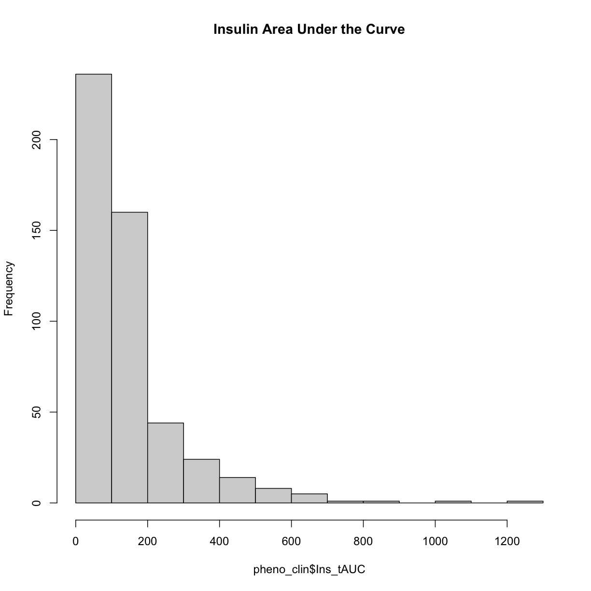
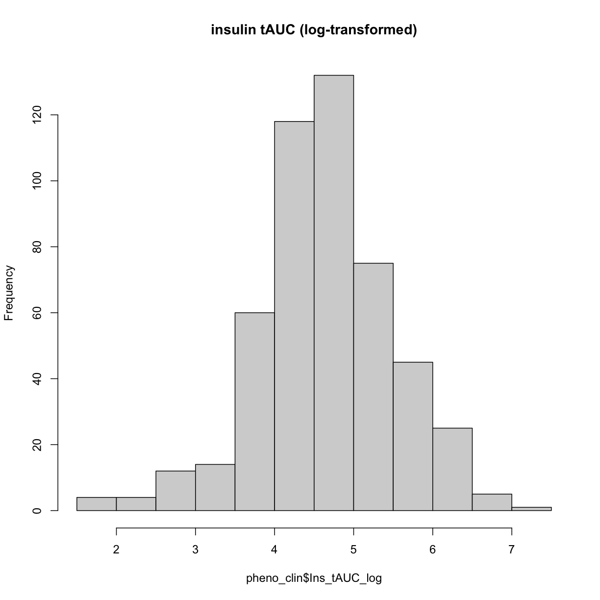
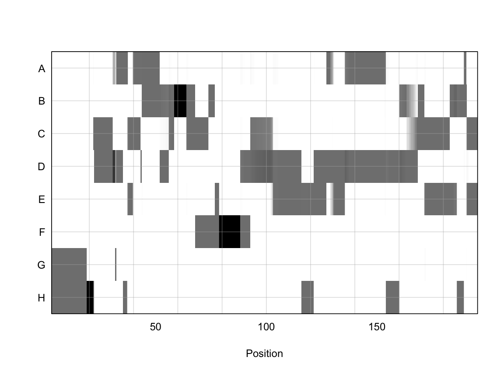
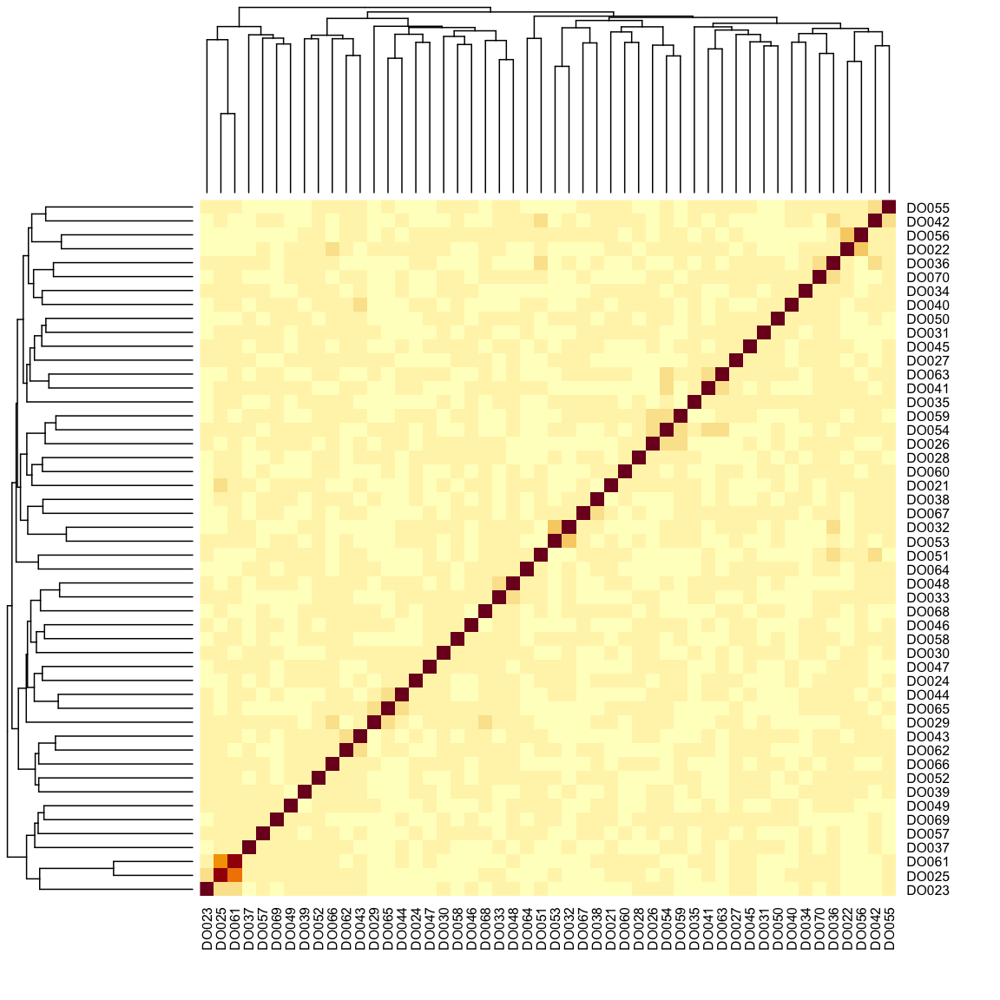
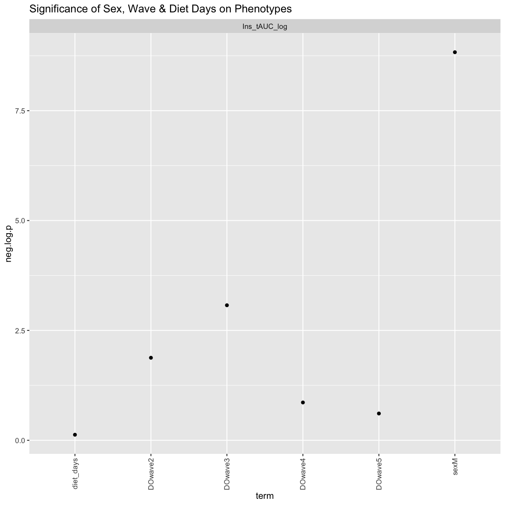
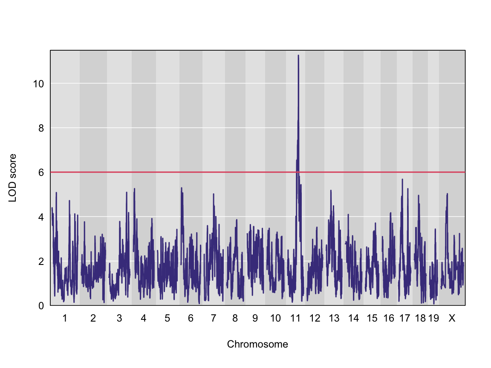

---
# Please do not edit this file directly; it is auto generated.
# Instead, please edit 04-review-mapping-steps.md in _episodes_rmd/
title: "Review Mapping Steps"
teaching: 30
exercises: 30
questions:
- "What are the steps involved in running QTL mapping in Diversity Outbred mice?"
objectives:
- "Reviewing the QTL mapping steps learnt in the first two days"
keypoints:
- "To understand the key steps running a QTL mapping analysis"
source: Rmd
---

Before we begin to run QTL mapping on gene expression data to find eQTLs, let's review the main QTL mapping steps that we learnt in the [QTL mapping course](https://smcclatchy.github.io/mapping/).  As a reminder, we are using data from the Keller et al. [paper](https://academic.oup.com/genetics/article/209/1/335/5931013?login=false) that are freely available to [download](doi:10.5061/dryad.pj105).

Make sure that you are in your main directory. If you’re not sure where you are working right now, you can check your working directory with `getwd()`. If you are not in your main directory, run `setwd("code")` in the Console or Session -> Set Working Directory -> Choose Directory in the RStudio menu to set your working directory to the code directory.

### Load Libraries  

Below are the neccessary libraries that we require for this review.  They are already installed on your machines so go ahead an load them using the following code:

~~~
library(tidyverse)
library(knitr)
library(broom)
library(qtl2)
~~~
{: .language-r}

### Load Data

The data for this tutorial has been saved as several R binary files which contain several data objects, including phenotypes and mapping data as well as the genoprobs.  

Load the data in now by running the following command in your new script. 

~~~
##phenotypes
load("../data/attie_DO500_clinical.phenotypes.RData")

##mapping data
load("../data/attie_DO500_mapping.data.RData")

##genotype probabilities
probs = readRDS("../data/attie_DO500_genoprobs_v5.rds")
~~~
{: .language-r}

We loaded in a few data objects today. Check the Environment tab to see what was loaded. You should see a phenotypes object called `pheno_clin` with 500 observations (in rows) of 32 variables (in columns), an object called map (physical map), and an object called probs (genotype probabilities).

### Phenotypes

In this data set, we have 20 phenotypes for 500 Diversity Outbred mice. `pheno_clin` is a data frame containing the phenotype data as well as covariate information. Click on the triangle to the left of `pheno_clin` in the Environment pane to view its contents. Run `names(pheno_clin)` to list the variables. 

`pheno_clin_dict` is the phenotype dictionary.  This data frame contains information on each variable in `pheno_clin`, including `name`,`short name`, `pheno_type`, `formula` (if used) and `description`.

Since the paper is interested in type 2 diabetes and insulin secretion, we will choose `insulin tAUC` (area  under the curve (AUC) which was calculated without any correction for baseline differences) for this review

Many statistical models, including the QTL mapping model in qtl2, expect that the incoming data will be normally distributed. You may use transformations such as log or square root to make your data more normally distributed. Here, we will log transform the data. 

Here is a histogram of the untransformed data.

~~~
hist(pheno_clin$Ins_tAUC, main = "Insulin Area Under the Curve")
~~~
{: .language-r}

Now, let's apply the `log()` function to this data to correct the distribution.

~~~
pheno_clin$Ins_tAUC_log <- log(pheno_clin$Ins_tAUC)
~~~
{: .language-r}

Now, let's make a histogram of the log-transformed data.

~~~
hist(pheno_clin$Ins_tAUC_log, main = "insulin tAUC (log-transformed)")
~~~
{: .language-r}

This looks much better!

### The Marker Map  

The marker map for each chromosome is stored in the `map` object. This is used to plot the LOD scores calculated at each marker during QTL mapping. Each list element is a numeric vector with each marker position in megabases (Mb). Here we are using the 69K grid marker file. Often when there are numerous genotype arrays used in a study, we interoplate all to a 69k grid file so we are able to combine all samples across different array types. 

Look at the structure of `map` in the Environment tab by clicking the triangle to the left or by running `str(map)` in the Console. 

### Genotype probabilities  

Each element of `probs` is a 3 dimensional array containing the founder allele dosages for each sample at each marker on one chromosome. These are the 8 state alelle probabilities (not 32) using the 69k marker grid for same 500 DO mice that also have clinical phenotypes. We have already calculated genotype probabilities for you, so you can skip the step for [calculating genotype probabilities](https://smcclatchy.github.io/mapping/03-calc-genoprob/) and the optional step for calculating allele probabilities.

Next, we look at the dimensions of `probs` for chromosome 1: 

~~~
dim(probs[[1]])
~~~
{: .language-r}

~~~
[1]  500    8 4711
~~~
{: .output}

~~~
plot_genoprob(probs, map, ind = 1, chr = 1)
~~~
{: .language-r}

In the plot above, the founder contributions, which range between 0 and 1, are colored from white (= 0) to black (= 1.0). A value of ~0.5 is grey. The markers are on the X-axis and the eight founders (denoted by the letters A through H) on the Y-axis. Starting at the left, we see that this sample has genotype GH because the rows for G & H are grey, indicating values of 0.5 for both alleles. Moving along the genome to the right, the genotype becomes HH where where the row is black indicating a value of 1.0.  This is followed by CD, DD, DG, AD, AH, CE, etc. The values at each marker sum to 1.0.  

### [Kinship Matrix](https://smcclatchy.github.io/mapping/04-calc-kinship/)

The kinship matrix has already been calculated and loaded in above

~~~
n_samples <- 50
heatmap(K[[1]][1:n_samples, 1:n_samples])
~~~
{: .language-r}

The figure above shows kinship between all pairs of samples. Light yellow indicates low kinship and dark red indicates higher kinship. Orange values indicate varying levels of kinship between 0 and 1. The dark red diagonal of the matrix indicates that each sample is identical to itself. The orange blocks along the diagonal may indicate close relatives (i.e. siblings or cousins).

### Covariates    

Next, we need to create additive covariates that will be used in the mapping model.  First, we need to see which covariates are significant. In the data set, we have `sex`, `DOwave` (Wave (i.e., batch) of DO mice) 
and `diet_days` (number of days on diet) to test whether there are any gender, batch or diet effects.

First we are going to select out the covariates and phenotype we want from `pheno_clin` data frame.  Then reformat these selected variables into a long format (using the `gather` command) grouped by the phenotypes (in this case, we only have `Ins_tAUC_log`)

~~~
### Tests for sex, wave and diet_days.

tmp = pheno_clin %>%
        dplyr::select(mouse, sex, DOwave, diet_days, Ins_tAUC_log) %>%
        gather(phenotype, value, -mouse, -sex, -DOwave, -diet_days) %>%
        group_by(phenotype) %>%
        nest()
~~~
{: .language-r}

Let's create a linear model function that will regress the covariates and the phenotype.

~~~
mod_fxn = function(df) {
  lm(value ~ sex + DOwave + diet_days, data = df)
}
~~~
{: .language-r}

Now let's apply that function to the data object `tmp` that we created above. 

~~~
tmp = tmp %>%
  mutate(model = map(data, mod_fxn)) %>%
  mutate(summ = map(model, tidy)) %>%
  unnest(summ)

tmp
~~~
{: .language-r}

~~~
# A tibble: 7 × 8
# Groups:   phenotype [1]
  phenotype    data               model  term  estimate std.e…¹ stati…²  p.value
  <chr>        <list>             <list> <chr>    <dbl>   <dbl>   <dbl>    <dbl>
1 Ins_tAUC_log <tibble [500 × 5]> <lm>   (Int…  4.49    0.447    10.1   1.10e-21
2 Ins_tAUC_log <tibble [500 × 5]> <lm>   sexM   0.457   0.0742    6.17  1.48e- 9
3 Ins_tAUC_log <tibble [500 × 5]> <lm>   DOwa… -0.294   0.118    -2.49  1.33e- 2
4 Ins_tAUC_log <tibble [500 × 5]> <lm>   DOwa… -0.395   0.118    -3.36  8.46e- 4
5 Ins_tAUC_log <tibble [500 × 5]> <lm>   DOwa… -0.176   0.118    -1.49  1.38e- 1
6 Ins_tAUC_log <tibble [500 × 5]> <lm>   DOwa… -0.137   0.118    -1.16  2.46e- 1
7 Ins_tAUC_log <tibble [500 × 5]> <lm>   diet…  0.00111 0.00346   0.322 7.48e- 1
# … with abbreviated variable names ¹​std.error, ²​statistic
~~~
{: .output}

~~~
tmp %>%
  filter(term != "(Intercept)") %>%
  mutate(neg.log.p = -log10(p.value)) %>%
  ggplot(aes(term, neg.log.p)) +
    geom_point() +
    facet_wrap(~phenotype) +
    labs(title = "Significance of Sex, Wave & Diet Days on Phenotypes") +
    theme(axis.text.x = element_text(angle = 90, hjust = 1, vjust = 0.5)) +
rm(tmp)
~~~
{: .language-r}

We can see that sex and DOwave (especially the third batch) are significant. Here DOwave is the group or batch number as not all mice are in the experient at the same time. Because of this, we now have to correct for it.

~~~
# convert sex and DO wave (batch) to factors
pheno_clin$sex = factor(pheno_clin$sex)
pheno_clin$DOwave = factor(pheno_clin$DOwave)

covar = model.matrix(~sex + DOwave, data = pheno_clin)
~~~
{: .language-r}
**REMEMBER:** the sample IDs must be in the rownames of `pheno`, `addcovar`, `genoprobs` and `K`. `qtl2` uses the sample IDs to align the samples between objects.

### [Performing a genome scan](https://smcclatchy.github.io/mapping/06-perform-genome-scan/) 

At each marker on the genotyping array, we will fit a model that regresses the phenotype (insulin secretion AUC) on covariates and the founder allele proportions.  Note that this model will give us an estimate of the effect of each founder allele at each marker. There are eight founder strains that contributed to the DO, so we will get eight founder allele effects.

Now let's perform the genome scan, using the [scan1](https://github.com/rqtl/qtl2/blob/master/R/plot_scan1.R) function.

~~~
qtl = scan1(genoprobs = probs, 
            pheno = pheno_clin[,"Ins_tAUC_log", drop = FALSE], 
            kinship = K, 
            addcovar = covar)
~~~
{: .language-r}

Next, we plot the genome scan.

~~~
plot_scan1(x = qtl, map = map, lodcolumn = "Ins_tAUC_log")
  abline(h = 6, col = 2, lwd = 2)
~~~
{: .language-r}

We can see a very strong peak on chromosome 11 with no other distibuishable peaks.

### [Finding LOD peaks](https://smcclatchy.github.io/mapping/07-find-lod-peaks/)

We can find all of the peaks above the significance threshold using the [find_peaks](https://github.com/rqtl/qtl2/blob/master/R/find_peaks.R) function. 

The support interval is determined using the [Bayesian Credible Interval](http://www.ncbi.nlm.nih.gov/pubmed/11560912) and represents the region most likely to contain the causative polymorphism(s). We can obtain this interval by adding a `prob` argument to [find_peaks](https://github.com/rqtl/qtl2/blob/master/R/find_peaks.R). We pass in a value of `0.95` to request a support interval that contains the causal SNP 95% of the time.

In case there are multiple peaks are found on a chromosome, the `peakdrop` argument allows us to the find the peak which has a certain LOD score drop between other peaks. 

Let's find LOD peaks.  Here we are choosing to find peaks with a LOD score greater than 6. 

~~~
lod_threshold = 6
peaks = find_peaks(scan1_output = qtl, map = map, 
                   threshold = lod_threshold, 
                   peakdrop = 4, 
                   prob = 0.95)

kable(peaks %>% dplyr::select (-lodindex) %>% 
        arrange(chr, pos), caption = "Phenotype QTL Peaks with LOD >= 6")
~~~
{: .language-r}

Table: Phenotype QTL Peaks with LOD >= 6

|lodcolumn    |chr |      pos|      lod|    ci_lo|    ci_hi|
|:------------|:---|--------:|--------:|--------:|--------:|
|Ins_tAUC_log |11  | 83.59467| 11.25884| 83.58553| 84.95444|

> ## Challenge
> Now choose another phenotype in `pheno_clin` and perform the same steps.  
> 1). Check the distribution. Does it need transforming?  If so, how would you do it?
> 2). Are there any sex, batch, diet effects?  
> 3). Run a genome scan with the genotype probabilities and kinship provided.   
> 4). Plot the genome scan for this phenotype.  
> 5). Find the peaks above LOD score of 6. 
>
> > ## Solution
> > Replace `<pheno name>` with your choice of phenotype
> > 
> > ~~~
> > #1).
> > 
> > hist(pheno_clin$<pheno name>)
> > 
> > pheno_clin$<pheno name>_log <- log(pheno_clin$<pheno name>)
> > 
> > hist(pheno_clin$<pheno name>_log)
> > 
> > 
> > #2).
> > 
> > tmp = pheno_clin %>%
> >         dplyr::select(mouse, sex, DOwave, diet_days, <pheno name>) %>%
> >         gather(phenotype, value, -mouse, -sex, -DOwave, -diet_days) %>%
> >         group_by(phenotype) %>%
> >         nest()
> > mod_fxn = function(df) {
> >   lm(value ~ sex + DOwave + diet_days, data = df)
> > }
> > tmp = tmp %>%
> >   mutate(model = map(data, mod_fxn)) %>%
> >   mutate(summ = map(model, tidy)) %>%
> >   unnest(summ) 
> > 
> > tmp
> > 
> > tmp %>%
> >   filter(term != "(Intercept)") %>%
> >   mutate(neg.log.p = -log10(p.value)) %>%
> >   ggplot(aes(term, neg.log.p)) +
> >     geom_point() +
> >     facet_wrap(~phenotype) +
> >     labs(title = "Significance of Sex, Wave & Diet Days on Phenotypes") +
> >     theme(axis.text.x = element_text(angle = 90, hjust = 1, vjust = 0.5)) +
> > rm(tmp)
> > 
> > #3).
> > 
> > qtl = scan1(genoprobs = probs, 
> >            pheno = pheno_clin[,"<pheno name>", drop = FALSE], 
> >         kinship = K, 
> >         addcovar = covar)
> > 
> > #4).
> > 
> > plot_scan1(x = qtl, map = map, lodcolumn = "<pheno name>")
> > abline(h = 6, col = 2, lwd = 2)
> > 
> > #5). 
> > 
> > peaks = find_peaks(scan1_output = qtl, map = map, 
> >                threshold = lod_threshold, 
> >                peakdrop = 4, 
> >                prob = 0.95)
> > ~~~
> > {: .language-r}
> {: .solution}
{: .challenge}
