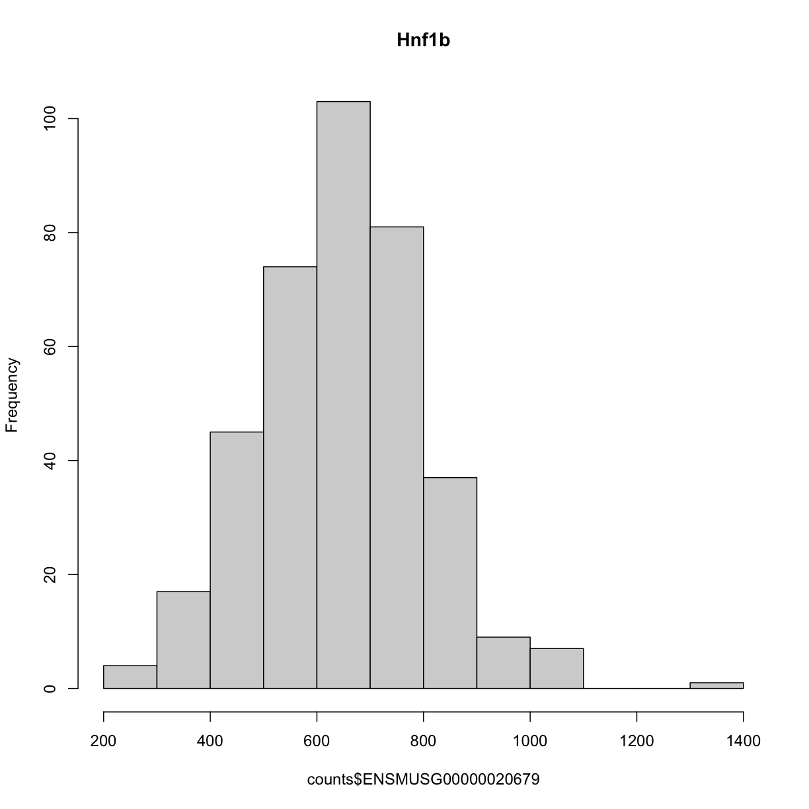

---
# Please do not edit this file directly; it is auto generated.
# Instead, please edit 05-map-one-eqtl.md in _episodes_rmd/
title: "Mapping A Single Gene Expression Trait"
teaching: 30
exercises: 30
questions:
- "How do I map one gene expression trait?"
objectives:
- "QTL mapping of an expression data set"
keypoints:
- "To run a QTL analysis for expression data"
source: Rmd
---

In this tutorial, we are going to use the gene expression data as our phenotype to map QTLs.  That is, we are looking to find any QTLs (cis or trans) that are responsible for variation in gene expression across samples.  

We are using the same directory as our previous tutorial, which you can check by typing `getwd()` in the Console.  If you are not in the correct directory, type in `setwd("code")` in the console or Session -> Set Working Directory -> Choose Directory in the RStudio menu to set your working directory to the main directory. 

If you have started a new R session, you will need to load the libraries again.  If you haven't, the libraries listed below are already loaded. 

### Load Libraries  

~~~
library(tidyverse)
library(knitr)
library(broom)
library(qtl2)
~~~
{: .language-r}

### Load Data

In this lesson, we are loading in gene expression data for `21,771` genes: `attie_DO500_expr.datasets.RData` that includes normalised and raw gene expression data. `dataset.islet.rnaseq` is the dataset you can download directly from Dryad. Again, if you are using the same R session, you will not need to the load the mapping, phenotypes and genotype probabilities data, again. 

~~~
# expression data
load("../data/attie_DO500_expr.datasets.RData")

# data from paper
load("../data/dataset.islet.rnaseq.RData")

# phenotypes
load("../data/attie_DO500_clinical.phenotypes.RData")

# mapping data
load("../data/attie_DO500_mapping.data.RData")

# genotype probabilities
probs = readRDS("../data/attie_DO500_genoprobs_v5.rds")
~~~
{: .language-r}

### Expression Data

Raw gene expression counts are in the `counts` data object. These counts have been normalised and saved in the `norm` data object. More information is about normalisation is [here](https://whoatemycookie.github.io/gene-expression-qtl/03-load-explore-data/index.html#gene-expression-phenotypes).  

To view the contents of either one of these data , click the table on the right hand side either `norm` or `counts` in the Environment tab. If you type in `names(counts)`, you will see the names all start with `ENSMUSG`. These are Ensembl IDs.  If we want to see which gene these IDs correspond to, type in `dataset.islet.rnaseq$annots[dataset.islet.rnaseq$annots`, which gives information about each gene, including ensemble id, gene symbol as well as start & stop location of the gene and chromsome on which the gene lies.  

Because we are working with the `insulin tAUC` phenotype, let's map the expression counts for `Hnf1b` which is known to influence this phenotype is these data.   First, we need to find the Ensembl ID for this gene:

~~~
dataset.islet.rnaseq$annots[dataset.islet.rnaseq$annots$symbol == "Hnf1b",]
~~~
{: .language-r}

~~~
                              gene_id symbol chr    start      end strand
ENSMUSG00000020679 ENSMUSG00000020679  Hnf1b  11 83.85006 83.90592      1
                     middle nearest.marker.id        biotype       module
ENSMUSG00000020679 83.87799       11_84097611 protein_coding midnightblue
                   hotspot
ENSMUSG00000020679    <NA>
~~~
{: .output}

We can see that the ensembl ID of `Hnf1b` is `ENSMUSG00000020679`. If we check the distribution for `Hnf1b` expression data between the raw and normalised data, we can see there distribution has been corrected.  Here is the distribution of the raw counts:

~~~
hist(counts$ENSMUSG00000020679, main = "Hnf1b")
~~~
{: .language-r}

and here is the distribution of the normalised counts:

~~~
hist(norm$ENSMUSG00000020679, main = "Hnf1b")
~~~
{: .language-r}

The histogram indicates that distribution of these counts are normalised.  

### The Marker Map  

We are using the same marker map as in the previous [lesson](https://smcclatchy.github.io/gene-expression-qtl/04-review-mapping-steps/index.html#the-marker-map)

### Genotype probabilities  

We have explored this earlier in th previous [lesson](https://smcclatchy.github.io/gene-expression-qtl/04-review-mapping-steps/index.html#genotype-probabilities).  But, as a reminder, we have already calculated genotype probabilities which we loaded above called `probs`.  This contains the 8 state genotype probabilities using the 69k grid  map of the same 500 DO mice that also have clinical phenotypes. 

### [Kinship Matrix](https://smcclatchy.github.io/mapping/04-calc-kinship/)

We have explored the kinship matrix in the previous [lesson](https://smcclatchy.github.io/gene-expression-qtl/04-review-mapping-steps/index.html#kinship-matrix). It has already been calculated and loaded in above. 

### Covariates    

Now let's add the necessary covariates. For `Hnf1b` expression data, let's see which covariates are significant.

~~~
###merging covariate data and expression data to test for sex, wave and diet_days.

cov.counts <- merge(covar, norm, by=c("row.names"), sort=F)

#testing covairates on expression data

tmp = cov.counts %>%
        dplyr::select(mouse, sex, DOwave, diet_days, ENSMUSG00000020679) %>%
        gather(expression, value, -mouse, -sex, -DOwave, -diet_days) %>%
        group_by(expression) %>%
        nest()
mod_fxn = function(df) {
  lm(value ~ sex + DOwave + diet_days, data = df)
}
tmp = tmp %>%
  mutate(model = map(data, mod_fxn)) %>%
  mutate(summ = map(model, tidy)) %>%
  unnest(summ) 
#  kable(tmp, caption = "Effects of Sex, Wave & Diet Days on Expression")

tmp
~~~
{: .language-r}

~~~
# A tibble: 4 × 8
# Groups:   expression [1]
  expression         data     model  term      estimate std.e…¹ stati…²  p.value
  <chr>              <list>   <list> <chr>        <dbl>   <dbl>   <dbl>    <dbl>
1 ENSMUSG00000020679 <tibble> <lm>   (Interce… -1.70    0.506     -3.36 8.72e- 4
2 ENSMUSG00000020679 <tibble> <lm>   sexM      -0.199   0.0824    -2.42 1.60e- 2
3 ENSMUSG00000020679 <tibble> <lm>   DOwave     0.510   0.0370    13.8  3.73e-35
4 ENSMUSG00000020679 <tibble> <lm>   diet_days  0.00403 0.00386    1.04 2.97e- 1
# … with abbreviated variable names ¹​std.error, ²​statistic
~~~
{: .output}

~~~
tmp %>%
  filter(term != "(Intercept)") %>%
  mutate(neg.log.p = -log10(p.value)) %>%
  ggplot(aes(term, neg.log.p)) +
    geom_point() +
    facet_wrap(~expression) +
    labs(title = "Significance of Sex, Wave & Diet Days on Expression") +
    theme(axis.text.x = element_text(angle = 90, hjust = 1, vjust = 0.5)) +
rm(tmp)
~~~
{: .language-r}

We can see that sex and DOwave are significant.  Here DOwave is the group or batch number as not all mice were submitted for genotyping at the same time.  Because of this, we now have to correct for it.

~~~
# convert sex and DO wave (batch) to factors
pheno_clin$sex = factor(pheno_clin$sex)
pheno_clin$DOwave = factor(pheno_clin$DOwave)
pheno_clin$diet_days = factor(pheno_clin$DOwave)

covar = model.matrix(~sex + DOwave + diet_days, data = pheno_clin)
~~~
{: .language-r}

### [Performing a genome scan](https://smcclatchy.github.io/mapping/06-perform-genome-scan/) 

Now let's perform the genome scan!

~~~
qtl = scan1(genoprobs = probs, 
            pheno = norm[,"ENSMUSG00000020679", drop = FALSE], 
            kinship = K, 
            addcovar = covar, 
            cores = 2)
~~~
{: .language-r}

Let's plot it

~~~
plot_scan1(x = qtl, 
           map = map, 
           lodcolumn = "ENSMUSG00000020679", 
           main = colnames(qtl))
abline(h = 6, col = 2, lwd = 2)
~~~
{: .language-r}

### [Finding LOD peaks](https://smcclatchy.github.io/mapping/07-find-lod-peaks/)

Let's find LOD peaks

~~~
lod_threshold = 6
peaks = find_peaks(scan1_output = qtl, 
                   map = map, 
                   threshold = lod_threshold, 
                   peakdrop = 4, prob = 0.95)
kable(peaks %>% 
        dplyr::select(-lodindex) %>% 
        arrange(chr, pos), caption = "Phenotype QTL Peaks with LOD >= 6")
~~~
{: .language-r}

Table: Phenotype QTL Peaks with LOD >= 6

|lodcolumn          |chr |       pos|       lod|     ci_lo|     ci_hi|
|:------------------|:---|---------:|---------:|---------:|---------:|
|ENSMUSG00000020679 |9   | 109.08150|  6.402594| 106.66772| 111.56048|
|ENSMUSG00000020679 |11  |  84.40138| 36.878942|  83.64714|  84.40138|
|ENSMUSG00000020679 |15  |  68.91018|  6.121254|  67.82232|  70.38004|
|ENSMUSG00000020679 |18  |  70.89669|  6.042135|  33.80428|  71.96869|

> ## Challenge
> Now choose another gene expression trait in `norm` data object and perform 
> the same steps.   
> 1). Check the distribution of the raw counts and normalised counts
> 2). Are there any sex, batch, diet effects?   
> 3). Run a genome scan with the genotype probabilities and kinship provided.   
> 4). Plot the genome scan for this gene.   
> 5). Find the peaks above LOD score of 6.   
>
> > ## Solution
> > Replace `<ensembl id>` with your choice of gene expression trait
> > 
> > ~~~
> > #1).
> > 
> > hist(pheno_clin$<ensembl id>)
> > 
> > pheno_clin$<ensembl id>_log <- log(pheno_clin$<ensembl id>)
> > 
> > hist(pheno_clin$<ensembl id>_log)
> > 
> > 
> > #2).
> > 
> > tmp = pheno_clin %>%
> >         dplyr::select(mouse, sex, DOwave, diet_days, <ensembl id>) %>%
> >         gather(expression, value, -mouse, -sex, -DOwave, -diet_days) %>%
> >         group_by(expression) %>%
> >         nest()
> > mod_fxn = function(df) {
> >   lm(value ~ sex + DOwave + diet_days, data = df)
> > }
> > tmp = tmp %>%
> >   mutate(model = map(data, mod_fxn)) %>%
> >   mutate(summ = map(model, tidy)) %>%
> >   unnest(summ) 
> > 
> > tmp
> > 
> > tmp %>%
> >   filter(term != "(Intercept)") %>%
> >   mutate(neg.log.p = -log10(p.value)) %>%
> >   ggplot(aes(term, neg.log.p)) +
> >     geom_point() +
> >     facet_wrap(~expression) +
> >     labs(title = "Significance of Sex, Wave & Diet Days on Phenotypes") +
> >     theme(axis.text.x = element_text(angle = 90, hjust = 1, vjust = 0.5)) +
> > rm(tmp)
> > 
> > #3).
> > 
> > qtl = scan1(genoprobs = probs, 
> >            pheno = pheno_clin[,"<ensembl id>", drop = FALSE], 
> >         kinship = K, 
> >         addcovar = covar)
> > 
> > #4).
> > 
> > plot_scan1(x = qtl, map = map, lodcolumn = "<ensembl id>")
> > abline(h = 6, col = 2, lwd = 2)
> > 
> > #5). 
> > 
> > peaks = find_peaks(scan1_output = qtl, map = map, 
> >                threshold = lod_threshold, 
> >                peakdrop = 4, 
> >                prob = 0.95)
> > ~~~
> > {: .language-r}
> {: .solution}
{: .challenge}
