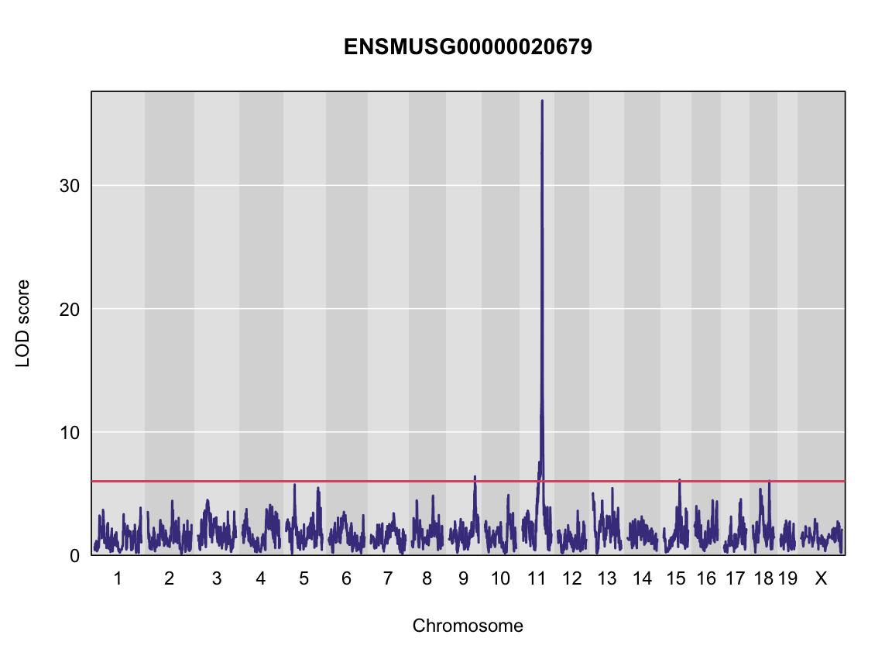

---
# Please do not edit this file directly; it is auto generated.
# Instead, please edit 05-review-mapping-steps.md in _episodes_rmd/
title: "5. Review Mapping Steps"
teaching: 30
exercises: 30
questions:
- "??????"
objectives:
- "????"
keypoints:
- "????"
source: Rmd
---

### Load Libraries  

~~~
library(tidyverse)
~~~
{: .language-r}

~~~
── Attaching packages ───────────────────────────────────────── tidyverse 1.3.1 ──
~~~
{: .output}

~~~
✔ ggplot2 3.3.6     ✔ purrr   0.3.4
✔ tibble  3.1.7     ✔ dplyr   1.0.9
✔ tidyr   1.2.0     ✔ stringr 1.4.0
✔ readr   2.1.2     ✔ forcats 0.5.1
~~~
{: .output}

~~~
── Conflicts ──────────────────────────────────────────── tidyverse_conflicts() ──
✖ dplyr::filter() masks stats::filter()
✖ dplyr::lag()    masks stats::lag()
~~~
{: .output}

~~~
library(qtl2)
~~~
{: .language-r}

~~~

Attaching package: 'qtl2'
~~~
{: .output}

~~~
The following object is masked from 'package:readr':

    read_csv
~~~
{: .output}

~~~
library(qtl2convert)
#library(qtl2db)
library(GGally)
~~~
{: .language-r}

~~~
Registered S3 method overwritten by 'GGally':
  method from   
  +.gg   ggplot2
~~~
{: .output}

~~~
library(broom)
library(knitr)
library(corrplot)
~~~
{: .language-r}

~~~
corrplot 0.92 loaded
~~~
{: .output}

~~~
library(RColorBrewer)
~~~
{: .language-r}

## Load Data

~~~
##phenotypes
load("../data/attie_DO500_clinical.phenotypes.RData")

##mapping data
load("../data/attie_DO500_mapping.data.RData")

probs <- readRDS("../data/attie_DO500_genoprobs_qtlviewer_8state_69k.rds")
~~~
{: .language-r}

### Phenotypes

Lets choose a phenotype.  Here, we have chosen `weight_6wk` (weight taken at 6 weeks).  

Lets check the distribution

~~~
hist(pheno_clin$weight_6wk, main = "Proportion of weight at 6 weeks")
~~~
{: .language-r}

Apply the `log()` function to this data.

~~~
pheno_clin$weight_6wk_log <- log(pheno_clin$weight_6wk)
~~~
{: .language-r}

Now, lets make a histogram of the log-transformed data.

~~~
hist(pheno_clin$weight_6wk_log, main = "Proportion of weight at 6 weeks (log-transformed)")
~~~
{: .language-r}

This looks much better!

### The Marker Map  

The marker map for each chromosome is stored in the `map` object. This is used to plot the LOD scores calculated at each marker during QTL mapping.  Here we are using the 69K grid marker file

### Genotype probabilities  

We have already claculated genotype probabilities which we load above

~~~
dim(probs[[1]])
~~~
{: .language-r}

~~~
[1]  500    8 4711
~~~
{: .output}

~~~
plot_genoprob(probs, map, ind = 1, chr = 1)
~~~
{: .language-r}

### [Kinship Matrix](https://smcclatchy.github.io/mapping/04-calc-kinship/)

The kinship matrix has already been calculated and loaded in above

~~~
n_samples <- 50

heatmap(K[[1]][1:n_samples, 1:n_samples])
~~~
{: .language-r}

### Covariates    

Now lets add the necessary covariates. For these analysis, lets see which covariates are significant (???)

~~~
# convert sex and DO wave (batch) to factors
pheno_clin$sex = factor(pheno_clin$sex)
pheno_clin$DOwave = factor(pheno_clin$DOwave)

covar = model.matrix(~sex + DOwave, data = pheno_clin)
~~~
{: .language-r}
### [Performing a genome scan](https://smcclatchy.github.io/mapping/06-perform-genome-scan/) 

Now lets perform the genome scan!

~~~
qtl <- scan1(genoprobs = probs, 
             pheno =  pheno_clin[,"weight_6wk_log", drop = FALSE],
             kinship = K, 
             addcovar = covar)
~~~
{: .language-r}

Lets plot it

~~~
plot_scan1(x = qtl, map = map, 
           lodcolumn = "weight_6wk_log", main = colnames(qtl))
abline(h = 6, col = 2, lwd = 2)
~~~
{: .language-r}

### [Performing a permutation test](https://smcclatchy.github.io/mapping/10-perform-perm-test/) 

Not in scripts

### [Finding LOD peaks](https://smcclatchy.github.io/mapping/07-find-lod-peaks/)

Lets find LOD peaks

~~~
lod_threshold = 6
peaks = find_peaks(scan1_output = qtl, map = map, threshold = lod_threshold, peakdrop = 4, prob = 0.95)
kable(peaks %>% select (-lodindex) %>% arrange(chr, pos), caption = "Phenotype QTL Peaks with LOD >= 6")
~~~
{: .language-r}

Table: Phenotype QTL Peaks with LOD >= 6

|lodcolumn      |chr |      pos|      lod|    ci_lo|    ci_hi|
|:--------------|:---|--------:|--------:|--------:|--------:|
|weight_6wk_log |11  | 11.82603| 6.321523| 10.41106| 16.88112|
|weight_6wk_log |17  | 34.56569| 6.831975| 31.46779| 44.52366|
|weight_6wk_log |X   | 45.98936| 6.373361| 39.23834| 49.93483|

Lets plot them:

should we?

### [Estimated QTL effects](https://smcclatchy.github.io/mapping/11-est-qtl-effects/) 

Not in scripts

### [SNP Association Mapping](https://smcclatchy.github.io/mapping/12-snp-assoc/)

Not in scripts

### Searching for Candidate Genes

Not in scripts
