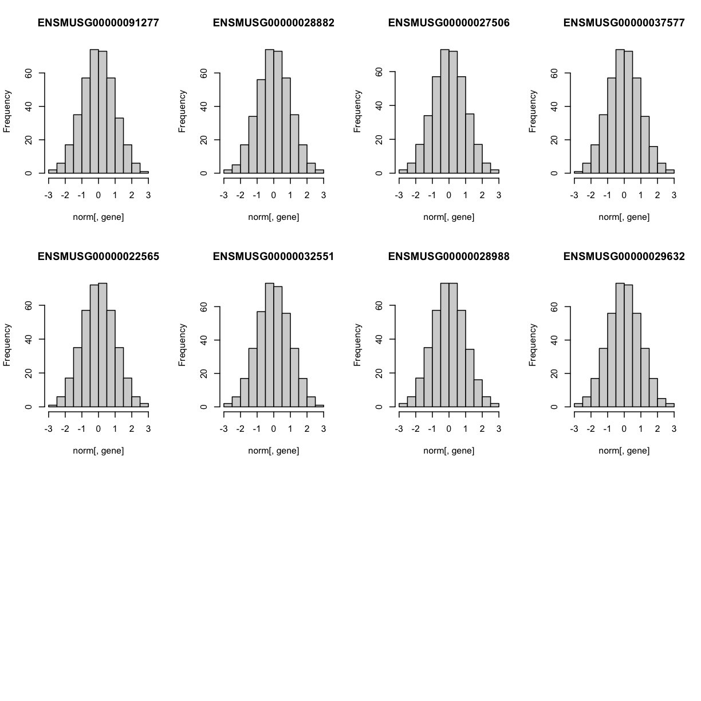
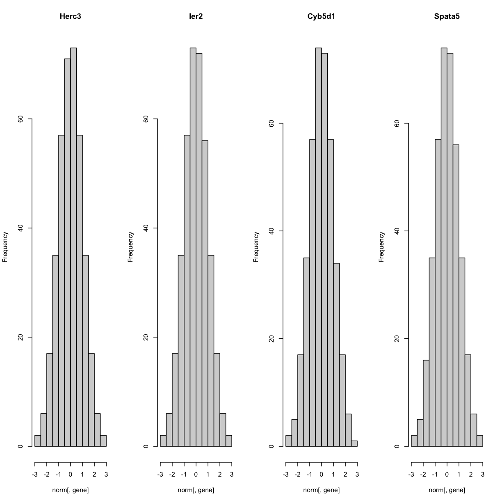
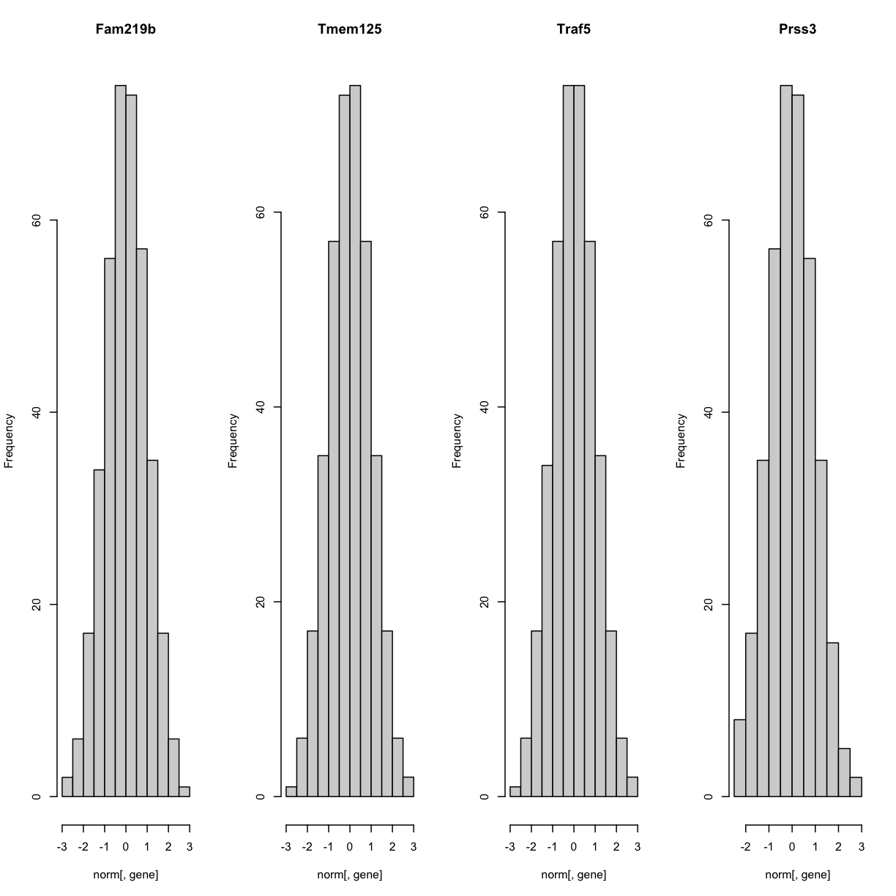
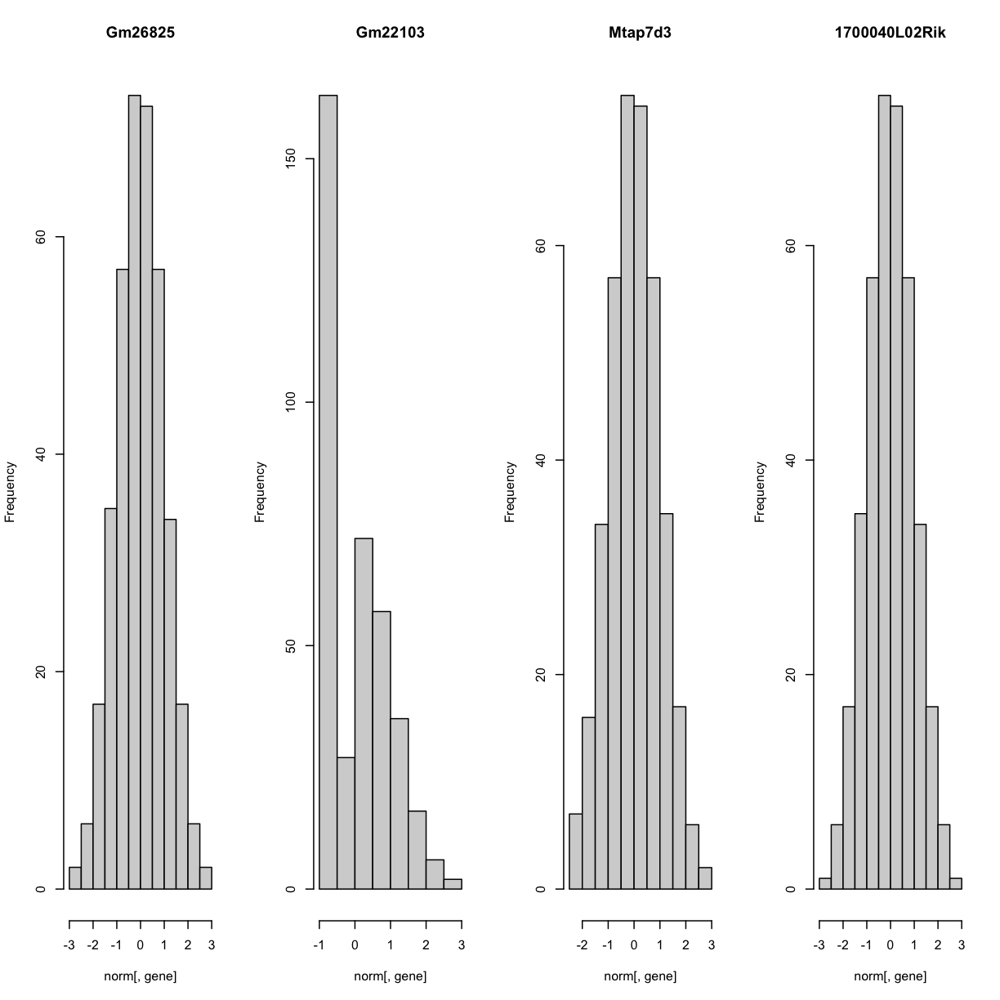
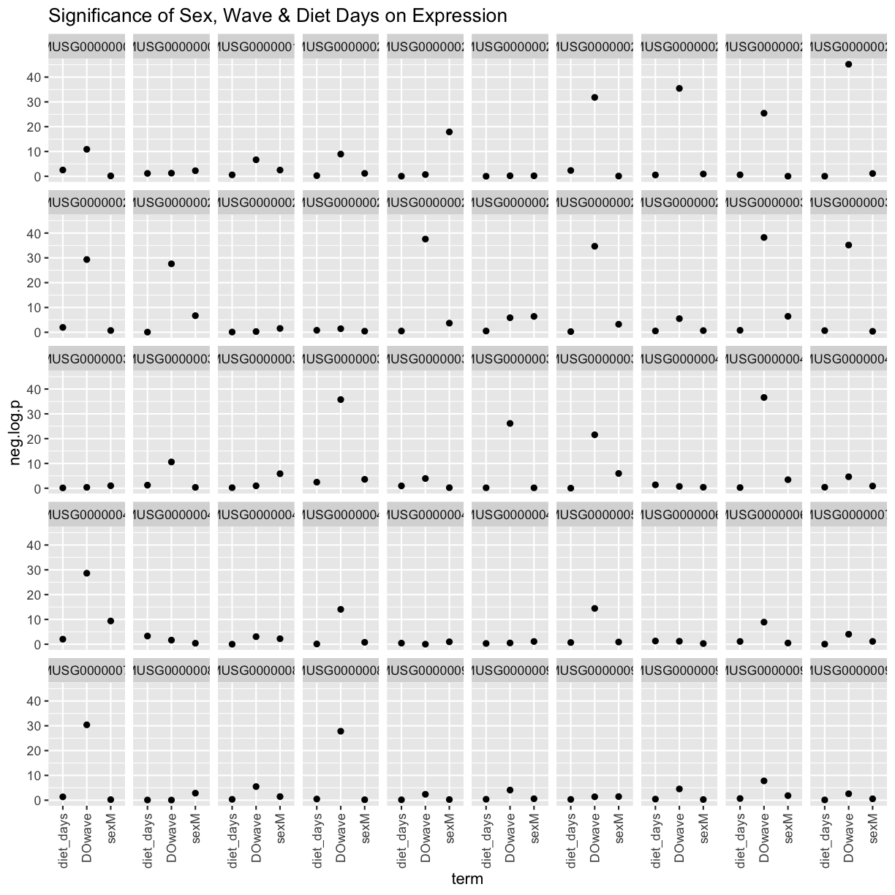
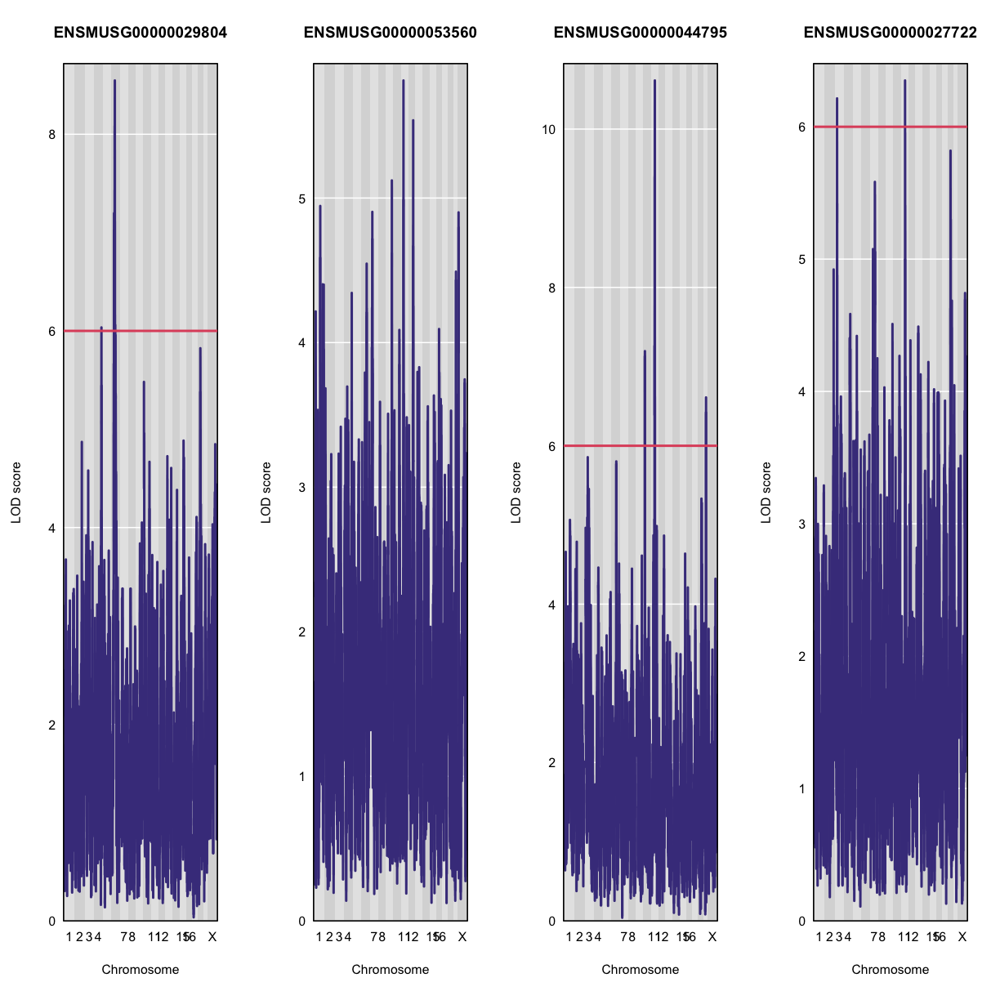

---
# Please do not edit this file directly; it is auto generated.
# Instead, please edit 06-map-many-eqtls.md in _episodes_rmd/
title: "Mapping Many Gene Expression Traits"
teaching: 30
exercises: 30
questions:
- "How do I map many genes?"
objectives:
- "????"
keypoints:
- "To map several genes at the same time"
source: Rmd
---

### Load Libraries  

~~~
library(tidyverse)
library(knitr)
library(broom)
library(qtl2)
library(qtl2ggplot)
library(RColorBrewer)

source("../code/gg_transcriptome_map.R")
source("../code/qtl_heatmap.R")
~~~
{: .language-r}

Before we begin this lesson, we need to create another directory called `results` in our main directory.  You can do this by clicking on the "Files" tab and navigate into the main directory.  Then select "New Folder" and name it "results".

### Load Data

~~~
# expression data
load("../data/attie_DO500_expr.datasets.RData")

# data from paper
load("../data/dataset.islet.rnaseq.RData")

# phenotypes
load("../data/attie_DO500_clinical.phenotypes.RData")

# mapping data
load("../data/attie_DO500_mapping.data.RData")

# genotype probabilities
probs = readRDS("../data/attie_DO500_genoprobs_v5.rds")
~~~
{: .language-r}

### Data Selection

For this lesson, lets choose a random set of 50 gene expression phenotypes.

~~~
genes = colnames(norm)

sams <- sample(length(genes), 50, replace = FALSE, prob = NULL)
genes <- genes[sams]
~~~
{: .language-r}

### Expression Data

Lets check the distributin of these 50 gene expression phenotypes

~~~
par(mfrow=c(1,4))
for(gene in genes[1:20]){
  hist(norm[,gene], main = dataset.islet.rnaseq$annots[dataset.islet.rnaseq$annots$gene_id == gene,]$symbol)
  }
~~~
{: .language-r}

The histogram indicates that distribution of these counts are normalised (as they should be).

### The Marker Map  

We are using the same marker map as in the previous [lesson](https://smcclatchy.github.io/gene-expression-qtl/04-review-mapping-steps/index.html#the-marker-map)

### Genotype probabilities  

We have explored this earlier in th previous [lesson](https://smcclatchy.github.io/gene-expression-qtl/04-review-mapping-steps/index.html#genotype-probabilities).  But, as a reminder, we have already calculated genotype probabilities which we loaded above called `probs`.  This contains the 8 state genotype probabilities using the 69k grid  map of the same 500 DO mice that also have clinical phenotypes. 

### [Kinship Matrix](https://smcclatchy.github.io/mapping/04-calc-kinship/)

We have explored the kinship matrix in the previous [lesson](https://smcclatchy.github.io/gene-expression-qtl/04-review-mapping-steps/index.html#kinship-matrix). It has already been calculated and loaded in above. 

### Covariates    

Now let's add the necessary covariates. For these 50 gene expression data, let's see which covariates are significant.

~~~
###merging covariate data and expression data to test for sex, wave and diet_days.

cov.counts <- merge(covar, norm[,genes], by=c("row.names"), sort=F)

#testing covairates on expression data

tmp = cov.counts %>%
        dplyr::select(mouse, sex, DOwave, diet_days, names(cov.counts[,genes])) %>%
        gather(expression, value, -mouse, -sex, -DOwave, -diet_days) %>%
        group_by(expression) %>%
        nest()
mod_fxn = function(df) {
  lm(value ~ sex + DOwave + diet_days, data = df)
}
tmp = tmp %>%
  mutate(model = map(data, mod_fxn)) %>%
  mutate(summ = map(model, tidy)) %>%
  unnest(summ) 
#  kable(tmp, caption = "Effects of Sex, Wave & Diet Days on Expression")

tmp
~~~
{: .language-r}

~~~
# A tibble: 200 × 8
# Groups:   expression [50]
   expression         data     model  term     estimate std.e…¹ stati…²  p.value
   <chr>              <list>   <list> <chr>       <dbl>   <dbl>   <dbl>    <dbl>
 1 ENSMUSG00000042055 <tibble> <lm>   (Interc…  0.603   0.550     1.10  2.74e- 1
 2 ENSMUSG00000042055 <tibble> <lm>   sexM      0.0830  0.0896    0.927 3.54e- 1
 3 ENSMUSG00000042055 <tibble> <lm>   DOwave   -0.412   0.0403  -10.2   7.64e-22
 4 ENSMUSG00000042055 <tibble> <lm>   diet_da…  0.00300 0.00420   0.716 4.75e- 1
 5 ENSMUSG00000005881 <tibble> <lm>   (Interc…  0.167   0.572     0.292 7.71e- 1
 6 ENSMUSG00000005881 <tibble> <lm>   sexM     -0.0119  0.0932   -0.128 8.98e- 1
 7 ENSMUSG00000005881 <tibble> <lm>   DOwave    0.328   0.0419    7.83  5.23e-14
 8 ENSMUSG00000005881 <tibble> <lm>   diet_da… -0.00777 0.00437  -1.78  7.62e- 2
 9 ENSMUSG00000030499 <tibble> <lm>   (Interc… -1.50    0.530    -2.82  4.99e- 3
10 ENSMUSG00000030499 <tibble> <lm>   sexM      0.380   0.0863    4.41  1.38e- 5
# … with 190 more rows, and abbreviated variable names ¹​std.error, ²​statistic
~~~
{: .output}

~~~
tmp %>%
  filter(term != "(Intercept)") %>%
  mutate(neg.log.p = -log10(p.value)) %>%
  ggplot(aes(term, neg.log.p)) +
    geom_point() +
    facet_wrap(~expression, ncol=10) +
    labs(title = "Significance of Sex, Wave & Diet Days on Expression") +
    theme(axis.text.x = element_text(angle = 90, hjust = 1, vjust = 0.5)) +
rm(tmp)
~~~
{: .language-r}

We can see that `DOwave` is the most significant.  However, given that a few are influenced by `sex` and `diet_days`, we will have to correct for those as well. 

~~~
# convert sex and DO wave (batch) to factors
pheno_clin$sex = factor(pheno_clin$sex)
pheno_clin$DOwave = factor(pheno_clin$DOwave)
pheno_clin$diet_days = factor(pheno_clin$DOwave)

covar = model.matrix(~sex + DOwave + diet_days, data = pheno_clin)
~~~
{: .language-r}

### [Performing a genome scan](https://smcclatchy.github.io/mapping/06-perform-genome-scan/) 

Now lets perform the genome scan!  We are also going to save our qtl results in an `Rdata` file to be used in further lessons. 

### QTL Scans

~~~
qtl.file = "../results/gene.norm_qtl_cis.trans_random.Rdata"

if(file.exists(qtl.file)) {
  load(qtl.file)
  } else {
    qtl = scan1(genoprobs = probs, 
                pheno = norm[,genes, drop = FALSE],
                kinship = K, 
                addcovar = covar, 
                cores = 2)
    save(qtl, file = qtl.file)
    }
~~~
{: .language-r}

### QTL plots

~~~
par(mfrow=c(1,4))
for(i in 1:20) {
  plot_scan1(x = qtl, 
             map = map, 
             lodcolumn = i, 
             main = colnames(qtl)[i])
  abline(h = 6, col = 2, lwd = 2)
  }
~~~
{: .language-r}

### QTL Peaks

We are also going to save our peak results so we can use these again else where.  First, lets get out peaks with a LOD score greater than 6. 

~~~
lod_threshold = 6
peaks = find_peaks(scan1_output = qtl, 
                   map = map, 
                   threshold = lod_threshold, 
                   peakdrop = 4, 
                   prob = 0.95)
~~~
{: .language-r}

We will save these peaks into a csv file. 

~~~
kable(peaks %>% 
        dplyr::select(-lodindex) %>% 
        arrange(chr, pos), caption = "Expression QTL (eQTL) Peaks with LOD >= 6")

write_csv(peaks, "../results/gene.norm_qtl_peaks_random.csv")
~~~
{: .language-r}

Table: Phenotype QTL Peaks with LOD >= 6

|lodcolumn          |chr |        pos|        lod|      ci_lo|      ci_hi|
|:------------------|:---|----------:|----------:|----------:|----------:|
|ENSMUSG00000006313 |1   |   5.024922|   6.017559|   3.000000|   9.964486|
|ENSMUSG00000045005 |1   |  61.974262|   6.822885|  59.358711|  65.170619|
|ENSMUSG00000097069 |1   | 128.857776|   6.786012| 124.015913| 130.727344|
|ENSMUSG00000026427 |1   | 131.565298|   8.612473| 130.287881| 139.058573|
|ENSMUSG00000026049 |1   | 135.481336|   6.544009| 132.453455| 135.798134|
|ENSMUSG00000032649 |1   | 152.433726|  36.826967| 152.422610| 152.433726|
|ENSMUSG00000045107 |1   | 159.141735|   6.093000| 153.913246| 163.315674|
|ENSMUSG00000040170 |1   | 162.805534|  90.301197| 162.660248| 162.867294|
|ENSMUSG00000057594 |1   | 173.113807|   6.390894|  73.684635| 180.313324|
|ENSMUSG00000057594 |1   | 190.142151|   6.048886| 188.983387| 190.453546|
|ENSMUSG00000026427 |2   |   4.369263|   6.519883|   4.241948|   4.875753|
|ENSMUSG00000024854 |2   |   4.972275|   6.137185|   4.292516|  10.344301|
|ENSMUSG00000040170 |2   |   5.679261|   6.838276|   4.958738|   7.501966|
|ENSMUSG00000029126 |2   |  10.363308|   6.181899|   4.292516| 138.132614|
|ENSMUSG00000090994 |2   |  24.948963|   7.312249|  23.160434|  26.470332|
|ENSMUSG00000094242 |2   |  26.434318|   6.891295|  25.858090|  50.650153|
|ENSMUSG00000047250 |2   |  36.635073|   8.624351|  36.000249|  38.624308|
|ENSMUSG00000029715 |2   |  64.883167|   7.557968|  64.021169|  68.937839|
|ENSMUSG00000026994 |2   |  66.952535|   7.469886|  64.348108|  68.568918|
|ENSMUSG00000075027 |2   |  85.202802|  11.198490|  84.171512|  89.785114|
|ENSMUSG00000075027 |2   |  93.343426|  11.015530|  92.122394|  94.522850|
|ENSMUSG00000033335 |2   | 106.520484|   7.013931| 103.627938| 106.907339|
|ENSMUSG00000037014 |2   | 148.376062|   6.784396| 132.240855| 150.817057|
|ENSMUSG00000045005 |2   | 164.022416|   6.333956| 163.413317| 164.758936|
|ENSMUSG00000019762 |2   | 164.076561|  23.226514| 164.022416| 164.255184|
|ENSMUSG00000052374 |2   | 164.255184|   7.112630| 163.582672| 164.336991|
|ENSMUSG00000086480 |2   | 175.839420|  11.924439| 173.877812| 178.421762|
|ENSMUSG00000094242 |2   | 179.248418|   6.226650| 165.900093| 179.488565|
|ENSMUSG00000032649 |3   |  39.083892|   6.167177|  38.886082|  39.632404|
|ENSMUSG00000085890 |3   |  53.480171|   6.870075|  52.678574|  54.901999|
|ENSMUSG00000061360 |3   |  62.774555|   6.508061|  59.250712|  63.139247|
|ENSMUSG00000047557 |3   |  67.609374|  32.437106|  66.921340|  67.653979|
|ENSMUSG00000074466 |3   |  89.265523|  35.639255|  89.265523|  89.565831|
|ENSMUSG00000047557 |3   |  99.090850|   6.443265|  98.141985| 100.208705|
|ENSMUSG00000028133 |3   | 101.884680|   7.348328| 101.857630| 103.206555|
|ENSMUSG00000020263 |3   | 116.632109|   6.504173| 114.966469| 118.540622|
|ENSMUSG00000028133 |3   | 117.187432|  21.978735| 117.167137| 117.339231|
|ENSMUSG00000028133 |3   | 121.183469|  37.080828| 120.954628| 121.186997|
|ENSMUSG00000044365 |3   | 133.432106|  10.212062| 132.302465| 135.232817|
|ENSMUSG00000040969 |3   | 137.961468|   6.937742| 135.788890| 139.596035|
|ENSMUSG00000062151 |3   | 157.247450|   7.462584| 157.031554| 160.017104|
|ENSMUSG00000097312 |4   |   8.365329|   6.167757|   3.000000|  33.095143|
|ENSMUSG00000026994 |4   |  12.795203|   6.210189|  11.317929|  63.029706|
|ENSMUSG00000021311 |4   |  17.742789|   6.197093|  16.085608|  19.795003|
|ENSMUSG00000036362 |4   |  28.851452|   6.486166|   3.938158|  40.536395|
|ENSMUSG00000095375 |4   |  42.868337|  14.671214|  42.330494|  43.554301|
|ENSMUSG00000054509 |4   | 138.690361|   7.850134| 138.138494| 140.250356|
|ENSMUSG00000040616 |4   | 142.079533|  36.750649| 141.912272| 142.079533|
|ENSMUSG00000063245 |4   | 148.123078|  29.984248| 145.802530| 148.146518|
|ENSMUSG00000078291 |5   |  24.943315|   7.601951|  23.436274|  26.201520|
|ENSMUSG00000042099 |5   |  36.243421|   6.370183|  34.788707| 115.446727|
|ENSMUSG00000029126 |5   |  38.745839|  23.926415|  38.235269|  38.751361|
|ENSMUSG00000020474 |5   |  53.941878|   6.627336|  52.465258| 104.078266|
|ENSMUSG00000037014 |5   |  63.013158|   6.835050|  44.474381|  64.462891|
|ENSMUSG00000084544 |5   |  66.128148|  43.898154|  66.103847|  66.326161|
|ENSMUSG00000006313 |5   |  91.799805|   6.821550|  73.970622| 100.177432|
|ENSMUSG00000036006 |5   | 135.658482|   6.842464| 134.409079| 136.237367|
|ENSMUSG00000045438 |5   | 139.339762|  10.390507| 139.215508| 139.441834|
|ENSMUSG00000061898 |5   | 142.306762|  15.148180| 142.293828| 143.554489|
|ENSMUSG00000045005 |5   | 143.159416|   6.303979| 142.242615| 144.415349|
|ENSMUSG00000030406 |5   | 143.699438|   6.375977|  87.762266| 147.563362|
|ENSMUSG00000026049 |5   | 147.253583|   6.965177| 143.240265| 147.287872|
|ENSMUSG00000056602 |5   | 150.583587|   6.482290| 149.684549| 151.833620|
|ENSMUSG00000032649 |6   |  24.554539|   6.496668|  18.401401|  31.534264|
|ENSMUSG00000097069 |6   |  33.225512|   6.042993|  32.436639| 128.076006|
|ENSMUSG00000034424 |6   |  40.148390|   8.182217|  39.344919|  46.367017|
|ENSMUSG00000033335 |6   |  50.576990|   7.385649|  49.805892|  53.685431|
|ENSMUSG00000025287 |6   |  55.783552|   7.555793|  54.107425|  63.293317|
|ENSMUSG00000092368 |6   | 102.928891|   7.151521|  55.794477| 107.431726|
|ENSMUSG00000040616 |6   | 122.570908|   7.249819| 120.453920| 125.565302|
|ENSMUSG00000036362 |6   | 137.427486|   6.944427| 137.367861| 138.095199|
|ENSMUSG00000083626 |6   | 142.522038|   6.282510| 141.450743| 142.877411|
|ENSMUSG00000024854 |6   | 146.530881|   7.512688| 146.383170| 148.595270|
|ENSMUSG00000043290 |7   |   5.264727|  14.853563|   4.112152|   6.000682|
|ENSMUSG00000030406 |7   |  19.073303|   9.969891|  16.802582|  19.290036|
|ENSMUSG00000006313 |7   |  30.531596|  45.978666|  30.531252|  30.534994|
|ENSMUSG00000069874 |7   |  45.441513|   6.870671|  44.610566| 143.414669|
|ENSMUSG00000052374 |7   |  46.358463|   7.241459|  44.819852|  79.540279|
|ENSMUSG00000038112 |7   |  91.482683|   6.121385|  29.701749| 131.339331|
|ENSMUSG00000006313 |7   |  93.494466|   6.081113|  92.540248|  95.900208|
|ENSMUSG00000028133 |7   |  98.389270|   8.029685|  81.484863| 107.605001|
|ENSMUSG00000056602 |8   |  22.513617|   6.314053|  15.994313|  31.082268|
|ENSMUSG00000052374 |8   |  24.688160|   7.269190|  22.922652|  27.271890|
|ENSMUSG00000031622 |8   |  71.623422|  18.842585|  70.826479|  72.600004|
|ENSMUSG00000081051 |8   |  74.950572|   8.007224|  70.827018|  76.597259|
|ENSMUSG00000045098 |8   |  77.049988|   6.951740|  75.362791|  77.180300|
|ENSMUSG00000040616 |8   | 115.000889|   6.009728|  41.560257| 117.098882|
|ENSMUSG00000036880 |8   | 116.979928|   7.113609| 115.718942| 118.090351|
|ENSMUSG00000097203 |8   | 121.444866|  11.765596| 121.441850| 123.206745|
|ENSMUSG00000033335 |9   |  14.677118|   9.565858|  10.649965|  26.343336|
|ENSMUSG00000089702 |9   |  15.996531|  12.713196|  11.667522|  16.431894|
|ENSMUSG00000041633 |9   |  33.550524|   6.911047|  33.493194|  34.365485|
|ENSMUSG00000032649 |9   |  34.380468|   6.635181|  28.425280|  34.806782|
|ENSMUSG00000038112 |9   |  40.355213|  22.967276|  39.434431|  40.456768|
|ENSMUSG00000037971 |9   |  51.195977|  47.365598|  50.557512|  51.335030|
|ENSMUSG00000026994 |9   | 108.728707|   6.109499|  67.358019| 108.998714|
|ENSMUSG00000026494 |9   | 112.825525|   6.252254|  40.780764| 118.818779|
|ENSMUSG00000031622 |9   | 116.936239|   6.005365| 102.828927| 119.342532|
|ENSMUSG00000030406 |9   | 119.351721|   6.145976|  16.469500| 123.772090|
|ENSMUSG00000015305 |10  |   8.209453|  16.555451|   7.567820|   9.008502|
|ENSMUSG00000048217 |10  |  27.619157|   8.257088|  26.980733|  29.318130|
|ENSMUSG00000032649 |10  |  36.467786|   7.365016|  35.653037|  37.281723|
|ENSMUSG00000052374 |10  |  39.996088|   6.097212|  36.467786|  41.589243|
|ENSMUSG00000097069 |10  |  55.505078|  10.415781|  52.927609|  55.538600|
|ENSMUSG00000047250 |10  |  75.604454|   6.241092|  18.527427| 121.585762|
|ENSMUSG00000078291 |10  |  82.044778|   6.257621|  81.013884|  89.760048|
|ENSMUSG00000020263 |10  |  83.469081|  39.466122|  83.255643|  83.741454|
|ENSMUSG00000040969 |10  |  90.173226|   6.135332|  88.846165|  90.785004|
|ENSMUSG00000036362 |10  | 103.367496|   6.137124|  36.881931| 105.555575|
|ENSMUSG00000069874 |10  | 114.979805|   6.408463|  25.041214| 122.853631|
|ENSMUSG00000036006 |10  | 117.618279|   6.785792| 116.765814| 119.427140|
|ENSMUSG00000040616 |10  | 127.830649|   6.129999|  22.790048| 130.685419|
|ENSMUSG00000097312 |11  |   3.157511|  28.577363|   3.126009|   3.454185|
|ENSMUSG00000020474 |11  |   5.975257|  12.923338|   5.126321|   6.348857|
|ENSMUSG00000037971 |11  |  16.131869|   6.715891|  14.809410|  17.165927|
|ENSMUSG00000075486 |11  |  19.111816|   6.598141|  15.963422|  23.787427|
|ENSMUSG00000082116 |11  |  30.516276|   7.570057|  25.862447|  31.564721|
|ENSMUSG00000082116 |11  |  49.010731|  32.379307|  48.403386|  49.010731|
|ENSMUSG00000069874 |11  |  58.335146|   6.685292|  57.312581| 109.965664|
|ENSMUSG00000082116 |11  |  67.946874|   7.631305|  67.708923|  69.416362|
|ENSMUSG00000020897 |11  |  69.234230|   9.962713|  69.064645|  69.542556|
|ENSMUSG00000044365 |11  |  69.416362|   7.868773|  67.327916|  72.974476|
|ENSMUSG00000025287 |11  |  72.314268|   6.228527|  69.064645|  97.596132|
|ENSMUSG00000030406 |11  |  72.974476|   7.383864|  71.782692|  75.903257|
|ENSMUSG00000029166 |11  |  73.079353|   6.300913|  71.782692|  76.653411|
|ENSMUSG00000024097 |11  |  82.560347|   6.037842|  81.082463|  84.686176|
|ENSMUSG00000093483 |11  |  83.139783| 132.513853|  83.104215|  83.175351|
|ENSMUSG00000000805 |11  |  85.958455|   9.583614|  81.259022|  88.344415|
|ENSMUSG00000034329 |11  |  86.128457|  16.143259|  85.942359|  87.143928|
|ENSMUSG00000048217 |11  | 102.256090|  28.089370| 102.246410| 102.589080|
|ENSMUSG00000093483 |11  | 103.555128|   8.290464| 100.852582| 103.731310|
|ENSMUSG00000075027 |11  | 118.372606|   6.104516| 117.094755| 120.245724|
|ENSMUSG00000057594 |11  | 120.327824|  34.537424| 120.327824| 120.525818|
|ENSMUSG00000047250 |12  |  35.839992|  11.625764|  35.171413|  36.060935|
|ENSMUSG00000086480 |12  |  50.017539|   7.348444|  46.668722|  53.173040|
|ENSMUSG00000097080 |12  |  50.710648|   6.053660|  46.062470|  52.975896|
|ENSMUSG00000041633 |12  |  84.203316|   6.026125|  77.361096|  94.677613|
|ENSMUSG00000032649 |12  |  84.209187|   6.579002|  30.949400|  84.885271|
|ENSMUSG00000040616 |12  |  89.158972|   7.407896|  89.135947|  90.137506|
|ENSMUSG00000052374 |13  |  11.787211|   9.850816|  11.689749|  18.376763|
|ENSMUSG00000021311 |13  |  12.142754|  25.135674|  12.118251|  15.577276|
|ENSMUSG00000042099 |13  |  19.656559|   6.039057|  12.118251|  22.298549|
|ENSMUSG00000036181 |13  |  23.923410|  10.723709|  20.108823|  27.270024|
|ENSMUSG00000034424 |13  |  37.755078|   6.305204|  30.249233| 120.387272|
|ENSMUSG00000000489 |13  | 112.216066|   7.508623| 110.600303| 112.689915|
|ENSMUSG00000045107 |14  |   3.122521|  30.600182|   3.000000|  12.527336|
|ENSMUSG00000094242 |14  |   7.288241|  22.232217|   3.040840|  12.527336|
|ENSMUSG00000094242 |14  |  19.765537|  23.908274|  19.644603|  20.188719|
|ENSMUSG00000045107 |14  |  20.229410|  40.521420|  19.783656|  20.243088|
|ENSMUSG00000026994 |14  |  36.620269|   6.229749|  34.529952|  44.751499|
|ENSMUSG00000054509 |14  |  56.385608|  42.503490|  56.385608|  56.624317|
|ENSMUSG00000061360 |14  |  72.699648|   6.806485|  70.532356|  74.905032|
|ENSMUSG00000078291 |14  |  74.873402|   7.090992|  59.752486|  75.158928|
|ENSMUSG00000026427 |14  |  78.614280|   6.322060|  13.040795|  83.365644|
|ENSMUSG00000024854 |14  |  78.622956|   6.713575|  55.659248|  93.159436|
|ENSMUSG00000026427 |14  |  92.355332|   6.714752|  88.478841|  93.259019|
|ENSMUSG00000075486 |14  | 101.264521|  28.906453| 101.238103| 102.467008|
|ENSMUSG00000022475 |15  |  47.109796|   6.499047|  41.164200|  48.394382|
|ENSMUSG00000026427 |15  |  50.140303|   6.030488|  48.161615|  54.408901|
|ENSMUSG00000000489 |15  |  67.861639|   9.087495|  67.122758|  67.893155|
|ENSMUSG00000029715 |15  |  69.109933|   7.283189|  68.991957|  72.059794|
|ENSMUSG00000022433 |15  |  78.975240|   7.568733|  73.659987|  82.620361|
|ENSMUSG00000000489 |15  |  79.848642|  39.269678|  79.521869|  80.172565|
|ENSMUSG00000061360 |15  |  81.625674|  20.334654|  81.497355|  82.387529|
|ENSMUSG00000040170 |15  |  83.028439|   6.310925|  70.450104|  87.054810|
|ENSMUSG00000040969 |15  |  88.097035|   6.040808|  35.898542|  91.693928|
|ENSMUSG00000083626 |15  |  90.353312|   6.040440|  76.237397|  94.142237|
|ENSMUSG00000022475 |15  |  98.026455|  16.344171|  97.616094|  98.463532|
|ENSMUSG00000020474 |15  | 102.231738|   6.187833| 101.186229| 104.015452|
|ENSMUSG00000045098 |16  |   7.194416|   6.386782|   4.026626|  51.664175|
|ENSMUSG00000036006 |16  |  10.479574|   6.216374|   8.057973|  30.822786|
|ENSMUSG00000041633 |16  |  26.421438|   6.047020|  24.270447|  28.378813|
|ENSMUSG00000020263 |16  |  29.503008|   8.136812|  27.940300|  29.540748|
|ENSMUSG00000045438 |16  |  33.350802|   6.418726|  32.852323|  35.103650|
|ENSMUSG00000075033 |16  |  59.515638|  12.509782|  54.643912|  60.036825|
|ENSMUSG00000063163 |16  |  70.124587|  21.554747|  69.901171|  70.744784|
|ENSMUSG00000045438 |16  |  73.652071|   7.332895|  73.283252|  75.255163|
|ENSMUSG00000022475 |16  |  77.448162|   6.945679|  15.774437|  78.363082|
|ENSMUSG00000022889 |16  |  85.315558|  14.500093|  84.547568|  85.991727|
|ENSMUSG00000023341 |16  |  97.635634|  60.328982|  97.598025|  98.180002|
|ENSMUSG00000097069 |17  |   6.720756|   8.540521|   6.179119|   6.748055|
|ENSMUSG00000036022 |17  |  23.753197|   6.114170|  12.683465|  25.408447|
|ENSMUSG00000042099 |17  |  29.907024|  28.760281|  29.711239|  30.994198|
|ENSMUSG00000042099 |17  |  33.680116|  89.717455|  33.680116|  33.866717|
|ENSMUSG00000092368 |17  |  34.519485|  50.613873|  34.181204|  34.519485|
|ENSMUSG00000092368 |17  |  36.271975| 142.529169|  36.267315|  36.526816|
|ENSMUSG00000092368 |17  |  40.770308| 107.230567|  40.770308|  41.953736|
|ENSMUSG00000042099 |17  |  52.174397|  10.056121|  51.736429|  52.597914|
|ENSMUSG00000042099 |17  |  57.071792|   8.408698|  57.024044|  61.766796|
|ENSMUSG00000026994 |17  |  73.736476|   6.336149|  64.994882|  75.371079|
|ENSMUSG00000024097 |17  |  80.507280|   6.480086|  79.727615|  80.887502|
|ENSMUSG00000054509 |17  |  85.268610|   7.503464|  84.929951|  85.350429|
|ENSMUSG00000044365 |18  |  13.760634|   6.470458|   3.000000|  85.128972|
|ENSMUSG00000042099 |18  |  16.835616|   6.846439|  16.379159|  19.901969|
|ENSMUSG00000052374 |18  |  17.083304|   8.429344|  16.142857|  21.125281|
|ENSMUSG00000031622 |18  |  17.607787|   6.165603|  16.835616|  68.585017|
|ENSMUSG00000000805 |18  |  30.009451|   8.600117|  29.990456|  31.017915|
|ENSMUSG00000075486 |18  |  36.599722|   6.691241|  34.588534|  44.969966|
|ENSMUSG00000097080 |18  |  38.003165|  55.874212|  37.801102|  38.261133|
|ENSMUSG00000026994 |18  |  41.750711|   6.140384|   5.057602|  77.748169|
|ENSMUSG00000043290 |18  |  43.062062|   6.221672|  36.069173|  58.377678|
|ENSMUSG00000040170 |18  |  69.181641|   6.045102|  46.874010|  83.712538|
|ENSMUSG00000036880 |18  |  71.972967|  42.447938|  71.970826|  71.975108|
|ENSMUSG00000036880 |18  |  74.656975|  92.693068|  74.544927|  74.823823|
|ENSMUSG00000040969 |18  |  88.081247|   6.313955|  86.340133|  90.672596|
|ENSMUSG00000024854 |19  |   4.611135|  12.408390|   4.275662|   4.978110|
|ENSMUSG00000092368 |19  |   8.869281|   6.174674|   7.605183|  10.049850|
|ENSMUSG00000097080 |19  |  16.207067|   6.452527|  14.884413|  42.683343|
|ENSMUSG00000081051 |19  |  38.115027|   7.539811|  36.898397|  40.218172|
|ENSMUSG00000045107 |19  |  41.787160|   6.113966|  38.173308|  42.185900|
|ENSMUSG00000095375 |X   |  16.567082|   6.209723|  11.353116|  48.548841|
|ENSMUSG00000037014 |X   |  38.572875|   6.091869|  20.819904|  49.026883|
|ENSMUSG00000036022 |X   |  53.334452|  14.426887|  52.732396|  53.366141|
|ENSMUSG00000085153 |X   |  61.164240|   7.476678|  60.855475|  70.832546|
|ENSMUSG00000086480 |X   |  91.564602|   6.142258|  86.985046|  97.098344|
|ENSMUSG00000027840 |X   | 140.345819|   6.313376| 105.134414| 171.028300|
|ENSMUSG00000092908 |X   | 142.548819|   6.941289| 139.941432| 171.028300|
|ENSMUSG00000041633 |X   | 145.335742|   9.922986| 145.296963| 157.666845|
|ENSMUSG00000025287 |X   | 152.118341|   6.057853| 145.798606| 157.256032|
|ENSMUSG00000025264 |X   | 152.126211|  14.470244| 145.335742| 160.349329|
|ENSMUSG00000026049 |X   | 159.715757|   6.123504| 158.566592| 164.948105|
|ENSMUSG00000081051 |X   | 164.156375|   6.304208|  60.380357| 167.115384|

### QTL Peaks Figure

~~~
qtl_heatmap(qtl = qtl, map = map, low.thr = 3.5)
~~~
{: .language-r}

> ## Challenge
> What do the qtl scans for all gene exression traits look like? *Note:* Don't worry, we've done the qtl scans for you!!!
> You can read in this file, `../data/gene.norm_qtl_all.genes.Rdata`, which are the `scan1` results for all gene expression traits. 
>
> > ## Solution
> > 
> > 
> > ~~~
> > load("../data/gene.norm_qtl_all.genes.Rdata")
> > 
> > lod_threshold = 6
> > peaks = find_peaks(scan1_output = qtl, 
> >                map = map, 
> >                threshold = lod_threshold, 
> >                peakdrop = 4, 
> >                prob = 0.95)
> > write_csv(peaks, "../results/gene.norm_qtl_peaks.csv")
> > 
> > ## Heat Map
> > qtl_heatmap(qtl = qtl, map = map, low.thr = 3.5)
> > ~~~
> > {: .language-r}
> {: .solution}
{: .challenge}
