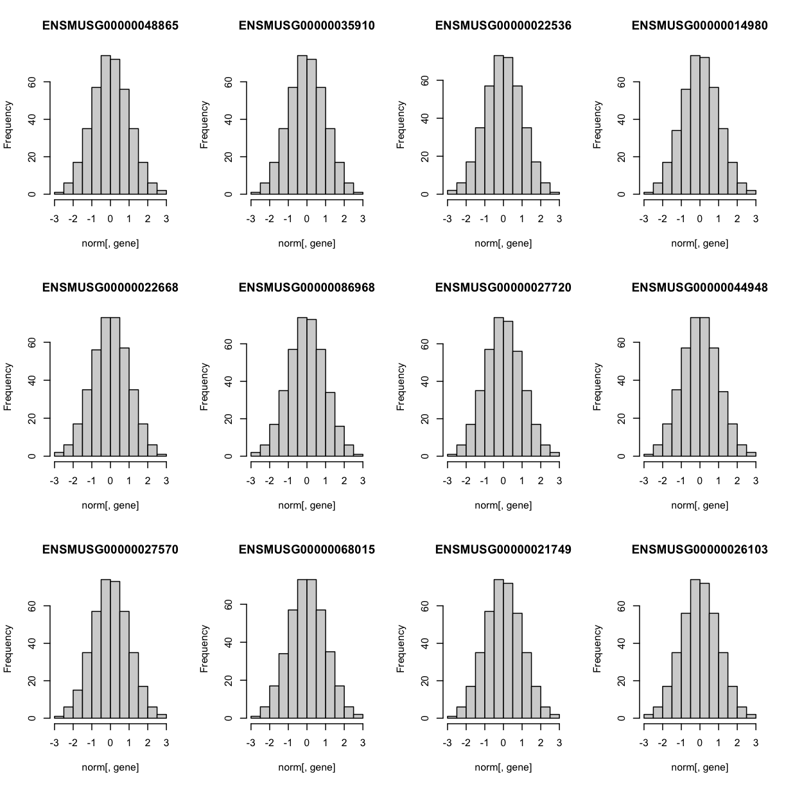

---
# Please do not edit this file directly; it is auto generated.
# Instead, please edit 06-mapping-one-eqtl.md in _episodes_rmd/
title: "Mapping a Single Gene Expression Trait"
teaching: 30
exercises: 30
questions:
- "How do I map one gene expression trait?"
objectives:
- "????"
keypoints:
- "????"
source: Rmd
---

### Load Libraries  

~~~
library(tidyverse)
~~~
{: .language-r}

~~~
── Attaching packages ────────────────────────────────── tidyverse 1.3.2 ──
✔ ggplot2 3.3.6     ✔ purrr   0.3.4
✔ tibble  3.1.8     ✔ dplyr   1.0.9
✔ tidyr   1.2.0     ✔ stringr 1.4.0
✔ readr   2.1.2     ✔ forcats 0.5.1
── Conflicts ───────────────────────────────────── tidyverse_conflicts() ──
✖ dplyr::filter() masks stats::filter()
✖ dplyr::lag()    masks stats::lag()
~~~
{: .output}

~~~
library(qtl2)
~~~
{: .language-r}

~~~

Attaching package: 'qtl2'

The following object is masked from 'package:readr':

    read_csv
~~~
{: .output}

~~~
library(qtl2convert)
#library(qtl2db)
library(GGally)
~~~
{: .language-r}

~~~
Registered S3 method overwritten by 'GGally':
  method from   
  +.gg   ggplot2
~~~
{: .output}

~~~
library(broom)
library(knitr)
library(corrplot)
~~~
{: .language-r}

~~~
corrplot 0.92 loaded
~~~
{: .output}

~~~
library(RColorBrewer)
~~~
{: .language-r}

## Load Data

~~~
#expression data
load("../data/attie_DO500_expr.datasets.RData")

##mapping data
load("../data/attie_DO500_mapping.data.RData")

genoprobs <- readRDS("../data/attie_DO500_genoprobs_qtlviewer_8state_69k.rds")

##phenotypes
load("../data/attie_DO500_clinical.phenotypes.RData")
~~~
{: .language-r}

### Expression Data

Lets check the distribution

~~~
hist(counts$ENSMUSG00000020679, main = "Hnf1b")
~~~
{: .language-r}

These counts are normalised

### The Marker Map  

The marker map for each chromosome is stored in the `map` object. This is used to plot the LOD scores calculated at each marker during QTL mapping.  Here we are using the 69K grid marker file

### Genotype probabilities  

We have already calculated genotype probabilities which we load above

~~~
probs = genoprobs
~~~
{: .language-r}

~~~
dim(probs[[1]])
~~~
{: .language-r}

~~~
[1]  500    8 4711
~~~
{: .output}

~~~
plot_genoprob(probs, map, ind = 1, chr = 1)
~~~
{: .language-r}

### [Kinship Matrix](https://smcclatchy.github.io/mapping/04-calc-kinship/)

The kinship matrix has already been calculated and loaded in above

~~~
n_samples <- 50

heatmap(K[[1]][1:n_samples, 1:n_samples])
~~~
{: .language-r}

### Covariates    

Now lets add the necessary covariates. For these analysis, lets see which covariates are significant (???)

~~~
# convert sex and DO wave (batch) to factors
pheno_clin$sex = factor(pheno_clin$sex)
pheno_clin$DOwave = factor(pheno_clin$DOwave)

covar = model.matrix(~sex + DOwave, data = pheno_clin)
~~~
{: .language-r}
### [Performing a genome scan](https://smcclatchy.github.io/mapping/06-perform-genome-scan/) 

Now lets perform the genome scan!

~~~
Hnf1b_qtl = scan1(genoprobs = genoprobs, pheno = counts[,"ENSMUSG00000020679", drop = FALSE], kinship = K, addcovar = covar, cores = 2)
~~~
{: .language-r}

Lets plot it

~~~
plot_scan1(x = Hnf1b_qtl, map = map, lodcolumn = "ENSMUSG00000020679", main = colnames(Hnf1b_qtl))
~~~
{: .language-r}

~~~
Error in plot_scan1(x = Hnf1b_qtl, map = map, lodcolumn = "ENSMUSG00000020679", : object 'Hnf1b_qtl' not found
~~~
{: .error}

~~~
  abline(h = 6, col = 2, lwd = 2)
~~~
{: .language-r}

~~~
Error in int_abline(a = a, b = b, h = h, v = v, untf = untf, ...): plot.new has not been called yet
~~~
{: .error}

### [Performing a permutation test](https://smcclatchy.github.io/mapping/10-perform-perm-test/) 

Not in scripts

### [Finding LOD peaks](https://smcclatchy.github.io/mapping/07-find-lod-peaks/)

Lets find LOD peaks

~~~
lod_threshold = 6
peaks = find_peaks(scan1_output = Hnf1b_qtl, map = map, threshold = lod_threshold, peakdrop = 4, prob = 0.95)
~~~
{: .language-r}

~~~
Error in align_scan1_map(scan1_output, map): object 'Hnf1b_qtl' not found
~~~
{: .error}

~~~
kable(peaks %>% select (-lodindex) %>% arrange(chr, pos), caption = "Phenotype QTL Peaks with LOD >= 6")
~~~
{: .language-r}

~~~
Error in select(., -lodindex): object 'peaks' not found
~~~
{: .error}

Lets plot them:

should we?

### [Estimated QTL effects](https://smcclatchy.github.io/mapping/11-est-qtl-effects/) 

Not in scripts

### [SNP Association Mapping](https://smcclatchy.github.io/mapping/12-snp-assoc/)

Not in scripts

### Searching for Candidate Genes

Not in scripts
