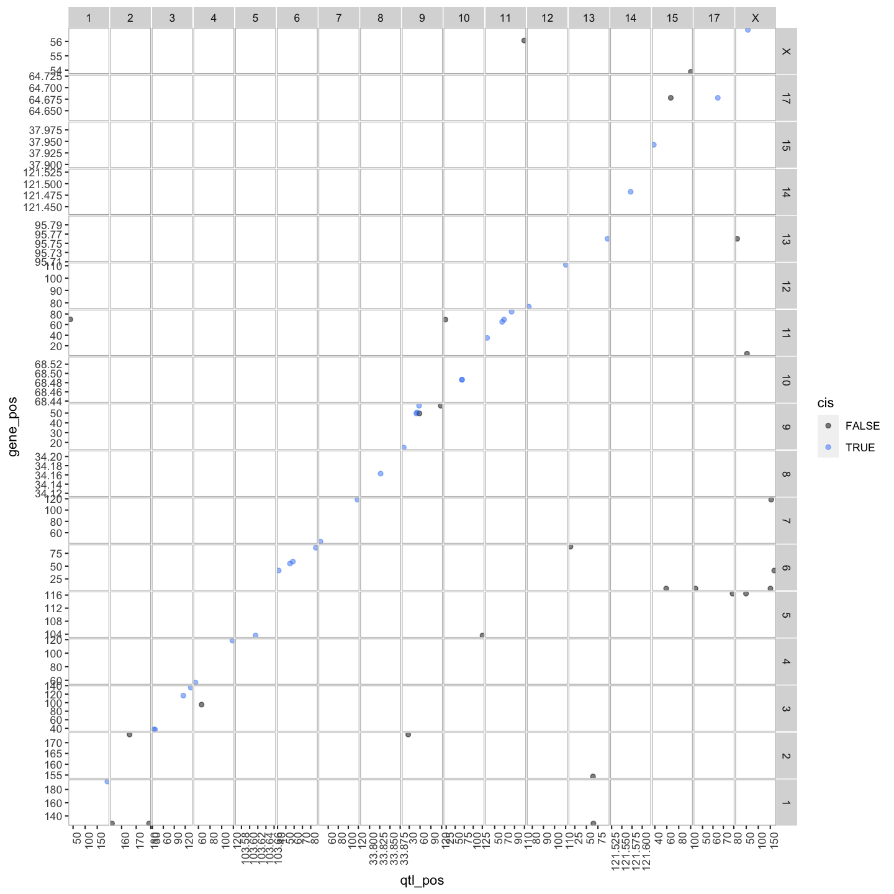
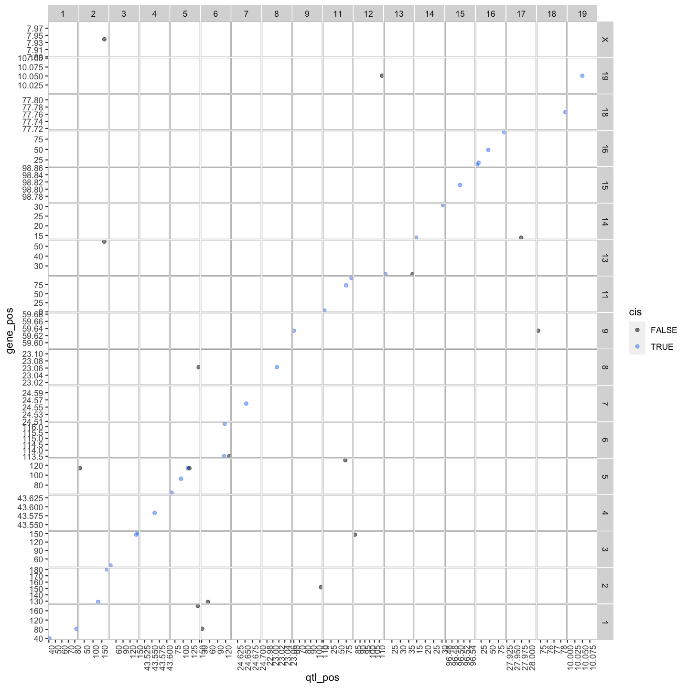

---
# Please do not edit this file directly; it is auto generated.
# Instead, please edit 07-create-transcriptome-map.md in _episodes_rmd/
title: "Creating A Transcriptome Map"
teaching: 30
exercises: 30
questions:
- "How do I create and interpret a transcriptome map?"
objectives:
- Describe a transcriptome map.
- Interpret a transcriptome map.
keypoints:
- "Transcriptome maps aid in understanding gene expression regulation."
source: Rmd
---

### Load Libraries  

~~~
library(tidyverse)
library(qtl2)
library(qtl2convert)
library(GGally)
library(broom)
library(corrplot)
library(RColorBrewer)
library(qtl2ggplot)

source("../code/gg_transcriptome_map.R")
source("../code/qtl_heatmap.R")
~~~
{: .language-r}

## Load Data

~~~
#expression data
load("../data/attie_DO500_expr.datasets.RData")

##mapping data
load("../data/attie_DO500_mapping.data.RData")

##genoprobs
probs = readRDS("../data/attie_DO500_genoprobs_v5.rds")

##phenotypes
load("../data/attie_DO500_clinical.phenotypes.RData")

expr.mrna <- norm
~~~
{: .language-r}

In this lesson we are going to learn how to create a transcriptome map.  At transcriptome map shows the location of the eQTL peak compared its gene location, giving information about cos and trans eQTLs. 

We are going to use the file that we created in the previous lesson with the lod scores greater than 6: `gene.norm_qtl_peaks_cis.trans.csv`.  

You can load it in using the following code:

~~~
lod_summary = read.csv("../results/gene.norm_qtl_peaks_cis.trans.csv")
lod_summary$marker.id <- paste0(lod_summary$chr,
                                "_",
                                lod_summary$pos * 1000000)
~~~
{: .language-r}

~~~
ensembl = get_ensembl_genes()
~~~
{: .language-r}

~~~
snapshotDate(): 2022-04-25
~~~
{: .output}

~~~
loading from cache
~~~
{: .output}

~~~
Importing File into R ..
~~~
{: .output}

~~~
id    = ensembl$gene_id
chr   = seqnames(ensembl)
start = start(ensembl) * 1e-6
end   = end(ensembl)   * 1e-6
df = data.frame(ensembl = id, 
                gene_chr = chr, 
                gene_start = start, 
                gene_end = end,
                stringsAsFactors = F)
colnames(lod_summary)[colnames(lod_summary) == "lodcolumn"] = "ensembl"
colnames(lod_summary)[colnames(lod_summary) == "chr"] = "qtl_chr"
colnames(lod_summary)[colnames(lod_summary) == "pos"] = "qtl_pos"
colnames(lod_summary)[colnames(lod_summary) == "lod"] = "qtl_lod"
lod_summary = left_join(lod_summary, df, by = "ensembl")
lod_summary = mutate(lod_summary, 
                     gene_chr = factor(gene_chr, levels = c(1:19, "X")),
                     qtl_chr = factor(qtl_chr, levels = c(1:19, "X")))
rm(df)
~~~
{: .language-r}

We can summarise which eQTLs are cis or trans. Remember a cis qtl is...  and trans eqtl is....

~~~
lod_summary$cis.trans <- ifelse(lod_summary$qtl_chr == lod_summary$gene_chr, "cis", "trans")
table(lod_summary$cis.trans)
~~~
{: .language-r}

~~~

  cis trans 
   47    65 
~~~
{: .output}

### Plot Transcriptome Map

~~~
lod_summary = mutate(lod_summary, cis = (gene_chr == qtl_chr) & (abs(gene_start - qtl_pos) < 4))
out.plot = ggtmap(data = lod_summary %>% filter(qtl_lod >= 7.18), cis.points = TRUE, cis.radius = 4)
~~~
{: .language-r}

~~~
pdf("../results/transcriptome_map_cis.trans.pdf", width = 10, height = 10)
out.plot
dev.off()
~~~
{: .language-r}

~~~
quartz_off_screen 
                2 
~~~
{: .output}

~~~
out.plot
~~~
{: .language-r}

