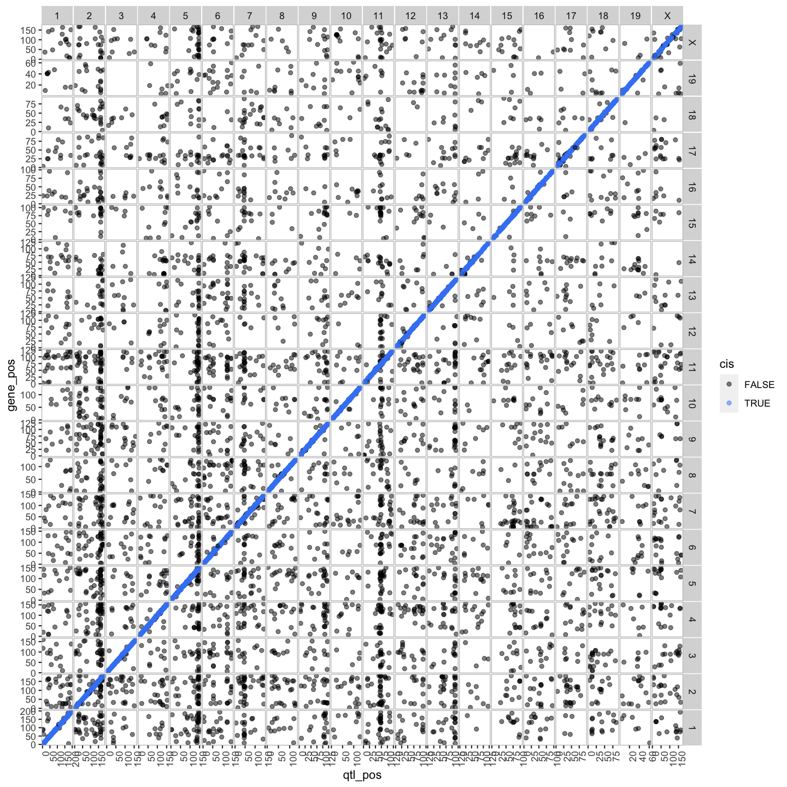
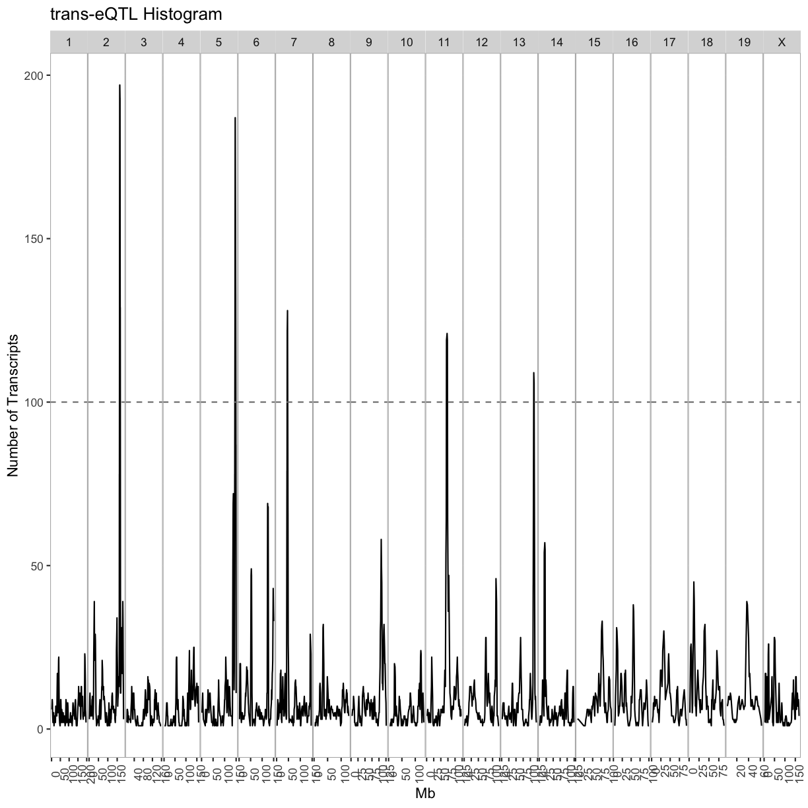
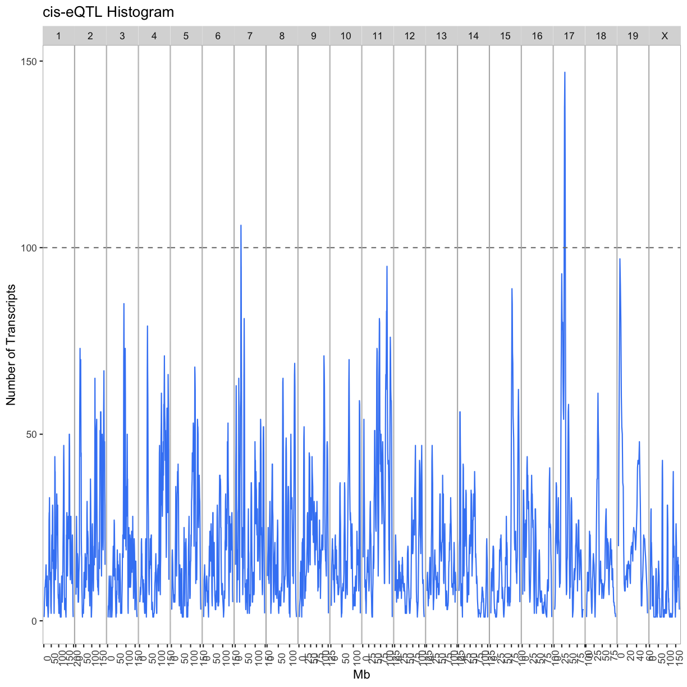

---
# Please do not edit this file directly; it is auto generated.
# Instead, please edit 08-create-transcriptome-map.md in _episodes_rmd/
title: "Creating A Transcriptome Map"
teaching: 30
exercises: 30
questions:
- "How do I create and interpret a transcriptome map?"
objectives:
- Describe a transcriptome map.
- Interpret a transcriptome map.
keypoints:
- "Transcriptome maps aid in understanding gene expression regulation."
source: Rmd
---

!!!!!! CREATE MARKER ID !!!!!!!

### Load Libraries  

~~~
library(tidyverse)
library(qtl2)
library(qtl2convert)
library(GGally)
library(broom)
library(corrplot)
library(RColorBrewer)
library(qtl2ggplot)
source("../code/gg_transcriptome_map.R")
source("../code/qtl_heatmap.R")
~~~
{: .language-r}

## Load Data

~~~
# expression data
load("../data/attie_DO500_expr.datasets.RData")

# mapping data
load("../data/attie_DO500_mapping.data.RData")

probs <- readRDS("../data/attie_DO500_genoprobs_qtlviewer_8state_69k.rds")

# phenotypes
load("../data/attie_DO500_clinical.phenotypes.RData")

# loading previous results
load("../data/dataset.islet.rnaseq.RData")

expr.mrna <- counts
~~~
{: .language-r}
##making the transciptome map for the 50 cis/trans genes in last lesson

Load in the LOD peaks over 6 from previous lesson.

~~~
lod_summary = read.csv("../data/gene.counts_qtl_peaks_random.csv")
lod_summary$marker.id <- paste0(lod_summary$chr,
                                "_",
                                lod_summary$pos * 1000000)

ensembl = get_ensembl_genes()
id    = ensembl$gene_id
chr   = seqnames(ensembl)
start = start(ensembl) * 1e-6
end   = end(ensembl)   * 1e-6
df = data.frame(ensembl = id, 
                gene_chr = chr, 
                gene_start = start, 
                gene_end = end,
                stringsAsFactors = F)
colnames(lod_summary)[colnames(lod_summary) == "lodcolumn"] = "ensembl"
colnames(lod_summary)[colnames(lod_summary) == "chr"] = "qtl_chr"
colnames(lod_summary)[colnames(lod_summary) == "pos"] = "qtl_pos"
colnames(lod_summary)[colnames(lod_summary) == "lod"] = "qtl_lod"
lod_summary = left_join(lod_summary, df, by = "ensembl")
lod_summary = mutate(lod_summary, 
                     gene_chr = factor(gene_chr, levels = c(1:19, "X")),
                     qtl_chr = factor(qtl_chr, levels = c(1:19, "X")))
rm(df)

# summary:
lod_summary$cis.trans <- ifelse(lod_summary$qtl_chr == lod_summary$gene_chr, "cis", "trans")
table(lod_summary$cis.trans)
~~~
{: .language-r}

~~~

  cis trans 
   44    65 
~~~
{: .output}

### Plot Transcriptome Map

~~~
lod_summary = mutate(lod_summary, 
                     cis = (gene_chr == qtl_chr) &
                       (abs(gene_start - qtl_pos) < 4))
out.plot = ggtmap(data = lod_summary %>% 
                    filter(qtl_lod >= 7.18), 
                  cis.points = TRUE, 
                  cis.radius = 4)
~~~
{: .language-r}

~~~
pdf("../results/transcriptome_map_random.pdf", width = 10, height = 10)
out.plot
dev.off()
~~~
{: .language-r}

~~~
quartz_off_screen 
                2 
~~~
{: .output}

~~~
out.plot
~~~
{: .language-r}

### QTL Density Plot

~~~
breaks = matrix(c(seq(0, 200, 4), 
                  seq(1, 201, 4), 
                  seq(2, 202, 4), 
                  seq(3, 203, 4)), 
                ncol = 4)
tmp = as.list(1:ncol(breaks)) 
for(i in 1:ncol(breaks)) {
  tmp[[i]] = lod_summary %>%
    filter(qtl_lod >= 7.18 & cis == FALSE) %>%
    arrange(qtl_chr, qtl_pos) %>%
    group_by(qtl_chr) %>%
    mutate(win = cut(qtl_pos, breaks = breaks[,i])) %>%
    group_by(qtl_chr, win) %>%
    summarize(cnt = n()) %>%
    separate(win, into = c("other", "prox", "dist")) %>%
    mutate(prox = as.numeric(prox),
           dist = as.numeric(dist),
           mid = 0.5 * (prox + dist)) %>%
    dplyr::select(qtl_chr, mid, cnt)
  }

trans = bind_rows(tmp[[1]], 
                  tmp[[1]], 
                  tmp[[3]], 
                  tmp[[4]])
rm(tmp)

out.plot = ggplot(trans, aes(mid, cnt)) +
             geom_line() +
             geom_hline(aes(yintercept = 100), linetype = 2, color = "grey50") +
             facet_grid(.~qtl_chr, scales = "free") +
             theme(panel.background = element_blank(),
             panel.border = element_rect(fill = 0, color = "grey70"),
             panel.spacing = unit(0, "lines"),
             axis.text.x = element_text(angle = 90)) +
             labs(title = "trans-eQTL Histogram", x = "Mb", y = "Number of Transcripts")
pdf("../results/trans_eqtl_density_random.pdf", width = 10, height = 8)
print(out.plot)
dev.off()
~~~
{: .language-r}

~~~
quartz_off_screen 
                2 
~~~
{: .output}

~~~
out.plot
~~~
{: .language-r}

~~~
breaks = matrix(c(seq(0, 200, 4), 
                  seq(1, 201, 4), 
                  seq(2, 202, 4), 
                  seq(3, 203, 4)), 
                ncol = 4)
tmp = as.list(1:ncol(breaks)) 
for(i in 1:ncol(breaks)) {
tmp[[i]] = lod_summary %>%
             filter(qtl_lod >= 7.18 & cis == TRUE) %>%
             arrange(qtl_chr, qtl_pos) %>%
             group_by(qtl_chr) %>%
             mutate(win = cut(qtl_pos, breaks = breaks[,i])) %>%
             group_by(qtl_chr, win) %>% 
             summarize(cnt = n()) %>%
             separate(win, into = c("other", "prox", "dist")) %>%
             mutate(prox = as.numeric(prox), 
                    dist = as.numeric(dist), 
                    mid = 0.5 * (prox + dist)) %>%
             dplyr::select(qtl_chr, mid, cnt)
}

cis = bind_rows(tmp[[1]], tmp[[2]], tmp[[3]], tmp[[4]])
rm(tmp1, tmp2, tmp3, tmp4)

out.plot = ggplot(cis, aes(mid, cnt)) +
             geom_line(color = "#4286f4") +
             geom_hline(aes(yintercept = 100), linetype = 2, color = "grey50") +
             facet_grid(.~qtl_chr, scales = "free") +
             theme(panel.background = element_blank(),
                   panel.border = element_rect(fill = 0, color = "grey70"),
                   panel.spacing = unit(0, "lines"),
                   axis.text.x = element_text(angle = 90)) +
           labs(title = "cis-eQTL Histogram", x = "Mb", y = "Number of Transcripts")
pdf("../results/cis_eqtl_density_random.pdf", width = 10, height = 8)
print(out.plot)
dev.off()
~~~
{: .language-r}

~~~
quartz_off_screen 
                2 
~~~
{: .output}

~~~
out.plot
~~~
{: .language-r}

~~~
tmp = lod_summary %>%
        filter(qtl_lod >= 7.18) %>%
        group_by(cis) %>%
        count()
kable(tmp, caption = "Number of cis- and trans-eQTL")
~~~
{: .language-r}

Table: Number of cis- and trans-eQTL

|cis   |  n|
|:-----|--:|
|FALSE | 28|
|TRUE  | 28|

~~~
rm(tmp)
~~~
{: .language-r}

## Islet RNASeq eQTL Hotspots

### Select eQTL Hotspots

Select trans-eQTL hotspots at the 7.18 LOD thresholds. Retain the maximum per chromosome.

~~~
hotspots = trans %>%
             group_by(qtl_chr) %>%
             #filter(cnt >= 100) %>%
             summarize(center = median(mid)) %>%
             mutate(proximal = center - 2, distal = center + 2)
kable(hotspots, caption = "Islet trans-eQTL hotspots")
~~~
{: .language-r}

Table: Islet trans-eQTL hotspots

|qtl_chr | center| proximal| distal|
|:-------|------:|--------:|------:|
|1       |  173.5|    171.5|  175.5|
|2       |   81.5|     79.5|   83.5|
|3       |   57.5|     55.5|   59.5|
|5       |   75.0|     73.0|   77.0|
|6       |    5.5|      3.5|    7.5|
|7       |   37.0|     35.0|   39.0|
|8       |  110.0|    108.0|  112.0|
|11      |   69.5|     67.5|   71.5|
|12      |  111.0|    109.0|  113.0|
|14      |   22.0|     20.0|   24.0|
|15      |   64.0|     62.0|   66.0|
|16      |   93.5|     91.5|   95.5|
|17      |   56.0|     54.0|   58.0|
|X       |   53.5|     51.5|   55.5|

~~~
cis.hotspots = cis %>%
             group_by(qtl_chr) %>%
             summarize(center = median(mid)) %>%
             mutate(proximal = center - 2, distal = center + 2)
kable(cis.hotspots, caption = "Islet cis-eQTL hotspots")
~~~
{: .language-r}

Table: Islet cis-eQTL hotspots

|qtl_chr | center| proximal| distal|
|:-------|------:|--------:|------:|
|1       |   99.5|     97.5|  101.5|
|2       |  116.5|    114.5|  118.5|
|3       |   95.5|     93.5|   97.5|
|4       |   42.5|     40.5|   44.5|
|5       |  118.5|    116.5|  120.5|
|6       |   48.5|     46.5|   50.5|
|7       |   55.5|     53.5|   57.5|
|9       |    9.5|      7.5|   11.5|
|10      |  127.5|    125.5|  129.5|
|11      |  103.5|    101.5|  105.5|
|14      |    4.5|      2.5|    6.5|
|15      |   82.5|     80.5|   84.5|
|16      |   30.5|     28.5|   32.5|
|17      |   56.0|     54.0|   58.0|
|18      |   38.5|     36.5|   40.5|

Given the hotspot locations, retain all genes with LOD > 7.18 and trans-eQTL within +/- 4Mb of the mid-point of the hotspot.

~~~
hotspot.genes = as.list(hotspots$qtl_chr)
names(hotspot.genes) = hotspots$qtl_chr
for(i in 1:nrow(hotspots)) {
  hotspot.genes[[i]] = lod_summary %>%
    filter(qtl_lod >= 7.18) %>%
    filter(qtl_chr == hotspots$qtl_chr[i] & 
                           qtl_pos >= hotspots$proximal[i] & 
                           qtl_pos <= hotspots$distal[i] &
                           (gene_chr != hotspots$qtl_chr[i] |
                           (gene_chr == hotspots$qtl_chr[i] &
                            gene_start > hotspots$distal[i] + 1 &
                            gene_end < hotspots$proximal[i] - 1)))
  write_csv(hotspot.genes[[i]], file = paste0("../results/chr",
                                              names(hotspot.genes)[i], "_hotspot_genes_random.csv"))
}
~~~
{: .language-r}

Number of genes in each hotspot.

~~~
hotspots = data.frame(hotspots, count = sapply(hotspot.genes, nrow))
kable(hotspots, caption = "Number of genes per hotspot")
~~~
{: .language-r}

Table: Number of genes per hotspot

|   |qtl_chr | center| proximal| distal| count|
|:--|:-------|------:|--------:|------:|-----:|
|1  |1       |  173.5|    171.5|  175.5|     0|
|2  |2       |   81.5|     79.5|   83.5|     0|
|3  |3       |   57.5|     55.5|   59.5|     1|
|5  |5       |   75.0|     73.0|   77.0|     1|
|6  |6       |    5.5|      3.5|    7.5|     1|
|7  |7       |   37.0|     35.0|   39.0|     0|
|8  |8       |  110.0|    108.0|  112.0|     1|
|11 |11      |   69.5|     67.5|   71.5|     2|
|12 |12      |  111.0|    109.0|  113.0|     0|
|14 |14      |   22.0|     20.0|   24.0|     0|
|15 |15      |   64.0|     62.0|   66.0|     0|
|16 |16      |   93.5|     91.5|   95.5|     1|
|17 |17      |   56.0|     54.0|   58.0|     0|
|X  |X       |   53.5|     51.5|   55.5|     1|

~~~
cis.hotspot.genes = as.list(cis.hotspots$qtl_chr)
names(cis.hotspot.genes) = cis.hotspots$qtl_chr
for(i in 1:nrow(cis.hotspots)) {
  cis.hotspot.genes[[i]] = lod_summary %>%
    dplyr::select(ensembl, qtl_chr, qtl_pos, qtl_lod) %>%
    filter(qtl_lod >= 7.18) %>%
    filter(qtl_chr == cis.hotspots$qtl_chr[i] &
             qtl_pos >= cis.hotspots$proximal[i] &
             qtl_pos <= cis.hotspots$distal[i])
  write_csv(cis.hotspot.genes[[i]], 
            file = paste0("../results/chr",
                          names(cis.hotspot.genes)[i], "_cis_hotspot_genes_random.csv"))
  }
~~~
{: .language-r}

Number of genes in each cis-hotspot.

~~~
cis.hotspots = data.frame(cis.hotspots, 
                          count = sapply(cis.hotspot.genes, nrow))
kable(cis.hotspots, caption = "Number of genes per cis-hotspot")
~~~
{: .language-r}

Table: Number of genes per cis-hotspot

|   |qtl_chr | center| proximal| distal| count|
|:--|:-------|------:|--------:|------:|-----:|
|1  |1       |   99.5|     97.5|  101.5|     1|
|2  |2       |  116.5|    114.5|  118.5|     0|
|3  |3       |   95.5|     93.5|   97.5|     1|
|4  |4       |   42.5|     40.5|   44.5|     1|
|5  |5       |  118.5|    116.5|  120.5|     1|
|6  |6       |   48.5|     46.5|   50.5|     1|
|7  |7       |   55.5|     53.5|   57.5|     0|
|9  |9       |    9.5|      7.5|   11.5|     1|
|10 |10      |  127.5|    125.5|  129.5|     1|
|11 |11      |  103.5|    101.5|  105.5|     1|
|14 |14      |    4.5|      2.5|    6.5|     1|
|15 |15      |   82.5|     80.5|   84.5|     1|
|16 |16      |   30.5|     28.5|   32.5|     1|
|17 |17      |   56.0|     54.0|   58.0|     2|
|18 |18      |   38.5|     36.5|   40.5|     1|

Get the expression of genes that map to each hotspot.

~~~
for(i in 1:length(hotspot.genes)) {
  tmp = data.frame(ensembl = hotspot.genes[[i]]$ensembl,
                   t(expr.mrna[,hotspot.genes[[i]]$ensembl]))
  hotspot.genes[[i]] = left_join(hotspot.genes[[i]], 
                                 tmp, 
                                 by = "ensembl")
  write_csv(hotspot.genes[[i]], path = paste0("../results/chr", names(hotspot.genes)[i], "_hotspot_genes_random.csv"))
}
~~~
{: .language-r}

### Hotspot Gene Correlation

~~~
breaks = -100:100/100
colors = colorRampPalette(rev(brewer.pal(11, "Spectral")))(length(breaks) - 1)
for(i in 1:length(hotspot.genes)) {
  chr = names(hotspot.genes)[i]
  tmp = hotspot.genes[[i]] %>%
    dplyr::select(starts_with("DO")) %>%
    t() %>%
    as.matrix() %>%
    cor()
  dimnames(tmp) = list(hotspot.genes[[i]]$ensembl, hotspot.genes[[i]]$ensembl)
  side.colors = cut(hotspot.genes[[i]]$qtl_lod, breaks = 100)
  side.colors = colorRampPalette(rev(brewer.pal(9, "YlOrRd")))(length(levels(side.colors)))[as.numeric(side.colors)]
  names(side.colors) = rownames(tmp)
  pdf(paste0("../results/hotspot_gene_cor_chr", chr, "_random.pdf"), width = 10, height = 10)
  heatmap(tmp, symm = TRUE, scale = "none", main = paste("Chr", chr, "Gene Correlation"), breaks = breaks, col = colors, RowSideColors = side.colors, ColSideColors = side.colors)
  dev.off()
  heatmap(tmp, symm = TRUE, scale = "none", main = paste("Chr", chr, "Gene Correlation"), breaks = breaks, col = colors, RowSideColors = side.colors, ColSideColors = side.colors)
}
~~~
{: .language-r}

~~~
Warning in min(x): no non-missing arguments to min; returning Inf
~~~
{: .warning}

~~~
Warning in max(x): no non-missing arguments to max; returning -Inf
~~~
{: .warning}

~~~
Error in seq.int(rx[1L], rx[2L], length.out = nb): 'from' must be a finite number
~~~
{: .error}

### Hotspot Principal Components

~~~
hotspot.pcs = as.list(names(hotspot.genes))
names(hotspot.pcs) = names(hotspot.genes)
do.wave = pheno_clin[rownames(expr.mrna),"DOwave",drop=F]
wave.col = as.numeric(as.factor(do.wave[,1]))
for(i in 1:length(hotspot.genes)) {
  tmp = hotspot.genes[[i]] %>%
          select(starts_with("DO")) %>%
          as.matrix() %>%
          t() %>%
          prcomp()
  hotspot.pcs[[i]] = tmp$x
  tmp = gather(data.frame(mouse = rownames(hotspot.pcs[[i]]), hotspot.pcs[[i]]), pc, value, -mouse)
  tmp = left_join(tmp, pheno_clin %>% select(mouse, sex, DOwave, diet_days), by = "mouse")
  print(tmp %>%
    filter(pc %in% paste0("PC", 1:4)) %>%
    mutate(DOwave = factor(DOwave)) %>%
    ggplot(aes(DOwave, value, fill = sex)) +
    geom_boxplot() +
    facet_grid(pc~.) +
    labs(title = paste("Chr", names(hotspot.genes)[i], "Hotspot")))
}
~~~
{: .language-r}

~~~
Error in svd(x, nu = 0, nv = k): a dimension is zero
~~~
{: .error}
