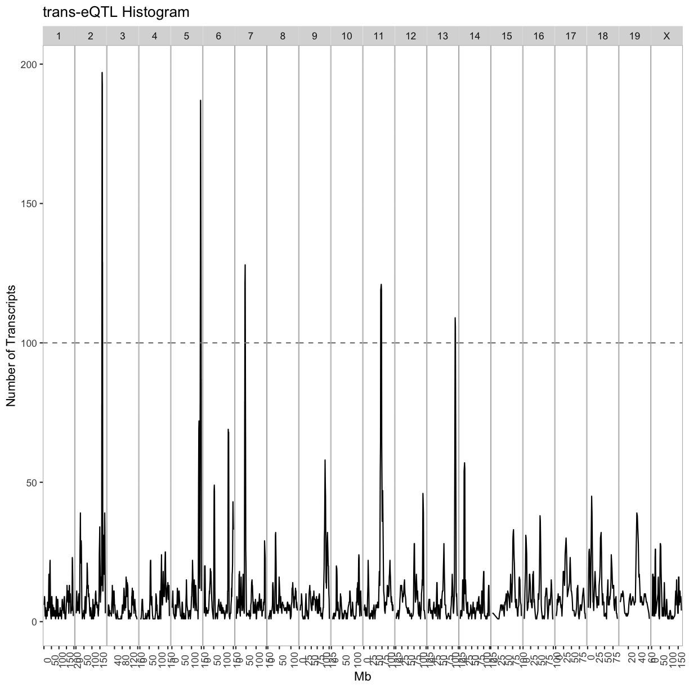
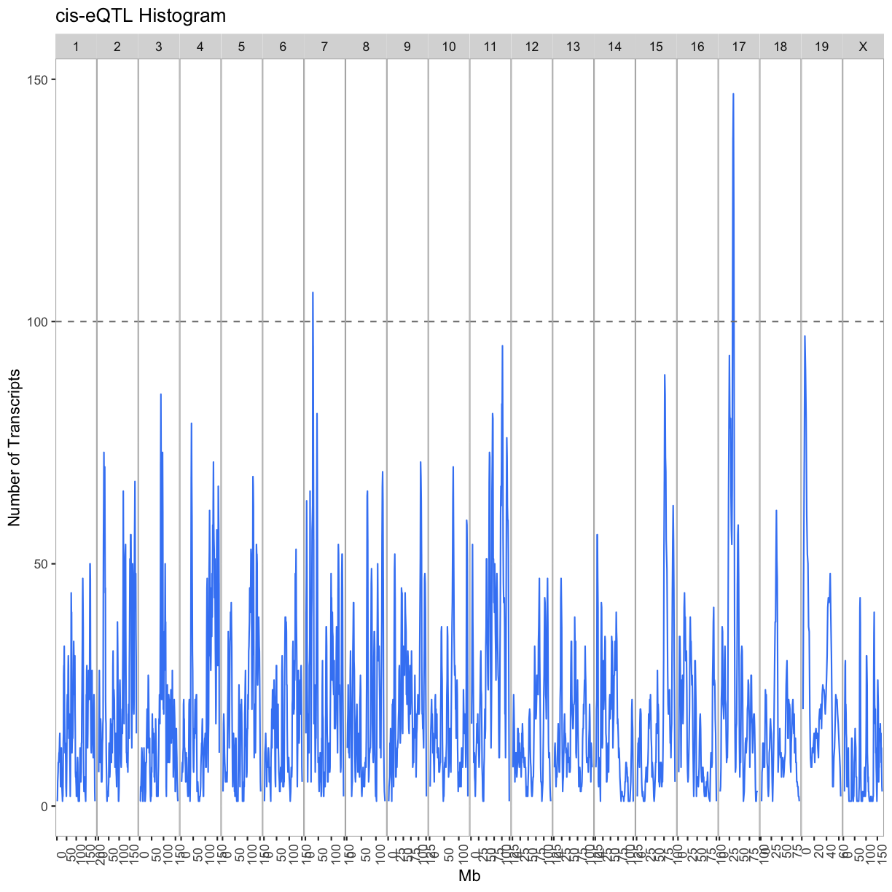

---
# Please do not edit this file directly; it is auto generated.
# Instead, please edit 08-full-transcriptome-map.md in _episodes_rmd/
title: "Transcriptome Map of cis and trans eQTL"
teaching: 10
exercises: 20
questions:
- "How do I create a full transcriptome map?"
objectives:
- 
keypoints:
- "."
source: Rmd
---

### Load Libraries  

~~~
library(tidyverse)
library(qtl2)
library(qtl2convert)
#library(qtl2db)
library(GGally)
library(broom)
library(knitr)
library(corrplot)
library(RColorBrewer)
library(qtl2ggplot)

source("../code/gg_transcriptome_map.R")
source("../code/qtl_heatmap.R")
~~~
{: .language-r}

## Load Data

~~~
#expression data
load("../data/attie_DO500_expr.datasets.RData")

##loading previous results
load("../data/dataset.islet.rnaseq.RData")

##mapping data
load("../data/attie_DO500_mapping.data.RData")

##genoprobs
probs = readRDS("../data/attie_DO500_genoprobs_v5.rds")

##phenotypes
load("../data/attie_DO500_clinical.phenotypes.RData")
~~~
{: .language-r}

~~~
lod_summary = dataset.islet.rnaseq$lod.peaks

ensembl = get_ensembl_genes()
id    = ensembl$gene_id
chr   = seqnames(ensembl)
start = start(ensembl) * 1e-6
end   = end(ensembl)   * 1e-6
df = data.frame(ensembl = id, gene_chr = chr, gene_start = start, gene_end = end,
     stringsAsFactors = F)
colnames(lod_summary)[colnames(lod_summary) == "annot.id"] = "ensembl"
colnames(lod_summary)[colnames(lod_summary) == "chrom"] = "qtl_chr"
colnames(lod_summary)[colnames(lod_summary) == "pos"] = "qtl_pos"
colnames(lod_summary)[colnames(lod_summary) == "lod"] = "qtl_lod"
lod_summary = left_join(lod_summary, df, by = "ensembl")
lod_summary = mutate(lod_summary, gene_chr = factor(gene_chr, levels = c(1:19, "X")),
                     qtl_chr = factor(qtl_chr, levels = c(1:19, "X")))
rm(df)

## summary:

lod_summary$cis.trans <- ifelse(lod_summary$qtl_chr == lod_summary$gene_chr, "cis", "trans")
table(lod_summary$cis.trans)
~~~
{: .language-r}

~~~

  cis trans 
14549 24299 
~~~
{: .output}

### Plot Transcriptome Map

~~~
lod_summary = mutate(lod_summary, cis = (gene_chr == qtl_chr) & (abs(gene_start - qtl_pos) < 4))
out.plot = ggtmap(data = lod_summary %>% filter(qtl_lod >= 7.18), cis.points = TRUE, cis.radius = 4)
~~~
{: .language-r}

~~~
out.plot
~~~
{: .language-r}

### QTL Density Plot

~~~
breaks = matrix(c(seq(0, 200, 4), seq(1, 201, 4), seq(2, 202, 4), seq(3, 203, 4)), ncol = 4)
tmp = as.list(1:ncol(breaks)) 
for(i in 1:ncol(breaks)) {
tmp[[i]] = lod_summary %>%
             filter(qtl_lod >= 7.18 & cis == FALSE) %>%
             arrange(qtl_chr, qtl_pos) %>%
             group_by(qtl_chr) %>%
             mutate(win = cut(qtl_pos, breaks = breaks[,i])) %>%
             group_by(qtl_chr, win) %>% 
             summarize(cnt = n()) %>%
             separate(win, into = c("other", "prox", "dist")) %>%
             mutate(prox = as.numeric(prox), 
                    dist = as.numeric(dist), 
                    mid = 0.5 * (prox + dist)) %>%
             dplyr::select(qtl_chr, mid, cnt)
}

trans = bind_rows(tmp[[1]], tmp[[1]], tmp[[3]], tmp[[4]])
rm(tmp)

out.plot = ggplot(trans, aes(mid, cnt)) +
             geom_line() +
             geom_hline(aes(yintercept = 100), linetype = 2, color = "grey50") +
             facet_grid(.~qtl_chr, scales = "free") +
             theme(panel.background = element_blank(),
             panel.border = element_rect(fill = 0, color = "grey70"),
             panel.spacing = unit(0, "lines"),
             axis.text.x = element_text(angle = 90)) +
             labs(title = "trans-eQTL Histogram", x = "Mb", y = "Number of Transcripts")

out.plot
~~~
{: .language-r}

~~~
breaks = matrix(c(seq(0, 200, 4), seq(1, 201, 4), seq(2, 202, 4), seq(3, 203, 4)), ncol = 4)
tmp = as.list(1:ncol(breaks)) 
for(i in 1:ncol(breaks)) {
tmp[[i]] = lod_summary %>%
             filter(qtl_lod >= 7.18 & cis == TRUE) %>%
             arrange(qtl_chr, qtl_pos) %>%
             group_by(qtl_chr) %>%
             mutate(win = cut(qtl_pos, breaks = breaks[,i])) %>%
             group_by(qtl_chr, win) %>% 
             summarize(cnt = n()) %>%
             separate(win, into = c("other", "prox", "dist")) %>%
             mutate(prox = as.numeric(prox), 
                    dist = as.numeric(dist), 
                    mid = 0.5 * (prox + dist)) %>%
             dplyr::select(qtl_chr, mid, cnt)
}

cis = bind_rows(tmp[[1]], tmp[[2]], tmp[[3]], tmp[[4]])
rm(tmp1, tmp2, tmp3, tmp4)

out.plot = ggplot(cis, aes(mid, cnt)) +
             geom_line(color = "#4286f4") +
             geom_hline(aes(yintercept = 100), linetype = 2, color = "grey50") +
             facet_grid(.~qtl_chr, scales = "free") +
             theme(panel.background = element_blank(),
                   panel.border = element_rect(fill = 0, color = "grey70"),
                   panel.spacing = unit(0, "lines"),
                   axis.text.x = element_text(angle = 90)) +
           labs(title = "cis-eQTL Histogram", x = "Mb", y = "Number of Transcripts")

out.plot
~~~
{: .language-r}

~~~
tmp = lod_summary %>%
        filter(qtl_lod >= 7.18) %>%
        group_by(cis) %>%
        count()
kable(tmp, caption = "Number of cis- and trans-eQTL")
~~~
{: .language-r}

Table: Number of cis- and trans-eQTL

|cis   |     n|
|:-----|-----:|
|FALSE |  5617|
|TRUE  | 12677|
|NA    |   526|

~~~
rm(tmp)
~~~
{: .language-r}

## Islet RNASeq eQTL Hotspots

### Select eQTL Hotspots

Select trans-eQTL hotspots with more than 100 genes at the 7.18 LOD thresholds. Retain the maximum per chromosome.

~~~
hotspots = trans %>%
             group_by(qtl_chr) %>%
             filter(cnt >= 100) %>%
             summarize(center = median(mid)) %>%
             mutate(proximal = center - 2, distal = center + 2)
kable(hotspots, caption = "Islet trans-eQTL hotspots")
~~~
{: .language-r}

Table: Islet trans-eQTL hotspots

|qtl_chr | center| proximal| distal|
|:-------|------:|--------:|------:|
|2       |  165.5|    163.5|  167.5|
|5       |  146.0|    144.0|  148.0|
|7       |   46.0|     44.0|   48.0|
|11      |   71.0|     69.0|   73.0|
|13      |  112.5|    110.5|  114.5|

~~~
cis.hotspots = cis %>%
             group_by(qtl_chr) %>%
             filter(cnt >= 100) %>%
             summarize(center = median(mid)) %>%
             mutate(proximal = center - 2, distal = center + 2)
kable(cis.hotspots, caption = "Islet cis-eQTL hotspots")
~~~
{: .language-r}

Table: Islet cis-eQTL hotspots

|qtl_chr | center| proximal| distal|
|:-------|------:|--------:|------:|
|7       |   29.0|     27.0|   31.0|
|17      |   34.5|     32.5|   36.5|

Given the hotspot locations, retain all genes with LOD > 7.18 and trans-eQTL within +/- 4Mb of the mid-point of the hotspot.

~~~
hotspot.genes = as.list(hotspots$qtl_chr)
names(hotspot.genes) = hotspots$qtl_chr
for(i in 1:nrow(hotspots)) {
  hotspot.genes[[i]] = lod_summary %>% 
                         filter(qtl_lod >= 7.18) %>%
                         filter(qtl_chr == hotspots$qtl_chr[i] & 
                           qtl_pos >= hotspots$proximal[i] & 
                           qtl_pos <= hotspots$distal[i] &
                           (gene_chr != hotspots$qtl_chr[i] |
                           (gene_chr == hotspots$qtl_chr[i] &
                            gene_start > hotspots$distal[i] + 1 &
                            gene_end < hotspots$proximal[i] - 1)))
  write_csv(hotspot.genes[[i]], file = paste0("../results/chr", names(hotspot.genes)[i], "_hotspot_genes.csv"))
}
~~~
{: .language-r}

Number of genes in each hotspot.

~~~
hotspots = data.frame(hotspots, count = sapply(hotspot.genes, nrow))
kable(hotspots, caption = "Number of genes per hotspot")
~~~
{: .language-r}

Table: Number of genes per hotspot

|   |qtl_chr | center| proximal| distal| count|
|:--|:-------|------:|--------:|------:|-----:|
|2  |2       |  165.5|    163.5|  167.5|   147|
|5  |5       |  146.0|    144.0|  148.0|   182|
|7  |7       |   46.0|     44.0|   48.0|   123|
|11 |11      |   71.0|     69.0|   73.0|   126|
|13 |13      |  112.5|    110.5|  114.5|   104|

~~~
cis.hotspot.genes = as.list(cis.hotspots$qtl_chr)
names(cis.hotspot.genes) = cis.hotspots$qtl_chr
for(i in 1:nrow(cis.hotspots)) {
  cis.hotspot.genes[[i]] = lod_summary %>% 
                             dplyr::select(ensembl, marker.id, qtl_chr, qtl_pos, qtl_lod) %>%
                             filter(qtl_lod >= 7.18) %>%
                             filter(qtl_chr == cis.hotspots$qtl_chr[i] & 
                                    qtl_pos >= cis.hotspots$proximal[i] & 
                                    qtl_pos <= cis.hotspots$distal[i])
  write_csv(cis.hotspot.genes[[i]], file = paste0("../results/chr", names(cis.hotspot.genes)[i], "_cis_hotspot_genes.csv"))
}
~~~
{: .language-r}

Number of genes in each cis-hotspot.

~~~
cis.hotspots = data.frame(cis.hotspots, count = sapply(cis.hotspot.genes, nrow))
kable(cis.hotspots, caption = "Number of genes per cis-hotspot")
~~~
{: .language-r}

Table: Number of genes per cis-hotspot

|   |qtl_chr | center| proximal| distal| count|
|:--|:-------|------:|--------:|------:|-----:|
|7  |7       |   29.0|     27.0|   31.0|   120|
|17 |17      |   34.5|     32.5|   36.5|   188|

Get the expression of genes that map to each hotspot.

~~~
for(i in 1:length(hotspot.genes)) {
  tmp = data.frame(ensembl = hotspot.genes[[i]]$ensembl, t(expr.mrna[,hotspot.genes[[i]]$ensembl]))
  hotspot.genes[[i]] = left_join(hotspot.genes[[i]], tmp, by = "ensembl")
  write_csv(hotspot.genes[[i]], file = paste0("../results/chr", names(hotspot.genes)[i], "_hotspot_genes.csv"))
}
~~~
{: .language-r}

~~~
Error in h(simpleError(msg, call)): error in evaluating the argument 'x' in selecting a method for function 't': object 'expr.mrna' not found
~~~
{: .error}

### Hotspot Gene Correlation

~~~
breaks = -100:100/100
colors = colorRampPalette(rev(brewer.pal(11, "Spectral")))(length(breaks) - 1)
for(i in 1:length(hotspot.genes)) {
  chr = names(hotspot.genes)[i]
  tmp = hotspot.genes[[i]] %>%
    dplyr::select(starts_with("DO")) %>%
    t() %>%
    as.matrix() %>%
    cor()
  dimnames(tmp) = list(hotspot.genes[[i]]$ensembl, hotspot.genes[[i]]$ensembl)
  side.colors = cut(hotspot.genes[[i]]$qtl_lod, breaks = 100)
  side.colors = colorRampPalette(rev(brewer.pal(9, "YlOrRd")))(length(levels(side.colors)))[as.numeric(side.colors)]
  names(side.colors) = rownames(tmp)

  heatmap(tmp, symm = TRUE, scale = "none", main = paste("Chr", chr, "Gene Correlation"), breaks = breaks, col = colors, RowSideColors = side.colors, ColSideColors = side.colors)
}
~~~
{: .language-r}

~~~
Error in hclustfun(distfun(x)): NA/NaN/Inf in foreign function call (arg 10)
~~~
{: .error}

### Hotspot Principal Components

~~~
hotspot.pcs = as.list(names(hotspot.genes))
names(hotspot.pcs) = names(hotspot.genes)
do.wave = pheno_clin[rownames(expr.mrna),"DOwave",drop=F]
~~~
{: .language-r}

~~~
Error in h(simpleError(msg, call)): error in evaluating the argument 'x' in selecting a method for function 'rownames': object 'expr.mrna' not found
~~~
{: .error}

~~~
wave.col = as.numeric(as.factor(do.wave[,1]))
~~~
{: .language-r}

~~~
Error in h(simpleError(msg, call)): error in evaluating the argument 'x' in selecting a method for function 'as.factor': object 'do.wave' not found
~~~
{: .error}

~~~
#hotspot.genes.rns <- list()
for(i in 1:length(hotspot.genes)) {
  tmp = hotspot.genes[[i]] %>%
          dplyr::select(starts_with("DO")) %>%
          as.matrix() %>%
          t() %>%
          prcomp()
  hotspot.pcs[[i]] = tmp$x
  #rownames(hotspot.pcs[[i]]) <- gsub("\\.x","", rownames(hotspot.pcs[[i]]))
  #rownames(hotspot.pcs[[i]]) <- gsub("\\.y","", rownames(hotspot.pcs[[i]]))
  tmp = gather(data.frame(mouse = rownames(hotspot.pcs[[i]]), hotspot.pcs[[i]]), pc, value, -mouse)
  tmp$mouse <- gsub("\\.x","", tmp$mouse)
  tmp$mouse <- gsub("\\.y","", tmp$mouse)
  tmp = left_join(tmp, pheno_clin %>% dplyr::select(mouse, sex, DOwave, diet_days), by = "mouse")
  print(tmp %>%
    filter(pc %in% paste0("PC", 1:4)) %>%
    mutate(DOwave = factor(DOwave)) %>%
    ggplot(aes(DOwave, value, fill = sex)) +
    geom_boxplot() +
    facet_grid(pc~.) +
    labs(title = paste("Chr", names(hotspot.genes)[i], "Hotspot")))
}
~~~
{: .language-r}

~~~
Error in svd(x, nu = 0, nv = k): a dimension is zero
~~~
{: .error}

