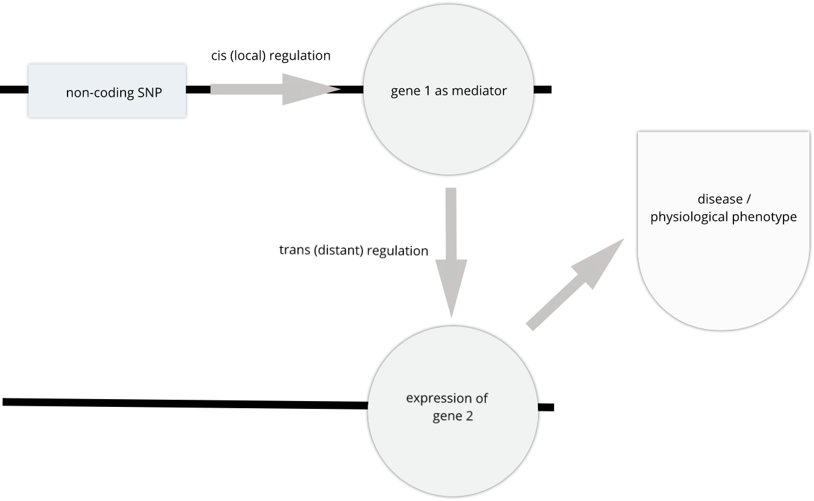
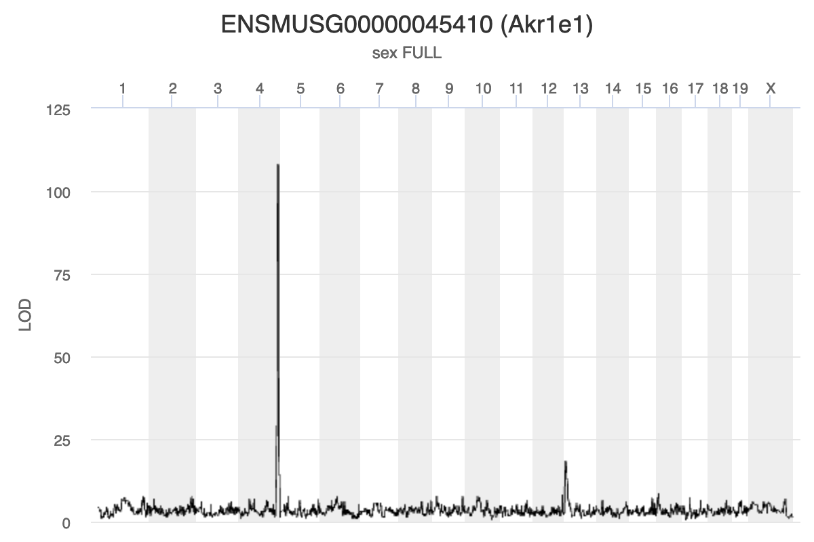
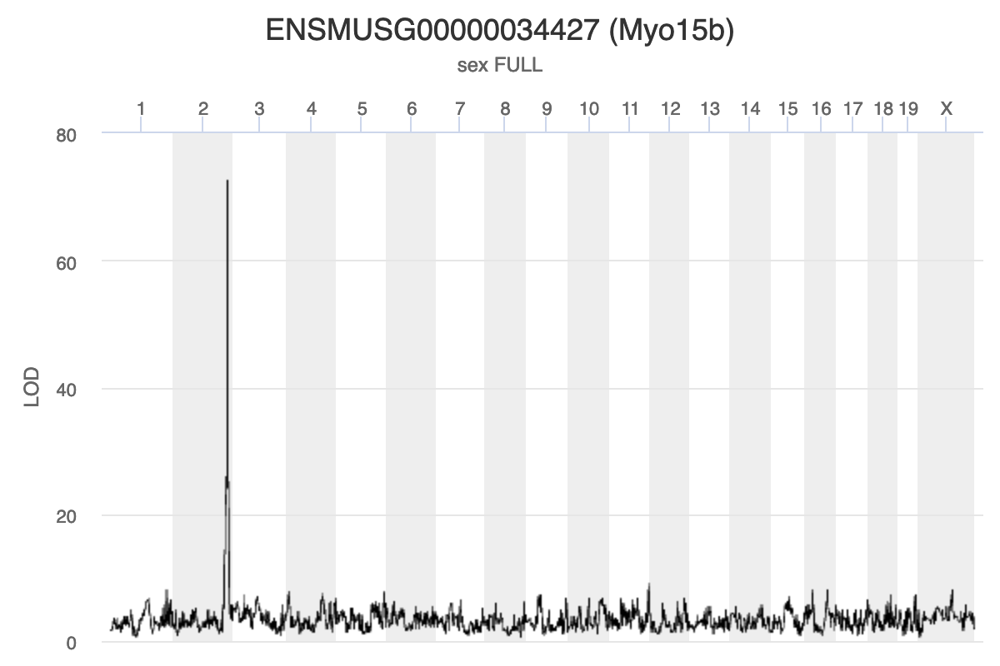
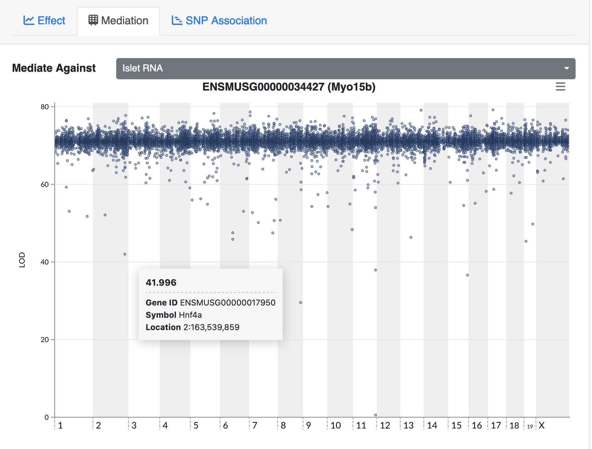

---
# Please do not edit this file directly; it is auto generated.
# Instead, please edit 11-mediation-analysis.md in _episodes_rmd/
source: Rmd
title: "Mediation Analysis"
teaching: 10
exercises: 2
questions:
- "What is mediation analysis?"
- "How is mediation analysis used in genetics and genomics?"
- "How do I explore causal relations with mediation analysis?"
objectives:
- "Describe mediation analysis as applied in genetics and genomics."
keypoints:
- "Mediation analysis investigates an intermediary between an independent variable and its effect on a dependent variable."
- "Mediation analysis is used in high-throughput genomics studies to identify molecular phenotypes, such as gene expression or methylation traits, that mediate the effect of genetic variation on disease phenotypes or other outcomes of interest." 
---

> ## Challenge: 
>
> > ## Solution
> >
> > 
> > 
> > 
> {: .solution}
{: .challenge}


