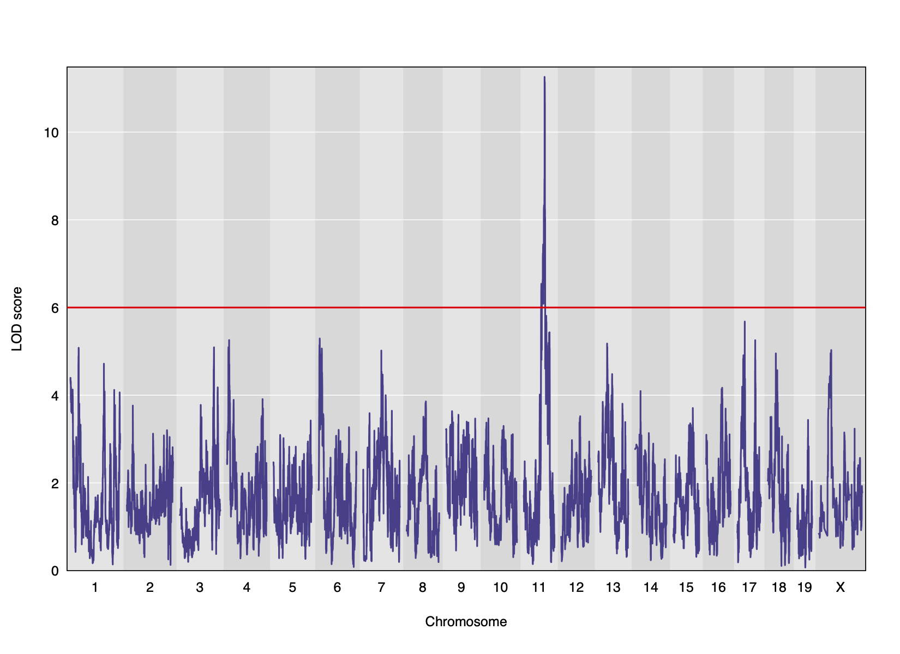

```{r, include=FALSE}
source("../bin/chunk-options.R")
knitr_fig_path("02-")
```

```{r load_data, echo=FALSE}
library(qtl2)
```

Genome-wide association studies (GWAS) often identify variants in non-coding 
regions of the genome, indicating that regulation of gene expression 
predominates in common diseases like type II diabetes. Most of the more than 100 
genetic loci associated with type II diabetes affect the function of pancreatic 
islets, which produce insulin for regulating blood glucose levels. 
Susceptibility to type II diabetes (T2D) increases with obesity, such that 
T2D-associated genetic loci operate mainly under conditions of obesity (See 
[Keller, Mark P et al. “Genetic Drivers of Pancreatic Islet Function.” Genetics vol. 209,1 (2018): 335-356](https://www.ncbi.nlm.nih.gov/pmc/articles/PMC5937189/)). Like 
most GWAS loci, the T2D-associated genetic loci identified from genome-wide 
association studies (GWAS) have very small effect sizes and odds ratios just 
slightly more than 1.

This study explored islet gene expression in diabetes. The authors hypothesized 
that gene expression changes in response to dietary challenge would reveal 
signaling pathways involved in stress responses. The expression of many genes
often map to the same locus, indicating that expression of these genes is
controlled in common. If their mRNAs encode proteins with common physiological 
functions, the function of the controlling gene(s) is revealed. Variation in 
expression of the controlling gene(s), rather than a genetic variant, can be 
tested as an immediate cause of a disease-related phenotype.

In this study, Diversity Outbred (DO) mice were fed a high-fat, high-sugar diet 
as a stressor, sensitizing the mice to develop diabetic traits. Body weight and 
plasma glucose, insulin, and triglyceride measurements were taken biweekly. 
Food intake could be measured since animals were individually housed. A glucose 
tolerance test at 18 weeks of age provided measurement of dynamic glucose and 
insulin changes at 5, 15, 30, 60 and 120 minutes after glucose administration. 
Area under the curve (AUC) was determined from these time points for both plasma 
glucose and insulin levels. Homeostatic model assessment (HOMA) of insulin 
resistance (IR) and pancreatic islet function (B) were determined after the 
glucose tolerance test was given. Islet cells were isolated from pancreas, and 
RNA extracted and libraries constructed from isolated RNA for gene expression 
measurements.

Genome scans were performed with the leave-one-chromosome-out (LOCO) method for
kinship correction. Sex and experimental cohort (DO wave) were used as 
covariates. The results of one scan for insulin area under the curve (AUC) is 
shown below with a strong peak on chromosome 11. In this lesson, we will look
into genes located under this peak.

  

