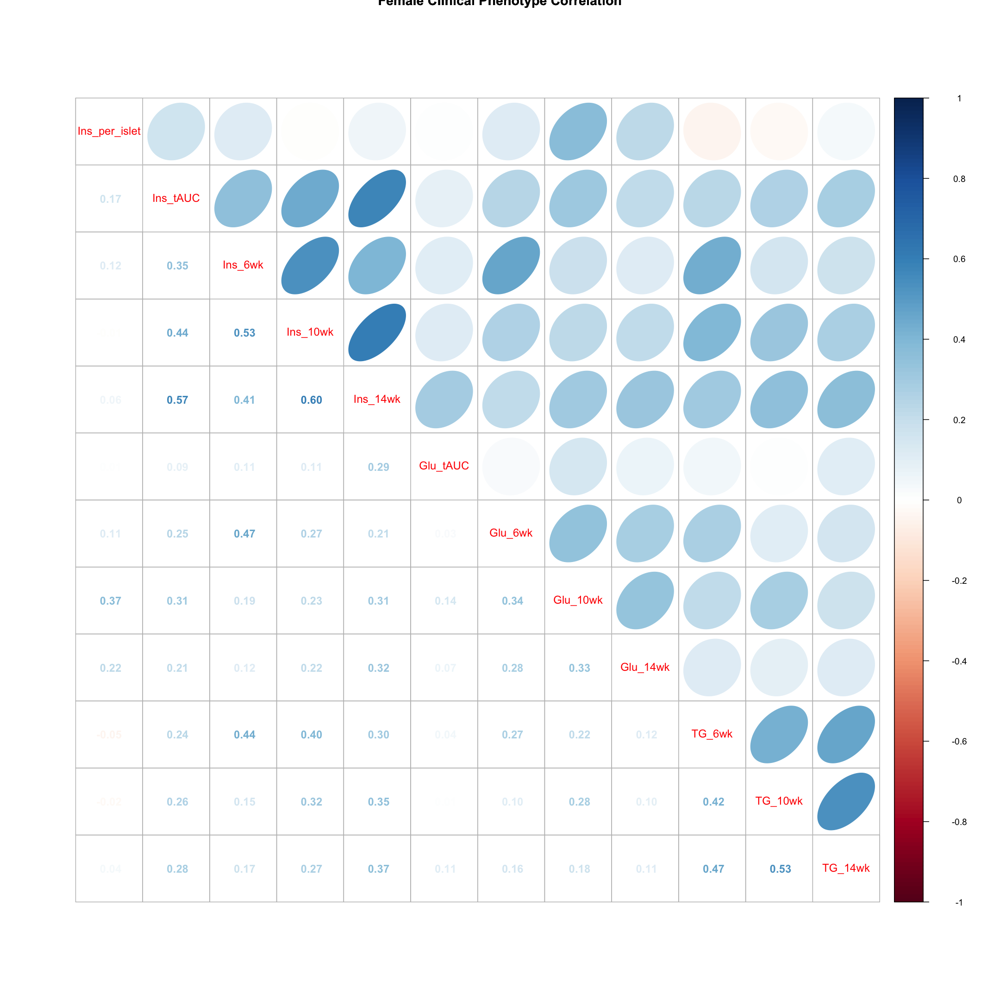

```{r, include=FALSE}
source("../bin/chunk-options.R")
knitr_fig_path("03-")
```

Load the libraries.
```{r, load_tidyverse, message=FALSE}
library(tidyverse)
library(knitr)
library(GGally)
library(corrplot)
library(broom)
library(qtl2)
library(qtl2convert)
library(qtl2ggplot)
library(RColorBrewer)
# the following analysis is from File S1 Attie_eQTL_paper_physiology.Rmd 
# compliments of Daniel Gatti. See Data Dryad entry for more information.
```

## Physiological Phenotypes

The complete data used in these analyses are available from 
[Data Dryad](https://doi.org/10.5061/dryad.pj105). 

Load in the clinical phenotypes.

```{r load_phenos}
# load the data
load("../data/attie_DO500_clinical.phenotypes.RData")
```

See the [data dictionary](../data/Attie-232_Attie_DO_Islets-dictionary.csv) to 
see a description of each of these phenotypes.  

#### Phenotype Ranges

```{r pheno_ranges, warning=FALSE}
tmp = pheno_clin %>%
  select(num_islets:weight_10wk) %>%
  summarize_all(funs(min, max), na.rm = TRUE) %>%
  gather(phenotype, value) %>%
  mutate(phenotype = str_replace(phenotype, "_min", ".min")) %>%
  mutate(phenotype = str_replace(phenotype, "_max", ".max")) %>%
  separate(phenotype, c("phenotype", "stat"), sep = "\\.") %>%
  mutate(stat = factor(stat, levels = c("min", "max"))) %>%
  spread(key = stat, value = value)
kable(tmp, caption = "Phenotype Ranges")
```

#### Univariate Boxplot

```{r pheno_boxplot, warning=FALSE}
pheno_clin %>%
  select(num_islets:weight_10wk) %>%
  gather(phenotype, value) %>%
  ggplot(aes(x = phenotype, y = value)) +
    geom_boxplot() +
    scale_y_log10() +
    theme(axis.text.x = element_text(angle = 90, vjust = 0.5, hjust = 1)) +
    labs(title = "Distribution of Log Transformed Phenotypes")
```

Subset the phenotypes to include only those analyzed in the paper.

```{r convert_factors}
# convert sex and DO wave (batch) to factors
pheno_clin$sex = factor(pheno_clin$sex)
pheno_clin$DOwave = factor(pheno_clin$DOwave)
```

### Figure 1 Boxplots

```{r bw_boxplot, warning=FALSE}
pheno_clin %>%
  select(mouse, sex, starts_with("weight")) %>%
  gather(week, value, -mouse, -sex) %>%
  separate(week, c("tmp", "week")) %>%
  mutate(week = factor(week, levels = c("2wk", "6wk", "10wk"))) %>%
  ggplot(aes(week, value, fill = sex)) +
    geom_boxplot() +
    scale_y_log10() +
    labs(title = "Body Weight", y = "Weight")
```

```{r glucose_boxplot, warning=FALSE}
pheno_clin %>%
  select(mouse, sex, starts_with("Glu")) %>%
  select(mouse, sex, ends_with("wk")) %>%
  gather(week, value, -mouse, -sex) %>%
  separate(week, c("tmp", "week")) %>%
  mutate(week = factor(week, levels = c("6wk", "10wk", "14wk"))) %>%
  ggplot(aes(week, value, fill = sex)) +
    geom_boxplot() +
    scale_y_log10() +
    labs(title = "Glucose", y = "Glucose")
```

```{r insulin_boxplot, warning=FALSE}
pheno_clin %>%
  select(mouse, sex, starts_with("Ins")) %>%
  select(mouse, sex, ends_with("wk")) %>%
  gather(week, value, -mouse, -sex) %>%
  separate(week, c("tmp", "week")) %>%
  mutate(week = factor(week, levels = c("6wk", "10wk", "14wk"))) %>%
  ggplot(aes(week, value, fill = sex)) +
    geom_boxplot() +
    scale_y_log10() +
    labs(title = "Insulin", y = "Insulin")
```

```{r trig_boxplot, warning=FALSE}
pheno_clin %>%
  select(mouse, sex, starts_with("TG")) %>%
  select(mouse, sex, ends_with("wk")) %>%
  gather(week, value, -mouse, -sex) %>%
  separate(week, c("tmp", "week")) %>%
  mutate(week = factor(week, levels = c("6wk", "10wk", "14wk"))) %>%
  ggplot(aes(week, value, fill = sex)) +
    geom_boxplot() +
    scale_y_log10() +
    labs(title = "TG", y = "TG")
```

```{r fig1_boxplots, warning=FALSE}
pheno_clin %>%
  select(mouse, sex, num_islets:Ins_tAUC, food_ave) %>%
  gather(phenotype, value, -mouse, -sex) %>%
  ggplot(aes(sex, value, fill = sex)) +
    geom_boxplot() +
    scale_y_log10() +
    facet_wrap(~phenotype, scales = "free_y")
```

### QA/QC

#### Proportion Missing Data

```{r pheno_missing_data, warning=FALSE}
tmp = pheno_clin %>% 
  mutate_all(is.na) %>% 
  summarize_all(mean) %>%
  gather(phenotype, value)
kable(tmp, caption = "Proportion of Missing Data")
```

The phenotypes that we're mapping (on the right) are mostly free of missing 
values. The highest are `Ins_per_islet` and WPIC at 3.6%.


Log transform and standardize each phenotype. Consider setting points that are 
more than 5 std. dev. from the mean to NA. Only do this if the final 
distribution doesn't look skewed.

```{r pheno_std, warning=FALSE}
pheno_clin_log = pheno_clin %>%
                   mutate_if(is.numeric, log)
pheno_clin_std = pheno_clin_log %>%
                   select(mouse, num_islets:weight_10wk) %>%
                   mutate_if(is.numeric, scale)
pheno_clin_std %>%
  select(num_islets:weight_10wk) %>%
  gather(phenotype, value) %>%
  ggplot(aes(x = phenotype, y = value)) +
    geom_boxplot() +
    theme(axis.text.x = element_text(angle = 90, vjust = 0.5, hjust = 1)) +
    labs(title = "Distribution of Standardized Phenotypes")
```

```{r outliers, warning=FALSE}
outliers = pheno_clin_std %>% 
              gather(pheno, value, -mouse) %>%
              filter(abs(value) > 5)
kable(outliers, caption = "Potential Outliers")
```

### All Pairs

```{r pheno_all_pairs_include, warning=FALSE, out.width= "100%"}
knitr::include_graphics("../fig/rmd-02-pheno_all_pairs-1.png")
```
```{r pheno_all_pairs, warning=FALSE, fig.width=15, fig.height=15}
ggpairs(select(pheno_clin_log, num_islets:weight_10wk)) +
  theme(axis.text.x = element_text(angle = 90, vjust = 0.5, hjust = 1))
```

The HOMA phenotypes have odd distributions.

```{r homair_vs_homab, warning=FALSE}
saveRDS(pheno_clin_log, 
        file = "../data/pheno_clin_log_outliers_removed.rds")
ggplot(pheno_clin_log, aes(HOMA_IR_0min, HOMA_B_0min, color = DOwave, shape = sex)) +
  geom_point()
```

There doesn't appear to be a batch effect, but there are a large number of low 
values. Is there some lower bound to the HOMA measurements?


### Tests for sex, wave and diet_days.

```{r sex_diet_wave_anova}
tmp = pheno_clin_log %>%
        select(mouse, sex, DOwave, diet_days, num_islets:weight_10wk) %>%
        gather(phenotype, value, -mouse, -sex, -DOwave, -diet_days) %>%
        group_by(phenotype) %>%
        nest()
mod_fxn = function(df) {
  lm(value ~ sex + DOwave + diet_days, data = df)
}
tmp = tmp %>%
  mutate(model = map(data, mod_fxn)) %>%
  mutate(summ = map(model, tidy)) %>%
  unnest(summ)
# kable(tmp, caption = "Effects of Sex, Wave & Diet Days on Phenotypes")
```

```{r sex_diet_wave_effects}
tmp %>%
  filter(term != "(Intercept)") %>%
  mutate(neg.log.p = -log10(p.value)) %>%
  ggplot(aes(term, neg.log.p)) +
    geom_point() +
    facet_wrap(~phenotype) +
    labs(title = "Significance of Sex, Wave & Diet Days on Phenotypes") +
    theme(axis.text.x = element_text(angle = 90, hjust = 1, vjust = 0.5)) +
rm(tmp)
```

### Weight vs. Food Intake

```{r bw_vs_food, warning=FALSE}
pheno_clin_log %>%
  select(mouse, sex, food_ave:weight_10wk) %>%
  gather(phenotype, value, -mouse, -sex, -food_ave) %>%
  separate(phenotype, c("phenotype", "week")) %>%
  mutate(week = factor(week, levels = c("2wk", "6wk", "10wk"))) %>%
  ggplot(aes(food_ave, value, color = sex)) +
    geom_point() +
    geom_smooth(method = "lm") +
    labs(title = "Food Intake vs. Body Weight", y = "log(Body Weight)") + 
    facet_wrap(~week)
```

```{r bw_sex_food_model}
model_fxn = function(df) { lm(value ~ sex*food_ave, data = df) }
tmp = pheno_clin_log %>%
  select(mouse, sex, food_ave:weight_10wk) %>%
  gather(phenotype, value, -mouse, -sex, -food_ave) %>%
  separate(phenotype, c("phenotype", "week")) %>%
  mutate(week = factor(week, levels = c("2wk", "6wk", "10wk"))) %>%
  group_by(week) %>%
  nest() %>%
  mutate(model = map(data, model_fxn)) %>%
  mutate(summ = map(model, tidy)) %>%
  unnest(summ) %>%
  filter(term != "(Intercept)") %>%
  mutate(p.adj = p.adjust(p.value))
# kable(tmp, caption = "Effects of Sex and Food Intake on Body Weight")
```

### Correlation Plots

Females

```{r female_corr_plot, fig.width=15, fig.height=15, message=FALSE, warning=FALSE}
tmp = pheno_clin_log %>% 
        filter(sex == "F") %>%
        select(num_islets:weight_10wk)
tmp = cor(tmp, use = "pairwise")
corrplot.mixed(tmp, upper = "ellipse", lower = "number", 
               main = "Female Clinical Phenotype Correlation")
corrplot.mixed(tmp, upper = "ellipse", lower = "number", 
               main = "Female Clinical Phenotype Correlation")
```

Males

```{r male_corr_plot, fig.width=15, fig.height=15, warning=FALSE, message=FALSE}
tmp = pheno_clin_log %>% 
        filter(sex == "M") %>%
        select(num_islets:weight_10wk)
tmp = cor(tmp, use = "pairwise")
corrplot.mixed(tmp, upper = "ellipse", lower = "number", 
               main = "Male Clinical Phenotype Correlation")
corrplot.mixed(tmp, upper = "ellipse", lower = "number", 
               main = "Male Clinical Phenotype Correlation")
```



### Founder Allele Frequency

Load in the genoprobs and markers.

```{r load_genoprobs}
genoprobs = readRDS("../data/genotypes/attie_DO500_genoprobs_v5.rds")
markers = readRDS("../data/marker_grid_0.02cM_plus.rds")
K = calc_kinship(probs = genoprobs, type = "loco", cores = 4)
saveRDS(K, file = "../data/kinship")
map = map_df_to_list(map = markers, pos_column = "pos")
```

```{r founder_allele_freq,fig.height=10,fig.width=12}
map_fxn = function(g, m) {
  retval = apply(g, 2:3, mean) %>%
             t() %>%
             data.frame() %>%
             mutate(pos = m) %>%
             gather(founder, prop, -pos)
  return(retval)
}
allele.freq = map2(genoprobs, map, map_fxn)
allele.freq = map2(allele.freq, 1:length(allele.freq), function(af, chr) { mutate(af, chr = chr) })
tmp = allele.freq[[1]]
for(i in 2:length(allele.freq)) {
  tmp = rbind(tmp, allele.freq[[i]])
}
allele.freq = data.frame(tmp)
rm(tmp)

cc = CCcolors
names(cc) = LETTERS[1:8]
ggplot(allele.freq, aes(pos, prop, color = founder)) +
  geom_line() +
  scale_color_manual(values = cc) +
  facet_grid(founder~chr, scales = "free") +
  theme(axis.text.x = element_text(angle = 90, vjust = 0.5, hjust = 1),
        panel.spacing = unit(0.1, "lines")) +
  labs(title = "Attie Founder Allele Proportions")
```


### QTL Scans

```{r qtl_scans}
rownames(pheno_clin_log) = pheno_clin_log$mouse
covar = model.matrix(~sex + DOwave, data = pheno_clin_log)

qtl = scan1(genoprobs = genoprobs, pheno = pheno_clin_log[,12:31, drop = FALSE], kinship = K, addcovar = covar, cores = 2)
```

### QTL plots

```{r qtl_plots}
par(mfrow=c(2,10))
for(i in 1:ncol(qtl)) {
  plot_scan1(x = qtl, map = map, lodcolumn = i, main = colnames(qtl)[i])
  abline(h = 6, col = 2, lwd = 2)
}
```

### QTL Peaks

```{r qtl_peaks}
lod_threshold = 6
peaks = find_peaks(scan1_output = qtl, map = map, threshold = lod_threshold, peakdrop = 4, prob = 0.95)
kable(peaks %>% select (-lodindex) %>% arrange(chr, pos), caption = "Phenotype QTL Peaks with LOD >= 6")
write_csv(peaks, file = "../data/pheno_clin_QTL_peaks.csv")
```

### QTL Peaks Figure

```{r qtl_peaks_figure,warning=FALSE,message=FALSE}
peaks = peaks %>%
          arrange(lodcolumn)
plot_peaks(peaks, map, col = c("blue","red"), lwd = 3, tick.height = 0.8, gap = 0, main = "LOD > 6")
box()
plot_peaks(peaks, map, col = c("blue","red"), lwd = 3, tick_height = 0.8, gap = 0, main = "LOD > 6")
box()
ggplot_peaks(peaks, map, col = c("blue","red"), legend.title = "LOD > 6")
```

```{r qtl_heatmap, warning=FALSE,message=FALSE,fig.height=8,fig.width=12}
source("../code/qtl_heatmap.R")
qtl_heatmap(qtl = qtl, map = map, low.thr = 3.5)
```


## Gene Expression Phenotypes

### summarized data, matrices w/sample annotation, exp data, gene annotation, 
### like bioconductor summarized experiment etc = whole set of rectangles

```{r load_expression_data}
# load the expression data along with annotations and metadata
load("../data/dataset.islet.rnaseq.RData")

# look at raw counts
dataset.islet.rnaseq$raw[1:6,1:6]

# look at gene annotations
dataset.islet.rnaseq$annots[1:6,]

# look at sample metadata
# mouse sex, birth dates and DO waves
table(dataset.islet.rnaseq$samples[, c("sex", "birthdate")])
table(dataset.islet.rnaseq$samples[, c("sex", "DOwave")])

# look at raw counts
dataset.islet.rnaseq$raw[1:6,1:6]

# look at normalized counts
dataset.islet.rnaseq$expr[1:6,1:6]

# look at LOD peaks
dataset.islet.rnaseq$lod.peaks[1:6,]

# look at a region of interest
chr11_peaks <- dataset.islet.rnaseq$annots %>% 
   select(gene_id, chr) %>% 
   filter(chr=="11") %>%
   left_join(dataset.islet.rnaseq$lod.peaks, 
             by = c("chr" = "chrom", "gene_id" = "annot.id")) 

# look at the first several rows of chromosome 11 peaks
head(chr11_peaks)

# how many rows?
dim(chr11_peaks)

# how many rows have LOD scores?
chr11_peaks %>% filter(!is.na(lod)) %>% dim()

# sort chromosome 11 peaks by LOD score
chr11_peaks %>% arrange(desc(lod)) %>% head()

# range of LOD scores and positions
range(chr11_peaks$lod, na.rm = TRUE)
range(chr11_peaks$pos, na.rm = TRUE)
```